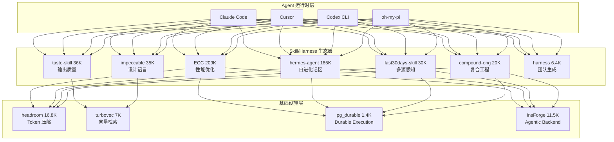
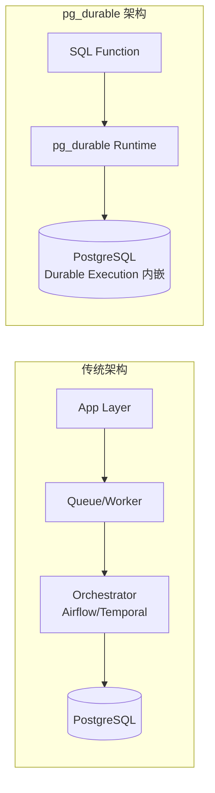
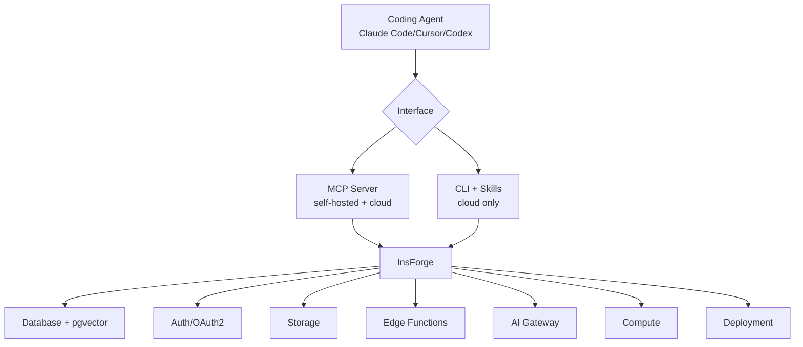

# 2026-06-08 GitHub 趋势研究简报

## 今日核心判断

> 今天的 GitHub Trending 传递了一个异常强烈的信号：**Agent Skill 生态已经跨越临界点**。
>
> 一周榜 Top 20 中，至少 8 个项目属于 "Agent Skill / Harness" 赛道——ECC（209K）、hermes-agent（185K）、taste-skill（36K）、impeccable（35K）、last30days-skill（30K）、compound-engineering-plugin（20K）、headroom（16.8K）、harness（6.4K）。这不是零散的工具发布，而是**生态核聚变**。
>
> 与此同时，两个基础设施级信号值得高度关注：
> 1. **headroom 一周 +300%**（4.1K→16.8K），Token 压缩正在从可选优化变为标配基础设施
> 2. **微软发布 pg_durable**，将 Durable Execution 原生嵌入 PostgreSQL——这不是社区项目，是微软官方的架构判断
>
> turbovec 日增 1,533 stars 登顶全网日增速第一，SIMD 加速向量检索的需求是真实的。

## 趋势一：Agent Skill 生态核聚变（92 分）

### 为什么重要

Agent Skill 项目的密度已经大到不能用"趋势"来描述——它是一个**正在形成的基础设施层**。当 ECC 达到 209K stars（超过 Kubernetes 的一半），当 taste-skill 一周增加 6K stars，我们需要认真回答一个问题：**Skill 是否正在成为 Agent 时代的 npm 包？**

### 生态分层图



### 核心判断

| 维度 | 判断 | 依据 |
|------|------|------|
| 生态成熟度 | ⚠️ 过热但非泡沫 | 项目数量和质量同时增长，但增速不可持续 |
| 标准化程度 | 低 | 每个 Skill 独立定义接口，缺乏统一 spec |
| 中期存活率 | 20-30% | 多数 Skill 会被 Agent 运行时原生吸收 |
| 架构价值 | 高 | 证明了"Agent 能力可组合"这一核心假设 |

## 趋势二：Token 压缩基础设施化（89 分）

### headroom 增长数据

| 时间 | Stars | 周增量 |
|------|-------|--------|
| 2026-06-02 | 4.1K | +1.5K |
| 2026-06-08 | 16.8K | +13.3K（+300%！） |

### 为什么这个时候爆发

headroom 的高速增长反映了一个行业共识正在形成：**Token 是 Agent 时代的计算成本单位**。当 Agent 每次调用工具的输出动辄 10K+ tokens，当 RAG 检索的上下文经常超过 100K tokens，Token 压缩不再是一个可选优化，而是**基础设施级的必需品**。

headroom 的三模式接入（Library/Proxy/MCP Server）使其可以无侵入地接入任何 Agent 架构。这种"中间件"定位正是基础设施的典型特征。

### 架构启发

```
传统 Agent 栈：  Agent → Tool Output → LLM（原始 Token）
进化 Agent 栈：  Agent → Tool Output → [Headroom 压缩层] → LLM（优化 Token）
                                       ├─ ContentRouter（内容分类）
                                       ├─ SmartCrusher / CodeCompressor（压缩）
                                       └─ CacheAligner（缓存对齐）
```

## 趋势三：PostgreSQL 作为 Agent 运行时（85 分）

### 微软的架构判断

microsoft/pg_durable 不是社区实验——这是微软官方发布的 PostgreSQL 扩展，用 Rust 编写，将 **Durable Execution** 原生嵌入数据库。



### 核心设计

- **SQL-native 工作流**：用 `~>` 和 `|=>` 操作符定义 DAG，`df.start()` 启动
- **检查点持久化**：每步执行后 checkpoint，崩溃/重启后自动恢复
- **零外部基础设施**：不需要 Redis、Temporal、Airflow
- **适用场景**：向量 embedding 管道、数据清洗、定时维护、fan-out 聚合

### 对架构师的启发

pg_durable 代表了一个重要的架构方向：**将编排逻辑从应用层移回数据层**。当你的工作流本质上是数据转换（chunk → embed → upsert），把编排放在数据旁边比维护一个 Airflow + Worker + Queue 的三件套更简洁。

⚠️ **风险提示**：当前 1.4K stars，52 个 open issues，仍在早期阶段。SQL-native 意味着复杂控制流（非 HTTP 调用、非 SQL 逻辑）需要外部 worker 配合。

## 趋势四：向量检索 SIMD 新世代（86 分）

### turbovec 核心数据

| 指标 | 数值 |
|------|------|
| 总 Stars | 7K（从 3.4K 翻倍） |
| 今日增速 | +1,533 stars（全网第一） |
| 内存压缩 | 10M 文档 31GB → 4GB（87%） |
| 性能优势 | ARM 上击败 FAISS 12-20% |

turbovec 日增 1,533 stars 登顶全网日增速第一，说明**向量检索的性能优化是真实需求**。与 headroom（Token 压缩）类似，turbovec 代表了 Agent 栈中另一个正在独立化的基础设施层：**高性能语义检索**。

## 趋势五：Agentic Backend Platform 浮现（84 分）

### InsForge 定位

InsForge（11.5K stars，+469/天）提出了一个清晰的定位：**为 Coding Agent 提供全栈后端**。



### 关键判断

InsForge 的 MCP Server 接口设计是一个重要信号：**后端正在主动适配 Agent，而非让 Agent 适配后端**。传统的 BaaS（Supabase/Firebase）暴露 REST/GraphQL API 供前端调用；InsForge 暴露 MCP tools 供 Agent 调用。这是 BaaS 的 Agent 时代重写。

## 其他值得关注

| 项目 | Stars | 增速 | 一句话 |
|------|-------|------|--------|
| supermemory | 26K | +3K/week | Memory engine，Cloudflare Workers + KV |
| open-notebook | 27.2K | +555/天 | 开源 Notebook LM 替代，TypeScript |
| CopilotKit | 33.6K | +590/天 | Agent 前端栈 + AG-UI 协议 |
| HyperFrames | 25.4K | +404/天 | HTML 原生视频渲染，Agent 友好 |
| fff | 7.7K | +983/week | Rust 文件搜索，AI Agent / Neovim |
| tolaria | 12.8K | +242/天 | Markdown 知识库桌面管理 |
| Personal_AI_Infra | 15.2K | +361/天 | Daniel Miessler 的 Agent 基础设施框架 |

## 风险与机遇

### 机遇

1. **Skill 生态标准化机会**：当前每个 Skill 独立定义接口，谁能定义 Skill spec 就掌握了 Agent 时代的"npm"
2. **Token 压缩是刚需**：headroom 的 +300% 增长证明这不是锦上添花，而是必需品
3. **数据库原生 Agent 运行时**：pg_durable 的方向如果被验证，将改变 Agent 后端架构格局
4. **BaaS Agent 化**：InsForge 的 MCP-first 接口设计可能成为 Agent 时代 BaaS 的标准

### 风险

1. **Skill 生态过热**：大量项目 star 注水（Claude/Copilot 自动 commit），实际用户量存疑
2. **pg_durable 早期风险**：52 个 open issues，复杂控制流不支持，微软内部优先级不确定
3. **turbovec 单人项目**：7K stars 但核心维护者仅 1 人，长期风险

## 重点项目档案

详见以下项目档案：

1. 🗜️ [headroom](projects/headroom.html) — Agent Token 压缩基础设施
2. ⚡ [turbovec](projects/turbovec.html) — Rust SIMD 向量索引
3. 🐘 [pg_durable](projects/pg-durable.html) — PostgreSQL Durable Execution
4. 🏗️ [InsForge](projects/insforge.html) — Agentic Backend Platform
5. ⌨️ [oh-my-pi](projects/oh-my-pi.html) — 终端 AI Coding Agent

---

*生成时间：2026-06-08 06:00 CST*
