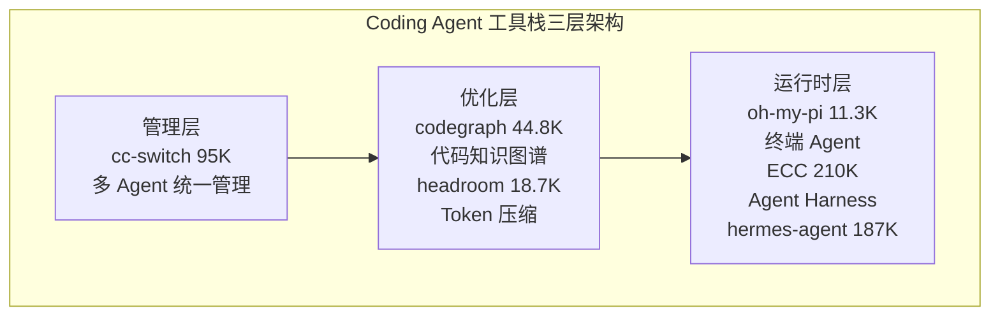

# 2026-06-09 GitHub 趋势研究简报

## 今日核心判断

> 今天的 GitHub Trending 传递了三个关键信号：
> 1. **Coding Agent 工具链从"单一工具"进入"基础设施栈"阶段** — cc-switch 做多 Agent 管理、codegraph 做知识预索引、oh-my-pi 做终端运行时，三层分工明确。
> 2. **Agent 安全运行时成为大厂基础设施新赛道** — NVIDIA OpenShell + Anthropic sandbox-runtime 同周出现，意味着 Agent 安全区已经从"最佳实践"升级为"运行时级隔离"。
> 3. **语音 AI 全栈国产项目强势崛起** — VoxCPM、FunASR、Open-LLM-VTuber 同时霸榜，语音交互不再是 Demo 级别。

## 趋势一：Coding Agent 工具链基础设施化（趋势分 90）

**核心观察：** Coding Agent 生态正在形成清晰的三层工具栈：
- **管理层**：cc-switch（95.1K stars, Rust）统一管理 Claude Code、Codex、Hermes Agent、OpenCode 等多个 Coding Agent 的配置和切换。
- **优化层**：codegraph（44.8K stars）预索引代码知识图谱，减少 Agent 的 token 消耗和工具调用次数；headroom（18.7K）压缩上下文。
- **运行时层**：oh-my-pi（11.3K）终端 Agent、ECC（210K）Agent Harness 优化、hermes-agent（187K）通用 Agent。

这个三层架构的出现标志着 Coding Agent 从"工具"走向"平台化工具链"。

**架构师视角：** 企业内部的 AI 开发工具链需要参考这个三层模型设计，特别是 codegraph 这类知识预索引层，可以显著降低 Agent 的 token 成本和响应延迟。

## 趋势二：AI Memory 基础设施竞争白热化（趋势分 88）

本周 AI Memory 赛道同时出现三个重要项目：

| 项目 | Stars | 周增速 | 定位 |
|------|-------|--------|------|
| supermemory | 26.2K | +2.9K | Memory API 引擎，快速可扩展 |
| open-notebook | 28K | +3K | NotebookLM 开源替代，灵活知识管理 |
| MemPalace | 新上榜 | 日增明显 | "最佳基准测试"的开源 AI 记忆系统 |

**核心观察：** Agent 的记忆层不再是 "context window + 简单缓存" 的模式，而是正在独立为一个完整的基础设施层。supermemory 直接定位为 "Memory API for the AI era"，说明市场已形成共识。

**风险提示：** Memory API 领域目前还没有标准协议，各项目各自为政。短期内不建议深度绑定任何单一实现，但应该持续跟踪标准化的可能性。

## 趋势三：语音 AI 全栈爆发（趋势分 86）

| 项目 | Stars | 核心能力 | 语言 |
|------|-------|---------|------|
| VoxCPM | 27.7K | 无 Tokenizer 多语言 TTS + 语音克隆 | Python |
| FunASR | 17.5K | 工业级 ASR，170x 实时，50+ 语言 | Python |
| Open-LLM-VTuber | 10.5K | LLM 语音交互 + Live2D 虚拟形象 | Python |

**核心观察：** 语音 AI 的 ASR（识别）、TTS（合成）、交互（对话）三个环节都有成熟的国产开源方案。VoxCPM 的 "无 Tokenizer" 路线值得注意 — 它绕开了传统 TTS 对语音 tokenizer 的依赖，直接建模语音生成，理论上在多语言和零样本克隆上有优势。

**架构师视角：** 对于考虑语音交互能力的产品，现在可以用 VoxCPM + FunASR + 开源 LLM 搭建完整的语音对话链路，成本可控。

## 趋势四：Agent 安全运行时浮出水面（趋势分 85）

| 项目 | 来源 | Stars | 核心定位 |
|------|------|-------|---------|
| NVIDIA/OpenShell | NVIDIA | 6.9K | Agent 安全会话运行时，Rust 实现 |
| anthropic-experimental/sandbox-runtime | Anthropic | 4.4K | 进程级沙箱，文件系统+网络限制 |

**核心观察：** NVIDIA 和 Anthropic 在同一周推出 Agent 安全运行时，这不是巧合。当 Agent 开始自主执行代码、访问网络、操作文件系统时，安全隔离不再是可选功能，而是必须的基础设施层。

- **OpenShell**：Rust 实现，定位为 Agent 的 "安全、隐私运行时"，强调自主 Agent 的隔离执行。
- **sandbox-runtime**：TypeScript 实现，轻量级沙箱，在 OS 层面强制文件系统和网络限制，无需容器。

**架构师视角：** Agent 安全是企业落地的第一道门槛。OpenShell 的 Rust 实现更适合高性能场景，Anthropic 的方案更适合嵌入现有 Node.js/TypeScript 工具链。

## 趋势五：Agent 调研与信息聚合 Skill 成熟（趋势分 82）

| 项目 | Stars | 核心能力 |
|------|-------|---------|
| last30days-skill | 34.3K | 跨 Reddit/X/YouTube/HN/Polymarket 的 AI 调研 |
| Agent-Reach | 24K | 零 API 费的 Twitter/Reddit/YouTube/B站/小红书搜索 |
| google/skills | 12.3K | Google 官方 Agent Skills |
| openai/plugins | 2.3K | OpenAI 官方 Plugins |

**核心观察：** Agent 的 "信息获取层" 正在被 Skill 化。last30days-skill 和 Agent-Reach 的核心价值是把分散的信息源聚合为一个统一的 Agent 可调用接口。Google 和 OpenAI 同时推出官方 Skills/Plugins 平台，意味着大厂也在构建这个基础设施层。

## 重点项目深度分析

### 1. codegraph — 代码知识图谱预索引（评分 88）

**做什么：** 为 Claude Code、Codex、Gemini、Cursor 等 Coding Agent 提供预索引的代码知识图谱。通过将代码库的结构、依赖关系、调用链等信息预先构建成图谱，减少 Agent 的 token 消耗和工具调用次数。

**为什么火：** 随着代码库增大，Agent 需要越来越多的 context 来理解项目。codegraph 把这个 "理解" 过程前置，是一种典型的空间换时间优化。44.8K stars 说明这个痛点非常普遍。

**技术亮点：**
- 100% 本地运行，不依赖外部服务
- 支持多种 Agent：Claude Code、Codex、Gemini、Cursor、OpenCode、Hermes Agent
- 预索引减少 token 使用量

**定位：基础设施候选。** 如果 Agent 是 "大脑"，codegraph 就是 "预先整理好的参考书架"。

### 2. cc-switch — 多 Coding Agent 统一管理（评分 84）

**做什么：** 跨平台桌面工具，统一管理 Claude Code、Codex、OpenCode、OpenClaw、Gemini CLI、Hermes Agent 等 Coding Agent 的配置和切换。

**为什么火：** Coding Agent 爆发后，开发者机器上往往同时安装了 3-5 个 Agent，配置管理和快速切换成为刚需。95.1K stars 证实了这个痛点的普遍性。

**技术亮点：**
- Rust 实现，跨平台桌面应用
- 支持主流 Coding Agent 的配置管理
- 官方网站 ccswitch.io

**定位：工具型。** 是 Agent 工具链的 "控制面板"，本身不是 Agent 但管理所有 Agent。

### 3. NVIDIA/OpenShell — Agent 安全会话运行时（评分 87）

**做什么：** 为自主 AI Agent 提供安全、隐私的运行时环境。Rust 实现，强调在 Agent 执行过程中提供隔离和限制。

**为什么火：** NVIDIA 出品 + Rust 实现 + Agent 安全刚需 = 三重加分。6.9K stars 说明安全运行时正在成为 Agent 基础设施的必要组成。

**技术亮点：**
- Rust 实现，性能和安全兼顾
- NVIDIA 背书，可能与其 GPU 生态深度集成
- 定位为 "安全、隐私运行时"

**定位：基础设施候选。** Agent 安全运行时可能成为未来所有 Agent 部署的基础层。

### 4. supermemory — AI Memory API（评分 86）

**做什么：** 为 AI 应用提供快速、可扩展的记忆引擎。定位为 "The Memory API for the AI era"。

**为什么火：** 随着 Agent 需要跨会话、跨任务的记忆能力，Memory API 成为刚需。26.2K stars + 2.9K 周增速说明市场对 Agent 记忆层的强烈需求。

**技术亮点：**
- 极快的记忆检索速度
- 可扩展架构
- TypeScript 实现

**定位：基础设施候选。** 如果 MCP 是 Agent 的 "手"，Memory API 就是 Agent 的 "长期记忆"。

### 5. VoxCPM — 无 Tokenizer 多语言 TTS（评分 83）

**做什么：** VoxCPM2 实现了无需语音 Tokenizer 的多语言语音生成，支持创意语音设计和高保真克隆。

**为什么火：** 无 Tokenizer 路线绕开了传统 TTS 的核心瓶颈，理论上在多语言和零样本克隆上有优势。27.7K stars 说明语音生成赛道正在升温。

**技术亮点：**
- 无 Tokenizer 设计，降低对语音标注数据的依赖
- 支持多语言生成
- 创意语音设计能力
- 真实感克隆

**定位：工具型/生产可用。** 可以直接用于产品中的语音合成场景。

## 风险与机遇

### 风险
1. **Agent Skill 碎片化风险**：taste-skill、stop-slop、impeccable 等大量 Skill 同时涌现，质量参差不齐，缺乏统一标准。
2. **Memory API 标准缺失**：supermemory、MemPalace 等各自为政，短期内无法形成行业共识。
3. **Coding Agent 管理工具泡沫**：cc-switch 95K stars 增速过快，可能含有大量跟风 star。

### 机遇
1. **Agent 安全运行时**：NVIDIA + Anthropic 双入场，预示这个赛道将快速成熟。
2. **语音 AI 全栈国产化**：VoxCPM + FunASR 为中文语音产品提供了完整的开源方案。
3. **代码知识图谱预索引**：codegraph 代表了 Agent 优化的新方向 — 不是让 Agent 更聪明，而是让 Agent 不需要那么聪明。

## 重点项目档案

- [codegraph](projects/codegraph.html) — 代码知识图谱预索引
- [cc-switch](projects/cc-switch.html) — 多 Agent 统一管理
- [supermemory](projects/supermemory.html) — AI Memory API
- [NVIDIA/OpenShell](projects/nvidia-openshell.html) — Agent 安全会话运行时
- [VoxCPM](projects/voxcpm.html) — 无 Tokenizer 多语言 TTS

---

*本报告基于 2026-06-09 GitHub Trending 数据生成*
