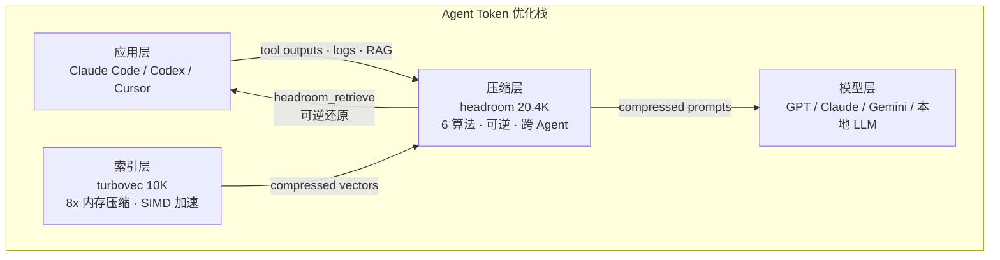
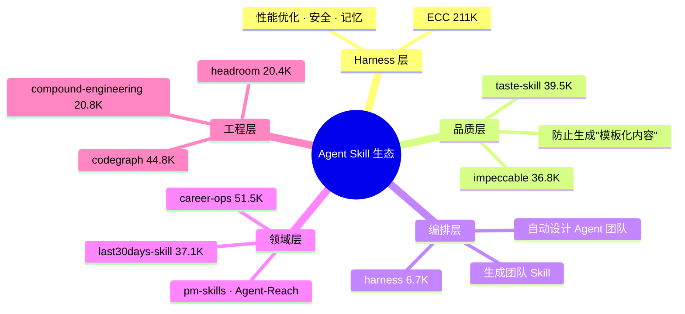

# 2026-06-10 GitHub 趋势研究简报

## 今日核心判断

> 今天 GitHub Trending 传递了三个关键信号：

> 1. **Token 压缩从"优化技巧"升级为"基础设施层"** — headroom 以 14,266 周增登顶全网第一，提供 Library / Proxy / MCP 三种接入模式，6 种压缩算法，可逆压缩。这不是一个工具，而是 Agent 栈的新层。
> 2. **向量索引进入 Rust + SIMD 时代** — turbovec 用 TurboQuant 算法实现 8 倍内存压缩 + ARM 上超 FAISS 12-20%。当 RAG 成为 Agent 标配，向量索引的性能和内存效率直接决定系统上限。
> 3. **Agent Skill 生态开始质量分层** — ECC 211K 仍是 Harness 层事实标准，但 taste-skill（39.5K）、impeccable（36.8K）、harness（6.7K）分别切入"品味"、"设计"、"团队编排"细分领域。碎片化之后是垂直化。

## 趋势一：LLM Token 压缩基础设施化（趋势分 91）

**核心数据：**

| 指标 | headroom | turbovec |
|------|----------|----------|
| Stars | 20.4K（周增 14,266） | 10.1K（周增 4,283） |
| 日增速 | ~2,000 | ~1,800 |
| 核心能力 | Token 压缩 60-95% | 向量内存降 8 倍 |
| 技术路线 | 6 算法 + 可逆压缩 (CCR) | TurboQuant + SIMD 内核 |
| 接入方式 | Library / Proxy / MCP / CLI | Python / Rust SDK |

**headroom 架构分析：**
- **ContentRouter**：检测内容类型，自动选择最佳压缩器
- **SmartCrusher**：JSON 压缩（数组、嵌套对象）
- **CodeCompressor**：AST 感知的代码压缩（Python/JS/Go/Rust/Java/C++）
- **Kompress-base**：HuggingFace 训练的文本压缩模型
- **CacheAligner**：稳定前缀以命中 Anthropic/OpenAI KV 缓存
- **CCR（可逆压缩）**：原始数据本地保存，LLM 按需调用 `headroom_retrieve`

**架构师视角：** headroom 的 Proxy 模式是杀手级设计 — 零代码修改，任何 OpenAI 兼容客户端即可受益。对于企业 Agent 部署，这意味着可以在不动现有代码的情况下直接降低 60-95% 的 token 成本。但要注意：可逆压缩意味着原始数据必须本地存储，在合规严格的环境中需要评估数据驻留风险。

## 趋势二：Agent Skill 生态从碎片化到平台化（趋势分 87）

**本周 Agent Skill 生态关键数据：**

| 项目 | Stars | 周增 | 定位 |
|------|-------|------|------|
| ECC | 211.8K | +9,301 | Agent Harness 性能优化系统 |
| hermes-agent | 188.7K | +11,747 | 自进化 Agent 框架 |
| taste-skill | 39.5K | +7,597 | 让 AI 有"品味"，防模板化 |
| impeccable | 36.8K | +3,736 | AI Harness 的设计语言 |
| last30days-skill | 37.1K | +6,616 | 跨平台 AI 调研 |
| harness | 6.7K | +1,553 | 自动设计 Agent 团队 |

**核心观察：** Agent Skill 正在从"一个人写一个脚本"走向分层的专业化生态：
1. **Harness 层**（ECC）：全局性能优化，是 Agent 的"操作系统"
2. **品质层**（taste-skill / impeccable）：输出质量控制，解决 AI 的"模板化倾向"
3. **编排层**（harness）：自动生成多 Agent 团队和对应 Skill
4. **领域层**（career-ops / last30days / pm-skills）：垂直场景的 Skill 市场

**风险：** Skill 碎片化仍在加速，本周至少有 15+ 个新 Skill 进入 Trending。缺乏统一标准和质量评审机制，大量"一日游"项目。ECC 和 hermes-agent 的超高 star 数可能包含大量被动关注。

## 趋势三：开源知识管理双赛道分化（趋势分 85）

| 项目 | Stars | 周增 | 技术栈 | 路线 |
|------|-------|------|--------|------|
| tolaria | 14.3K | +1,200 | Tauri + React + TypeScript | Git-first / Offline-first / 本地文件 |
| open-notebook | 28.5K | +3,891 | TypeScript | NotebookLM 开源替代 / 云端友好 |

**tolaria 分析：**
- **核心理念**：文件优先（纯 Markdown）、Git 优先（每个 Vault 都是 Git 仓库）、离线优先（无账号无订阅）
- **AI 策略**：AI-first but not AI-only，支持 Claude Code / Codex CLI / Gemini CLI 的 AGENTS 文件
- **技术栈**：Tauri 2（Rust 后端 + WebView 前端），跨平台 macOS / Windows / Linux
- **真实性**：作者 Luca Ronin 用于管理自己 10,000+ 笔记的个人工具

**架构师视角：** tolaria 的 Git-first 路线值得关注 — 它把知识管理拉回了"文件即数据"的 Unix 哲学。对于团队知识库场景，这意味着可以用 Git 的权限控制、分支策略、CI/CD 来管理知识。但它的本地优先设计也意味着缺乏实时协作能力。

## 趋势四：本地 LLM 选型工具链成熟（趋势分 82）

**whichllm 深度分析：**
- **核心差异化**：不是按参数量推荐，而是按真实基准测试（LiveBench / Aider / Chatbot Arena ELO）排名
- **时效性感知**：自动降级过时的基准测试分数
- **架构感知**：VRAM = 权重 + GQA KV Cache + 激活 + 开销，支持 MoE 模型的 active/total 分离
- **GPU 模拟**：买卡前先模拟，`whichllm --gpu "RTX 4090"`

**与同类工具对比：**

| 能力 | whichllm | ollama | lm-studio |
|------|----------|--------|-----------|
| 硬件检测 | ✅ 自动 | ❌ 手动选择 | ✅ 自动 |
| 基准排名 | ✅ 多源融合 | ❌ | ❌ |
| GPU 模拟 | ✅ | ❌ | ❌ |
| 模型下载运行 | ✅ | ✅ | ✅ |
| 一条命令 | ✅ | ✅ | ❌ GUI |

**定位：工具型。** 解决的是本地 LLM 生态的"选择困难症"问题。随着本地 LLM 数量爆发，这个需求只会增长。

## 趋势五：Agent 信息获取层基础设施化（趋势分 80）

延续昨天的判断，last30days-skill 和 Agent-Reach 继续高热：

| 项目 | Stars | 日增 | 核心差异 |
|------|-------|------|----------|
| last30days-skill | 37.1K | +3,177 | 多平台调研（Reddit/X/YouTube/HN/Polymarket） |
| Agent-Reach | 25.5K | — | 零 API 费的网络搜索（Twitter/B站/小红书） |

两者互补而非竞争 — last30days 做深度调研，Agent-Reach 做实时信息获取。

## 重点项目深度分析

### 1. headroom — Agent Token 压缩基础设施（评分 90）

**做什么：** 在 Agent 输出到达 LLM 之前进行 Token 压缩，60-95% 的 token 减少率，支持 Library / Proxy / MCP / CLI 四种接入方式。

**为什么火（周增 14,266 全网第一）：** Agent 日常运行中，tool outputs、logs、RAG chunks 占据了大量 context window。这不是一个"锦上添花"的优化，而是直接降低了 Agent 的运行成本和响应延迟。14K/周的增速说明这个痛点已经从少数人的抱怨变成了全行业的共识。

**技术亮点：**
1. **6 种压缩算法**：SmartCrusher（JSON）、CodeCompressor（AST）、Kompress-base（ML 文本）、Image 压缩、CacheAligner（KV 缓存优化）
2. **可逆压缩 CCR**：原始数据本地保存，LLM 通过 `headroom_retrieve` 按需还原
3. **跨 Agent 共享记忆**：`SharedContext().put/.get` 跨 Claude / Codex 共享
4. **headroom learn**：从失败会话中学习，自动写入 CLAUDE.md / AGENTS.md

**定位：基础设施候选。** 如果 Agent 是"大脑"，headroom 就是"信息过滤器" — 不是让 Agent 看到更多，而是让 Agent 只看最关键的部分。

### 2. turbovec — Rust SIMD 向量索引（评分 88）

**做什么：** 基于 Google Research TurboQuant 算法的向量索引，Rust 实现，Python 绑定。10M 文档的 float32 向量从 31GB 压缩到 4GB。

**为什么火（日增 1,800）：** RAG 是 Agent 的标配能力，向量索引是 RAG 的核心基础设施。turbovec 用 TurboQuant 算法实现了无训练、在线摄入、SIMD 加速的向量搜索，直接挑战 FAISS 的地位。

**技术亮点：**
1. **TurboQuant 算法**：数据无关的量化器，匹配 Shannon 下界，无 codebook 训练
2. **手写 SIMD 内核**：ARM NEON 超 FAISS 12-20%，x86 AVX-512BW 匹配或超越
3. **Allowlist 过滤**：在 SIMD 内核内直接过滤，无过度获取
4. **纯本地运行**：无托管服务，可完全离线，适合合规场景

**定位：基础设施候选。** 对标 FAISS 的下一代向量索引。LangChain / LlamaIndex / Haystack / Agno 已有官方集成。

### 3. tolaria — Git-first Markdown 知识管理（评分 82）

**做什么：** 跨平台桌面应用，管理 Markdown 知识库。核心理念：文件优先、Git 优先、离线优先。

**为什么火：** AI Agent 时代，知识管理工具需要同时服务人和 Agent。tolaria 的 AGENTS 文件设计让 Agent 可以理解和操作知识库，而 Git 版本控制确保了知识演进的可追溯性。

**技术亮点：**
1. **Tauri 2**：Rust 后端 + WebView 前端，安装包小、启动快
2. **纯 Markdown + YAML frontmatter**：无专有格式，数据完全可迁移
3. **AI 集成**：支持 Claude Code / Codex CLI / Gemini CLI 的配置路径
4. **10,000+ 笔记的真实使用验证**

**定位：工具型。** 解决的是个人知识管理的"数据主权"问题。与 Obsidian 的闭源 + 插件生态路线形成对比。

### 4. whichllm — 本地 LLM 硬件匹配（评分 78）

**做什么：** 一条命令找到最适合你硬件的本地 LLM，基于真实基准测试而非参数量。

**技术亮点：**
1. **多源基准融合**：LiveBench + Artificial Analysis + Aider + Chatbot Arena ELO
2. **时效性感知**：过时的基准分数自动降权
3. **GPU 模拟**：买卡前先测试
4. **MoE 感知**：区分 active 和 total 参数

**定位：工具型。** 降低本地 LLM 的使用门槛。

### 5. career-ops — AI 求职系统（评分 75）

**做什么：** 基于 Claude Code 的 AI 求职系统，14 种 Skill 模式，Go Dashboard + PDF 生成。

**判断：** 51.5K stars 增速迅猛但泡沫风险较高。AI 求职工具是短周期需求，用户获取快但留存难。技术上没有明显创新，更多是 Claude Code Skill 的垂直场景封装。

**定位：工具型 / 短期热点。** 不建议持续跟踪。

## 风险与机遇

### 风险
1. **Token 压缩的准确性边界不清晰**：headroom 声称"same answers"，但在复杂推理、数学、代码生成等场景下的准确性损失尚未被系统性评估。
2. **turbovec 在低维向量上弱于 FAISS**：GloVe d=200 的 2-bit 场景下落后 FAISS 1.2 个百分点。
3. **Agent Skill 泡沫持续膨胀**：本周 15+ 个新 Skill 进 Trending，大部分缺乏长期维护能力。
4. **career-ops / AiToEarn 等项目 star 注水嫌疑**：增速异常，且 fork/issue 比例不健康。

### 机遇
1. **Token 压缩 + 向量索引双基建**：headroom + turbovec 的组合可以为 Agent 提供从输入到检索的全链路成本优化。
2. **Git-first 知识管理**：tolaria 的路线适合需要数据主权和版本控制的企业场景。
3. **本地 LLM 生态工具链**：whichllm + ollama + llama.cpp 正在构建完整的本地 LLM 工具链。

## 重点项目档案

- [headroom](projects/headroom.html) — Agent Token 压缩基础设施
- [turbovec](projects/turbovec.html) — Rust SIMD 向量索引
- [tolaria](projects/tolaria.html) — Git-first Markdown 知识管理
- [whichllm](projects/whichllm.html) — 本地 LLM 硬件匹配
- [career-ops](projects/career-ops.html) — AI 求职系统

---

*本报告基于 2026-06-10 GitHub Trending 数据生成*
