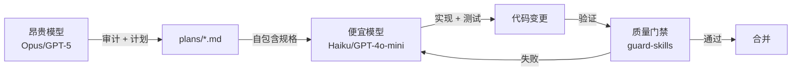

# 2026-06-11 GitHub 趋势研究简报

## 今日重点趋势

### 趋势 1：Agent 编排分层 — 顾问模式定义新协作范式

**核心信号：** shadcn/improve 1 天 745⭐，这不是又一个 Agent 工具，而是一个全新的 Agent 协作范式。

**模式解析：** 该项目的核心理念是「昂贵模型做审计和计划，便宜模型做执行」。这是一个关键认知转变——不是所有 Agent 任务都需要最贵的模型。通过引入「顾问-执行者」分层，可以将 Agent 工作流的成本降低一个数量级，同时保持质量。

**生态呼应：**
- **amElnagdy/guard-skills** (548⭐) — 为 Coding Agent 提供质量门禁，捕获 AI 生成的典型失败模式
- **JimLiu/baoyu-design** (680⭐) — Claude Design 本地化 Skill，UI 设计也能 Agent 化

**架构启发：** Agent Skill 生态正在从「单一工具」演进为「多步骤工作流编排」。关键不是某个 Skill 能做什么，而是多个 Skill 如何组合成可靠的工作流。shadcn/improve 的 `audit → plan → execute → verify` 闭环是值得学习的编排模式。

### 趋势 2：Apple 端侧 AI 生态正式开放

**核心信号：** apple/coreai-models 3 天 605⭐，Apple 首次系统性开放端侧 AI 全栈。

**关键分析：** 这不是一个简单的模型仓库，而是 Apple 端侧 AI 的完整开发者生态：
- **模型导出层** — 从 HuggingFace 到 Core AI 格式的配方
- **Python 原语层** — PyTorch 模型到端侧的构建块
- **Swift 运行时层** — macOS/iOS 集成的 Swift 包
- **Agent Skills 层** — 让 Coding Agent 直接利用 Core AI 的技能插件

**平台判断：** 这是 Apple 在 AI 生态的「App Store 时刻」。通过开放 Core AI 的模型导出和运行时，Apple 正在构建一个封闭花园中的开放生态。对架构师而言，这意味着端侧 AI 不再是概念，而是有了官方工具链支撑的生产路径。

**风险点：** 目前要求 macOS/iOS 27.0+、Xcode 27.0+，生态成熟度仍需观察。

### 趋势 3：AI 原生可观测性从监控到自愈

**核心信号：** superloglabs/superlog 721⭐，YC P26，OpenTelemetry + AI Agent 自愈。

**技术栈：** Postgres + ClickHouse + OTLP + AI Agent Runner。这不是在现有监控工具上加 AI 外壳，而是从底层重新设计的 AI-native 可观测性。

**为什么重要：**
1. 告警疲劳是 SRE 的头号痛点，AI 做信号聚合和降噪是真需求
2. 从「发现问题」到「定位根因」到「修复建议」的闭环是可观测性的终极目标
3. OpenTelemetry 是事实标准，基于 OTel 构建意味着可集成性

**平台潜力：** 高。可观测性天然是平台生意，AI 自愈能力是差异化壁垒。

### 趋势 4：开发沙箱成为 Agent 基础设施

**核心信号：** tastyeffectco/sandboxd 561⭐，Go 实现，Docker 隔离，一条命令启动。

**需求分析：** Coding Agent 需要安全的执行环境来运行代码、安装依赖、预览结果。sandboxd 精准切入这个需求：
- 无 K8s 依赖，降低部署门槛
- Preview URL 支持，方便 Agent 和人类查看结果
- 自托管，数据不离开企业环境

**基础设施判断：** 如果 Coding Agent 成为标准开发流程，开发沙箱就是必要的基础设施层。类似 CI/CD 中的 Runner，Agent 时代的 Sandbox。

### 趋势 5：AI 生成式设计资产走向生产

**核心信号：** diffusionstudio/lottie 2,004⭐（本周最高增速之一），AI 生成生产级 Lottie 动画。

**趋势判断：** AI 生成设计资产正从「概念验证」走向「生产可用」。Lottie 是移动端和 Web 动画的工业标准格式，能直接生成 Lottie 意味着可以直接进入产品流程。这不是「AI 替代设计师」，而是「AI 扩大设计产能」。

---

## 重点项目深度分析

### Top 1：shadcn/improve — Agent 顾问模式

**它做什么：** 审计代码库，生成自包含的实现计划，交给便宜模型执行。

**为什么火：** shadcn 的品牌背书 + 解决了一个真实痛点（Agent 工作流成本高）+ 概念清晰（计划是产品，不是代码）。

**技术亮点：**
- 并行子 Agent 审计 9 个维度（正确性、安全、性能、测试覆盖、技术债、依赖、DX、文档、方向）
- 每个发现都有 `file:line` 级证据
- 顾问模型会重新验证子 Agent 的发现，剔除误报
- 计划包含验证门禁和停止条件
- 支持 `execute` 模式在隔离 worktree 中派发执行

**定位：** 平台候选。这是一个编排模式的开源实现，可能成为 Agent 工作流的事实标准。

**风险：** 目前只有 shadcn 的品牌背书，缺乏大规模使用验证。计划质量高度依赖模型能力。

### Top 2：apple/coreai-models — 端侧 AI 全栈

**它做什么：** 提供模型导出配方、Python 原语和 Swift 运行时，让开发者在 Apple 设备上运行 AI 模型。

**为什么火：** Apple 官方开源，端侧 AI 开发者苦工具链久矣。

**技术亮点：**
- 模型导出管线：HuggingFace → Core AI `.aimodel` 格式
- Swift 运行时：与 Core AI 框架无缝集成
- Agent Skills：让 Coding Agent 能直接使用 Core AI
- 支持量化、调色板压缩等端侧优化

**定位：** 基础设施候选。这是 Apple 端侧 AI 生态的基石。

### Top 3：superloglabs/superlog — AI 自愈可观测性

**它做什么：** 基于开源 OTel 的可观测性平台，AI Agent 自动聚合信号、定位根因、生成修复建议。

**为什么火：** YC P26 背书 + 解决告警疲劳真痛点 + AI-native 架构。

**技术亮点：**
- OTLP 原生接入，与现有 OpenTelemetry 生态无缝集成
- ClickHouse 支撑海量遥测数据查询
- 社区版 Agent Runner 自动记录事件摘要
- 从信号到事件到修复建议的 AI 闭环

**定位：** 平台候选。可观测性天然是平台生意。

---

## 风险与机遇

### 风险
1. **Agent Skill 生态碎片化加剧** — shadcn/improve、guard-skills、baoyu-design 各自为战，缺乏统一编排标准
2. **Apple 生态锁定** — coreai-models 只服务于 Apple 平台，跨平台团队需谨慎投入
3. **AI 自愈的可靠性** — superlog 的 AI 修复建议目前更偏向辅助，离真正自动修复还有距离

### 机遇
1. **模型分层编排** — shadcn/improve 的顾问模式可能是 Agent 成本优化的关键突破口
2. **端侧 AI 开发窗口期** — Apple Core AI 刚开放，早期投入有先发优势
3. **Agent 基础设施层** — sandboxd 这类项目预示 Agent 运行时基础设施的蓝海

---

## 重点项目档案

| 项目 | ⭐ | 类别 | 评分 | 是否持续跟踪 |
|------|------|------|------|------------|
| shadcn/improve | 745 | 平台候选 | 92 | ✅ |
| apple/coreai-models | 605 | 基础设施候选 | 90 | ✅ |
| superloglabs/superlog | 721 | 平台候选 | 86 | ✅ |
| tastyeffectco/sandboxd | 561 | 基础设施候选 | 83 | ✅ |
| diffusionstudio/lottie | 2,004 | 工具型 | 78 | 🔍 观察 |
| JimLiu/baoyu-design | 680 | 工具型 | 75 | 🔍 观察 |
| amElnagdy/guard-skills | 548 | 工具型 | 74 | 🔍 观察 |
| Tencent-Hunyuan/UniRL | 427 | 学习型 | 70 | 🔍 观察 |
