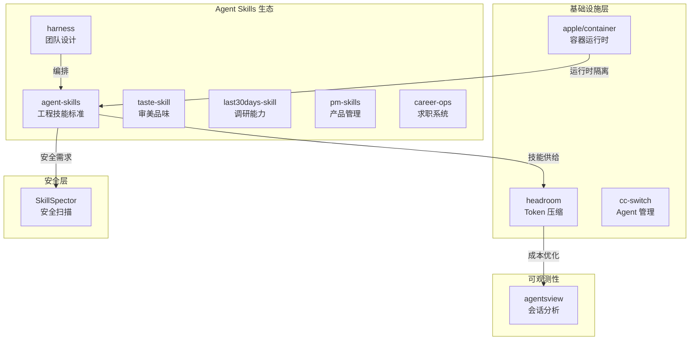

# 2026-06-12 GitHub 趋势研究简报

## 今日核心发现

### 1. Agent Skills 正在成为独立生态品类

今天 GitHub Trending 首页几乎被 Agent Skills 项目淹没：

| 项目 | Stars | 日增 | 定位 |
|------|-------|------|------|
| addyosmani/agent-skills | 54,532 | +3,275 | 工程技能标准化 |
| Leonxlnx/taste-skill | 41,495 | +8,077/周 | AI 审美品味 |
| mvanhorn/last30days-skill | 39,677 | +11,732/周 | 跨平台调研能力 |
| phuryn/pm-skills | — | trending | 产品经理技能市场 |
| santifer/career-ops | 52,776 | +3,998/周 | AI 求职系统 |
| revfactory/harness | 6,820 | +1,113/周 | 元技能：自动设计 Agent 团队 |

**判断：** Agent Skills 不再是零散的小工具，正在形成**独立的技能市场品类**。从工程能力、审美品味、调研能力到产品管理、求职、团队设计，覆盖面已经相当完整。addyosmani/agent-skills 作为工程技能的事实标准，54K stars 证明了市场对"标准化 Agent 能力"的强烈需求。

**架构师视角：** 这预示着 Agent 系统的架构模式从"单体 Agent + Prompt"向"Agent + 技能市场 + 编排层"演进。技能市场可能成为 Agent 生态的平台层机会。

### 2. LLM Token 压缩成为新基础设施层

**chopratejas/headroom** 周增长 13,062 stars（本周最快速），总量 23,083。核心能力：

- 压缩工具输出、日志、文件、RAG chunks，60-95% token 减少
- 三种部署模式：Library、Proxy、MCP Server
- 保持答案质量不变的前提下大幅降低 LLM 输入成本

**判断：** 这不是简单的压缩工具，而是 **LLM 应用的中间件基础设施**。在 Agent 系统中，工具调用产生的上下文膨胀是真实痛点——每次工具调用返回数百行日志、RAG 检索返回大量文档片段，都在消耗宝贵的上下文窗口和 token 预算。headroom 直接解决了这个问题。

**中期趋势概率：高。** Token 优化/压缩会在整个 LLM 基础设施栈中占据一席之地，类似 HTTP 压缩中间件对 Web 的价值。

### 3. Apple 容器化正式发布

**apple/container** 日增 2,419 stars，总量 32,164。关键技术特征：

- Swift 编写，Apple Silicon 原生优化
- 轻量虚拟机上运行 Linux 容器
- 非 Docker 替代品，而是 macOS 原生容器方案
- Apple 生态封闭路径上的容器化基础设施

**判断：** 对 macOS 开发者而言意义重大——终于有了 Apple 原生的容器运行时。但从跨平台角度看，不会取代 Docker。更值得关注的是：Apple 正在构建从芯片到操作系统到容器运行时的**完整开发者基础设施栈**，container 是这块拼图的重要一环。

### 4. Agent 安全面浮出水面

**NVIDIA/SkillSpector** 2,577 stars，日增 308。定位明确：

- 专门为 AI Agent 技能做安全扫描
- 检测漏洞、恶意模式、安全风险
- 对应昨天 Agent Skills 爆发的安全侧需求

**判断：** 当 Skills 成为 Agent 的核心能力来源，**Skills 供应链安全**就成为必须解决的问题。NVIDIA 第一时间切入这个方向，说明大厂已经看到这个安全缺口。这可能是 Agent 安全赛道的起始信号。

### 5. Coding Agent 工具链持续膨胀

本周多个 Coding Agent 工具链项目上榜：

| 项目 | Stars | 定位 |
|------|-------|------|
| farion1231/cc-switch | 98,480 | 多 Agent 桌面管理助手 |
| kenn-io/agentsview | 1,592 | Agent 会话分析与用量统计 |
| ogulcancelik/herdr | 5,399 | Agent 复用器（多路复用） |
| can1357/oh-my-pi | 11,917 | 终端 AI 编码 Agent |

cc-switch 以 98K stars 成为 Coding Agent 工具链中 star 最高的项目。herdr 的"Agent 多路复用"概念值得关注——让多个 Agent 共享会话上下文，类似 tmux 对终端的意义。

---

## 本周持续跟踪项目动态

| 项目 | 上次 star | 本周 star | 周增量 | 状态 |
|------|-----------|-----------|--------|------|
| NousResearch/hermes-agent | — | 190,940 | +11,519 | 📈 持续爆发 |
| Panniantong/Agent-Reach | — | 26,351 | +5,021 | 📈 稳步增长 |
| CopilotKit/CopilotKit | — | 34,718 | +2,686 | 📈 稳步增长 |
| heygen-com/hyperframes | — | 26,816 | +2,596 | 📈 稳步增长 |
| RyanCodrai/turbovec | — | 11,056 | +6,487 | 🚀 快速增长 |
| MemPalace/mempalace | — | 55,385 | +2,004 | 📈 稳步增长 |
| microsoft/VibeVoice | — | 49,255 | +1,576 | 📈 稳步增长 |

---

## 重点项目深度分析

### 🛠️ addyosmani/agent-skills — Agent 工程技能的事实标准

**是什么：** 为 AI Coding Agent 提供生产级工程技能的集合。不是 Prompt 模板，而是经过验证的、可直接使用的工程工作流。

**为什么火：** Agent 需要的不是更聪明的模型，而是更专业的技能。addyosmani（Google Chrome 团队的前端架构师）的背书带来了巨大的信任度。54K stars 说明开发者社区强烈渴望 Agent 技能标准化。

**技术亮点：**
- 区别于 Prompt engineering，更像是 Agent 的"能力包"
- 生产级验证，不是 demo 级别的玩具
- Shell 语言编写，跨 Agent 兼容

**架构启发：** Agent 架构正在从"单体 Prompt"向"技能注册 + 能力调度"演进。这和微服务架构从单体到服务拆分的路径惊人相似。

**定位：平台候选。** 如果能建立技能标准和生态，将成为 Agent 时代的"npm"。

**风险：** 技能标准化进展可能被大厂 Agent 平台直接内置的技能系统取代。

### 🗜️ chopratejas/headroom — LLM Token 压缩中间件

**是什么：** 在工具输出、日志、文件、RAG chunks 到达 LLM 之前进行压缩，60-95% token 减少同时保持答案质量。

**为什么火：** 周+13K 是本周增长最快的项目之一。直击 Agent 系统的核心成本痛点——上下文膨胀。

**技术亮点：**
- Library 模式：应用内集成
- Proxy 模式：透明代理，无需改代码
- MCP Server 模式：作为 MCP 工具给 Agent 使用
- 三种模式覆盖了几乎所有集成场景

**架构启发：** 这是典型的**中间件模式**在 LLM 时代的应用。类似于：
- HTTP 压缩中间件（gzip）
- 数据库连接池
- 消息队列压缩

Token 压缩会成为 LLM 基础设施栈的标准组件。

**定位：基础设施候选。** 一旦证明压缩比和保真度的稳定性，会被所有 LLM 应用层集成。

**风险：** 压缩损失可能在特定领域（如代码、数学）造成质量问题；大模型厂商可能内置类似能力。

### 🍎 apple/container — Apple 原生容器运行时

**是什么：** 在 Mac 上创建和运行 Linux 容器的工具，使用轻量虚拟机，Swift 编写，Apple Silicon 优化。

**为什么火：** 日+2.4K，macOS 开发者终于有了 Apple 原生的容器方案，不需要依赖 Docker Desktop。

**技术亮点：**
- 轻量 VM 架构而非 Docker 的全功能容器引擎
- Apple Silicon 原生优化，性能和能效比 Docker Desktop 好
- Swift 实现，和 Apple 生态深度集成

**架构启发：** Apple 正在构建从芯片→OS→运行时→容器的完整开发者栈。这对 DevEx 有深远影响。

**定位：基础设施候选。** macOS 开发环境的容器化标准。

**风险：** 仅限 macOS，不会成为跨平台方案。Docker 生态的惯性很强。

---

## 风险与机遇

### 泡沫预警
- **Agent Skills 泡沫风险：** 大量 "skill" 项目涌入，其中很多只是精心包装的 Prompt 模板。pm-skills、career-ops 这类项目更偏营销包装，需要区分真正的工程创新和蹭概念。
- **taste-skill 争议：** "给 AI 好品味"这个定位更偏概念营销，41K stars 中有多少是好奇驱动需要验证。

### 真实机遇
- **Token 压缩基础设施：** headroom 解决的问题是真实的，市场需求验证充分（周+13K），技术路径清晰。
- **Agent 安全扫描：** SkillSpector 切入的方向是真实的，随着 Skills 生态爆发，安全扫描会成为必需品。
- **Apple 容器化：** 解决了 macOS 开发者的真实痛点，长期价值确定。

---

## 趋势关系图

---

## 一句话点评

> Agent Skills 生态爆发是本周最确定的趋势。从工程技能到审美品味到安全扫描，Agent 的"能力市场"正在形成。Token 压缩（headroom）和技能安全（SkillSpector）分别代表了 Agent 基础设施栈中"效率层"和"安全层"的早期形态。对架构师而言，现在应该关注 Agent 技能的标准化接口和安全审计流程。
