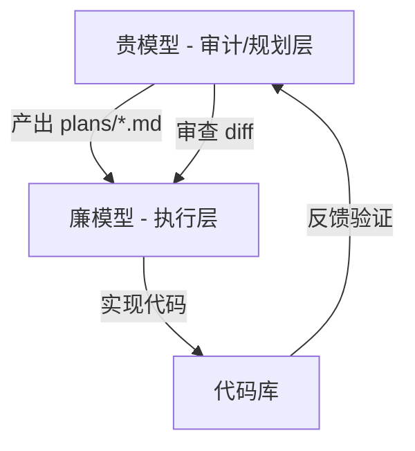
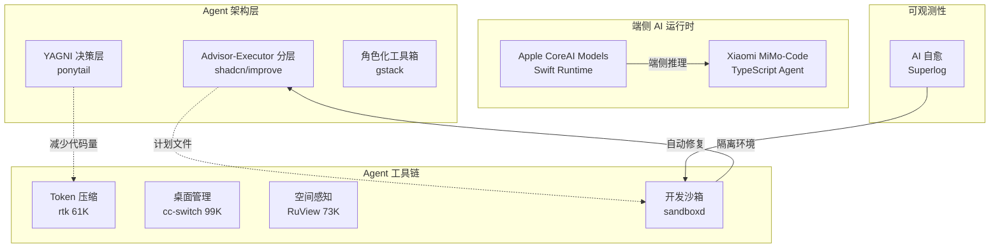

# 2026-06-13 GitHub 趋势研究简报

## 今日重点趋势

### 趋势 1：Agent 架构分层范式确立（92 分）

过去两周的 Agent Skills 爆发后，一个更深的结构性趋势正在浮现：**Agent 不是单体，而是分层系统**。

**shadcn/improve（2,385⭐）** 是这一趋势最清晰的代表——它明确主张"贵模型做审计和规划，廉模型做执行"，自身只产出计划（`plans/*.md`），绝不写代码。这创造了一个清晰的两层分工：

**ponytail（862⭐）** 则从另一个角度切入——不是分层，而是"极简"。它让 Agent 停在每个决策点上问"这真的需要存在吗？"（YAGNI），实测结果是 47% 的 Token 节省和 3 倍速度提升。这本质上也是一种分层：**决策层（要不要做）→ 实现层（怎么做）**。

**gstack（109K⭐）** 将 Claude Code 的工具箱拆分为 CEO、Designer、Eng Manager 等 23 个角色。这不是分层而是**角色化**——每个角色负责一个关注点，对应不同模型能力需求。

**架构师判断：** Agent 正在经历从单体 Prompt → 能力分层 → 角色化的演进路径，与微服务架构演进高度相似。这将是 2026 H2 的核心架构范式。

---

### 趋势 2：端侧 AI 运行时基础设施化（89 分）

**Apple CoreAI Models（826⭐）** 正式开源，提供端侧 AI 的三个核心组件：
1. **Model export recipes** — 模型导出配方
2. **Python primitives** — Python 层原语
3. **Swift runtime utilities** — Swift 运行时工具

这不是 demo，是 Apple 在端侧 AI 运行时上的基础设施投入。配合之前的 `apple/container`，Apple 正在构建完整的端侧开发栈：容器化 + 端侧推理。

**Xiaomi MiMo-Code（6,687⭐）** 三天爆发式增长。小米选择 TypeScript 作为主要语言，421 个 open issues 说明社区参与度极高。这是中国大厂在 Coding Agent 赛道的又一个重量级选手。

**架构师判断：** 端侧 AI 运行时正在从"能力点"升级为"平台层"。Apple 和小米的入场意味着端侧推理不再是极客项目，而是大厂的基础设施战略。

---

### 趋势 3：AI 自愈可观测性崭露头角（84 分）

**Superlog（792⭐）** 是一个值得关注的信号：它不是又一个 LLM wrapper，而是**将 AI Agent 嵌入可观测性管线**——基于 OpenTelemetry，用 AI Agent 自动诊断故障并触发修复。

这代表了可观测性的第三阶段演进：
1. **阶段 1：** 监控 → 告警（传统 APM）
2. **阶段 2：** 可观测性 → 关联分析（OpenTelemetry + Grafana）
3. **阶段 3：** AI Agent → 自愈（Superlog 代表的方向）

目前项目仍偏早期（792 stars，13 open issues），但方向准确。

---

### 趋势 4：Coding Agent 工具链全栈化（81 分）

本周 Coding Agent 生态的几个巨型项目持续增长：

| 项目 | Stars | 本周增速 | 定位 |
|------|-------|---------|------|
| cc-switch | 99K | 稳定 | 跨 Agent 桌面管理 |
| RuView | 73K | 活跃 | WiFi 感知空间智能 |
| rtk | 62K | 活跃 | Token 压缩代理 60-90% |
| openclaw | 378K | 稳定 | 个人 AI 助手平台 |
| hermes-agent | 192K | 活跃 | 自成长 Agent |
| opencode | 174K | 活跃 | 开源编码 Agent |

工具链已覆盖：开发（opencode/hermes）→ 管理（cc-switch）→ 优化（rtk）→ 感知（RuView）→ 沙箱（sandboxd）。

---

### 趋势 5：Sandbox 即基础设施（79 分）

**sandboxd（586⭐）** 一句话：自托管开发沙箱，一条命令启动预览环境。不依赖 Kubernetes，天然适配 Coding Agent 和 SaaS 工厂场景。

这个方向与 E2B、Daytona 等商业产品竞争，但 sandboxd 的定位更轻——不追求平台化，只做好"一键沙箱"。对于 Agent 生态来说，沙箱是必需品而非可选品。

---

## 重点项目深度分析

### Top 1：shadcn/improve — Agent 架构分层范式代表

**做什么：** Agent Skill，用最强模型审计代码库，生成结构化实施计划（`plans/*.md`），然后交给更便宜的模型执行。自己永远不写代码。

**为什么火：** shadcn 的个人品牌 + 切中 Agent 成本痛点。当 Agent 处理大型代码库时，全程用最强模型的成本是天文数字。improve 给出了优雅的解法——只在需要高智能的环节用贵模型。

**技术亮点：**
- 九大审计维度并行展开：正确性、安全、性能、测试覆盖、技术债、依赖、DX、文档、方向
- 自动发现 `docs/adr/`、`CONTEXT.md`、`DESIGN.md` 等设计文档，理解项目意图
- 每个发现都有 `file:line` 证据，impact/effort/confidence 评分
- 计划文件自带依赖图和优先级排序
- `/improve execute` 在隔离 worktree 中派发廉价模型执行

**架构启发：** 这暗示了一种新的 Agent 架构模式——**Advisor-Executor 分离**。贵模型是 Advisor，只做规划和审查；廉模型是 Executor，只做实现。两者通过结构化计划文件（而非 Prompt）通信。

**定位：** 工具型，但蕴含平台化潜力。如果"计划文件"成为 Agent 间的标准通信格式，improve 就成了 Agent 编排的中间层。

### Top 2：XiaomiMiMo/MiMo-Code — 小米入局 Coding Agent

**做什么：** 小米开源的编码 Agent，TypeScript 实现，GitHub 描述留空，6,687 stars（三天）。

**为什么火：** 小米品牌 + 中国 AI 开发者社区的期待。421 个 open issues 说明社区参与度极高，但也暴露出项目可能还在早期。

**技术亮点：** TypeScript 实现（非 Python），可能与小米的 Web 技术栈有关。Fork 数 528 说明不少人在尝试二次开发。

**风险：** 描述为空、文档不完善、issue 积压严重。可能是仓促开源的"占位项目"。

### Top 3：Apple CoreAI Models — 端侧 AI 运行时

**做什么：** 端侧 AI 模型的导出配方、Python 原语和 Swift 运行时工具。

**为什么值得关注：** Apple 不是在做一个推理框架，而是在构建端侧 AI 的**完整运行时基础设施**。配合 CoreML 和之前的 `apple/container`，这构成了 Apple 在开发者平台上的又一关键拼图。

**架构启发：** 端侧 AI 的瓶颈不是模型本身，而是运行时基础设施——模型如何导出、如何加载、如何与系统集成。Apple 正在定义这个基础设施层。

---

## 风险与机遇

### 泡沫信号
- **MiMo-Code：** 三天 6.7K stars 但无描述、文档不足，可能存在品牌驱动的泡沫成分
- **RuView 73K stars：** WiFi 信号感知空间智能的概念很酷，但 73K stars 的增速和实际可用性之间可能存在差距
- **Agent Skills 泛滥：** ponytail、improve、taste-skill 等同质化风险，市场可能容不下这么多 Skill

### 真实机遇
- **Agent 分层架构：** shadcn/improve 的 Advisor-Executor 分离模式是真实的架构创新，值得企业内部 PoC
- **端侧 AI 运行时：** Apple 和小米的入场意味着端侧推理将成为主流，相关工具链需求真实
- **自愈可观测性：** Superlog 的方向（AI Agent + OpenTelemetry 自愈）是基础设施的必然演进

---

## 重点项目档案

### shadcn/improve
- **定位：** 工具型 → 平台候选潜力
- **热度质量：** 8 — shadcn 品牌背书，概念新颖，实现完整
- **技术创新度：** 8 — Advisor-Executor 分离是真实架构创新
- **工程成熟度：** 7 — 代码质量高，但仍是早期
- **架构启发价值：** 9 — Agent 分层架构的范式代表
- **企业落地潜力：** 7 — 需要搭配 Agent 基础设施使用
- **中期趋势概率：** 8 — Agent 成本优化是刚性需求
- **平台化潜力：** 7 — 计划文件可能成为 Agent 间通信标准
- **基础设施潜力：** 6 — 更偏工具层
- **总分：** 60/80
- **归类：** 工具型（含平台候选潜力）
- **建议持续跟踪：** 是

### XiaomiMiMo/MiMo-Code
- **定位：** 工具型（早期观察中）
- **热度质量：** 6 — 品牌驱动成分较大
- **技术创新度：** 5 — 目前信息不足
- **工程成熟度：** 4 — 文档缺失，issue 积压
- **架构启发价值：** 5 — 需更多时间观察
- **企业落地潜力：** 6 — 小米生态内可能有优势
- **中期趋势概率：** 6 — Coding Agent 赛道拥挤
- **平台化潜力：** 5 — 信息不足
- **基础设施潜力：** 4 — 偏应用层
- **总分：** 41/80
- **归类：** 工具型（观察中）
- **建议持续跟踪：** 是（需更多数据）

### apple/coreai-models
- **定位：** 基础设施候选
- **热度质量：** 7 — Apple 官方出品，方向准确
- **技术创新度：** 7 — 端侧模型运行时是真实创新
- **工程成熟度：** 7 — Apple 工程质量有保障
- **架构启发价值：** 8 — 定义端侧 AI 运行时标准
- **企业落地潜力：** 8 — iOS/macOS 开发者刚需
- **中期趋势概率：** 9 — 端侧 AI 是确定性趋势
- **平台化潜力：** 8 — Apple 生态内是平台级
- **基础设施潜力：** 9 — 端侧推理运行时
- **总分：** 63/80
- **归类：** 基础设施候选
- **建议持续跟踪：** 强烈建议

### DietrichGebert/ponytail
- **定位：** 工具型
- **热度质量：** 7 — 有 benchmark 数据支撑
- **技术创新度：** 7 — YAGNI 系统化为 Agent Skill
- **工程成熟度：** 7 — 有量化测试，文档清晰
- **架构启发价值：** 7 — 决策层→实现层的分层思想
- **企业落地潜力：** 6 — 可降低 Agent 代码膨胀
- **中期趋势概率：** 6 — Agent Skill 同质化风险
- **平台化潜力：** 4 — 偏单一技能
- **基础设施潜力：** 3 — 纯工具
- **总分：** 47/80
- **归类：** 工具型
- **建议持续跟踪：** 是

### superloglabs/superlog
- **定位：** 工具型（方向正确）
- **热度质量：** 6 — 早期项目
- **技术创新度：** 7 — AI Agent + OpenTelemetry 自愈
- **工程成熟度：** 5 — 早期
- **架构启发价值：** 8 — 可观测性第三阶段
- **企业落地潜力：** 7 — 自愈是真实需求
- **中期趋势概率：** 7 — 方向正确但竞争激烈
- **平台化潜力：** 6 — 需要更多集成
- **基础设施潜力：** 7 — 可观测性是基础设施
- **总分：** 53/80
- **归类：** 工具型（含基础设施潜力）
- **建议持续跟踪：** 是

### tastyeffectco/sandboxd
- **定位：** 工具型
- **热度质量：** 6 — 早期但方向清晰
- **技术创新度：** 5 — 无 K8s 沙箱不是新概念
- **工程成熟度：** 5 — 早期
- **架构启发价值：** 6 — Agent 沙箱是必要组件
- **企业落地潜力：** 7 — 简单沙箱需求真实
- **中期趋势概率：** 6 — 竞争对手多
- **平台化潜力：** 4 — 偏单一功能
- **基础设施潜力：** 5 — 开发环境基础设施
- **总分：** 44/80
- **归类：** 工具型
- **建议持续跟踪：** 是

---

## 趋势生态关系图

---

## 昨日回顾

昨天（06-12）最值得关注的内容：
- **addyosmani/agent-skills** 54K⭐ 引爆 Agent Skills 品类 — 今天该方向已从"技能标准化"演进到"架构分层"
- **headroom** 23K⭐ Token 压缩 — 今天 rtk 61K⭐ 在同一赛道持续增长，Token 优化方向确认
- **apple/container** 32K⭐ — 今天 Apple 再加 CoreAI Models，端侧栈继续完善

*以上为一次性提醒，如您已阅读无需回复。*
