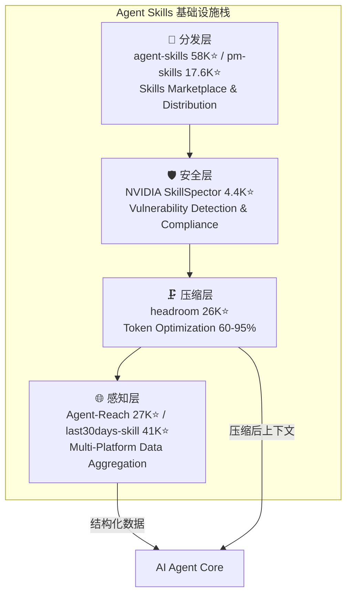
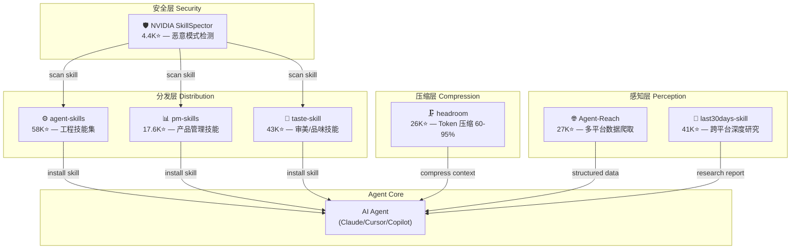

# 2026-06-14 GitHub 趋势研究简报

## 今日重点趋势

### 趋势 1：Agent Skills 全栈基础设施化（93 分）

本周 GitHub Trending 最显著的结构性信号：**Agent Skills 不再是散落的脚本，而是正在形成完整的四层基础设施栈**。

关键判断：

- **分发层**：addyosmani/agent-skills（58K⭐）已成为事实上的 Skills 分发中心，pm-skills（17.6K⭐）垂直领域（产品管理）紧随
- **安全层**：NVIDIA 入局是重大信号。SkillSpector（4.4K⭐）意味着企业开始正视 Agent Skills 的供应链安全问题——第三方 Skill 可能有恶意模式
- **压缩层**：headroom（26K⭐，周增 10.2K）持续爆发，Token 压缩正在从优化选项变为架构标配
- **感知层**：Agent-Reach（27K⭐）和 last30days-skill（41K⭐）分别从"广度爬取"和"深度研究"两个角度独立成层

**架构师启发**：如果你在构建 Agent 系统，现在需要像微服务架构考虑 API Gateway/Service Mesh/Observability 一样，考虑 Skills 的分发、安全、压缩和感知。这不是炒作，这是真实的架构分层在发生。

### 趋势 2：Apple Container 硅级容器化定局（90 分）

apple/container（36K⭐，周增 7.8K）不是新项目但本周增速显著。核心判断更新：

- **苹果官方背书**改变了 Mac 容器市场的竞争格局——Docker Desktop、OrbStack、Colima 都需要重新定位
- **Swift 原生 + Apple silicon 优化**意味着这是系统级基础设施，不是用户态工具
- 轻量 VM 方案是 **容器与虚拟机之间的第三条路**——安全性高于传统容器，开销低于完整 VM

对架构师的价值：在 Mac 开发团队中，apple/container 正在成为默认的本地容器运行时。对于 CI/CD pipeline 中涉及 Mac 的环节（如 iOS 构建），这是一个标准化候选。

### 趋势 3：Agent 感知层独立（87 分）

Panniantong/Agent-Reach（27K⭐，周增 5.4K）代表了 Agent 技术栈中一个新层的独立：

- **不同于传统爬虫**：Agent-Reach 面向 Agent 消费，输出结构化数据，不是给人看的 HTML
- **零 API 费用**：直接抓取而非通过官方 API，降低 Agent 数据获取成本
- **多平台覆盖**：Twitter/Reddit/YouTube/GitHub/Bilibili/XiaoHongShu，覆盖中西互联网

**泡沫风险**：零 API 费用的承诺依赖反爬策略的持续有效。平台可能随时加强反爬，导致项目可用性骤降。

### 趋势 4：开源 NotebookLM 赛道升温（85 分）

lfnovo/open-notebook（30K⭐，周增 3.8K）+ refactoringhq/tolaria（16K⭐，周增 3.5K）同时上榜：

- open-notebook 走 **全栈灵活**路线，TypeScript 实现，支持多模态
- tolaria 走 **桌面知识管理**路线，更偏 Obsidian/Notion 替代
- Google NotebookLM 的成功证明了 AI 增强知识管理的需求真实存在

### 趋势 5：RL 后训练环境接口标准化萌芽（78 分）

HuggingFace/OpenEnv（2.2K⭐）发布了 RL 后训练与环境交互的接口库。虽然 star 数不高，但信号意义重大——RL+LLM 训练栈正在从研究走向工程标准化。

---

## 重点项目深度分析

### 1. Panniantong/Agent-Reach — Agent 的互联网感知层

**GitHub**: https://github.com/Panniantong/Agent-Reach

| 维度 | 评分 | 理由 |
|------|------|------|
| 热度质量 | 8 | 周增 5.4K，持续性强，非一日泡沫 |
| 技术创新度 | 7 | 多平台聚合不新，但面向 Agent 消费的结构化输出有创新 |
| 工程成熟度 | 7 | 支持 7+ 平台，CLI 可用，但依赖反爬策略 |
| 架构启发价值 | 9 | "感知层独立"是 Agent 架构演进的重要信号 |
| 企业落地潜力 | 5 | 反爬依赖和合规风险限制企业场景 |
| 中期趋势概率 | 8 | Agent 需要多平台数据是刚需，方向明确 |
| 平台化潜力 | 7 | 可演化为 Agent 数据服务的标准接口 |
| 基础设施潜力 | 7 | 如果加入缓存/调度/合规层，有基础设施潜质 |

**总分**: 58/80 → **72.5/100**

**定位**: 基础设施候选（感知层）

**为什么火**: AI Agent 开发者急需多平台数据接入，而官方 API 贵且不全。Agent-Reach 用一个 CLI 解决了 7+ 平台的数据获取问题，直击痛点。

**真实技术亮点**:
1. 统一 CLI 接口覆盖异构平台（Twitter/Reddit/YouTube/Bilibili/XiaoHongShu 等）
2. 输出结构化数据，直接可被 Agent 消费
3. 零 API 费用——直接抓取页面数据

**架构启发**: Agent 技术栈正在分化出"感知层"——专门负责外部数据获取和预处理。这与自动驾驶中的感知模块类似，Agent 感知层的独立意味着 Agent 核心可以更专注于推理和决策。

**风险与泡沫点**:
1. ⚠️ 反爬风险——平台加强反爬后可用性可能骤降
2. ⚠️ 合规灰区——大规模抓取可能违反平台 ToS
3. ⚠️ 数据质量——无 API 保障的数据可能不稳定

**是否值得持续跟踪**: ✅ 是。即使 Agent-Reach 本身受限，"Agent 感知层独立"这一趋势值得长期跟踪。

### 2. chopratejas/headroom — Token 压缩从优化变为标配

**GitHub**: https://github.com/chopratejas/headroom

| 维度 | 评分 | 理由 |
|------|------|------|
| 热度质量 | 9 | 周增 10.2K，26K 总星，持续高增长 |
| 技术创新度 | 8 | CCR 可逆压缩是真实工程创新 |
| 工程成熟度 | 8 | Library/Proxy/MCP 三模式覆盖完善 |
| 架构启发价值 | 9 | Token 压缩成为 Agent 架构的独立层 |
| 企业落地潜力 | 8 | 直击成本痛点，ROI 可量化 |
| 中期趋势概率 | 9 | Token 成本是 Agent 规模化的硬约束 |
| 平台化潜力 | 8 | Proxy 模式可成为平台 |
| 基础设施潜力 | 9 | 有成为 Agent 基础设施标配的明确路径 |

**总分**: 68/80 → **85/100**

**判断更新**: headroom 从"值得关注"升级为"Agent 基础设施候选"。周增 10.2K 的持续性证明 Token 压缩不是可选项而是必需品。MCP Server 模式让它可以无缝接入任何 Agent 架构。

### 3. lfnovo/open-notebook — 开源 NotebookLM 从玩具到工具

**GitHub**: https://github.com/lfnovo/open-notebook

| 维度 | 评分 | 理由 |
|------|------|------|
| 热度质量 | 8 | 30K 总星，周增 3.8K，稳步上升 |
| 技术创新度 | 6 | 概念不新，但工程实现成熟 |
| 工程成熟度 | 8 | TypeScript 全栈，可自托管，功能完整 |
| 架构启发价值 | 6 | RAG + 多模态的组合实践有参考价值 |
| 企业落地潜力 | 7 | 自托管知识管理，数据可控 |
| 中期趋势概率 | 7 | AI 增强知识管理需求真实 |
| 平台化潜力 | 6 | 可作为企业知识平台底座 |
| 基础设施潜力 | 5 | 更偏应用层而非基础设施 |

**总分**: 53/80 → **66.3/100**

**定位**: 生产可用（知识管理领域）

---

## 风险与机遇

### 机遇
- **Agent Skills 四层栈**为创业者明确了产品方向：安全审计、压缩优化、感知聚合各有空间
- **Apple Container** 为 Mac 为主的开发团队提供了官方容器方案
- **open-notebook** 证明 AI 增强知识管理可自托管，企业数据安全可控

### 风险
- Agent Skills 市场可能重演 npm 供应链安全问题——SkillSpector 的出现本身就是风险信号
- Agent-Reach 类项目的反爬依赖可能引发法律风险
- Agent Skills 爆发式增长中混入大量低质量"包装"项目，需要严格筛选

---

## 今日 Mermaid 图

### Agent Skills 四层基础设施栈全景图

---

## 重点项目档案

本次新增/更新的项目档案：

| 项目 | 操作 | 文件 |
|------|------|------|
| Panniantong/Agent-Reach | 🆕 新增 | `projects/agent-reach.md` |
| lfnovo/open-notebook | 🆕 新增 | `projects/open-notebook.md` |
| chopratejas/headroom | 🔄 更新 | `projects/headroom.md` |
| apple/container | 🔄 更新 | `projects/apple-container.md` |
| NVIDIA/SkillSpector | 🔄 更新 | `projects/nvidia-skillspector.md` |
| addyosmani/agent-skills | 🔄 更新 | `projects/agent-skills.md` |

---

*研究日期：2026-06-14 · 研究者：GitHub 趋势研究助理*
