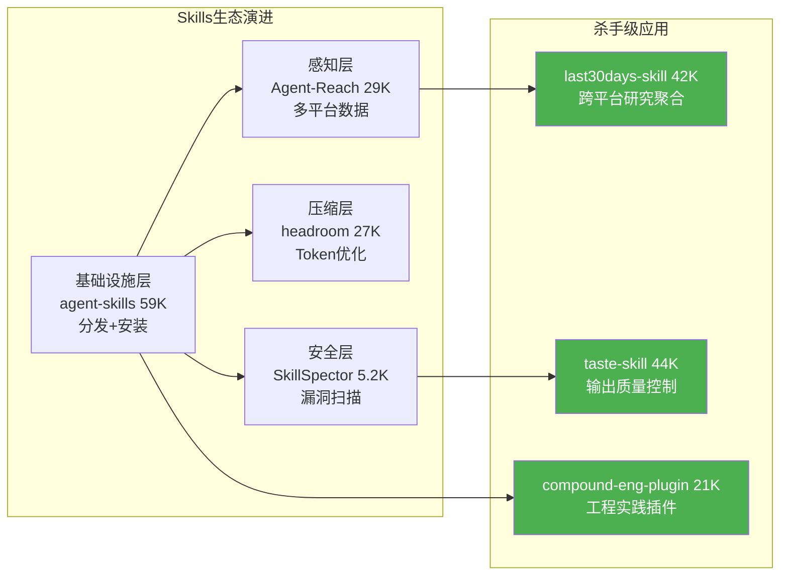
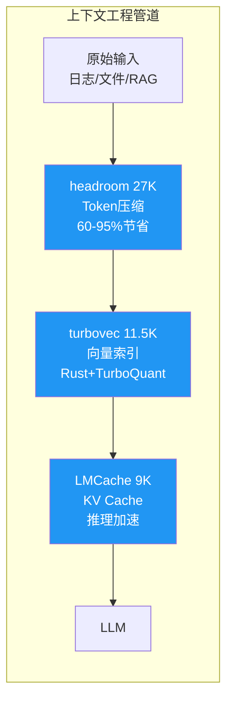

# 2026-06-15 GitHub 趋势研究简报

## 今日核心判断

Agent Skills 生态在 48 小时内完成了从"基础设施铺设"到"杀手级应用验证"的跳跃。上周我们还在讨论 Skills 的分发层、安全层、压缩层——今天 last30days-skill 周增 12.6K 证明 Skill 有真实杀手级用例，taste-skill 周增 8K 证明质量控制的 Skill 也有市场。这不是一个概念了。

同时，上下文工程工具链的三位一体（压缩→索引→缓存）在今日完成闭环。headroom 做输入压缩、turbovec 做向量索引、LMCache 做 KV Cache 加速——三个项目分别解决了 LLM 上下文窗口的"太贵"、"太慢"、"太大"三个核心问题。

## 今日五大趋势

### 趋势 1：Agent Skills 杀手级应用涌现（趋势分 92）

**关键变化：**
- last30days-skill 从 29K 涨到 42K（周增 12.6K），是本周增速最快的 Agent Skill 项目
- taste-skill 从 29K 涨到 44K（周增 8K），质量控制 Skill 的市场需求被验证
- compound-engineering-plugin 21K（周增 1.2K），将工程方法论编码为 Agent 可执行插件
- pm-skills 上榜 PM Skills Marketplace，Agent Skills 向非技术角色扩展

**架构判断：** Agent Skills 正在重复 Docker 镜像的路径——先是基础设施（Docker Hub），然后是安全扫描（Trivy/Clair），最后是杀手级应用（K8s 生态）。Skills 的"K8s 时刻"可能还没到，但"应用层验证"已经完成。

### 趋势 2：上下文工程工具链三位一体（趋势分 89）

- **headroom**（27.5K，周增 10.4K）：Token 压缩中间件，支持 Library/Proxy/MCP 三种部署模式
- **turbovec**（11.5K，周增 6.5K）：Rust 向量索引，10M 文档从 31GB 压缩到 4GB，速度击败 FAISS
- **LMCache**（9K，周增 585）：vLLM 生态的 KV Cache 加速层，PagedAttention 之后的推理优化新原语

**架构判断：** 这三个项目合在一起构成了 context engineering 的完整管道：压缩（减少输入 token）→ 索引（快速检索相关上下文）→ 缓存（避免重复计算）。每个环节都是独立可替换的，但组合使用效果最大化。这预示着 LLM 推理成本优化从"调参"进入"系统工程"阶段。

### 趋势 3：本地多模态 AI 运行时扩展（趋势分 84）

- **whichllm**（4.7K，周增 1.8K）：一行命令测出本地硬件最优 LLM 配置
- **Open-LLM-VTuber**（11.3K，周增 1.1K）：本地语音交互 + Live2D 虚拟形象
- **MoneyPrinterTurbo**（87.8K，周增 7K）：AI 短视频生成，从文本到高清视频

本地 AI 不再只是文本推理。语音、视频、多模态交互的端侧运行时正在快速成熟。

### 趋势 4：安全工具 AI 化与图分析化（趋势分 80）

- **NVIDIA SkillSpector**（5.2K，周增 2.8K）：Agent Skill 安全扫描器，NVIDIA 官方出品
- **flowsint**（6.6K，周增 966）：图分析安全调查平台
- **maigret**（33K，周增 1.7K）：OSINT 用户名追踪，3000+ 站点

安全工具正在经历 AI 原生重构——不是"用 AI 做安全"，而是"为 AI 系统做安全工具"。

### 趋势 5：垂直领域 AI 基础模型萌芽（趋势分 76）

- **shiyu-coder/Kronos**：金融市场基础模型，登上日榜
- **openmed**（3.5K，周增 2K）：开源医疗 AI

基础模型从通用走向垂直。金融和医疗是最先发力的两个方向——它们有足够的数据密度和专业壁垒。

## 重点项目深度分析

### 1. 🔎 last30days-skill — Agent Skills 第一个杀手级应用

**Stars:** 41,943（周增 12,602，本周 GitHub 全站周榜 #1）
**语言:** Python
**分类:** 生产可用 → 平台候选

**为什么重要：** 它证明了 Agent Skills 不只是开发者的工具配置文件，而是能产生独立价值的杀手级应用。一个 Skill 就解决了"跨 10+ 平台聚合信息并合成研究简报"这个真实需求——这正是 AI Agent 最常见的用例之一。

**架构启发：** Skill 作为独立分发单元，其价值不依附于任何特定 Agent 框架。这很像 Docker 镜像——容器的价值不依附于 K8s 或 Docker Swarm。Skill 可能会成为 Agent 时代的"包"格式。

**风险/局限：** 依赖第三方平台 ToS，API 变动可能导致功能不可用。12.6K/周增速中有多少来自媒体效应需要持续观察。

### 2. ⚡ LMCache — LLM 推理 KV Cache 加速层

**Stars:** 9,043（周增 585）
**语言:** Python
**分类:** 基础设施候选

**为什么重要：** 在 vLLM/PagedAttention 之后，KV Cache 管理是 LLM 推理优化的下一个前沿。LMCache 将缓存层从推理引擎中解耦，使得多模型共享缓存成为可能。

**架构启发：** 缓存层的解耦是推理基础设施成熟化的标志。从 GPU 内存 → 进程内缓存 → 跨进程缓存 → 分布式缓存，这个层次结构正在形成。

### 3. 🎨 taste-skill — AI 输出质量守门员

**Stars:** 43,637（周增 8,097）
**语言:** Shell
**分类:** 工具型

**为什么重要：** "AI slop"（AI 生成的低质量通用内容）正在成为严肃问题。taste-skill 通过编码"好品味"规则来约束 AI 输出，证明了质量控制可以做成独立的、可分发的 Skill。

**架构启发：** 质量控制作为独立层，而不是嵌入模型本身——这是 AI 工程从"模型中心"走向"系统中心"的又一个信号。

### 4. 🚀 turbovec — 上下文工程的索引层

**Stars:** 11,493（周增 6,535）
**语言:** Rust / Python
**分类:** 基础设施候选

**为什么重要：** 在 RAG 场景下，向量索引是性能瓶颈。turbovec 用 Rust + SIMD + TurboQuant 量化实现了 10M 文档 31GB→4GB 的压缩和比 FAISS 更快的搜索。它填补了上下文工程管道中的索引环节。

## 风险与机遇

**机遇：**
- Agent Skills 杀手级应用的出现意味着 Agent 生态进入"应用商店"阶段的前夜
- 上下文工程工具链成型将大幅降低 LLM 推理成本，加速企业落地
- 本地多模态 AI 运行时扩展意味着端侧 AI 场景将爆发

**风险：**
- Agent Skill 周增速可能存在媒体泡沫，需要关注 2-3 周后的留存率
- 上下文工程工具目前各自为政，缺乏统一标准接口
- 垂直领域 AI 基础模型的壁垒可能被通用模型的领域微调打破

## 重点项目档案

- 🔎 [last30days-skill](projects/last30days-skill.html) — Agent Skills 杀手级应用
- ⚡ [LMCache](projects/lmcache.html) — LLM KV Cache 加速层
- 🎨 [taste-skill](projects/taste-skill.html) — AI 输出质量守门员
- 🚀 [turbovec](projects/turbovec.html) — Rust 向量索引引擎
- 🖥️ [whichllm](projects/whichllm.html) — 本地 LLM 硬件选型工具

---

*本报告由 GitHub 趋势研究助理自动生成 | 2026-06-15*
