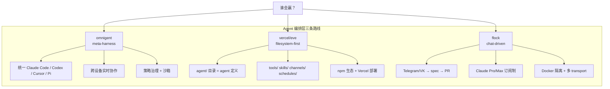
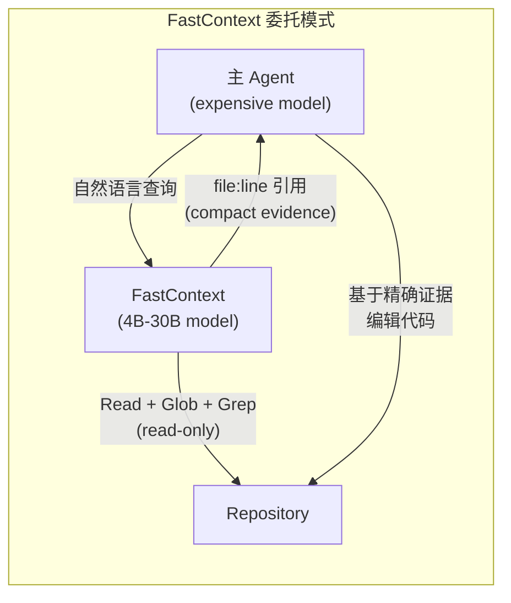

# 2026-06-19 GitHub 趋势研究简报

## 今日核心判断

**Agent Skill 经济学验证完成。** 一周前（6/13）我们记录 ponytail 时它只有 862 stars，今天它 36,393 stars——一周暴涨 42 倍。关键不是 star 数，而是 ponytail 发布了严格的 agentic benchmark：在真实 FastAPI+React 项目上，12 个 feature ticket，Haiku 4.5，n=4，54% LOC 削减、22% token 节省、20% 成本降低、27% 速度提升、100% 安全。这是第一次有 Skill 提供如此严格的数据。**Skill 不再是"有了"，而是"可量化了"。**

**Agent 编排层混战正式开启。** omnigent（meta-harness 统一所有 coding agent）、vercel/eve（filesystem-first 重构 agent 开发体验）、flock（chat-driven AI dev team 从 Telegram 驱动）——三条完全不同的路线在同一周爆发。这意味着 Agent 运行时标准的争夺进入实质阶段。

## 今日五大趋势

### 趋势 1：Agent Skill 经济学验证完成（趋势分 93）

ponytail 一周 42 倍的暴涨不是炒作。它发布的 benchmark 数据（54% LOC 削减、100% 安全）回答了行业最核心的问题：**Skill 到底有没有用？** 答案是可量化的"有"。与此同时：

- **shadcn/improve** 从 2.4K 增长到 5.5K，走"贵模型审计 + 便宜模型执行"的 tier 分层路线
- **BuilderIO/skills** 1.3K stars，BuilderIO 官方出品 Skills 库
- ponytail 兼容 13 种 agent，说明 Skill 的跨平台性已经验证

**关键判断：** Skill 经济学 = (LOC 削减 × 安全性) / (开发成本 × 维护成本)。ponytail 证明了分子可以很大。下一阶段竞争焦点是"谁的 Skill 库覆盖面最广"。

### 趋势 2：Agent 编排层混战开启（趋势分 90）

三个项目代表了三种完全不同的哲学：

| 项目 | 核心理念 | 优势 | 风险 |
|------|----------|------|------|
| omnigent | 不替换你的 agent，统一编排它们 | 跨 agent 协作、策略治理 | 过度抽象、alpha 阶段 |
| vercel/eve | 文件系统就是 agent 开发界面 | 开发体验、npm 生态 | Vercel 锁定、TypeScript only |
| flock | 聊天就是任务，PR 就是结果 | 极简使用门槛、订阅制 | 场景窄、依赖 Claude |

**关键判断：** omnigent 的 meta-harness 概念最雄心勃勃，但也最难——它要同时支持 Claude Code、Codex、Cursor 的内部协议，这些协议都在快速变化。vercel/eve 的 filesystem-first 最优雅，适合从零开始的新项目。flock 最接地气，但场景受限。

### 趋势 3：端侧 AI 与上下文工程双线推进（趋势分 87）

**Apple coreai-models**（1,064⭐）不是又一个模型库——它是 Apple 端侧 AI 的开发者基础设施：
- 模型导出配方（HuggingFace → Core AI `.aimodel` 格式）
- Python 构建块 + Swift 运行时
- 内置 Agent Skills（working-with-coreai, model-authoring, model-compression）
- 要求 macOS/iOS 27.0+，Xcode 27.0+

**Microsoft FastContext**（587⭐ + arXiv 论文）解决的是另一个问题：Coding Agent 的 context window 太贵了。方案是——用专用小模型（4B-30B）做仓库探索，返回精确的 `file:line` 引用，主模型只看关键代码。

**关键判断：** Apple 和 Microsoft 从两个方向解决同一个问题——AI 运行的"成本中心"管理。Apple 把推理放到端侧省 API 费，Microsoft 把探索委托给小模型省 context window。两者的共同前提是：Agent 时代，推理预算和 context 预算都是需要系统化管理的资源。

### 趋势 4：终端多路复用器 AI 化（趋势分 82）

**coder/boo**（661⭐）是 Coder 公司用 Zig + libghostty 构建的终端多路复用器。核心卖点不是 tmux 替代品，而是：**每个 session 的屏幕状态可以被 AI agent 精确读取。** 传统 tmux/screen 的 detach/reattach 只恢复"看起来"的内容，boo 恢复的是完整的终端状态（contents, styles, cursor, scrollback, modes）。这意味着 AI agent 可以 `boo peek` 读取另一个 session 的屏幕，就像人看屏幕一样。

### 趋势 5：Agent 安全与多模态 RL 新范式（趋势分 78）

- **burner-agents**（554⭐）：不是隐身，而是身份销毁。每次 web 交互用一次性 agent，完成后销毁一切。从隐私工具走向"不可归因"新范式。
- **Tencent UniRL**（646⭐）：统一多模态 RL 框架，一个 loop 训练 diffusion + AR + unified model。含 3 篇论文算法（DRPO, Flow-DPPO, CPPO）。

## 重点项目深度分析

### 1. Ponytail — Skill 经济学的 proof point

| 维度 | 评分 | 理由 |
|------|------|------|
| 热度质量 | 9 | 一周 42 倍，benchmark 驱动而非营销驱动 |
| 技术创新度 | 8 | YAGNI 编码为 Skill 是创新，但理念本身不新 |
| 工程成熟度 | 8 | 兼容 13 种 agent，benchmark 可复现 |
| 架构启发价值 | 9 | 证明 Skill 是可量化生产力工具 |
| 企业落地潜力 | 8 | MIT License，安全 100%，可直接用 |
| 中期趋势概率 | 9 | Skill 经济学已被验证 |
| 平台化潜力 | 7 | 本身是 Skill，但有平台化可能 |
| 基础设施潜力 | 5 | 不是基础设施 |
| **总分** | **63/80** | **工具型 → 生产可用过渡** |

### 2. Omnigent — Agent 编排的终极抽象

| 维度 | 评分 | 理由 |
|------|------|------|
| 热度质量 | 7 | 7 天 3.8K，真实需求驱动 |
| 技术创新度 | 9 | meta-harness 概念首次落地 |
| 工程成熟度 | 5 | alpha 阶段，212 个 issue |
| 架构启发价值 | 9 | 跨 agent 编排是硬问题 |
| 企业落地潜力 | 7 | Apache 2.0，policy/sandbox 设计好 |
| 中期趋势概率 | 8 | 多 agent 协作是确定性趋势 |
| 平台化潜力 | 9 | 有平台所有特征 |
| 基础设施潜力 | 8 | 可能成为 Agent 层的 Kubernetes |
| **总分** | **62/80** | **平台候选** |

### 3. Vercel eve — 开发体验优先的 Agent 框架

| 维度 | 评分 | 理由 |
|------|------|------|
| 热度质量 | 7 | 3 天 1.3K，Vercel 品牌加持 |
| 技术创新度 | 8 | filesystem-first 设计优雅 |
| 工程成熟度 | 6 | 早期，但 npm 包已发布 |
| 架构启发价值 | 8 | 约定优于配置用于 Agent |
| 企业落地潜力 | 7 | TypeScript 限定，但 DX 极好 |
| 中期趋势概率 | 8 | Vercel 生态 + Next.js 开发者基数 |
| 平台化潜力 | 8 | channels + schedules 天然平台特征 |
| 基础设施潜力 | 6 | 更偏框架而非基础设施 |
| **总分** | **58/80** | **平台候选（早期）** |

### 4. Microsoft FastContext — Coding Agent 的 context 经济学

| 维度 | 评分 | 理由 |
|------|------|------|
| 热度质量 | 6 | 587⭐ 但有 arXiv 论文背书 |
| 技术创新度 | 9 | 专用小模型做探索 + RL 训练 |
| 工程成熟度 | 7 | 微软出品，论文 + 代码 + 权重全发 |
| 架构启发价值 | 9 | context 委托模式定义新范式 |
| 企业落地潜力 | 8 | 4B 模型可本地跑，ROI 明确 |
| 中期趋势概率 | 8 | Coding Agent 必然需要 context 管理 |
| 平台化潜力 | 6 | 更偏工具/组件 |
| 基础设施潜力 | 7 | 可能成为 Coding Agent 标准组件 |
| **总分** | **60/80** | **基础设施候选** |

## 风险与机遇

### 机遇
1. **Skill 经济学已验证** → 企业应认真评估 Skill 库建设
2. **编排层混战** → 早期窗口，有空间做出更好的方案
3. **端侧 AI SDK 标准化** → Apple CoreAI 可能成为端侧推理标准
4. **Context 委托模式** → 可直接应用于现有 Coding Agent 部署

### 风险
1. **ponytail 36K 星可能的泡沫成分** — benchmark 只覆盖 12 个 ticket，需要更大规模验证
2. **omnigent alpha 阶段** — 212 个 issue，不建议生产环境使用
3. **Agent 编排层碎片化** — 三个项目三种范式，短期内不会收敛
4. **burner-agents 的伦理边界** — 不可归因 web 交互可被滥用

## 重点项目档案

- [Ponytail](projects/ponytail.html) — Agent Skill 经济学标杆
- [Omnigent](projects/omnigent.html) — Agent meta-harness
- [Vercel Eve](projects/vercel-eve.html) — Filesystem-first Agent 框架
- [Microsoft FastContext](projects/microsoft-fastcontext.html) — Context 委托子模型
- [Apple CoreAI Models](projects/apple-coreai-models.html) — 端侧 AI 开发者基础设施
- [Flock](projects/flock.html) — Chat-driven AI dev team
- [Coder Boo](projects/coder-boo.html) — AI 友好的终端多路复用器
- [Burner Agents](projects/burner-agents.html) — 不可归因 Web 交互

---

*本日报由 GitHub Researcher Agent 于 2026-06-19 06:00 CST 自动生成*
