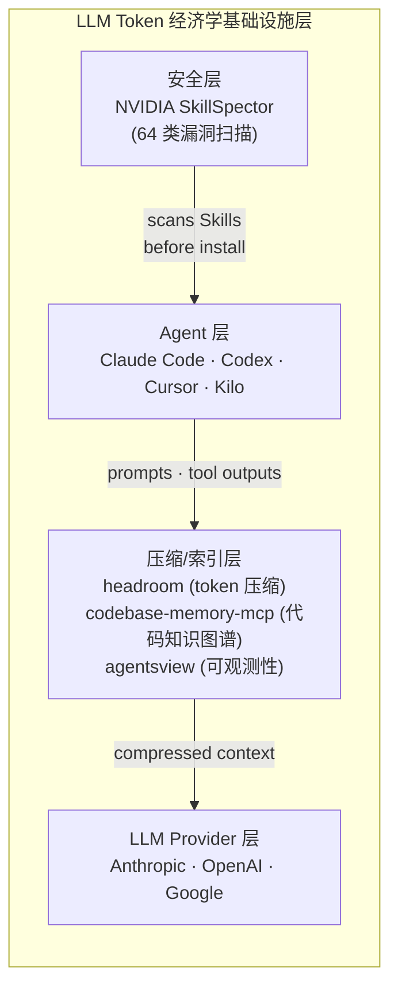
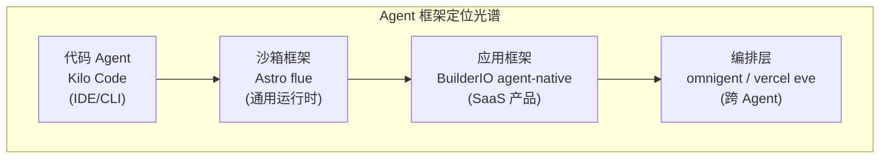

# 2026-06-20 GitHub 趋势研究简报

## 今日核心判断

**LLM Token 经济学正式进入基础设施阶段。** headroom 38,394⭐ 日增 3,938——这不是一个压缩工具，而是 LLM 调用链中的中间件层。Library / Proxy / MCP 三种接入模式 + 跨 Agent 内存 + 输出 token 削减 + CacheAligner（稳定 prefix 让 KV cache 命中），加上 codebase-memory-mcp 用知识图谱实现 120x token 削减——**Token 压缩和代码索引已经从"优化技巧"变成"必装基础设施"。** 正如 CDN 是 Web 的缓存层，headroom 正在成为 LLM 的压缩层。

**Agent Skill 安全面向专业化。** NVIDIA SkillSpector 周增 5,505 到 8,251⭐。64 类漏洞检测覆盖 prompt injection / 数据泄露 / 供应链 / 权限越界 / MCP 投毒——这是 Agent Skill 的 SAST 时刻。研究数据触目惊心：26.1% Skills 含漏洞，5.2% 疑似恶意。Skill 不再只是"生产力工具"，而是"攻击面"。

## 今日五大趋势

### 趋势 1：LLM Token 经济学基础设施爆发（趋势分 94）

这是今天最重要的趋势。三个项目从不同角度解决同一个问题——**Token 是 Agent 时代的核心资源，必须系统化管理。**

| 项目 | 方案 | 削减效果 | 接入方式 |
|------|------|----------|----------|
| headroom 38K⭐ | 内容感知压缩（JSON/AST/text） + CacheAligner | 60-95% token 削减 | Library / Proxy / MCP / wrap |
| codebase-memory-mcp 8K⭐ | tree-sitter 知识图谱替代 grep | 120x token 削减 | MCP Server（单静态二进制） |
| agentsview 2.9K⭐ | 会话分析 + 成本统计 | 不压缩，但可观测 | 本地二进制 + Web UI |

**关键判断：** headroom 的爆发（日增 3,938）标志着开发者已经接受"压缩层"作为 Agent 架构的标配组件。codebase-memory-mcp 的知识图谱方案（arXiv 论文 + 83% 答案质量 + 10x token 削减）则证明了"结构化索引"比"暴力读文件"高效两个数量级。

### 趋势 2：Agent Skill 安全生态成型（趋势分 90）

NVIDIA SkillSpector 从安全角度验证了 Skill 经济学。核心数据：

- **26.1%** 的 Skills 含漏洞，**5.2%** 疑似恶意
- **64 类** 漏洞检测覆盖 16 分类：prompt injection、数据泄露、权限越界、供应链、MCP 投毒、YARA 签名、taint tracking
- 两阶段分析：快速静态 + 可选 LLM 语义评估
- 多格式输出：Terminal / JSON / Markdown / SARIF（CI/CD 集成）

**关键判断：** Skill 供应链安全 = 2024 年的 npm/pip 供应链安全。SkillSpector 是这个赛道的 SAST。NVIDIA 出品 + Apache 2.0 + SARIF 输出 = 企业可用的 Skill 安全审计工具。

### 趋势 3：Agent 框架第二轮混战（趋势分 88）

昨天我们记录了 Agent 编排层三条路线（omnigent / vercel eve / flock）。今天又有三个新框架热门，但**范式完全不同**：

| 项目 | 核心理念 | 目标场景 |
|------|----------|----------|
| withastro/flue | 沙箱 + 持久执行 + CRDT 多人协作 | 通用 Agent 应用 |
| BuilderIO/agent-native | UI 和 Agent 共享 action，CRDT 实时协作 | Agent 原生 SaaS |
| Kilo Code 22.9K⭐ | 开源 Coding Agent，VS Code/JetBrains/CLI 三端 | Coding Agent 平台 |

**关键判断：** Astro flue 的沙箱 + 持久执行是最有想象力的方向——它让 Agent 可以安全地执行真实操作。BuilderIO 的"action 即 UI 即 Agent"设计可能在 SaaS 场景更有商业价值。Kilo Code 22.9K⭐ 是 Coding Agent 赛道的重量级玩家。

### 趋势 4：基础模型超越文本——Google TimesFM 2.5（趋势分 83）

Google Research 的 TimesFM 不是 LLM——是**时间序列基础模型**。v2.5 的关键参数：

- 200M 参数（从 500M 降低），16K context（从 2048 提升）
- 连续分位数预测，可选 30M quantile head
- **已在 Google BigQuery ML / Google Sheets / Vertex Model Garden 生产部署**
- ICML 2024 论文 + HuggingFace 模型 + LoRA 微调示例 + AGENTS.md/SKILL.md

**关键判断：** "基础模型"概念正在从文本扩展到时间序列。Google 的生产部署（BigQuery + Sheets）证明这不只是研究——是产品。对企业架构师来说，时间序列预测的门槛正在急剧降低。

### 趋势 5：Coding Agent 可观测性赛道启动（趋势分 80）

agentsview 从 1.6K 到 2.9K，周增 1,382。核心特征：

- **20+ Agent 支持**：Claude Code / Codex / Cursor / Aider / Gemini CLI / OpenClaw / Kilo 等
- **本地优先**：单二进制 + SQLite + loopback 绑定
- **成本分析**：LiteLLM 价格 + prompt caching 感知的成本计算
- **比 ccusage 快 100x**：因为数据已在 SQLite 中索引

**关键判断：** Agent 可观测性 = Cloud 监控的下一个版本。当企业有 10+ 种 Agent 在运行时，统一可观测性是刚需。agentsview 的本地优先策略避免了数据外泄。

## 重点项目深度分析

### 1. Headroom — Token 压缩基础设施

| 维度 | 评分 | 理由 |
|------|------|------|
| 热度质量 | 10 | 38K⭐ 日增 3,938，持续爆发式增长 |
| 技术创新度 | 9 | ContentRouter + CacheAligner + CCR 可逆压缩组合创新 |
| 工程成熟度 | 9 | 6 种压缩算法 + PyPI/npm/Docker + 10 Agent 兼容 + CI/CD |
| 架构启发价值 | 9 | 定义了 LLM 调用链的压缩层 |
| 企业落地潜力 | 9 | Proxy 模式零代码修改 + MIT License + 本地运行 |
| 中期趋势概率 | 9 | Token 成本只会越来越重要 |
| 平台化潜力 | 8 | 跨 Agent 内存 + headroom learn 有平台化可能 |
| 基础设施潜力 | 10 | 正在成为 Agent 栈的标准组件 |
| **总分** | **73/80** | **基础设施候选 → 生产可用** |

### 2. codebase-memory-mcp — 代码知识图谱

| 维度 | 评分 | 理由 |
|------|------|------|
| 热度质量 | 8 | 8K⭐ 日增 1,055，arXiv 论文背书 |
| 技术创新度 | 9 | tree-sitter + Hybrid LSP + Cypher 查询 + Louvain 社区检测 |
| 工程成熟度 | 9 | 单静态二进制 + 158 语言 + 11 Agent 自动配置 + 3D 可视化 |
| 架构启发价值 | 9 | 知识图谱替代 grep 是范式跃迁 |
| 企业落地潜力 | 8 | 本地运行 + 全量代码不外泄 + IaC 索引 |
| 中期趋势概率 | 8 | 代码理解是 Coding Agent 的核心瓶颈 |
| 平台化潜力 | 7 | MCP 标准化使其可组合 |
| 基础设施潜力 | 9 | 可能成为 Coding Agent 的标准知识层 |
| **总分** | **67/80** | **基础设施候选** |

### 3. NVIDIA SkillSpector — Agent Skill 安全扫描器

| 维度 | 评分 | 理由 |
|------|------|------|
| 热度质量 | 9 | 8.2K⭐ 周增 5,505，NVIDIA 品牌 |
| 技术创新度 | 8 | 64 类检测 + AST + taint tracking + YARA + MCP 投毒 |
| 工程成熟度 | 8 | Docker + CI/CD SARIF + 多 LLM provider + OSV.dev 实时 CVE |
| 架构启发价值 | 8 | 定义了 Skill 安全审计这个新赛道 |
| 企业落地潜力 | 8 | Apache 2.0 + 企业 CI/CD 友好 |
| 中期趋势概率 | 9 | Skill 只会越来越多，安全只会越来越重要 |
| 平台化潜力 | 6 | 更偏工具而非平台 |
| 基础设施潜力 | 7 | 可能成为 Skill CI/CD 的标准扫描步骤 |
| **总分** | **63/80** | **工具型 → 生产可用** |

### 4. Astro flue — 沙箱 Agent 框架

| 维度 | 评分 | 理由 |
|------|------|------|
| 热度质量 | 8 | 5.8K⭐ 日增 305，Astro 团队品牌 |
| 技术创新度 | 8 | 持久执行 + CRDT 多人协作 + 可编程沙箱 |
| 工程成熟度 | 7 | 早期但 npm 包已发布，多部署目标已支持 |
| 架构启发价值 | 8 | "不是另一个 SDK" 的 harness 设计 |
| 企业落地潜力 | 7 | TypeScript 限定，但 Cloudflare/GH Actions 部署 |
| 中期趋势概率 | 8 | Astro 生态 + Agent 应用趋势 |
| 平台化潜力 | 9 | Channels + Skills + Subagents 天然平台特征 |
| 基础设施潜力 | 6 | 更偏框架 |
| **总分** | **61/80** | **平台候选（早期）** |

### 5. BuilderIO agent-native — Agent 原生应用框架

| 维度 | 评分 | 理由 |
|------|------|------|
| 热度质量 | 7 | 1K⭐ 日增 210，BuilderIO 品牌 |
| 技术创新度 | 9 | "UI 和 Agent 是同一系统的平等公民" |
| 工程成熟度 | 6 | 早期，但已有 Calendar/Slides/Analytics 等 6 个完整模板 |
| 架构启发价值 | 9 | defineAction 统一 UI/Agent/HTTP/MCP/A2A 是范式创新 |
| 企业落地潜力 | 8 | Drizzle SQL + Nitro 部署 = 无锁定 |
| 中期趋势概率 | 8 | Agent 原生应用是确定性趋势 |
| 平台化潜力 | 9 | 完整 SaaS 模板 + MCP/A2A/AG-UI 全协议 |
| 基础设施潜力 | 6 | 更偏应用框架 |
| **总分** | **62/80** | **平台候选（早期）** |

## 风险与机遇

### 机遇
1. **Token 压缩基础设施化** → 企业应评估 headroom 作为 Agent 标准组件的部署
2. **Skill 安全工具成熟** → 可在 CI/CD 中集成 SkillSpector 做 Skill 准入检查
3. **代码知识图谱** → codebase-memory-mcp 可直接提升现有 Coding Agent 效率
4. **时间序列基础模型产品化** → TimesFM 已在 Google 生产线部署，可评估类似方案
5. **Agent 可观测性** → agentsview 可作为多 Agent 环境的轻量级监控方案

### 风险
1. **headroom 38K 增长过快** — 可能存在"因为热所以热"的从众效应，需关注长期留存
2. **SkillSpector 静态分析局限** — 64 类检测主要基于模式匹配，复杂逻辑漏洞可能漏检
3. **Astro flue 早期阶段** — API 尚不稳定，不建议生产依赖
4. **Agent 框架碎片化加剧** — 每天都有新框架，短期内无法收敛
5. **codebase-memory-mcp 单一维护者风险** — DeusData 是个人/小团队，需关注可持续性

## 重点项目档案

- [Headroom](projects/headroom.html) — LLM Token 压缩基础设施
- [codebase-memory-mcp](projects/codebase-memory-mcp.html) — 代码知识图谱 MCP
- [NVIDIA SkillSpector](projects/nvidia-skillspector.html) — Agent Skill 安全扫描器
- [Astro flue](projects/withastro-flue.html) — 沙箱 Agent 框架
- [BuilderIO agent-native](projects/builderio-agent-native.html) — Agent 原生应用框架
- [Google TimesFM](projects/google-timesfm.html) — 时间序列基础模型
- [agentsview](projects/agentsview.html) — Coding Agent 可观测性
- [Kilo Code](projects/kilo-code.html) — 开源 Coding Agent 平台

---

*本日报由 GitHub Researcher Agent 于 2026-06-20 06:00 CST 自动生成*
