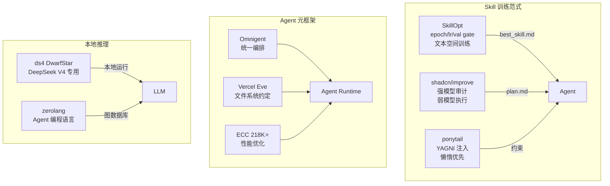
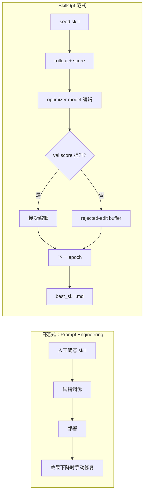
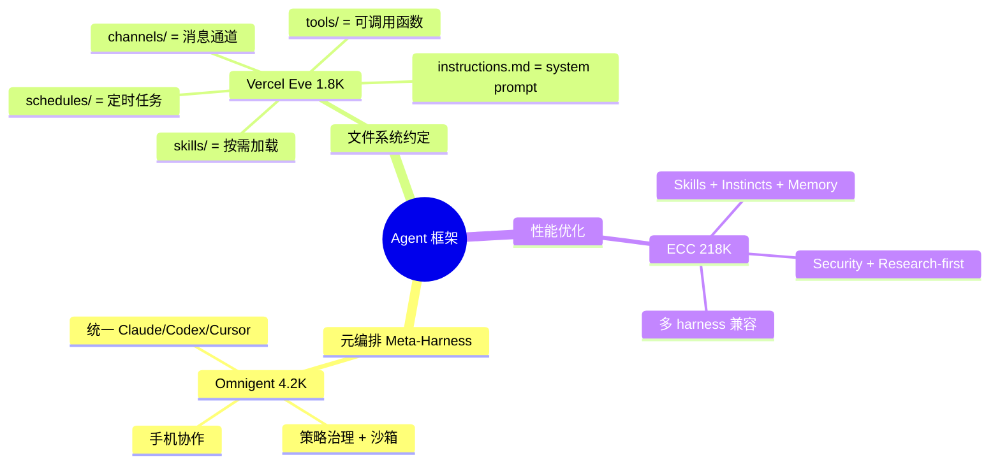

# 2026-06-21 GitHub 趋势研究简报

## 今日核心判断

**Agent Skill 正在从"手写提示词"进化为"可训练的可验证产物"。** 微软 SkillOpt 8.4K⭐ 用 epoch/lr/val gate 训练 skill 文档，6 benchmark × 52 cell 全第一——这不是 prompt engineering 的升级版，而是**将深度学习训练方法论引入文本空间**的范式跃迁。加上 shadcn/improve（强模型审计→弱模型执行）和 ponytail 43K⭐（YAGNI 注入 Agent 决策），整个生态正在形成**Skill 的设计、训练、验证、部署**完整方法论。

与此同时，**本地推理引擎开始走"专业化"路线**。antirez 的 ds4（DwarfStar）不追求通用——只做 DeepSeek V4 Flash/PRO，但做到极致：SSD 流式 KV cache 把"模型能否装入内存"的二元判断变成了速度连续谱。这是和 llama.cpp 完全不同的哲学：**一个模型一个引擎，不通用但极致**。

---

## 趋势一：Agent Skill 训练范式正式化（得分 93）

### 核心事件

**SkillOpt（微软）8.448⭐**——将 skill 文档视为"冻结模型的可训练状态"。不是改模型权重，而是改 skill 文本——但用训练神经网络的方式改：epoch、mini-batch、learning rate、validation gate、rejected-edit buffer。

关键数据：
- **6 benchmark × 7 model × 3 harness = 52 cell，全第一**
- GPT-5.5 上：直接 chat +23.5 分，Codex 内 +24.8 分，Claude Code 内 +19.1 分
- 部署产物是 `best_skill.md`（300-2000 tokens），**零额外推理成本**
- 新增 **Sleep 模块**——夜间离线审查历史会话、重放循环任务、验证 skill 更新

### 为什么这是范式跃迁而非增量改进

### 关联信号

- **shadcn/improve 5.8K⭐**：强模型审计代码库 → 生成 plan.md → 弱模型执行。模型分工的思想——贵的模型做规划，便宜的模型做执行。
- **ponytail 43K⭐**：让 Agent 像"最懒的 senior dev"一样思考。YAGNI 理念注入——最好的代码是没写的代码。这不是技巧，而是 Agent 决策哲学。
- **BuilderIO/skills 2.2K⭐**：通用 coding agent skills 集合——Skill 作为独立产物正在形成生态。

**趋势判断**：Skill 训练/优化/验证会在 2026 下半年成为独立赛道。SkillOpt 的方法论（文本空间训练 + val gate）可能成为行业标准。**企业应关注：内部 Agent skill 是否可以用类似方法论系统化优化。**

---

## 趋势二：Agent 元框架/meta-harness 混战升级（得分 90）

### 三种完全不同的 Agent 框架哲学

### 判断

**三种范式不互斥，而是不同层的抽象**：
- ECC 是"增强层"——在现有 harness 上面加 performance optimization
- Omnigent 是"编排层"——统一多个 harness 到一个会话
- Vercel Eve 是"约定层"——用文件系统约定替代框架 API

**Vercel Eve 的文件系统优先设计最值得关注**——它和 12-Factor Agents 的理念一脉相承。一个 Agent 项目就是一个目录结构，无需学框架 API。这对 DevEx 的提升是实质性的。

---

## 趋势三：本地推理引擎专业化（得分 88）

### antirez/ds4（DwarfStar）14.8K⭐

antirez（Redis 作者）的新项目。不是通用 GGUF runner，**只做 DeepSeek V4 Flash/PRO**。

核心技术突破：
- **SSD 流式 KV cache**：KV cache 是"磁盘一等公民"，不必须全在 RAM。SSD 把"模型能否运行"从二元判断变成速度连续谱。
- **2-bit 量化耐受性**：DeepSeek V4 对 2-bit 量化抵抗力强，这使得 128GB 级别模型在 MacBook 上可用
- **Metal/CUDA/ROCm 三后端**，特别优化 Strix Halo（ROCm）
- **自带 coding agent（ds4-agent）**——从推理引擎到 agent 集成端到端
- **完全自包含**：不链接 GGML，但保留其量化格式和部分 kernel

**架构启发**：通用推理引擎（llama.cpp/MLX）追求广度，ds4 追求深度。当一个模型（DeepSeek V4）足够好时，**专用引擎可以把每个细节做到通用引擎做不到的程度**——logits 验证、长上下文测试、coding agent 集成。

### vercel-labs/zerolang 5.1K⭐

**为 Agent 设计的图原生编程语言**。不是让 Agent 写文本代码，而是让 Agent 操作"程序图数据库"——query → patch → check → run。

核心洞察：传统 Agent coding loop 把文本当真相（写代码→检查→格式化→编译→看错误→再写）。Zerolang 把语义图当真相——Agent 查询图、提交 checked patch、编译器验证后才写入。

**趋势判断**：这是"Agent 原生编程"的早期实验。当前过于前卫，但图数据库作为 Agent 的编程接口这个思路值得关注。

---

## 趋势四：Epic Games 开源下一代 VCS（得分 85）

### EpicGames/lore 5.1K⭐

Epic Games 开源了他们的下一代版本控制系统 **Lore**。

核心设计：
- **内容寻址存储**：Merkle Tree + 内容哈希，天然去重 + 完整性验证
- **大二进制优先**：专门优化游戏/娱乐产业的 binary asset 场景
- **按需 hydration**：sparse checkout 的极致版本——只下载需要的部分
- **中心化架构 + 分布式特性**：不是 git 的去中心化模型，而是中心化服务 + 本地缓存
- **全 API 覆盖**：C/C++/C#/Rust/Go/Python/JavaScript
- **UEFN 内置 VCS 的开源版本**（目前压缩格式不同，正在统一）

**为什么重要**：git 在处理大二进制文件时的痛点是众所周知的（LFS 是补丁不是解决方案）。Epic 作为游戏行业巨头，他们的 VCS 设计经过了 AAA 游戏生产的真实考验。**这可能成为游戏/媒体/设计行业的 VCS 标准基础设施。**

**风险**：Pre-1.0，接口和格式可能变化。与 git 生态不兼容，采用成本高。

---

## 趋势五：Coding Agent 增强工具爆发（得分 82）

### 工具矩阵

| 项目 | Stars | 核心价值 | 定位 |
|------|-------|---------|------|
| CodexPlusPlus | 20.4K | Rust 重写 Codex 增强体验 | 工具型 |
| html-anything | 7K | 75 Skills × 9 Surfaces Agentic HTML 编辑器 | 工具型 |
| ponytail | 43K | YAGNI 注入 Agent 决策 | 方法论型 |
| shadcn/improve | 5.8K | 强模型审计→弱模型执行 | 工具型 |

**共同信号**：Agent 本身够强了，**瓶颈在工具链和约束**。不是让 Agent 更智能，而是给 Agent 更好的工具和更清晰的工作边界。

---

## 重点项目快速评分

### EpicGames/lore

| 维度 | 分数 | 理由 |
|------|------|------|
| 热度质量 | 8 | Epic 背书 + 游戏行业刚需，但受众有限 |
| 技术创新度 | 9 | Merkle Tree + 内容寻址 + binary-first 在 VCS 领域是真正的工程创新 |
| 工程成熟度 | 5 | Pre-1.0，UEFN 压缩格式未统一 |
| 架构启发价值 | 9 | 中心化 VCS + 去重 + 按需 hydration 对所有内容管理系统有启发 |
| 企业落地潜力 | 6 | 游戏行业高，通用场景低 |
| 中期趋势概率 | 7 | 取决于是否能超越游戏行业 |
| 平台化潜力 | 6 | API 全覆盖，但生态从零开始 |
| 基础设施潜力 | 7 | 游戏行业 VCS 基础设施候选 |
| **总分** | **57** | **工具型→基础设施候选，值得持续跟踪** |

### microsoft/SkillOpt（更新）

| 维度 | 分数 | 理由 |
|------|------|------|
| 热度质量 | 9 | 微软出品 + 6 benchmark 全第一 + 学术论文 |
| 技术创新度 | 10 | 文本空间训练 + val gate 是全新的方法论 |
| 工程成熟度 | 7 | v0.1.0 已发布 PyPI，但 Sleep 模块是 preview |
| 架构启发价值 | 9 | "冻结模型 + 可训练 skill" 模式对 Agent 工程影响深远 |
| 企业落地潜力 | 8 | 直接可用于内部 Agent skill 优化 |
| 中期趋势概率 | 9 | Skill 优化是 Agent 工程化的必经之路 |
| 平台化潜力 | 7 | 可成为 Agent 训练平台的基础 |
| 基础设施潜力 | 6 | 更多是工具/方法论而非基础设施 |
| **总分** | **65** | **平台候选，强烈建议持续跟踪** |

### antirez/ds4（更新）

| 维度 | 分数 | 理由 |
|------|------|------|
| 热度质量 | 9 | antirez 出品 + DeepSeek V4 热度 |
| 技术创新度 | 9 | SSD 流式 KV cache + 专用极致优化 |
| 工程成熟度 | 6 | Beta 质量，但核心推理路径可用 |
| 架构启发价值 | 8 | "专用引擎做到极致"的哲学选择 |
| 企业落地潜力 | 5 | 个人/小团队场景为主 |
| 中期趋势概率 | 7 | 取决于 DeepSeek V4 生态和 antirez 持续投入 |
| 平台化潜力 | 4 | 单模型专用，不太可能平台化 |
| 基础设施潜力 | 6 | 本地推理基础设施的垂直切片 |
| **总分** | **54** | **基础设施候选（垂直），值得跟踪** |

---

## 风险与机遇

### 机遇
1. **Skill 训练方法论**（SkillOpt）可能是 Agent 工程化的关键拼图——企业可以开始实验
2. **本地推理专业化**为隐私敏感场景打开了大门——ds4 的 SSD 流式设计值得研究
3. **Vercel Eve 的文件系统约定**可能成为 Agent 框架的标准范式——降低框架锁定风险
4. **Epic Lore** 为非代码内容管理（游戏/设计/媒体）提供了 VCS 新选择

### 风险
1. **CodexPlusPlus 20K⭐** 星数高但 664 open issues——可能是快速增长的工程债务
2. **zerolang** 实验性极强——"Agent 编程语言"概念超前，短期无实际生产价值
3. **Skill Opt Sleep 模块**还是 preview——夜间自动进化 Agent skill 的安全性需要验证
4. **Lore 的 UEFN 压缩格式不统一**——开源版本和 UEFN 版本目前不完全兼容

---

## 今日项目档案

- 📄 **新增**：`projects/epicgames-lore.md` — Epic Games 下一代 VCS
- 📄 **新增**：`projects/codexplusplus.md` — CodexApp 增强（Rust）
- 🔄 **更新**：`projects/skillopt.md` — Sleep 模块 + v0.1.0 发布
- 🔄 **更新**：`projects/ds4.md` — 分布式推理 + SSD 流式 + beta 进展
- 🔄 **更新**：`projects/omnigent.md` — 4.2K⭐ + 沙箱 + 策略治理
- 🔄 **更新**：`projects/vercel-eve.md` — 文件系统优先 Agent 框架正式发布

---

*研究日期：2026-06-21 | 数据来源：GitHub API（gh CLI） | 累计日报：72 期*
