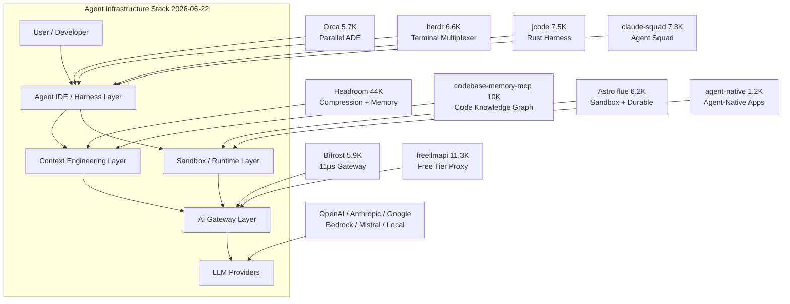

# 2026-06-22 GitHub 趋势研究简报

## 今日核心判断

**Agent 上下文压缩正在从"优化选项"变成"基础设施层"。** Headroom 44K⭐ 日增 2,617，已经在 Agent 栈中的位置等同于数据库层的连接池——你不一定需要自己写，但你一定需要一个。6 种压缩算法覆盖 JSON/Code/Prose/Image，3 种部署模式（library/proxy/MCP）覆盖所有架构场景，加上输出 token 削减和 cross-agent memory，Headroom 正在定义一个全新的 **"Context Engineering"** 层。

与此同时，**多 Agent 并行编排格局已经成型**。Orca、herdr、jcode、claude-squad 分别从 IDE、终端、harness 不同角度切入，但核心共识一致：**一个 Agent 不够，需要 fleet**。Worktree 隔离成为标准模式。

**AI Gateway 性能战**也在今天打响——Bifrost 用 Go 实现做到了 11µs overhead，对标 LiteLLM 的 50x，加上 semantic caching 和 MCP gateway，说明 AI 平台架构正在从"模型选择"演进为"网关 + 路由 + 缓存"的经典中间件模式。

---

## 趋势 1：Agent 上下文压缩层正式确立为基础设施（94 分）

**Headroom 44,115⭐ 日增 2,617**——数据说明一切。它已经不是"如果有空可以试试"的工具，而是**Agent 栈的标准管道**。

关键升级：
- **输出 token 削减**：不只压缩输入，verbosity steering + effort routing 削减模型输出 31.7%。在 Opus 级模型上 output 成本 5x input，这个优化价值巨大
- **headroom learn**：从失败会话中挖掘修正模式，写入 CLAUDE.md / AGENTS.md——Agent 开始有了"经验积累"
- **CacheAligner**：稳定 prompt 前缀让 provider KV cache 真正命中——这是一个工程细节但影响巨大
- **Cross-agent memory**：Claude/Codex/Cursor/Gemini 共享记忆，auto-dedup——多 Agent 协作不再丢失上下文
- **holdout 对照组**：`HEADROOM_OUTPUT_HOLDOUT=0.1` 保留 10% 不压缩作为对照——这是严肃的工程度量

codebase-memory-mcp 10,179⭐ 日增 1,029 是另一面——用知识图谱将代码理解 token 成本降低 120x。两者一个压缩通用上下文，一个压缩代码理解上下文，互补关系明确。

**架构师判断**：如果你的 Agent 应用还没有上下文压缩层，现在就是加上去的时机。成本影响是 60-95%，不是边际优化。

---

## 趋势 2：多 Agent 并行编排格局成型（91 分）

今天的 Trending 出现了一个清晰的共识：**一个 Agent 不够，需要 fleet**。

| 项目 | Stars | 核心差异 | 定位 |
|------|-------|----------|------|
| Orca | 5,784 | ADE（Agent Dev Environment），worktree + 移动端 + 设计模式 | 平台候选 |
| herdr | 6,636 | Rust 终端 agent multiplexer | 工具型 |
| jcode | 7,516 | Rust coding agent harness，minimal | 工具型 |
| claude-squad | 7,872 | Go 多 AI 终端管理（Claude/Codex/OpenCode/Amp） | 工具型 |
| ruflo | 60,737 | Claude multi-agent swarm meta-harness | 平台候选 |

**关键模式**：Git worktree 隔离已经成为多 Agent 并行的标准方案——每个 Agent 在独立 worktree 中工作，结果对比后合并 winner。Orca 把这个模式做成了产品级体验。

**架构师判断**：多 Agent 并行不是"更多 Agent = 更快"，而是**任务可分解性**决定收益。适合的场景是：探索性任务（多种方案并行尝试）、独立子任务（前端+后端+测试同时推进）、代码审查（多角度并行 review）。

---

## 趋势 3：AI Gateway 性能竞赛（87 分）

**Bifrost 5,937⭐**——Go 实现的 AI Gateway，11µs overhead@5k RPS，号称 50x faster than LiteLLM。

核心能力：
- 23+ provider 统一 OpenAI 兼容 API
- Adaptive load balancer + cluster mode
- Semantic caching（语义缓存，减少重复请求成本）
- MCP gateway（Agent 工具调用也走网关）
- Governance（budget management + virtual keys + rate limiting）
- 100% success rate@5k RPS

同时 **freellmapi 11,322⭐** 日增 226 聚合 16 个 LLM 免费层（~1.7B tokens/month），代表了另一面——通过网关层最大化利用免费配额。

**架构师判断**：AI Gateway 正在成为企业 AI 平台的核心组件，位置类比微服务架构中的 API Gateway。选型关键：延迟 overhead、provider 覆盖度、缓存策略、可观测性、治理能力。Bifrost 在性能维度领先，但 LiteLLM 在生态和成熟度上仍有优势。

---

## 趋势 4：Agent 框架两条路线分化（85 分）

**Astro flue 6,282⭐** 日增 280 vs **BuilderIO agent-native 1,296⭐** 日增 78——两条完全不同的 Agent 框架哲学：

- **flue 路线**："给 Agent 完整的工作环境"——sandbox + durable execution + CRDT + channels + subagents。Agent 是一等公民，应用为 Agent 服务。
- **agent-native 路线**："让应用原生支持 Agent"——在现有应用架构中嵌入 Agent 能力。应用是一等公民，Agent 是增强。

DeerFlow（字节出品）走的是第三条路：SuperAgent harness——研究、编码、创作一体化。

**system_prompts_leaks 44,323⭐** 日增 366 说明一个现实：大多数开发者 still 在用 prompt engineering 打基础，Agent 框架的渗透仍在早期。

---

## 趋势 5：Agentic 内容生产工业化（82 分）

**OpenMontage 8,487⭐** 日增 993——12 pipelines × 52 tools × 500+ agent skills，把 AI coding assistant 变成视频生产工作室。这不是"AI 剪辑工具"——这是**用 Agent 编排逻辑重构内容生产流水线**。

Palmier-Pro 4,933⭐（macOS AI 视频编辑器）和 voicebox 31,579⭐（开源 AI 语音工作室）验证了这个方向。

**关键洞察**：OpenMontage 的 52 tools × 500+ skills 架构，本质上是**将内容生产领域的最佳实践编码为 Agent 可执行的 skill 集合**——这个模式可以迁移到任何领域。

---

## 重点项目深度分析

### 1. Headroom — Agent 上下文压缩的"事实标准"（94 分）

| 维度 | 分数 | 理由 |
|------|------|------|
| 热度质量 | 9 | 44K stars 日增 2.6K，多日持续 |
| 技术创新度 | 9 | 6 算法 + CCR 可逆压缩 + CacheAligner |
| 工程成熟度 | 9 | library/proxy/MCP + evals + holdout |
| 架构启发价值 | 10 | 定义了 Context Engineering 层 |
| 企业落地潜力 | 8 | 60-95% token 削减直接省钱 |
| 中期趋势概率 | 9 | Agent 必需组件 |
| 平台化潜力 | 8 | cross-agent memory 是平台化起点 |
| 基础设施潜力 | 9 | 所有 Agent 应用的必经路径 |
| **总分** | **71/80** | **基础设施候选 → 生产可用** |

### 2. Orca — 并行 Agent 开发环境（86 分）

| 维度 | 分数 | 理由 |
|------|------|------|
| 热度质量 | 8 | 5.7K stars，日增 134 |
| 技术创新度 | 7 | worktree 并行不是新概念，但执行成熟 |
| 工程成熟度 | 8 | 30+ agent 兼容 + 移动端 + SSH |
| 架构启发价值 | 8 | ADE 概念——Agent Dev Environment |
| 企业落地潜力 | 7 | 适合多任务并行开发团队 |
| 中期趋势概率 | 8 | 多 Agent 是确定性趋势 |
| 平台化潜力 | 8 | IDE 级体验是平台化基础 |
| 基础设施潜力 | 5 | 更偏工具而非基础设施 |
| **总分** | **59/80** | **平台候选** |

### 3. Bifrost — 高性能 AI Gateway（85 分）

| 维度 | 分数 | 理由 |
|------|------|------|
| 热度质量 | 7 | 5.9K stars 日增 21 |
| 技术创新度 | 8 | 11µs overhead Go 实现 |
| 工程成熟度 | 8 | 23+ provider + cluster + governance |
| 架构启发价值 | 8 | AI Gateway 作为平台核心 |
| 企业落地潜力 | 9 | 直接解决多 provider 路由问题 |
| 中期趋势概率 | 8 | Gateway 是 AI 平台标配 |
| 平台化潜力 | 7 | plugin 生态可扩展 |
| 基础设施潜力 | 9 | 所有 AI 请求的必经路径 |
| **总分** | **64/80** | **基础设施候选** |

---

## 风险与机遇

### 风险
- **Agent 框架泡沫**：ruflo 60.7K + ruflo-like 项目大量涌现，但真正的多 Agent 生产用例仍稀缺——star 数和实际部署量之间可能存在巨大鸿沟
- **Gateway 锁定风险**：Bifrost/LiteLLM 等 Gateway 层引入了新的依赖——如果 Gateway 自身故障或行为不一致，影响面是全局的
- **system_prompts_leaks 44K** 的热度反映了一个不健康的信号——社区更关心"抄"而非"理解"

### 机遇
- **Context Engineering 作为新学科**：Headroom 的 6 算法 + codebase-memory-mcp 的知识图谱，正在定义一个全新的工程领域
- **AI Gateway 市场化**：性能/缓存/治理/成本的组合，正在创造一个有明确商业价值的中间件市场
- **多 Agent worktree 模式**：对于需要探索性方案的任务（如 bug fix、架构重构），并行多 Agent + 结果对比是真正的效率倍增器

---

## 重点项目档案

今日 5 个重点项目档案已更新/创建：

- 🗜️ [Headroom](projects/headroom.html) — Agent 上下文压缩层（更新）
- 🐬 [Orca](projects/stablyai-orca.html) — 并行 Agent 开发环境（新增）
- ⚡ [Bifrost](projects/maximhq-bifrost.html) — 高性能 AI Gateway（新增）
- 🎬 [OpenMontage](projects/openmontage.html) — Agentic 视频生产系统（新增）
- 🔧 [jcode](projects/jcode.html) — Rust Coding Agent Harness（新增）

---

*研究日期：2026-06-22 | 数据来源：GitHub Trending（global/python/typescript/rust/go）| 累计日报：73 期*
