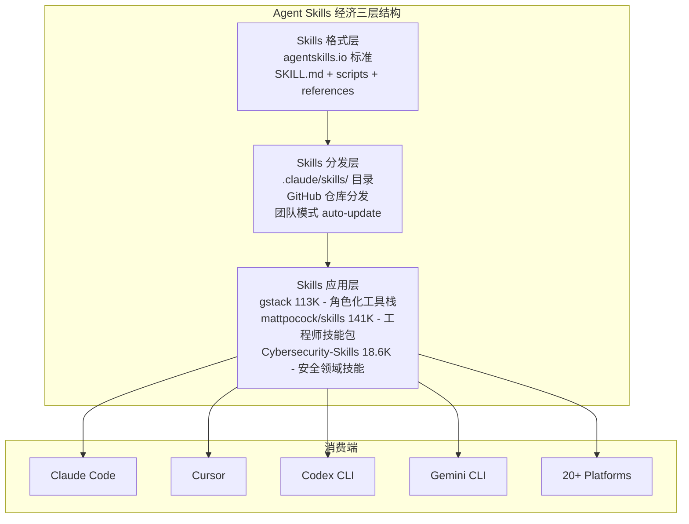
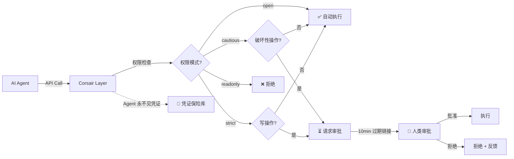

# 2026-06-23 GitHub 趋势研究简报

## 今日核心判断

**Agent Skills 经济已经爆发，而且比预想的更快。** 今天 GitHub Trending 前 25 中，有三个"Skills"类项目同时出现：gstack 113K⭐（YC CEO Garry Tan 的 23 角色化 Claude Code 工具栈）、mattpocock/skills 141K⭐（TypeScript 教父 Matt Pocock 的 .claude 目录）、Anthropic-Cybersecurity-Skills 18.6K⭐（817 安全技能映射 6 大框架）。三个加起来 273K⭐。

这标志着 Agent 生态的一个关键转折：**Skills 正在成为 Agent 时代的"应用包格式"**。就像 npm 之于 Node.js，pip 之于 Python——Skills 目录是 Agent 能力的分发、版本管理和复用单元。但与传统的包管理器不同，Skills 包含的不是代码逻辑，而是"角色认知 + 工作流程 + 领域知识"。

Garry Tan 在 README 中引用 Karpathy 的话："I don't think I've typed like a line of code probably since December"——并声称自己 2026 年的 ship 速度是 2013 年的 810×。这不是炫技，这是 YC CEO 用自己的实践证明"一个人 + Agent 工具栈 = 一支团队"。

## 今日重点趋势

### 1. Agent Skills 经济爆发（趋势分: 95）

三个 "Skills" 项目同时上 Trending，总星数 273K：

| 项目 | Stars | 核心价值 | 定位 |
|------|-------|----------|------|
| mattpocock/skills | 141.5K | TypeScript 教父的 .claude 目录 | 个人品牌 → 行业标准 |
| garrytan/gstack | 113K | YC CEO 的 23 角色化工具栈 | 完整软件工厂 |
| Anthropic-Cybersecurity-Skills | 18.6K | 817 安全技能 × 6 框架映射 | 领域垂直深度 |

**关键洞察：** Skills 不是插件。插件是"给程序增加功能"，Skills 是"给 Agent 增加角色认知和领域专业知识"。gstack 的 /cso 不是运行一个安全扫描脚本——它让 Claude 以 CISO 的视角审查你的代码。这种"角色化认知注入"是 Agent 时代独有的产物。

**gstack 深度分析：** 23 个工具覆盖了完整的软件工程流程：
- /office-hours → 产品思考
- /plan-ceo-review → 架构决策
- /plan-eng-review → 工程审查
- /review → 代码审查
- /qa → 浏览器 QA
- /cso → 安全审计（OWASP + STRIDE）
- /ship → 发布工程
- /canary → 金丝雀部署
- /autoplan → 端到端自动化

每个工具都是 Markdown slash command，MIT 开源。Garry Tan 声称这是他"每天使用的软件工厂"。

### 2. Agent 权限与集成层出现（趋势分: 88）

**corsair 2.8K⭐** 定义了一个全新品类：Agent Integration Layer。

核心创新不是技术——是**权限模型**：
- **open**: 一切立即执行
- **cautious**（推荐）: 读操作立即执行，破坏性操作需审批
- **strict**: 读立即执行，写需审批，破坏性操作被阻止
- **readonly**: 只读

加上 multi-tenancy 隔离（每个租户独立凭证/数据/权限）和 webhook 全覆盖，corsair 解决的是 Agent 集成的核心矛盾：**你需要给 Agent 权限才能让它有用，但你不信任它点的每一下按钮**。

### 3. Agentic Code Review 工具分化（趋势分: 86）

当 Agent 写代码成为常态，Review 工具必须重新设计：

- **hunk 5.4K⭐**：Review-first terminal diff viewer——diff 本身就是 review 界面，不是先看 diff 再 review
- **gstack /review**：角色化审查（bug 查找 + 设计审查 + 生产安全）
- **gstack /cso**：安全专家视角（OWASP + STRIDE 自动审计）

**关键转变：** 传统 Code Review 是"人审人写的代码"，Agentic Code Review 是"人审 Agent 写的代码 + Agent 辅助审"。review 的重点从"这段代码对不对"变成"这个 Agent 的决策链路合不合理"。

### 4. AI 金融分析工业化（趋势分: 84）

**daily_stock_analysis 45.7K⭐ + 41.8K forks**——forks/stars 比 0.92 是今天 Trending 所有项目中最高的。

这意味着什么？几乎每个 star 都伴随着 fork + 实际部署。这不是看热闹——这是真刀真枪在用。

- 多市场：A股 / 美股 / 港股
- 多源数据：实时行情 + 新闻 + 财报
- LLM 决策：多模型分析 + 决策看板
- 零成本运行：定时任务 + 自动推送

**对架构师的启发：** LLM 在金融决策领域已从"实验"走向"日常工具"。这个项目的 forks 分布（41.8K forks vs 418 open issues = 极低 issue 率）说明用户更多是"部署使用"而非"参与开发"——这是工具型产品（而非平台型）的典型特征。

### 5. Agentic 内容生产加速验证（趋势分: 83）

昨天判断的"Agentic 内容生产工业化"不是一日游——**增速在加速**：

| 项目 | 昨日 | 今日 | 日增量 |
|------|------|------|--------|
| OpenMontage | 8,487 | 11,762 | +3,275 |
| Palmier-Pro | 4,900 | 7,212 | +2,312 |
| voicebox | 31,500 | 32,139 | +639 |
| hyperframes | 29,900 | 29,915 | +15 |

OpenMontage 日增 3.3K，Palmier-Pro 日增 2.3K——增速在扩大而非收敛。

## 重点项目深度分析

### 1. garrytan/gstack — YC CEO 的 Agent 软件工厂

**它是什么：** 23 个角色化 slash commands + 8 个 power tools，把 Claude Code 变成一支虚拟工程团队。

**它为什么火：** Garry Tan 是 YC CEO，他的个人品牌就是信任背书。但更核心的是，gstack 不是演示项目——他声称自己用这套工具在 60 天内交付了 3 个生产服务 + 40+ 功能，同时全职管理 YC。

**真正的技术亮点：**
1. **角色化认知注入** — /cso 不是安全扫描，是让 Claude 以 CISO 视角思考
2. **团队模式 auto-update** — git hook 自动同步，零版本漂移
3. **gstack-detach** — 长时间 eval/benchmark 在独立 session 运行，不受 SIGTERM 影响
4. **hermetic E2E** — 本地测试与 CI 一致的密封环境
5. **反检测浏览器** — Layer C stealth + UA 精处理 + WebGL 指纹防护

**定位判断：平台候选。** gstack 正在定义"Agent 工具栈应该长什么样"。如果 Claude Code 是 Agent 时代的操作系统，gstack 就是预装的 iWork。

### 2. corsairdev/corsair — Agent 权限网关

**它是什么：** Agent 的统一集成层，4 档权限模式 + multi-tenancy + webhook + 凭证隔离。

**它为什么火：** Agent 集成的核心矛盾是"给权限才能有用 vs 给了权限就危险"。corsair 用权限分级 + 人类审批解决了这个问题。

**真正的技术亮点：**
1. **四档权限模式** — open/cautious/strict/readonly，每个 API endpoint 可单独 override
2. **Multi-tenancy** — 每个租户独立凭证/数据/权限，零交叉污染
3. **Webhook 全覆盖** — 每个 plugin 自带类型化、签名验证的 webhook handler
4. **Agent 永不见凭证** — Corsair 持有 token，Agent 只看到结果

**定位判断：基础设施候选。** 当 Agent 从"个人工具"走向"企业部署"，权限和集成是必选组件。

### 3. ZhuLinsen/daily_stock_analysis — LLM 金融分析民主化

**它是什么：** LLM 驱动的多市场股票分析系统，支持 A股/美股/港股。

**它为什么火：** 零成本运行 + 多市场覆盖 + 实时推送。41.8K forks 说明大量用户在真跑。

**真正的技术亮点：**
1. **多源数据融合** — 行情 + 新闻 + 财报 + 社交情绪
2. **LLM 决策链路** — 不只是看数据，而是 LLM 理解数据并给出建议
3. **零成本定时运行** — GitHub Actions / 免费层定时任务

**风险：** 金融建议的合规风险 + LLM 幻觉可能导致错误决策。

### 4. Anthropic-Cybersecurity-Skills — 安全技能标准化

**更新动态：** 从 11.4K（6月15日）增长到 18.6K，新增 55 skills（762→817），覆盖 AI Security / Supply Chain / Hardware & Firmware 三个新领域。

**关键新增：** MITRE F3（Fight Fraud Framework）v1.1 映射——94 个欺诈相关技能，覆盖 Positioning（FA0001）和 Monetization（FA0002）两大欺诈战术。

### 5. modem-dev/hunk — Agentic Diff Viewer

**它是什么：** Review-first terminal diff viewer，为 Agentic Coders 重新设计。

**定位：** 当 Agent 写代码成为常态，你需要一个专门的工具来审查 Agent 的输出。hunk 不是 git diff 的替代——它是 Agent 代码审查工作流的核心组件。

## 持续跟踪项目状态

| 项目 | 昨日 | 今日 | 变化 | 判断 |
|------|------|------|------|------|
| headroom | 44,115 | 46,934 | +2,819 | 继续加速，Context Engineering 层稳固 |
| codebase-memory-mcp | 10,179 | 11,426 | +1,247 | 持续增长，Code Intelligence MCP 标配化 |
| OpenMontage | 8,487 | 11,762 | +3,275 | 增速扩大，Agentic 内容生产主力 |
| Palmier-Pro | 4,900 | 7,212 | +2,312 | 增速扩大，macOS AI 视频编辑 |
| stablyai/orca | 5,784 | 6,009 | +225 | 稳定增长，多 Agent ADE |
| hyperframes | ~30K | 29,915 | stable | "Write HTML. Render video. Built for agents." |
| voicebox | 31,500 | 32,139 | +639 | 持续稳定增长 |
| freellmapi | 11,300 | 11,558 | +258 | 稳定增长 |

## 风险与机遇

### 机遇
1. **Agent Skills 是新 npm** — 先发优势巨大，谁定义了格式谁就控制了生态
2. **Agent 权限层是新 API Gateway** — 企业部署 Agent 的必经之路
3. **AI 金融分析验证了 LLM 在决策领域的可用性** — 从金融扩展到法律/医疗只是时间问题
4. **Agentic 内容生产工具链正在形成** — OpenMontage(生产) + Palmier-Pro(编辑) + hyperframes(渲染) + voicebox(音频)

### 风险
1. **gstack 个人依赖风险** — Garry Tan 是 YC CEO，如果精力转移，项目可能停滞
2. **Agent Skills 标准碎片化** — agentskills.io vs .claude/skills vs 自定义格式，需要统一
3. **AI 金融分析的合规风险** — 45.7K 用户依赖 LLM 做投资决策，一旦出问题影响面巨大
4. **Agent 权限层的信任假设** — corsair 的审批链接 10 分钟过期，但钓鱼/社工攻击不在模型覆盖范围内

## 重点项目档案

- 🏗️ [garrytan/gstack](projects/garrytan-gstack.html) — YC CEO 的 Agent 软件工厂
- 🔐 [corsairdev/corsair](projects/corsairdev-corsair.html) — Agent 权限与集成层
- 🔍 [modem-dev/hunk](projects/modem-dev-hunk.html) — Agentic Code Review
- 📈 [ZhuLinsen/daily_stock_analysis](projects/zhulinsen-daily-stock-analysis.html) — LLM 金融分析
- 🛡️ [Anthropic-Cybersecurity-Skills](projects/anthropic-cybersecurity-skills.html) — 817 安全技能（更新）

---

*研究日期：2026-06-23 · 数据来源：GitHub Trending + gh CLI · 研究者：GitHub 趋势研究助理*
