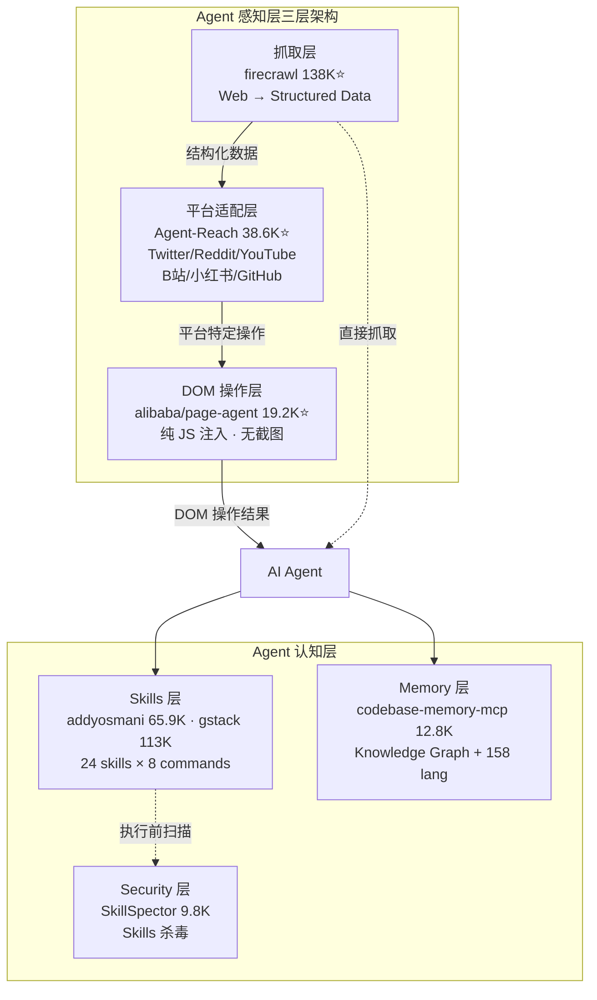
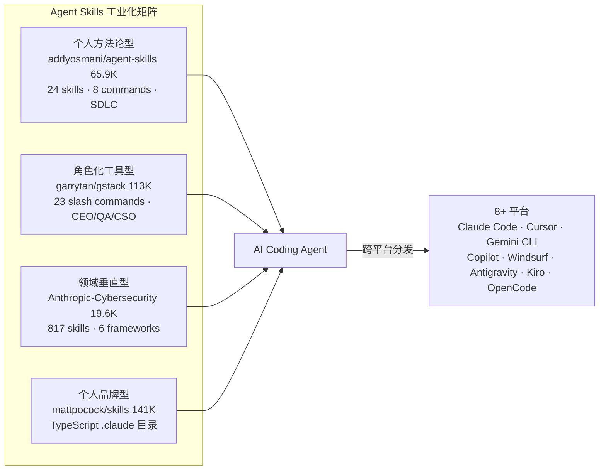

# 2026-06-24 GitHub 趋势研究简报

## 今日核心判断

**Agent 感知层（Perception Layer）正在形成标准的三层架构。** 今天 GitHub Trending 的最大信号不是单个项目，而是多个项目共同构成了 Agent 输入能力的完整分层：

- **抓取层**：firecrawl（138K⭐，日增 1.3K）——将任意网页结构化
- **平台适配层**：Agent-Reach（38.6K⭐，周增 8.1K）——一键打通 Twitter/Reddit/YouTube/B站/小红书/GitHub
- **DOM 操作层**：alibaba/page-agent（19.2K⭐）——纯 JS 注入，不截图、不多模态，文本操作 DOM

这意味着 Agent 的"看世界"能力正在从"每个开发者自己写 scraper"变成"三层标准化基础设施"。就像网络协议从"每人自己实现 TCP"到"标准 HTTP 栈"的演进。

同时，**Agent Skills 的工业化阶段已经确认**。addyosmani/agent-skills 65.9K⭐ 的关键不是星数——而是 Addy Osmani（Google Chrome 性能团队）把完整的软件工程方法论封装成了 24 个 Skills + 8 个 slash commands。这不是"分享我的 .claude 目录"，而是"把十年工程经验产品化为 Agent 可执行的指令"。

## 今日重点趋势

### 1. Agent 感知层成熟化（趋势分: 92）

三个项目从不同角度解决同一个问题——让 Agent "看见"互联网：

| 项目 | Stars | 方法 | 定位 |
|------|-------|------|------|
| firecrawl | 138K | API 化抓取，Web → Markdown/Structured | 通用抓取基础设施 |
| Agent-Reach | 38.6K | 一键 CLI 打通 12+ 平台 | 平台适配层 |
| alibaba/page-agent | 19.2K | 纯 JS 注入，DOM 文本操作 | In-page 操作层 |

**page-agent 深度分析：** 它的技术路线与 browser-use 截然不同——不用截图、不需要多模态 LLM、不需要 headless browser。`new PageAgent({ model: 'qwen3.5-plus' }).execute('Click the login button')` 即可。这种"文本 DOM 操作"路线有三个关键优势：

1. **成本极低**：不需要 GPT-4V 级别的多模态模型
2. **速度极快**：没有截图渲染开销
3. **隐私可控**：不截屏 = 不泄露视觉信息

加上 MCP Server 支持，page-agent 可以被外部 Agent 调用——这意味着它既是嵌入式工具（SaaS Copilot），也是可编排的 MCP 节点。

### 2. Agent Skills 工业化（趋势分: 90）

**addyosmani/agent-skills 更新动态：** 58K → 65.9K（一周 +7.7K），已支持 8 个平台（Claude Code、Cursor、Antigravity CLI、Gemini CLI、Windsurf、OpenCode、GitHub Copilot、Kiro IDE）。

Addy Osmani 的 Skills 包核心设计理念：
- **阶段化**：/spec → /plan → /build → /test → /review → /ship
- **自动激活**：设计 API 自动触发 api-and-interface-design skill，构建 UI 自动触发 frontend-ui-engineering skill
- **验证门禁**：每个 skill 都有验证步骤和反合理化表
- **/build 自动化**：spec 存在后，/build 自动生成计划并实现每个任务——人只批准一次计划，之后全自动运行

**与昨天 gstack 的对比：** gstack 是"CEO 的工具箱"（角色化覆盖全流程），agent-skills 是"工程师的方法论"（工程化覆盖全 SDLC）。两者不冲突，可以组合使用。

### 3. Agent 自我进化框架涌现（趋势分: 87）

**NousResearch/hermes-agent：** "The agent that grows with you"——核心是闭环学习：
1. Agent 完成复杂任务 → 自动创建 skills
2. Skills 在使用中自我改进
3. 周期性 nudge 持久化知识
4. FTS5 全文搜索跨会话回忆
5. Honcho dialectic user modeling 建立用户画像

关键架构亮点：6 种终端后端（local、Docker、SSH、Singularity、Modal、Daytona），支持 $5 VPS 到 GPU 集群，Modal 和 Daytona 提供 serverless 持久化——空闲时几乎零成本。

**bytedance/deer-flow 2.0：** 字节跳动的 SuperAgent harness，2.0 完全重写：
- Subagents：生成隔离子代理做并行工作流
- Sandbox：安全执行环境
- Memory：跨会话长期记忆
- Skills：可扩展技能系统
- Message Gateway：IM 渠道集成
- Claude Code / Codex CLI / Claude Code OAuth 集成

两个项目共同指向：**Agent 正在获得"元认知"能力**——不只是执行任务，而是在执行任务的过程中积累经验、创建新工具。

### 4. Code Intelligence MCP 标准化（趋势分: 85）

**codebase-memory-mcp 持续高增长：** 10.2K → 12.8K（周增 7.6K，日均 ~1.1K）。

arXiv 论文（2603.27277）验证的关键数据：
- **83% 回答质量**（vs file-by-file 探索）
- **10× 更少 tokens**（5 个结构化查询 ~3,400 tokens vs ~412,000 tokens）
- **2.1× 更少 tool calls**
- Linux 内核（28M LOC, 75K 文件）3 分钟完成索引
- 查询响应 < 1ms

**架构启发：** 这标志着代码理解范式的转移——从"把文件塞进 context window"到"持久化知识图谱 + MCP 查询"。知识图谱包含函数、类、调用链、HTTP 路由、跨服务链接，甚至 Dockerfiles 和 K8s manifests 也被索引为图节点。

### 5. Agent 安全审计新品类（趋势分: 83）

**NVIDIA/SkillSpector 9.8K⭐（周增 3.3K）：** 定义了"Skills 杀毒"这一新品类。当 Agent 执行第三方 Skills 时，Skills 本身就是新的攻击面——恶意 Skills 可以：
- 注入隐藏的系统提示
- 在工具调用中执行危险操作
- 泄露代码库信息

SkillSpector 扫描 AI Agent Skills 中的漏洞、恶意模式和安全风险。这是一个**必要的品类**——没有它，Agent Skills 生态就像没有杀毒软件的 npm。

## 重点项目深度分析

### 1. alibaba/page-agent — 注入式 GUI Agent

**它是什么：** 阿里巴巴开源的 JavaScript in-page GUI agent。一段 JS 嵌入网页，Agent 即可通过自然语言操作 DOM。

**核心技术亮点：**
1. **零依赖注入**：不需要浏览器扩展、Python、headless browser——纯 JS CDN 加载
2. **文本 DOM 操作**：不截图、不需要多模态 LLM——基于 browser-use 的 DOM 处理组件改造
3. **BYO LLM**：支持任何 LLM 提供商，包括 qwen3.5-plus、OpenAI 等
4. **MCP Server**：可从外部控制浏览器
5. **Chrome 扩展**：可选的多页面任务支持

**定位判断：平台候选。** page-agent 定义了一种新的 Web 交互范式——不是"自动化网页"而是"赋予网页自然语言接口"。SaaS AI Copilot、智能表单填写、无障碍访问——这些只是起点。

**风险：** DOM 注入的安全性需要严格审计。恶意页面可以欺骗 Agent 执行危险操作。文本 DOM 方案在复杂 Canvas/WebGL 场景下可能失效。

### 2. addyosmani/agent-skills — 工程方法论产品化

**更新动态：** 58K → 65.9K（+7.7K/周），已支持 8 个平台。

**关键进化：**
- 新增 /webperf（Web 性能审计）和 /code-simplify（代码简化）skill
- /build 自动化模式：批准一次计划，全自动执行
- Skills 自动激活：根据上下文触发对应 skill

**为什么重要：** Addy Osmani 不是在分享配置文件——他在把 Google Chrome 团队的工程方法论封装为 Agent 可执行的指令。每个 skill 都有验证步骤、反合理化表和质量门禁。

### 3. koala73/worldmonitor — 全球情报仪表盘

**它是什么：** 实时全球情报聚合——500+ 新闻源 × 15 分类 × AI 合成摘要 + 地缘政治监控 + 金融雷达 + 24 语言。

**技术亮点：**
1. **6 站点变体**：world/tech/finance/commodity/happy/energy 从单一代码库构建
2. **双地图引擎**：3D globe.gl + WebGL deck.gl（56 种图层）
3. **CII v8 压力评分**：31 个 Tier-1 国家的不稳定性指数
4. **本地 AI**：支持 Ollama 完全离线运行
5. **Tauri 2 桌面端**：Rust + Node.js sidecar
6. **Protocol Buffers**：276 protos / 34 services

**定位判断：工具型（偏平台化）。** 单代码库 6 站点变体的架构非常优雅——本质上是"情报聚合的 white-label 平台"。

### 4. jamiepine/voicebox — 开源 AI 语音工作室

**它是什么：** 本地优先的 AI 语音工作室——ElevenLabs + WisprFlow 的开源替代。7 个 TTS 引擎、语音克隆、全局听写、MCP Agent 语音输出。

**核心技术亮点：**
1. **7 TTS 引擎**：Qwen3-TTS、Qwen CustomVoice、LuxTTS、Chatterbox Multilingual/Turbo、HumeAI TADA、Kokoro
2. **23 语言** + 副语言标签（[laugh]、[sigh]、[gasp]）
3. **MCP Server**：任何 MCP-aware Agent 可以调用 voicebox.speak
4. **Tauri (Rust)**：不是 Electron，原生性能
5. **全局听写热键**：push-to-talk + toggle 模式

**定位判断：工具型。** Agent 语音 I/O 的基础设施——为 Agent 增加"嘴巴"。

### 5. bytedance/deer-flow — 字节跳动 SuperAgent Harness

**它是什么：** 字节跳动开源的长周期 SuperAgent 编排框架。subagents + sandbox + memory + skills + message gateway 全栈。

**核心技术亮点：**
1. **长周期任务**：分钟到小时级任务编排
2. **CLI-backed providers**：支持 Codex CLI、Claude Code OAuth 作为模型 provider
3. **vLLM 集成**：支持 Qwen3-32B 等模型的本地部署
4. **InfoQuest**：字节跳动自研搜索爬虫工具集
5. **LangSmith + Langfuse 双 Tracing**

**定位判断：平台候选。** DeerFlow 2.0 是字节跳动在 Agent 基础设施层面的重要布局——从 Deep Research 框架升级为通用 SuperAgent harness。

## 持续跟踪项目状态

| 项目 | 昨日 | 今日 | 变化 | 判断 |
|------|------|------|------|------|
| OpenMontage | 11,762 | 15,399 | +3,637 | 增速继续扩大，Agentic 内容生产主力 |
| addyosmani/agent-skills | ~58K | 65,910 | +7,900 | Skills 工业化龙头，持续加速 |
| Agent-Reach | ~35K | 38,576 | +3,576 | Agent 感知层标配化 |
| codebase-memory-mcp | 11,426 | 12,783 | +1,357 | Code Intelligence MCP 持续高增长 |
| Anthropic-Cybersecurity | 18,601 | 19,596 | +995 | 安全技能标准化持续 |
| voicebox | 32,139 | 33,079 | +940 | 稳定增长，Agent 语音 I/O |
| stablyai/orca | 6,009 | 6,296 | +287 | 稳定增长，多 Agent ADE |
| NVIDIA/SkillSpector | ~8K | 9,795 | +1,795 | Agent 安全审计品类增长快 |
| worldmonitor | ~57K | 59,022 | +2,022 | 全球情报仪表盘持续 |
| firecrawl | ~137K | 138,129 | +1,129 | Web 抓取基础设施持续 |

## 风险与机遇

### 机遇
1. **Agent 感知层三层架构 = 新基础设施机会** — 抓取/适配/操作三层都有独立的产品空间
2. **Skills 工业化 = Agent 时代的 npm** — 方法论封装为可执行指令的市场正在形成
3. **Agent 自我进化 = 下一个范式转移** — 从"被动执行"到"主动积累能力"
4. **Code Intelligence MCP 化 = 代码理解的范式转移** — 知识图谱替代 context window 填充
5. **Voice I/O + MCP = Agent 的语音接口** — voicebox 证明语音输出已可被 Agent 调用

### 风险
1. **page-agent DOM 注入风险** — 恶意页面可欺骗 Agent，需要严格的沙箱隔离
2. **Skills 供应链安全** — 第三方 Skills 可能包含恶意指令，SkillSpector 目前只覆盖基础扫描
3. **deer-flow 过度依赖字节生态** — InfoQuest 等核心组件绑定 BytePlus/Volcengine
4. **Agent-Reach 平台依赖风险** — Twitter/Reddit 等平台随时可能封堵，多后端路由是关键
5. **worldmonitor 的信息可信度** — AI 合成情报摘要的准确性难以验证

## 重点项目档案

- 🎯 [alibaba/page-agent](projects/alibaba-page-agent.html) — 注入式 GUI Agent（新增）
- 🛠️ [addyosmani/agent-skills](projects/agent-skills.html) — 工程方法论产品化（更新）
- 🌍 [koala73/worldmonitor](projects/koala73-worldmonitor.html) — 全球情报仪表盘（新增）
- 🎙️ [jamiepine/voicebox](projects/jamiepine-voicebox.html) — 开源 AI 语音工作室（新增）
- 🦌 [bytedance/deer-flow](projects/bytedance-deer-flow.html) — SuperAgent Harness（新增）

---

*研究日期：2026-06-24 · 数据来源：GitHub Trending (daily/weekly) + Web Fetch · 研究者：GitHub 趋势研究助理*
