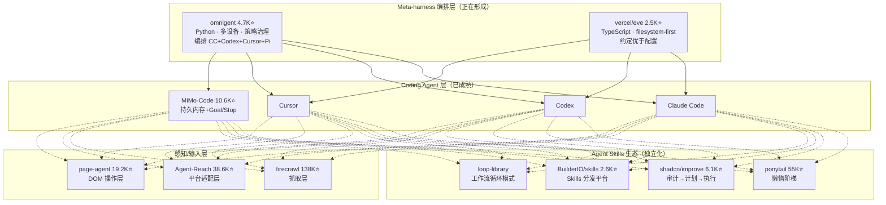

# 2026-06-25 GitHub 趋势研究简报

## 今日核心判断

**Agent 编程范式正在经历从"写更多"到"写更少"的系统性翻转。**

今天 GitHub 最强的信号来自 ponytail——55K⭐，13天从 0 到 55K。它不是一个工具或框架，而是一个 Agent Skill：在 AI Agent 写代码之前，强制走一个 7 级"懒惰阶梯"决策树。实测数据：**54% 更少代码、20% 更低成本、27% 更快速度、100% 安全护栏保持**。

关键不是星数——而是这个信号确认了：**Agent 的核心竞争力不是"能写多少代码"，而是"能不写多少代码"**。这与过去两年 Agent 领域的叙事截然相反。

同时，**Meta-harness 编排层正在形成一个新品类**。omnigent（4.7K⭐）和 vercel/eve（2.5K⭐）同时在构建"harness above harnesses"——当 Claude Code、Codex、Cursor 各自成熟后，上面需要一层来管理跨 harness 协作。这是"Agent 的 Kubernetes"级别的机会。



## 今日重点趋势

### 1. Agent "懒惰工程"范式大规模验证（趋势分: 93）

**ponytail 55K⭐ 深度分析：**

ponytail 的核心是一个 7 级决策阶梯，Agent 在写代码前必须从上到下逐级检查：

| 级别 | 检查内容 | 示例 |
|------|----------|------|
| 1 | 这需要存在吗？ | YAGNI 砍掉 |
| 2 | 代码库已经有了？ | 复用，不重写 |
| 3 | 标准库能做？ | 用 stdlib |
| 4 | 平台原生功能？ | `<input type="date">` 而非 flatpickr |
| 5 | 已安装的依赖能做？ | 用现有依赖 |
| 6 | 一行能搞定？ | 一行代码 |
| 7 | 最后才写最小可行实现 | 最简实现 |

ponytail 与简单"写更少代码"提示词的本质差异：
- **懒惰关于解决方案，严格关于阅读理解**——Agent 必须先读完受影响代码、追踪真实数据流，再选择阶梯级别
- **安全护栏不退让**——验证、错误处理、安全、可访问性代码不能被"懒惰"掉
- **可量化**——在 tiangolo/full-stack-fastapi-template 真实仓库上跑 12 个任务 × 4 次，数据公开可复现

**架构启发：** ponytail 验证了一个重要假设——Agent 最大的浪费不是模型能力不足，而是 Agent 过度生产代码。传统思路是"让 Agent 更聪明"，ponytail 的思路是"让 Agent 更克制"。这与资深工程师的行为模式一致。

### 2. Meta-harness 编排层竞争白热化（趋势分: 90）

两个项目几乎同时出现，走截然不同的技术路线：

| 维度 | omnigent | vercel/eve |
|------|----------|------------|
| 语言 | Python 3.12+ | TypeScript |
| 创建日期 | 6/11 | 6/16 |
| Stars | 4,713 | 2,526 |
| 核心理念 | 统一编排+治理 | 约定优于配置 |
| 架构 | Server/Client，桌面 App | Filesystem-first |
| 沙箱 | Modal/Daytona/Islo 云沙箱 | 内置 worktree 隔离 |
| 策略治理 | ✅ YAML policies（花费限制、工具白名单） | ❌ 当前无 |
| 多设备 | ✅ 手机→浏览器→终端同步 | ❌ 当前无 |
| 分发 | curl install + Homebrew + pip | npx eve init |

**关键判断：** 这不是"谁赢"的问题——而是两个项目共同确认了 meta-harness 是真实品类。omnigent 更偏向**企业级治理场景**（策略、审计、多设备），eve 更偏向**开发者体验场景**（filesystem-first、TypeScript 原生、Vercel 生态）。类似 Kubernetes（omnigent）vs Next.js（eve）的关系。

### 3. 大厂 Coding Agent 终端争夺战（趋势分: 89）

**MiMo-Code 10.6K⭐ 关键更新：**
- 持久内存升级为 4 层：Project Memory（MEMORY.md）+ Session Checkpoint（checkpoint.md）+ Scratch Notes（notes.md）+ Task Progress（tasks/）
- 新增 Goal/Stop 条件：独立 judge 模型评估"是否真的完成"，防止 Agent 过早乐观退出
- Compose Mode：specs-driven 开发全生命周期（plan→execute→review→TDD→debug→verify→merge）
- 子 Agent 系统：主 Agent 按需创建子 Agent，共享上下文、可并行

**shadcn/improve 6.1K⭐ 关键更新：**
- 新增 `/improve reconcile`——验证已落地计划、刷新漂移、解除阻塞
- 新增 `/improve branch`——只审计当前分支变更
- 完整工作流：/improve → 选发现 → /improve plan → /improve execute → /improve reconcile

两个项目代表两条路线：

```mermaid
flowchart LR
    subgraph "MiMo-Code 路线：全功能终端 Agent"
        A1[用户输入] --> A2[持久内存注入]
        A2 --> A3[多 Agent 协作]
        A3 --> A4[Goal/Stop 判断]
        A4 --> A5[代码输出]
    end
    
    subgraph "shadcn/improve 路线：顾问-执行者分层"
        B1[/improve] --> B2[最贵模型审计]
        B2 --> B3[plans/*.md 文件]
        B3 --> B4[最便宜模型执行]
        B4 --> B5[审计模型 review diff]
    end
```

### 4. OCR 长程解析突破（趋势分: 87）

**baidu/Unlimited-OCR 6.3K⭐ 深度分析：**

百度 PaddlePaddle 团队 6/18 发布，6天到 6.3K。核心突破：

- **One-shot Long-horizon Parsing**：单次推理处理超长文档（论文、书籍、复杂表格+图+公式混排）
- 基于 DeepSeek-OCR 架构进一步突破，支持 gundam 模式（crop_mode=True，分块处理超长文档）
- HuggingFace Spaces 已上线在线 Demo
- MIT 协议，支持 transformers 直接加载

**架构启发：** OCR 正在从"切段→逐段识别→后处理拼接"迁移到"端到端单次推理"。这与 LLM 从 sliding window 到 long-context 的演进路径一致。长程 OCR 的突破会直接影响文档智能、知识库构建、Agent 文档理解等场景。

### 5. Agent Skills 生态独立化（趋势分: 86）

BuilderIO/skills 2.6K⭐ 的入场是一个重要信号：

- BuilderIO 是被 Nike/Google/TikTok 使用的网站构建器公司
- 他们把 Skills 当作独立的软件分发单元——不是某个 Agent 的附属配置
- `npx skills add builderio/skills` ——类似 npm install 但面向 Agent Skills
- 标志着 Skills 正在形成 B2D 分发渠道

加上 Forward-Future/loop-library（Agent 工作流循环模式库）和 cobusgreyling/loop-engineering（loop 设计 CLI 工具），Agent Skills 的生态层已经包含：
1. **分发平台**（agent-native.com、agentskills.io）
2. **工程方法论**（shadcn/improve、ponytail）
3. **模式库**（loop-library、loop-engineering）
4. **安全审计**（NVIDIA/SkillSpector）

## 风险与机遇

### 机遇
- **"懒惰工程"方法论产品化**——ponytail 的决策树可以企业内部定制化，把团队最佳实践编码为 Agent 指令
- **Meta-harness 是新的平台机会**——如果 omnigent 或 eve 成为事实标准，它们就是"Agent 的操作系统"
- **OCR 长程突破降低文档智能成本**——Unlimited-OCR 的 one-shot 模式简化了企业文档处理管线

### 风险
- **ponytail 55K 的星数增速过于陡峭**——13天 55K，可能存在社交媒体泡沫放大效应。需观察实际 adoption（npm downloads、fork 活跃度）
- **Meta-harness 品类过早竞争**——两个项目都还在 alpha 阶段，品类定义本身还在变化
- **Skills 生态碎片化**——每个 Skills 作者定义自己的格式和约定，缺乏标准可能阻碍互操作

## 重点项目档案

### 今日更新档案

| 项目 | Stars 变化 | 更新内容 |
|------|-----------|----------|
| ponytail | 36K→55K (+18.6K/6天) | 更新最新 benchmark 数据、7 级阶梯说明 |
| omnigent | 4.2K→4.7K | 更新 latest 文档分析、策略治理详情 |
| vercel-eve | 1.8K→2.5K (+700) | 更新 filesystem-first 架构分析 |
| shadcn-improve | 5.5K→6.1K (+600) | 新增 reconcile/branch/execute 命令分析 |
| mimo-code | 9.8K→10.6K (+800) | 新增 Goal/Stop、Compose Mode 分析 |

### 今日新增档案

| 项目 | Stars | 分类 |
|------|-------|------|
| baidu/Unlimited-OCR | 6,273 | 基础设施候选 |

## 今日评分亮点

### Ponytail 综合评分

| 维度 | 分数 | 理由 |
|------|------|------|
| 热度质量 | 9 | 13天55K，TrendShift 日/周榜 #1，但增速过陡需观察持续性 |
| 技术创新度 | 8 | 7级决策树不复杂，但系统化为可执行 Skill 是创新 |
| 工程成熟度 | 7 | benchmark 方法论严谨（真实 repo、12 任务、n=4），但生态刚起步 |
| 架构启发价值 | 10 | "Agent 更克制 > Agent 更聪明"——改变整个 Agent 设计哲学 |
| 企业落地潜力 | 8 | 企业可定制决策树编码团队最佳实践 |
| 中期趋势概率 | 9 | YAGNI 方法论本身经过几十年验证 |
| 平台化潜力 | 7 | 可扩展为更多语言的懒惰决策框架 |
| 基础设施潜力 | 5 | 是 Skill 不是 Infra |

**总分: 63/80** · 分类: **平台候选** · 持续跟踪: ✅
