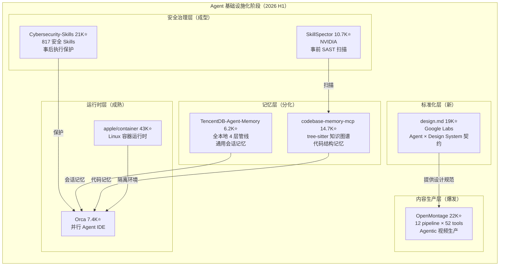
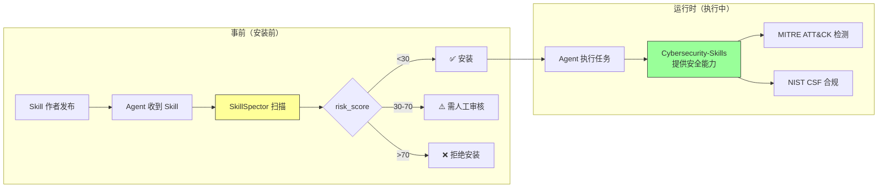

# 2026-06-26 GitHub 趋势研究简报

## 今日核心判断

**Agent 生态正在从"能干活"向"有标准、有安全、有记忆"的基础设施化阶段跃迁。**

今天 GitHub 最强的信号不是某个单一项目爆发——而是多条线索同时收敛：

1. **Google Labs design.md**（19K⭐，+1,407/day）提出 DESIGN.md 规范——Agent 与设计系统之间第一次有了结构化的"契约文件"
2. **OpenMontage**（22K⭐，+3,553/day）验证了 Agent 不止能写代码——12 pipeline 的 Agentic 视频生产系统正在形成独立品类
3. **NVIDIA SkillSpector**（10.7K⭐）+ **Anthropic-Cybersecurity-Skills**（21K⭐）形成安全闭环——Agent 安全从"讨论"变成"有工具"
4. **TencentDB-Agent-Memory**（6.2K⭐）+ **codebase-memory-mcp**（14.7K⭐）——Agent 记忆层出现分化：通用会话记忆 vs 代码结构记忆

这些信号共同指向：**Agent 生态的"钢筋水泥"阶段已经开始**——标准、安全、记忆、编排，基础设施层的每一块拼图都在被快速填补。



## 今日重点趋势

### 1. Agent × Design System 标准化：DESIGN.md 规范（趋势分: 90）

**google-labs-code/design.md 19,005⭐ 深度分析（+1,407/day）：**

这是今天架构价值最高的项目。DESIGN.md 定义了一种文件格式规范——用 YAML frontmatter 描述机器可读的设计 tokens（colors、typography、spacing、rounded、components），用 Markdown body 描述人类可读的设计理由。

**核心价值：**

| 层级 | 内容 | 解决的问题 |
|------|------|-----------|
| YAML Tokens | colors, typography, spacing, rounded, components | Agent 知道"用什么值" |
| Markdown 理由 | Overview, Colors, Typography, Layout, Do's & Don'ts | Agent 知道"为什么用这个值" |
| CLI 工具链 | lint, diff, export (Tailwind/DTCG), spec | 可验证、可对比、可导出 |

**为什么重要：**

此前 Agent 做 UI 开发时，设计系统信息散落在 Figma、CSS 变量、设计师脑中——Agent 只能看到"像素结果"而无法理解"设计意图"。DESIGN.md 把设计意图结构化：

```yaml
# Agent 读到的不只是颜色值
colors:
  tertiary: "#B8422E"  # "Boston Clay"
# 还有为什么的选择理由（Markdown）：
# "The sole driver for interaction.
#  Used for CTAs, link states, and focus rings.
#  NOT for body text or decorative elements."
```

**架构启发：** 这是 `ROBOTS.TXT → DESIGN.md` 的模式类比。正如 ROBOTS.TXT 为爬虫定义了"可以做什么"，DESIGN.md 为 Agent 定义了"应该怎么做"。未来可能扩展到更多领域：`ARCHITECTURE.md`（系统架构契约）、`SECURITY.md`（安全策略契约）、`DATA.md`（数据模型契约）。

**9 条 lint 规则：** broken-ref（错误）、missing-primary（警告）、contrast-ratio WCAG AA 检查（警告）、orphaned-tokens（警告）、token-summary（信息）、missing-sections（信息）、missing-typography（警告）、section-order（警告）、unknown-key（警告）。

**导出格式：** Tailwind v3 JSON config、Tailwind v4 CSS @theme、W3C DTCG tokens.json。

### 2. Agentic 视频生产大爆发（趋势分: 88）

**OpenMontage 21,941⭐ 深度更新（6/22 记录时 8,487 → 今天 21,941，4天 +13,454）：**

| 指标 | 6/22 | 6/26 | 变化 |
|------|------|------|------|
| Stars | 8,487 | 21,941 | +158% |
| 日增速 | ~993 | 3,553 | 3.6x |
| 周增速 | 4K+ | 12,948 | 3.2x |
| Forks | ~800 | 2,461 | 3x |

**爆发原因分析：**
- YouTube 频道 @OpenMontage 持续发布完全由 Agent 生产的完整视频（科幻预告片、Pixar 风格动画、产品广告），每条附带完整 prompt + pipeline + 成本
- 零成本路径验证：Piper TTS（离线）+ Archive.org/NASA/Wikimedia + Remotion = $0.15/视频
- 12 pipeline 覆盖全场景：动画解说、角色动画、纪录片混剪、产品广告、Cinematic 预告片、Clip Factory、播客转视频、屏幕 Demo、Talking Head 等
- 双渲染引擎：Remotion（React-based，数据驱动）+ HyperFrames（HTML/GSAP，动效驱动），Agent 在 proposal 阶段自动选择

**架构判断：** OpenMontage 的本质是一个 **Agent-native content production framework**——它不是视频编辑器，而是让 Agent 编排完整视频生产管线的 harness。pipeline = skill + tools + stages，每个 stage 有 director skill（Markdown 指令文件），Agent 读 skill → 用 tools → 执行 stage → self-review → checkpoint。这与 coding agent 编排软件工程的模式完全同构。

### 3. Agent 安全治理工具化（趋势分: 87）

| 工具 | 定位 | 模式 | 覆盖 |
|------|------|------|------|
| SkillSpector 10.7K⭐ | 事前安全扫描 | CLI + MCP Server | 68 类漏洞 × 17 分类 |
| Cyberbersecurity-Skills 21K⭐ | 安全能力执行 | 817 Skills × 6 框架 | MITRE ATT&CK/NIST/ATLAS/D3FEND/AI RMF/F3 |

**SkillSpector 关键更新：**
- 新增 **MCP Server 模式**：`skillspector mcp` — Agent 安装 skill 前自动调用扫描，变成运行时护栏
- **68 类漏洞模式**（此前记录 64 类）：新增 4 类检测
- **Baseline 抑制**：接受已知 finding，re-scan 只报新问题——类似 .gitignore 但面向安全
- **SARIF 输出**：直接集成 GitHub Code Scanning / IDE
- 支持 **Pi extension**：从 Agent session 内部扫描

**安全闭环图：**



### 4. Agent 记忆层竞速（趋势分: 85）

**TencentCloud/TencentDB-Agent-Memory 6,157⭐ 首日跟踪：**

腾讯云出品的 Agent 长期记忆解决方案——全本地、4 层渐进式管线、零外部 API 依赖。

**与 codebase-memory-mcp 的定位差异：**

| 维度 | TencentDB-Agent-Memory | codebase-memory-mcp |
|------|------------------------|---------------------|
| 记忆类型 | 通用会话记忆（对话上下文、用户偏好、决策历史） | 代码结构记忆（函数调用链、类继承、路由、依赖） |
| 技术路径 | 4 层渐进式管线（未公开详细架构） | tree-sitter AST + 持久知识图谱 |
| 索引速度 | N/A（会话级别） | Linux 内核 28M LOC 3分钟 |
| 查询延迟 | N/A | <1ms（图遍历） |
| Token 效率 | 减少重复对话 token | 5 次查询 3,400 tokens vs 412,000 tokens（-99.2%） |
| 本地优先 | ✅ 零外部 API | ✅ 100% 本地处理 |
| 适用场景 | 长期运行的 Agent 助手、客服 Agent | Coding Agent、代码审查、架构分析 |

**架构判断：** Agent 记忆层正在分化为**两个独立子品类**——会话记忆（让 Agent "记住对话"）和结构记忆（让 Agent "理解代码库"）。两者技术路径完全不同：会话记忆偏向信息检索和摘要，结构记忆偏向静态分析和图数据库。

### 5. Apple container 基础设施级增长（趋势分: 84）

**apple/container 43,151⭐（+6,937/2周）：**

| 指标 | 6/12 | 6/26 | 增幅 |
|------|------|------|------|
| Stars | 36,214 | 43,151 | +19% |
| Forks | ~700 | 1,266 | +81% |
| 日增速 | ~500-800 | 1,366 | 持续攀升 |

Apple container 的增长曲线非常健康——不是爆发式（不像 ponytail 13天 55K），而是稳步加速。这是一个基础设施项目应有的增长模式。

**为什么持续走高：** Apple Silicon 开发者群体一直在等待官方容器方案。此前 Docker Desktop on Mac 性能不佳，Colima/OrbStack 是第三方方案。Apple 官方入场意味着容器开发体验将成为 macOS 的"一等公民"。

## 风险与机遇

### 机遇
- **DESIGN.md 规范有机会成为行业标准**——Google Labs 背景 + Agent 生态刚需 + 可导出为 Tailwind/DTCG。如果被 Claude Code / Cursor / Codex 默认支持，将成为事实标准
- **Agentic 内容生产是新的 SaaS 品类**——OpenMontage 的 pipeline 架构可以被复制到音频（播客）、3D、游戏等领域
- **Agent 安全工具链有企业级市场**——SkillSpector 的 SARIF 输出 + MCP server 模式可以直接进入企业 CI/CD

### 风险
- **DESIGN.md 仍是 alpha 版本**——Google Labs 项目不等于 Google 官方产品，可能被放弃
- **OpenMontage 增速过陡**——4天 +158% 有社交媒体泡沫放大效应。需观察 fork 活跃度和真实 adoption（pipeline 实际运行次数）
- **Agent 记忆层品类过早**——TencentDB-Agent-Memory 详情不足（4 层管线架构未完全公开），可能只是云服务的导流项目
- **Agent 安全工具碎片化**——SkillSpector 的 68 类 vs 其他安全项目的分类标准不统一

## 重点项目档案

### 今日新增档案

| 项目 | Stars | 分类 | Score |
|------|-------|------|-------|
| google-labs-code/design.md | 19,005 | 平台候选 | 90 |
| TencentCloud/TencentDB-Agent-Memory | 6,157 | 基础设施候选 | 82 |

### 今日更新档案

| 项目 | Stars 变化 | 更新内容 |
|------|-----------|----------|
| OpenMontage | 8,487→21,941 (+158%) | 爆发式增长分析、双渲染引擎、12 pipeline 详情 |
| codebase-memory-mcp | 12,783→14,709 | 周增 9.6K，MCP 代码智能确认基础设施定位 |
| NVIDIA/SkillSpector | 8,251→10,661 | MCP Server 模式、68 类漏洞、Baseline 抑制 |
| stablyai/orca | 5,784→7,380 | 持续增长，30+ Agent 兼容列表更新 |
| apple/container | 36,214→43,151 | 健康增长曲线分析 |
| Anthropic-Cybersecurity-Skills | 18,601→21,152 | 安全闭环定位分析 |
| alibaba/page-agent | 19,240→19,760 | 稳步增长 |
| withastro/flue | 6,282→6,698 | 稳步增长 |

## 今日评分亮点

### google-labs-code/design.md 综合评分

| 维度 | 分数 | 理由 |
|------|------|------|
| 热度质量 | 9 | 日增 1,407，Google Labs 背景，Trending #1 |
| 技术创新度 | 8 | YAML+Markdown 双层结构不新，但定位为 Agent 设计契约是创新 |
| 工程成熟度 | 7 | alpha 版本，9 条 lint 规则、3 种导出格式，CLI 完整度高 |
| 架构启发价值 | 10 | "ROBOTS.TXT for Agent Design"——开创 Agent × Design System 标准化新品类 |
| 企业落地潜力 | 8 | 设计系统标准化是企业级刚需，lint+diff 可集成 CI/CD |
| 中期趋势概率 | 8 | 如果 Claude Code/Cursor 默认支持，将成为事实标准 |
| 平台化潜力 | 9 | 可扩展为 ARCHITECTURE.md/SECURITY.md/DATA.md 系列 Agent 契约 |
| 基础设施潜力 | 6 | 是规范而非基础设施，但可能催生基础设施 |

**总分: 65/80** · 分类: **平台候选** · 持续跟踪: ✅
