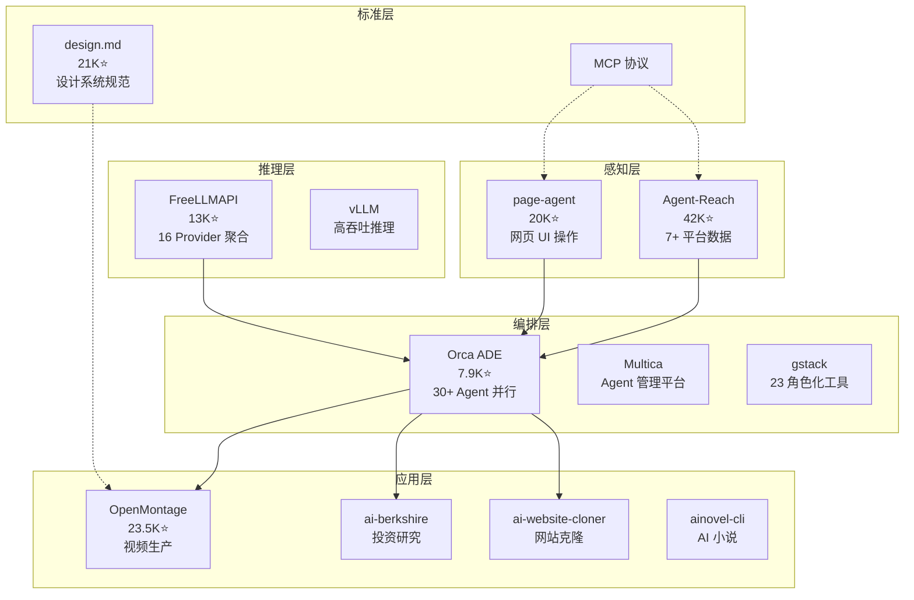

# 2026-06-27 GitHub 趋势研究简报

## 今日核心判断

**Agent 生态的"感知-决策-执行"三层架构正在明确成型。感知层（Agent-Reach 42K）标准化互联网数据接入，执行层（page-agent 20K）标准化 UI 操作，编排层（Orca 7.9K）标准化多 Agent 协调。同时 FreeLLMAPI 13K 以 16 家 Provider 聚合将 LLM 边际成本推向零。**

这不是又一批 trending 项目——这是 Agent 基础设施从"能用"向"有层次、有标准、有分工"演进的信号。

## 今日重点趋势

### 🥇 趋势 1：Agent 感知层大规模整合（Score: 90）

| 项目 | Stars | 日增 | 定位 |
|------|-------|------|------|
| Agent-Reach | 42,263 | +1,164 | 7+ 平台统一 CLI（Twitter/Reddit/YouTube/B站/小红书/GitHub/Web/RSS） |
| alibaba/page-agent | 20,201 | +554 | JavaScript in-page GUI agent（自然语言控制网页 UI） |
| aws/agent-toolkit-for-aws | 1,335 | +238 | AWS 官方 MCP servers + skills + plugins |

**判断**：Agent 技术栈正在分化出独立的"感知层"。Agent-Reach 解决"Agent 能看到什么"，page-agent 解决"Agent 能操作什么"。这像自动驾驶的感知（激光雷达+摄像头）和执行（转向+制动）分离——Agent 架构也在走同样的路。

**架构启发**：未来 Agent 系统设计应将感知层作为独立模块，定义清晰的 input/output 接口，而非将平台数据获取硬编码在 Agent 逻辑中。

### 🥈 趋势 2：LLM 零成本基础设施加速（Score: 87）

| 项目 | Stars | 增长 | 关键数据 |
|------|-------|------|----------|
| FreeLLMAPI | 13,142 | 2 个月 17 倍（783→13K） | 16 Provider × ~1.7B tokens/月 |

**判断**：FreeLLMAPI 的 17 倍增长验证了一个新范式——**免费 LLM 额度的聚合价值**。16 家 Provider 各自提供数百万元 token 免费额度，聚合后形成可用的推理能力。OpenAI + Anthropic 双兼容意味着 Claude Code 可以直接对接免费 pool。

**风险**：ToS 灰色地带（部分 Provider 的免费 tier 仅限个人非商用），企业落地需谨慎。

### 🥉 趋势 3：Agent 并行编排日常化（Score: 86）

| 项目 | Stars | 日增 | 定位 |
|------|-------|------|------|
| stablyai/orca | 7,901 | +571 | ADE——30+ CLI agent 并行，worktree 隔离，移动端监控 |
| multica-ai/multica | 新 | — | 开源 Agent 管理平台（任务分配 + 进度追踪 + 技能复用） |
| garrytan/gstack | 新 | — | Garry Tan 的 23 个 Claude Code 工具（CEO/Designer/Eng Manager 角色） |

**判断**：多 Agent 并行编排从"概念演示"进入"日常工具"。Orca 的 ADE 定位最清晰——不是造又一个 Agent，而是造管理 Agent 的 IDE。

### 趋势 4：DESIGN.md + OpenMontage 持续验证

- **design.md** 21,112⭐（+2,319/day）：连续 3 天日增 2K+，标准化规范的生命力在增强
- **OpenMontage** 23,506⭐（+1,674/day）：Agentic 视频生产持续高增长

昨天的判断正确——这两个项目不是一日热点。

### 趋势 5：Agent 垂直应用全面渗透

| 项目 | Stars | 日增 | 领域 |
|------|-------|------|------|
| ai-berkshire | 3,065 | +1,270 | AI 价值投资研究（巴菲特/芒格方法论） |
| ai-website-cloner | 21,299 | +1,076 | 一键克隆网站 |
| TREK | 7,593 | +1,063 | 自托管旅行规划 |
| open-seo | 3,046 | +635 | 开源 Semrush 替代 |
| ainovel-cli | 1,085 | +48 | 多 Agent AI 小说生成 |

**判断**：Agent 正在以极快速度渗透每个垂直领域。但多数项目是"Agent + 领域"的简单组合，技术壁垒不高，短期热度型为主。

## 重点项目深度分析

### 1. Agent-Reach — Agent 互联网感知层

**GitHub**: https://github.com/Panniantong/Agent-Reach
**Stars**: 42,263（+1,164/day） | **语言**: Python | **分类**: 基础设施候选

**做了什么**：一个 CLI 工具 + Agent skill，让任何 CLI Agent（Claude Code/Cursor/OpenClaw/Windsurf）能读取和搜索 Twitter、Reddit、YouTube、B站、小红书、GitHub、LinkedIn、V2EX、雪球等 10+ 平台数据。零 API 费用，Cookie 本地存储。

**为什么火**：解决了 Agent 开发的刚需——Agent 需要互联网数据，但每个平台 API 都很麻烦。Agent-Reach 把这件事变成一句话安装。

**真正的技术亮点**：
1. **多后端路由架构**——每个平台有"首选 + 备选"后端（如 B站：bili-cli → OpenCLI → 搜索 API），某个失效自动切换
2. **能力层定位**——不是又一个工具，而是"选型 + 安装 + 体检 + 路由"的能力层
3. **自诊断系统**——`agent-reach doctor` 一条命令告诉你每个渠道的状态

**定位判断**：基础设施候选。如果 Agent 是"大脑"，Agent-Reach 就是"眼睛+耳朵"。42K stars 验证了感知层作为独立模块的价值。

**风险**：Cookie 方式访问存在封号风险；平台反爬变更需要持续维护。

### 2. FreeLLMAPI — LLM 零成本聚合代理

**GitHub**: https://github.com/tashfeenahmed/freellmapi
**Stars**: 13,142（+586/day） | **语言**: TypeScript | **分类**: 工具型

**做了什么**：聚合 16 家免费 LLM Provider（Google/Groq/Cerebras/NVIDIA/Mistral/OpenRouter/GitHub Models/Cloudflare/Z.ai 等），通过一个 OpenAI 兼容端点提供 ~1.7B tokens/月免费推理能力。同时兼容 Anthropic Messages API。

**为什么火**：LLM 调用成本是 Agent 应用的最大门槛。16 家免费额度聚合后形成可观推理能力，对个人开发者和小团队有巨大吸引力。

**真正的技术亮点**：
1. **智能路由 + 自动 failover**——429/5xx 自动跳到下一个 Provider，每 key RPM/RPD/TPM/TPD 计数
2. **Sticky sessions**——多轮对话 30 分钟内保持同一模型，避免中途切换的幻觉
3. **三协议兼容**——OpenAI `/v1/chat/completions` + Anthropic `/v1/messages` + Responses API
4. **AES-256-GCM 加密 key 存储**

**定位判断**：工具型→平台候选。从 783 到 13K 的 17 倍增长说明需求强烈。但 ToS 灰色地带限制企业使用。

**架构启发**：LLM Gateway 标准化正在加速。OpenAI 兼容已成为事实标准，Anthropic 兼容正在成为第二标准。

### 3. Orca — 并行 Agent 开发环境

**GitHub**: https://github.com/stablyai/orca
**Stars**: 7,901（+571/day） | **语言**: TypeScript | **分类**: 平台候选

**做了什么**：Agent Development Environment（ADE），让开发者同时运行多个 CLI agent（Claude Code/Codex/Cursor/Grok 等 30+），每个在独立 git worktree 中工作。支持桌面 + 移动端 + SSH 远程。

**为什么火**：多 Agent 并行是 AI 编程的下一阶段。Orca 解决的不是"造又一个 agent"而是"管理一个 agent 团队"。

**真正的技术亮点**：
1. **Parallel Worktrees**——一个 prompt 扇出到 N 个 agent，独立 worktree，结果对比合并
2. **Design Mode**——点击 Chromium 中任意 UI 元素，HTML/CSS/截图直接进 agent prompt
3. **移动端伴侣**——iOS/Android 远程监控和指导 agent
4. **Orca CLI**——Agent 自身可驱动 Orca（脚本化工作流）

**定位判断**：平台候选。ADE 品类定义者，30+ agent 兼容性是护城河。

## Agent 生态分层图（2026-06-27 更新）

## 风险与机遇

### 机遇
1. **Agent 感知层独立化**——Agent-Reach 42K 证明"Agent 的眼睛"可以作为独立基础设施。企业 Agent 架构应预留感知层接口
2. **LLM 零成本路径**——FreeLLMAPI 验证免费额度聚合可行，适合 PoC 和个人开发者
3. **ADE 品类成型**——Orca 定义了"Agent IDE"品类，多 Agent 并行编排工具链值得持续跟踪

### 风险
1. **Cookie / 爬虫类项目存在合规风险**——Agent-Reach 的平台数据获取依赖 Cookie 和爬虫，平台政策变更可导致功能中断
2. **免费 tier 聚合的 ToS 灰色地带**——FreeLLMAPI 的 16 家 Provider 中，部分免费 tier 限个人非商用
3. **垂直应用泡沫**——ai-berkshire / ai-website-cloner / TREK 等日增千 star 但技术壁垒不高，短期热度型

## 重点项目档案

详见以下项目档案（已更新）：

- [Agent-Reach](projects/agent-reach.html) — Agent 互联网感知层
- [FreeLLMAPI](projects/freellmapi.html) — LLM 零成本聚合代理
- [Orca](projects/stablyai-orca.html) — 并行 Agent 开发环境
- [DESIGN.md](projects/design-md.html) — Agent 设计系统规范
- [OpenMontage](projects/openmontage.html) — Agentic 视频生产系统
