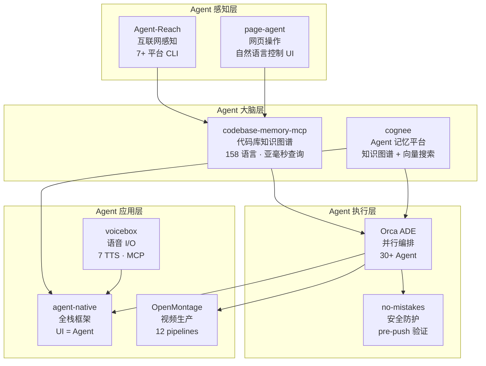
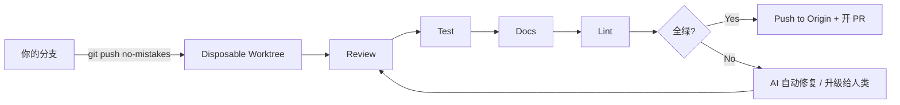
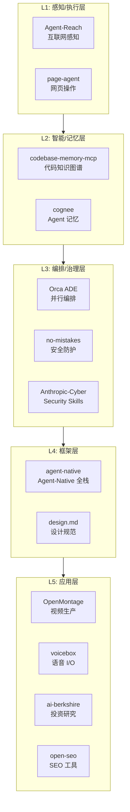

## 今日趋势概览

### 趋势 1：代码智能与记忆层大爆发（趋势分：91）

本周最值得关注的结构性变化：Agent 的"大脑层"从实验阶段进入生产级方案。

**codebase-memory-mcp**（DeusData）17,459⭐ 周增 7,592，将整个代码库索引为持久化知识图谱：
- 158 语言 tree-sitter AST 解析 + Hybrid LSP 语义类型推断（Python/TS/Go/Rust/C++ 等 11 种）
- Linux 内核 28M LOC / 75K 文件 3 分钟索引完成，查询 < 1ms
- 对比 file-by-file 探索：83% 答案质量 + 10× token 节省 + 2.1× 工具调用减少
- 14 个 MCP 工具（call graph/impact analysis/dead code detection/Cypher query 等）
- 单静态二进制，零依赖，自动检测 11 种 Coding Agent 配置
- 有 arXiv 论文支撑（arXiv:2603.27277）

**cognee**（topoteretes）23,943⭐ 周增 5,072，自托管 Agent 记忆平台：
- remember / recall / forget / improve 四个原语，API 极简
- 知识图谱 + 向量嵌入 + 认知科学本体生成
- 多模态数据摄入，session memory + graph memory 双层
- 支持 Python / Rust / TypeScript 客户端 + Claude Code 插件 + OpenClaw 插件
- 有 arXiv 论文（arXiv:2505.24478）

**架构师判断：** 这两个项目代表 Agent 技术栈的"大脑层"分化。codebase-memory-mcp 解决"理解现有代码"问题，cognee 解决"跨会话记忆"问题。两者都是 MCP server，可组合使用。这类基础设施一旦成熟，会像 LSP 一样成为标配。

### 趋势 2：Agent 安全治理层崛起（趋势分：87）

Agent 生态从"能跑就行"进入"安全可控"阶段，三个信号：

1. **no-mistakes** 3,790⭐ — git push 防护门。核心机制：`git push no-mistakes` → 创建 disposable worktree → 跑 review/test/docs/lint/PR 流水线 → AI 驱动验证 → 全绿才放行到 origin。支持 Claude Code/Codex/Copilot 等 agent 触发。设计哲学是"自动修复安全的机械问题，涉及意图的升级给人类"。

2. **Anthropic-Cybersecurity-Skills** 22,163⭐ 周增 5,109 — 817 条结构化安全技能，映射 MITRE ATT&CK/NIST CSF 2.0/MITRE ATLAS/D3FEND/NIST AI RMF/MITRE F3 六大框架。29 个安全领域，兼容 Claude Code/Copilot/Codex/Cursor 等 20+ 平台。

3. **OpenSpec** 57,088⭐ — Spec-driven development (SDD) 持续增长，从规格出发约束 Agent 行为。

**架构师判断：** 安全治理层的出现标志着 Agent 生态进入"工程化深水区"。no-mistakes 的 disposable worktree 模式非常精妙——它不阻塞开发者工作，在隔离空间做验证，类似 CI 的本地前置。安全技能映射到 6 大框架说明 Agent 安全已经从"想法"进入"体系化实施"阶段。

### 趋势 3：Agent-Native 应用框架首次定义（趋势分：85）

**BuilderIO/agent-native** 2,707⭐ 周增 1,569 — 这不是又一个 Chat UI wrapper，而是首次系统性地定义"Agent-Native 应用"架构模式：

核心理念：`defineAction` 一次定义，六端复用（UI / Agent / HTTP / MCP / A2A / CLI）。所有 action 共享一个 SQL-backed state，人类和 Agent 是同一系统的平等公民。

关键特征：
- Agent 和 UI 互为一等公民——点击或命令都行
- Real-time multiplayer——人类和 Agent 同时编辑同一文档
- Agent 可自修改应用——添加功能、修 bug、改进 UI
- Agent 调 Agent——A2A 标签触发协作
- 完整模板（Mail/Plans/Design/Content/Slides/Analytics）不是 scaffold，是 cloneable app

**架构师判断：** BuilderIO 团队（Qwik/Mitosis/Builder.io 创始人）有前端框架设计经验，这给了 agent-native 独特的架构品味。如果 agent-native 模式成立，它可能像 Rails 之于 MVC 一样，定义 Agent 时代全栈应用的默认架构。

### 趋势 4：OpenMontage 爆发式增长 + design.md 持续领跑（趋势分：88）

**OpenMontage**（calesthio）25,143⭐ **周增 17,249**，本周 GitHub 增长第一：
- 首个开源 Agentic 视频生产系统
- 12 pipelines / 52 tools / 500+ agent skills
- 从 YouTube 参考视频生成制作方案（分析 transcript/pacing/keyframes → 输出差异化概念 + 工具路径 + 成本估算）
- 可制作真实视频（从免费素材库检索运动片段 + 时间线编辑 + 渲染），不只是"把静态图动起来"
- 案例展示成本极低：Pixar 风格短片 $0.15，产品广告 $0.69，纪录片 $0.02
- 与 Claude Code/Cursor/Copilot/Windsurf/Codex 全兼容

**design.md** 22,286⭐ 日增 1,542，连续 4 天高增长。设计系统 Agent 规范化已确立。

### 趋势 5：Voice I/O 成熟 + Agent 垂直应用深化（趋势分：83）

**voicebox**（jamiepine）34,860⭐ 周增 3,819 — 本地 AI 语音工作室：
- 7 TTS 引擎（Qwen3-TTS/Qwen CustomVoice/LuxTTS/Chatterbox Multilingual/Turbo/HumeAI TADA/Kokoro）
- Voice cloning + 50+ 预设声音
- 23 语言、Whisper STT、global dictation hotkey
- MCP server——Agent 一个 tool call 就能"说话"
- Tauri (Rust) 构建，非 Electron
- ElevenLabs + WisprFlow 开源替代

**其他垂直应用持续活跃：**
- ai-berkshire 4,044⭐ — Claude Code 驱动的价值投资研究
- daily_stock_analysis 50,510⭐ — LLM 多市场股票分析
- open-seo 3,346⭐ — 开源 Semrush/Ahrefs 替代
- system_prompts_leaks 46,597⭐ — 各大 AI 系统 prompt 泄露合集

---

## 重点项目深度分析

### 1. DeusData/codebase-memory-mcp — 代码智能基础设施

**定位：** AI Coding Agent 的"代码理解引擎"。通过 tree-sitter + LSP 将代码库变成可查询的知识图谱，解决 Agent"看不懂全局"的核心痛点。

**为什么火（周增 7.6K）：**
- 真实痛点：Agent 逐文件读取代码效率极低（~412K tokens vs 3.4K tokens）
- arXiv 论文背书，31 个真实仓库评测
- 单二进制零依赖，安装即用
- 11 种 Coding Agent 自动配置

**技术亮点：**
- RAM-first 索引管线（LZ4 压缩 + 内存 SQLite + fused Aho-Corasick）
- Hybrid LSP：tree-sitter 做语法，LSP 做语义类型解析
- Cypher-like 查询语言
- Louvain 社区发现算法自动发现功能模块
- 3D 知识图谱可视化（localhost:9749）

**评分：** 热度质量 9 · 技术创新度 9 · 工程成熟度 8 · 架构启发价值 9 · 企业落地潜力 8 · 中期趋势概率 8 · 平台化潜力 7 · 基础设施潜力 9 = **总分 67/80**

**定位：基础设施候选 · 建议持续跟踪 · 值得 PoC**

### 2. kunchenguid/no-mistakes — Agent 时代的代码安全门

**定位：** git push 和 origin 之间的 AI 验证层。不替代 CI，而是 CI 的前置——在代码离开本地之前做质量把关。

**核心机制：**

**评分：** 热度质量 7 · 技术创新度 8 · 工程成熟度 7 · 架构启发价值 8 · 企业落地潜力 8 · 中期趋势概率 7 · 平台化潜力 6 · 基础设施潜力 7 = **总分 58/80**

**定位：工具型 · 建议持续跟踪 · 中小团队可试用**

### 3. BuilderIO/agent-native — Agent-Native 全栈框架

**定位：** 定义"Agent-Native Application"架构模式。不是 Chat UI，不是 Copilot Sidebar，而是 Agent 与 UI 共享同一套 actions 和 state 的全栈框架。

**架构启发：**
- Action-first 设计：一次 `defineAction`，六端复用
- 数据同步：一个数据库，UI 和 Agent 的修改互相同步
- Agent 自改进：Agent 可以给应用添加功能、修 bug
- 这可能定义下一代 SaaS 的默认架构

**评分：** 热度质量 7 · 技术创新度 8 · 工程成熟度 6 · 架构启发价值 9 · 企业落地潜力 7 · 中期趋势概率 8 · 平台化潜力 8 · 基础设施潜力 6 = **总分 59/80**

**定位：平台候选 · 建议持续跟踪 · 架构师应研究其设计理念**

---

## 风险与机遇

### 机遇
1. **代码智能层商机明确：** codebase-memory-mcp 证明"让 Agent 理解全局代码"有巨大价值。企业内部可构建类似方案（私有代码库 + 自定义规则）
2. **Agent 安全治理是新蓝海：** no-mistakes + Anthropic-Cybersecurity-Skills 显示安全治理需求真实存在
3. **Voice I/O 本地化：** voicebox 证明本地 voice pipeline 可行，隐私友好，成本可控

### 风险
1. **OpenMontage 周增 17K 过于陡峭：** 需观察是否可持续，Agentic 视频生产工具用户留存率通常不高
2. **Agent-Native 框架过早锁定风险：** agent-native 设计理念前卫但生态尚小（2.7K），框架选择需谨慎
3. **system_prompts_leaks 类项目法律风险：** 46.6K⭐ 但本质上是对抗 AI 公司 IP 保护，长期存续性存疑

---

## 本周 Agent 技术栈分层图

---

## 重点项目档案

今日新增项目档案：
- [codebase-memory-mcp](projects/codebase-memory-mcp.md) — 更新至 17.5K⭐
- [cognee](projects/cognee.md) — 新增
- [no-mistakes](projects/no-mistakes.md) — 新增
- [agent-native](projects/agent-native.md) — 新增
- [voicebox](projects/voicebox.md) — 新增

---

*研究日期：2026-06-28 · 数据来源：GitHub Trending (daily + weekly) · 分析视角：资深软件架构师*
