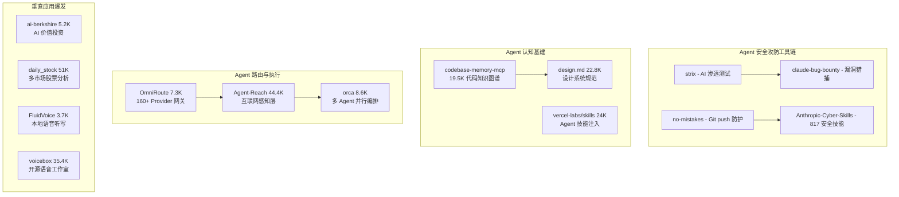
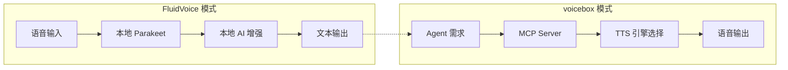

# 2026-06-29 GitHub 趋势研究简报

## 今日趋势全景

## 趋势 1：AI 安全攻防工具化加速（评分 89）

**核心信号：** Agent 安全生态从"规范文档"阶段进入"自动化工具链"阶段。

| 项目 | 定位 | 星标 | 核心能力 |
|------|------|------|----------|
| strix | AI 渗透测试 | 新增 trending | Docker 沙箱+多 Agent 协作+真实 PoC 验证 |
| claude-bug-bounty | 终端漏洞猎捕 | 3,594⭐ | 20 漏洞类别+自动报告生成 |
| no-mistakes | Git push 防护门 | 4,042⭐ | Disposable worktree+AI 验证流水线 |
| Anthropic-Cyber-Skills | 安全技能库 | 22,6K⭐ | 817 条技能映射 6 大安全框架 |

**架构师判断：** 上周的安全治理层（no-mistakes + Anthropic-Cybersecurity-Skills）是"制度+规范"，本周 strix 和 claude-bug-bounty 补上了"自动化攻击+验证"能力。Agent 安全生态形成完整闭环：**左移防御（no-mistakes）→ 渗透测试（strix）→ 漏洞猎捕（bug-bounty）→ 技能沉淀（Cyber-Skills）**。

企业落地建议：strix 适合 DevSecOps 团队做 CI/CD 集成（GitHub Actions 已支持），可作为 SAST/DAST 的补充层而非替代。

## 趋势 2：代码智能层持续高增长（评分 90）

codebase-memory-mcp 从昨天的 17.5K 涨到 19.5K（日增 ~1.2K），design.md 从 22.3K 到 22.8K，两者已在 Trending 周榜连续多日。

**关键演进：** codebase-memory-mcp 的 arXiv 论文（2603.27277）给出了硬核基准测试数据：
- 31 个真实仓库测试：83% 答案质量
- 10× 更少 token、2.1× 更少工具调用 vs 逐文件搜索
- Linux 内核（28M LOC / 75K 文件）3 分钟完成索引

这不是"又一个 MCP server"，而是 Agent 代码理解从"grep+read 循环"到"知识图谱查询"的范式转移。

## 趋势 3：AI 金融 Agent 全面爆发（评分 84）

| 项目 | 星标 | 日增 | 核心模式 |
|------|------|------|----------|
| ai-berkshire | 5,235 | 1,456 | 四大师方法论 + 多 Agent 对抗 |
| daily_stock_analysis | 51,076 | 周增 7.1K | LLM 多市场分析 + 自动推送 |
| Vibe-Trading | 新增 | — | HKUDS 出品，个人交易 Agent |

**判断：** 金融是 Agent 垂直应用中变现路径最短的领域之一——投资决策天然适合多 Agent 对抗（多头/空头/风控），且有明确的量化评估指标。但需警惕：**AI 生成的投资建议在真实市场中的有效性尚未经过牛熊周期检验**，当前更多是"研究辅助"而非"交易系统"。

## 趋势 4：本地 AI Voice I/O 成熟（评分 82）

FluidVoice 和 voicebox 双双在 Trending 榜单：

- **FluidVoice**：Parakeet 模型零延迟、Fluid Intelligence 本地 AI 增强（智能格式化+上下文感知）、Command Mode 语音控制 Mac
- **voicebox**：7 TTS 引擎、23 语言、Voice Cloning、MCP server 集成

**架构启发：** Voice I/O 正在成为 Agent 界面的标配输入/输出通道。FluidVoice 的"本地推理+可选云端增强"架构，和 voicebox 的"MCP server 暴露语音能力给 Agent"模式，代表了两种不同的集成策略：

## 趋势 5：Agent 路由层整合（评分 80）

OmniRoute 7.3K⭐ 代表了一个有趣的中间层：聚合 160+ Provider 的免费额度，通过 RTK+Caveman 压缩节省 15-95% token。虽然与 FreeLLMAPI（13K⭐）定位相似，但 OmniRoute 的差异化在于**多协议支持（MCP/A2A）和桌面端/PWA 客户端**。

## 重点项目深度分析

### 🗡️ strix — 开源 AI 渗透测试 Agent

**它做什么：** 自主 AI Agent 在 Docker 沙箱中运行，模拟真实黑客攻击行为——运行代码、发现漏洞、生成 PoC 验证。支持 20+ 漏洞类别（IDOR、SQL 注入、XSS、SSRF、业务逻辑等）。

**为什么火：** 
1. 传统 SAST 工具误报率高，DAST 需要人工配置，strix 用 Agent 模拟真实攻击路径
2. CI/CD 集成意味着每个 PR 自动安全扫描
3. 开源+本地 Docker 运行，数据不外泄
4. AI Agent 安全测试是 DevSecOps 的自然演进

**技术亮点：**
- 多 Agent 团队协作（recon → attack → validate → report）
- 完整黑客工具箱（HTTP Proxy + Browser Automation + Terminal + Python Runtime）
- Docker 沙箱隔离，安全可控
- CI/CD 原生集成（GitHub Actions）

**定位判断：** 工具型 → 有潜力演化为平台型（如果支持自定义 Agent 角色和漏洞规则引擎）

**风险：** 
1. 安全工具本身的安全风险（AI Agent 在沙箱中执行任意代码）
2. 对 LLM 质量高度依赖——不同模型的漏洞发现能力差异大
3. 可能产生新的攻击面（Agent 被误导）

### 🎙️ FluidVoice — macOS 最快离线听写

**它做什么：** macOS 本地语音转文字应用，基于 NVIDIA Parakeet 模型，零延迟显示，完全离线运行。

**技术亮点：**
- Parakeet 模型重新实现，"几乎零延迟"
- Fluid Intelligence 本地 AI 后处理（智能格式化、上下文感知大小写）
- Command Mode：语音控制 Mac（启动应用、快捷指令、系统操作）
- 多模型支持：Nemotron Speech 3.5、Parakeet Flash/TDT、Cohere Transcribe、Apple Speech、Whisper
- Write Mode：在任意应用的文本框中直接写入或重写

**定位判断：** 工具型（优秀的产品级项目，但受限于 macOS 平台）

### 📈 ai-berkshire — AI 价值投资研究框架

**它做什么：** 基于 Claude Code / Codex 的价值投资研究框架，将巴菲特、芒格、段永平、李录四位投资大师的方法论编码为多 Agent 并行研究流程。

**为什么火：** 
1. "AI 时代的伯克希尔"概念极具吸引力
2. 多 Agent 对抗分析（不同大师视角交叉验证）
3. 直接在 Claude Code / Codex 中运行，降低使用门槛
4. 金融领域是 AI Agent 最容易变现的垂直赛道

**风险：**
1. 投资方法论 ≠ 投资能力——AI 可以分析但不保证正确
2. 回测偏差（幸存者偏差、过拟合）
3. 监管风险（AI 投资建议合规性）

## 风险与机遇

### 机遇
1. **Agent 安全工具链闭环形成**——从防御到攻击到治理，基础设施逐步完善
2. **代码智能层从创新变为标配**——codebase-memory-mcp 持续高增长说明市场认可
3. **Voice I/O 本地化**——隐私+低延迟+离线可用，企业场景可落地

### 风险
1. **AI 金融 Agent 泡沫风险**——投资类项目星标增速极快但缺乏长期有效性验证
2. **安全工具的双刃剑**——AI 渗透测试工具可能被滥用
3. **本地 AI 工具的平台依赖**——FluidVoice 仅限 macOS，voicebox 跨平台但体验差异大

## 重点项目档案

### 新增项目档案
- 🗡️ usestrix/strix — AI 渗透测试 Agent
- 🎙️ altic-dev/FluidVoice — macOS 离线听写
- 📈 xbtlin/ai-berkshire — AI 价值投资研究框架
- 🔀 diegosouzapw/OmniRoute — 免费 AI 网关

### 更新项目档案
- 🧠 DeusData/codebase-memory-mcp — 19.5K（+2K，持续高增）
- 🎨 google-labs-code/design.md — 22.8K（+500）
- 🌐 Panniantong/Agent-Reach — 44.4K（+2.1K）
- 🐬 stablyai/orca — 8.6K（+700）
