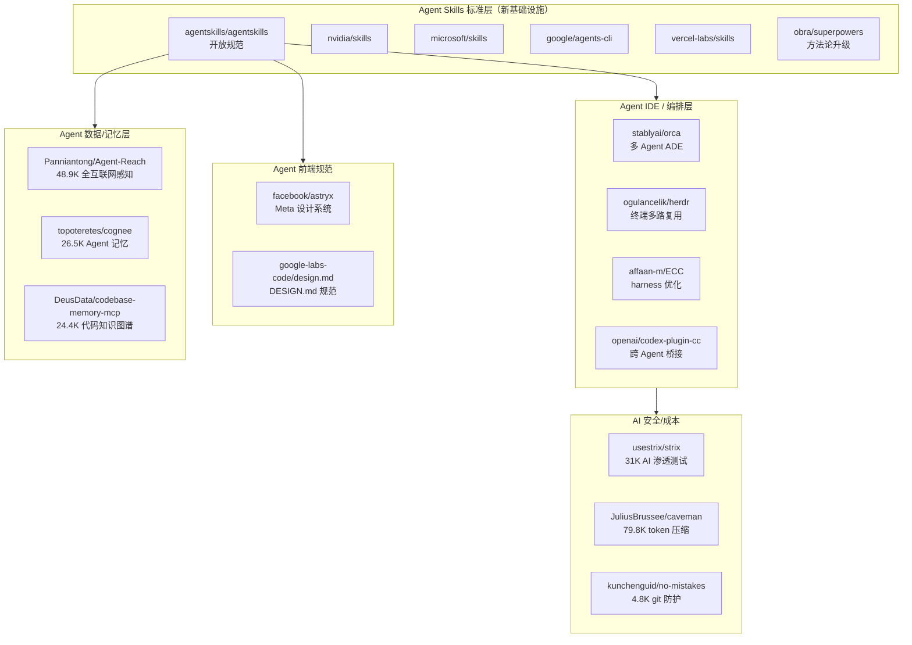

# 2026-07-02 GitHub 趋势研究简报

## 今日趋势全景

## 趋势一：Agent Skills 正在成为 Agent 生态的"标准接口层"（92 分）

**核心事件：** Anthropic 发起的 Agent Skills 开放规范正在被全行业采纳。

今日 GitHub Trending 同时出现多个巨头发布的 Skills 仓库：
- **nvidia/skills** (2,157⭐) — NVIDIA 发布的 AI Agent 技能集
- **microsoft/skills** (2,655⭐) — Microsoft 的 Skills/MCP servers/Custom Agents
- **google/agents-cli** (4,627⭐, 日+586) — Google 官方 Agent CLI + Skills
- **vercel-labs/skills** (24,763⭐) — Vercel 的开源 Agent Skills 工具
- **agentskills/agentskills** — 规范主仓库，定义 SKILL.md 标准格式

**规范核心设计：**
1. 一个 Skill = 一个文件夹 + SKILL.md
2. 三阶段渐进加载：Discovery（名称+描述）→ Activation（加载完整指令）→ Execution（执行+脚本）
3. 跨产品复用——一次编写，Claude Code/Codex/Cursor/Copilot 等通用

**obra/superpowers 将 Skills 升级为方法论：** 不是简单的技能包，而是完整的软件开发流程——brainstorming → spec → plan → TDD → subagent-driven development。Agent 自动拆分任务、分派子 Agent、审查代码，可自主工作数小时。

**架构师判断：** Agent Skills 规范正在成为类似 npm/pip 的"技能包分发层"。这是 Agent 生态走向标准化的关键信号。当 NVIDIA/Microsoft/Google/Vercel/Anthropic 都采纳同一格式时，事实标准已经确立。

## 趋势二：Meta 开源 Astryx——Agent-Ready 设计系统（88 分）

**核心事件：** Facebook 开源 Astryx 设计系统——Meta 内部 8 年打磨，驱动 13000+ 应用。

**关键数据：**
- 150+ 可访问组件，StyleX 构建
- 7 套预制主题（neutral/butter/chocolate/matcha/stone/gothic/y2k）
- CLI 工具（组件文档/模板/脚手架/codemods）
- Agent-ready：API+文档+CLI 统一设计，人和 AI 用同一套参考构建
- 无构建插件依赖——预构建 CSS + 类型化 React 组件
- swizzle 机制：组件源码可弹出至项目，完全拥有

**与 design.md 的关系：** google-labs-code/design.md（24.3K⭐，周+7.2K）定义了"如何向 Agent 描述设计系统"，是**描述层**。Astryx 直接提供组件库+CLI，是**组件层**。两者互补——design.md 告诉 Agent "应该长什么样"，Astryx 让 Agent "直接用这些组件构建"。

## 趋势三：Agent IDE 与编排层激战（87 分）

**Orca（10.8K⭐，周+3.5K）——多 Agent 并行 ADE：**
- 多 worktree 隔离——一个 prompt 扇出到 5 个 Agent 各自独立 worktree
- Ghostty-class 终端 + WebGL 渲染 + 无限分屏
- Design Mode——点击 UI 元素直接发送 HTML/CSS/截图到 Agent prompt
- GitHub & Linear 原生集成
- SSH remote——远程 beefy box 上跑 Agent
- Mobile companion——手机监控+发送后续指令
- 支持 Claude Code/Codex/Grok/Cursor/Copilot/OpenCode/Pi 等 16+ Agent

**herdr（9.9K⭐，周+2.4K）——Rust 终端 Agent 多路复用器：** 轻量级方案，在终端中同时运行多个 Agent。

**codex-plugin-cc（22.4K⭐）——跨 Agent 桥接：** 让 Claude Code 调用 OpenAI Codex 进行代码审查或委托任务。Agent 互操作性开始出现。

**ECC——Agent harness 性能优化系统：** skills + instincts + memory + security + research-first development，针对 Claude Code/Codex/Cursor 等的统一性能层。

**架构师判断：** Agent 开发工具链正从"单 Agent CLI"进化为"多 Agent IDE"。Orca 代表了"重 IDE"路线（类 VS Code for Agents），herdr 代表了"轻终端"路线。两条路线的竞争才刚开始。

## 趋势四：AI 安全与成本优化并行（85 分）

**strix 31K⭐（日+2,167）：** AI 渗透测试 Agent 持续高增长，已从昨日的趋势延续。

**caveman 79.8K⭐（日+866）：** Claude Code skill 通过"caveman speak"压缩 65% token。看似搞笑，实则揭示了 LLM 推理的重要特性——模型不需要完整自然语言就能正确推理。这对 Agent 成本优化有深远启发。

**no-mistakes 4.8K⭐（周+2.9K）：** git push 防护门，AI 验证流水线全绿才放行。

## 趋势五：Agent 数据层深化（86 分）

- **Agent-Reach 48.9K⭐（周+8.8K）** — 给 Agent 全互联网感知（Twitter/Reddit/YouTube/GitHub/Bilibili/XiaoHongShu），零 API 费用
- **cognee 26.5K⭐（周+5.2K）** — 自托管 Agent 记忆平台，知识图谱+向量搜索
- **codebase-memory-mcp 24.4K⭐（周+4.9K）** — 代码知识图谱，持续高增长

## 重点项目深度分析

### 🎨 facebook/astryx — Meta 设计系统开源

**它做什么：** Meta 内部最大的设计系统，8 年打磨，驱动 13000+ 应用。150+ 可访问组件，StyleX 构建，agent-ready。

**它为什么火：**
1. Meta 内部验证——13000+ 应用是极强的可信背书
2. Agent-ready 不是噱头——CLI+API+文档统一设计，AI 和人用同一套工具
3. 无构建插件——预构建 CSS + React 组件，零配置成本
4. swizzle 机制独特——组件源码可弹出，不锁定用户

**技术亮点：**
1. StyleX（Meta 的 CSS-in-JS）对消费者透明——可用 Tailwind/CSS Modules/原生 CSS 覆盖
2. 主题=CSS 自定义属性覆盖——设计师无需 fork 即可定制
3. 组件设计哲学："guidance over enforcement"——给能力而非设护栏
4. CLI 与 AI 协同——组件文档/模板/脚手架/codemods 一体化

**架构启发：** Astryx 的"agent-ready"设计哲学值得学习——不是简单地在文档中加 AI 提示，而是从 API 设计、CLI 工具、文档结构三个维度统一考虑 AI 和人类的使用体验。

**定位：** 平台候选——有潜力成为 Agent 时代前端开发的默认组件库

**风险：**
1. React 专享——Vue/Svelte 生态无法直接使用
2. StyleX 虽然对消费者透明，但内部构建依赖 Meta 工具链
3. 与 Ant Design/MUI/shadcn 竞争激烈，社区需要时间建立

### 📋 agentskills/agentskills — Agent Skills 开放规范

**它做什么：** 定义 Agent Skills 的标准格式——一个文件夹 + SKILL.md，包含元数据+指令+脚本+资源。

**为什么重要：** 这是 Agent 生态的"HTTP 时刻"——当一个开放规范被多家巨头采纳时，网络效应启动。Skills 将成为 Agent 能力分发的标准单位。

**架构启发：** 三阶段渐进加载（Discovery → Activation → Execution）是精巧的 context 管理设计——只在需要时加载完整指令，大幅减少 token 消耗。

### 🐬 stablyai/orca — 多 Agent 并行 ADE

**它做什么：** Agent Development Environment (ADE)，支持多 Agent 在隔离的 worktree 中并行工作，统一管理。

**技术亮点：**
1. Worktree 隔离——一个 prompt 扇出到 N 个 Agent，各自独立 worktree，比较结果后 merge 最优解
2. Design Mode——Chromium 窗口中点击 UI 元素，HTML/CSS/截图直接进入 Agent prompt
3. Mobile companion——手机监控 Agent 完成状态，发送后续指令
4. SSH worktree——远程高性能机器上运行 Agent
5. Annotate AI Diffs——在 diff 行上注释，反馈给 Agent

**架构启发：** 从"单 Agent 执行"到"多 Agent 编排"的范式转移。Worktree 隔离+比较合并是解决 Agent 代码质量问题的重要模式。

### 🔌 openai/codex-plugin-cc — 跨 Agent 桥接

**它做什么：** OpenAI 官方插件，让 Claude Code 调用 Codex 进行代码审查或委托任务。

**意义：** 这是 Agent 互操作性的早期信号。不同厂商的 Agent 开始能相互调用——这对 Agent 生态的去锁定位有深远意义。

### ☁️ google/agents-cli — Google 官方 Agent CLI

**它做什么：** Google 官方 CLI 工具，帮助编码助手在 Google Cloud 上创建、评估、部署 AI Agent。

**意义：** Google 加入 Agent CLI 竞争。结合 nvidia/skills 和 microsoft/skills，巨头都在抢占 Agent 技能层。

## 风险与机遇

### 机遇
1. **Agent Skills 标准化**——开放规范被多巨头采纳，Agent 生态的"npm 时刻"正在到来
2. **Meta 设计系统开源**——Astryx+design.md 组合让 Agent 前端开发有了统一参考
3. **多 Agent IDE 模式验证**——Orca 的 worktree 并行模式可能成为标配
4. **Agent 互操作起点**——codex-plugin-cc 跨 Agent 桥接是去锁定化的早期信号

### 风险
1. **Skills 生态碎片化**——每家巨头都有自己的 Skills 仓库，可能形成事实上的分裂
2. **设计系统锁定**——Astryx 虽开源但与 React+StyleX 深度绑定
3. **Agent IDE 过度竞争**——Orca/herdr/ECC/OpenClaude 等大量类似项目，市场可能快速洗牌
4. **caveman 模式泡沫**——token 压缩技巧虽有效但可能损害模型推理质量

## 重点项目档案

### 新增项目档案
- 🎨 facebook/astryx — Meta 设计系统开源（agent-ready）
- 📋 agentskills/agentskills — Agent Skills 开放规范
- 🐬 stablyai/orca — 多 Agent 并行 ADE（如已有则更新）
- 🔌 openai/codex-plugin-cc — 跨 Agent 桥接插件
- ☁️ google/agents-cli — Google 官方 Agent CLI

### 更新项目档案
- 🗡️ usestrix/strix — 31K（+6.9K since first tracked）
- 🔀 diegosouzapw/OmniRoute — 10.1K（+2.8K）
- 🧠 DeusData/codebase-memory-mcp — 24.4K（+5K since last tracked）
- 🌐 Panniantong/Agent-Reach — 48.9K（+4.5K）
