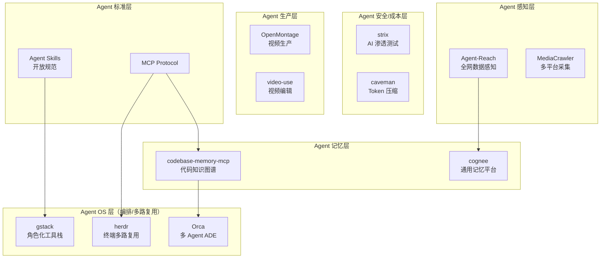

# 2026-07-03 GitHub 趋势研究简报

## 今日核心判断

GitHub Trending 本周数据揭示一个关键转折：**Agent 的能力边界正在从"数字操作"扩展到"内容生产"**。OpenMontage 以周增 12.6K star 登顶，不是因为它是一个更好的视频编辑器，而是因为它把 video production pipeline 变成了 Agent 可调用的 skill 集合。这意味着 Agent 的价值锚点正在从"提升开发者效率"转向"创造全新生产力"。

与此同时，**代码知识图谱工具 codebase-memory-mcp 周增 9.7K（近乎翻倍）**，表明市场已经认识到：没有代码级理解能力的 Agent 就是"瞎子程序员"。Agent 记忆层正从锦上添花变成必选基础设施。

## 今日重点趋势

### 1. Agentic Video Production 元年到来（趋势分：90）

| 项目 | Stars | 周增速 | 语言 | 定位 |
|------|-------|--------|------|------|
| calesthio/OpenMontage | 31,677 | +12,624 | Python | Agentic 视频生产系统（12 管线/52 工具/500+ 技能） |
| browser-use/video-use | 13,739 | +3,000 | Python | 用 coding agent 编辑视频 |

**关键判断：** 这不是"AI 视频生成"（那是 Sora/Runway 的赛道）。这是"Agent 驱动的视频生产流水线"——Agent 调度工具、编排 pipeline、管理素材。本质是把 video production 变成 agentic workflow。如果 coding agent 能写代码，为什么不能剪视频？这是 Agent 能力范围的自然延伸。

**架构启发：** OpenMontage 的 12 pipeline + 52 tools + 500+ agent skills 架构，本质上是将"视频生产"分解为 Agent 可执行的 DAG（有向无环图）。这与 software delivery pipeline（lint→test→build→deploy）的抽象方式完全一致。内容生产正在走软件工程走过的路。

### 2. 代码知识图谱爆发式增长（趋势分：89）

| 项目 | Stars | 周增速 | 语言 | 定位 |
|------|-------|--------|------|------|
| DeusData/codebase-memory-mcp | 24,603 | +9,697 | C | 代码库知识图谱 MCP（158 语言/亚毫秒查询） |
| topoteretes/cognee | 26,607 | +5,171 | Python | 自托管 Agent 记忆平台（知识图谱引擎） |

**关键判断：** codebase-memory-mcp 周增 9.7K star，几乎是翻倍增长。这不是普通的热度——这是**基础设施层的信号**。当 Agent 需要理解大型代码库时，context window 永远不够用。将代码库索引为知识图谱，查询时只加载相关片段，节省 99% token——这是让 Agent 在企业级代码库中可用的前提条件。

**技术对比：** codebase-memory-mcp 用 C 实现保证性能，cognee 用 Python 保证灵活性。前者是"代码理解专用"，后者是"通用 Agent 记忆"。两者并行增长说明市场需要不同层次的记忆方案。

### 3. Agent 多路复用与编排基础设施化（趋势分：87）

| 项目 | Stars | 周增速 | 语言 | 定位 |
|------|-------|--------|------|------|
| ogulcancelik/herdr | 10,108 | +2,401 | Rust | 终端 Agent 多路复用器 |
| stablyai/orca | 10,988 | +3,537 | TypeScript | 多 Agent 并行 ADE |
| garrytan/gstack | 118,963 | +4,039 | TypeScript | 23 角色化 Agent 工具栈 |
| openai/codex-plugin-cc | 22,569 | +448 | JavaScript | 跨 Agent 桥接（Claude Code ↔ Codex） |

**关键判断：** Agent 编排正在分化为三个层次：
- **终端层：** herdr 做 Agent 多路复用（类似 tmux for agents）
- **IDE 层：** Orca 做 multi-agent worktree 隔离
- **工作流层：** gstack 提供角色化工具栈（CEO/Designer/QA/Doc Engineer）

这对应了从"单机工具→操作系统→应用平台"的演进路径。Agent 编排正在形成自己的"OS 层"。

### 4. Agent 全网感知层成熟（趋势分：86）

| 项目 | Stars | 周增速 | 语言 | 定位 |
|------|-------|--------|------|------|
| Panniantong/Agent-Reach | 49,078 | +8,791 | Python | 全网数据感知 CLI（零 API 费用） |
| NanmiCoder/MediaCrawler | 55,051 | +2,575 | Python | 多平台数据采集（小红书/抖音/B站/微博） |

**关键判断：** Agent-Reach 周增 8.8K，49K 总 star，已经是现象级。核心价值：给 Agent 提供结构化的互联网数据输入。配合 MCP 协议，Agent 可以像调用函数一样获取 Twitter/Reddit/YouTube 的实时数据。这是 Agent 从"闭眼写代码"到"睁眼看世界"的关键基础设施。

### 5. AI 安全与 token 经济学（趋势分：84）

| 项目 | Stars | 日/周增速 | 语言 | 定位 |
|------|-------|-----------|------|------|
| usestrix/strix | 31,977 | 日+2,167 | Python | AI 渗透测试 Agent |
| JuliusBrussee/caveman | 80,713 | 日+866 | JavaScript | Token 压缩 65%（Claude Code skill） |
| kunchenguid/no-mistakes | 4,904 | 周+2,887 | Go | Git push 安全防护 |

## 重点项目深度分析

### 🧠 DeusData/codebase-memory-mcp — 代码知识图谱 MCP（Score: 92）

**它是什么：** 一个高性能的代码智能 MCP server，将代码库索引为持久化知识图谱。支持 158 种语言，查询亚毫秒级响应，声称节省 99% 的 token 消耗。用 C 语言实现，零依赖单静态二进制。

**为什么爆发：** 周增 9.7K star（几乎翻倍）不是偶然。当 coding agent 从 demo 走向生产环境，第一个瓶颈就是代码库太大、context window 太小。codebase-memory-mcp 精准切中了这个痛点：不是把整个代码库塞进 context，而是索引后按需检索。

**技术亮点：**
1. **C 语言实现** — 不是 Python/TypeScript，保证了索引和查询的极致性能
2. **158 语言支持** — 通过 tree-sitter 级别的解析能力覆盖几乎所有主流语言
3. **亚毫秒查询** — 知识图谱结构使得代码符号查询接近 O(1)
4. **99% token 节省** — 只加载相关代码片段而非整个文件
5. **零依赖单二进制** — 运维极简，这是基础设施级的设计选择

**定位：基础设施候选。** 它不是工具，是 Agent 技术栈的必选层。

### 🎬 calesthio/OpenMontage — Agentic 视频生产系统（Score: 85）

**它是什么：** 号称"世界首个开源 agentic 视频生产系统"。12 条 pipeline、52 个工具、500+ agent skills，把 AI coding assistant 变成视频生产工作室。

**为什么值得关注：** 这不是 AI 视频生成（Sora/Runway 赛道），而是 **Agent 驱动的视频生产流水线**。Agent 调度工具、编排 pipeline、管理素材——本质上是把 video production 变成 agentic workflow。如果 coding agent 能管理 build pipeline，为什么不能管理视频 pipeline？

**风险：** "500+ agent skills" 有堆数字嫌疑，需要验证实际可用性。12 pipeline 是否都是生产级也需要观察。

### 🐏 ogulcancelik/herdr — 终端 Agent 多路复用器（Score: 78）

**它是什么：** 一个用 Rust 写的终端 Agent 多路复用器。让你在一个终端里同时运行多个 coding agent（Claude Code、Codex、Cursor CLI 等）。

**为什么有用：** 当你同时用多个 Agent 处理不同任务时，需要一个调度层。herdr 的价值类似 tmux for agents——不是替代任何 Agent，而是提供并行管理能力。

**定位：工具型。** 短期实用，中期可能被 Agent IDE（如 Orca）吸收。

## Agent 技术栈分层演进

## 风险与机遇

**机遇：**
- Agent 技术栈正在快速分层化，每一层都有平台化机会
- 视频生产 Agent 打开了"内容生产"这个远大于"代码生产"的市场
- 代码知识图谱成为标配，意味着企业级 Agent 部署的底层障碍正在被清除

**风险：**
- OpenMontage 的 "500+ skills" 有营销堆砌嫌疑
- Agent 编排层竞争白热化（herdr/orca/gstack/codex-plugin-cc），尚未出现统一标准
- Agent-Reach 的"零 API 费用"模式依赖于平台政策容忍度，存在合规风险

## 今日新增项目档案

- [OpenMontage](projects/openmontage.html) — Agentic 视频生产系统
- [herdr](projects/herdr.html) — Rust 终端 Agent 多路复用器

## 今日更新项目档案

- [codebase-memory-mcp](projects/codebase-memory-mcp.html) — 周增 9.7K，评分提升至 92
- [Agent-Reach](projects/agent-reach.html) — 49K star，持续增长
- [cognee](projects/cognee.html) — 26.6K star，记忆平台定位清晰
- [strix](projects/strix.html) — 32K star，日增持续领先
