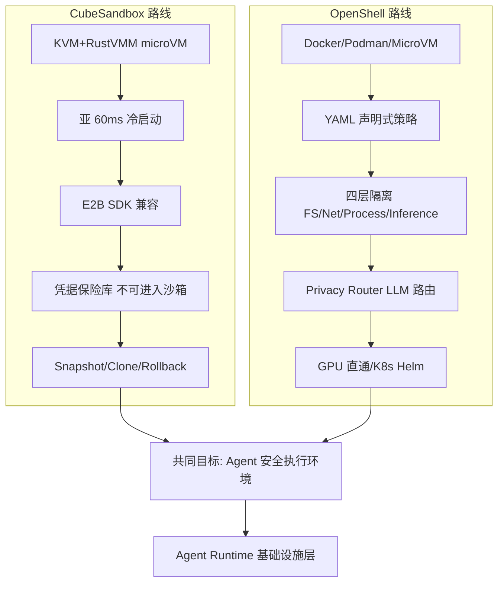

# 2026-07-04 GitHub 趋势研究简报

## 今日核心判断

今天 GitHub Trending 释放出一个强烈信号：**Agent 安全运行时正在成为兵家必争之地**。腾讯 CubeSandbox 和 NVIDIA OpenShell 同时出现在 Trending 榜单上，两个项目都选择 Rust + microVM/KVM 技术栈，都在解决同一个问题——**Agent 执行环境的安全隔离**。

这不是巧合。当 Agent 开始写代码、执行命令、访问网络，沙箱就不再是"nice to have"而是"must have"。CubeSandbox 走的是 E2B 兼容路线（亚 60ms 启动 / <5MB 开销 / 凭据保险库），OpenShell 走的是声明式策略引擎路线（四层隔离 / YAML 策略 / GPU 直通）。两种路径指向同一个终局：**Agent 需要自己的运行时，就像应用需要容器一样**。

与此同时，**Meta 开源 Astryx 设计系统**（日增 943 star）标志着前端领域正在发生"agent-ready"范式转移。Astryx 不是一个新组件库——它是 Meta 内部 8 年、13,000+ 应用验证的设计系统，核心创新是"人和 AI 用同一套 API/docs/CLI 构建"。配合 Google 的 design.md（视觉身份规范），前端设计系统正在从"人用"进化为"人+Agent 共用"。

## 今日重点趋势

### 1. Agent 安全运行时双雄对垒（趋势分：91）

| 项目 | Stars | 日增速 | 语言 | 核心差异 |
|------|-------|--------|------|----------|
| TencentCloud/CubeSandbox | 7,146 | +86 | Rust | KVM+RustVM 亚 60ms 启动/E2B 兼容/凭据保险库 |
| NVIDIA/OpenShell | 7,374 | +17 | Rust | 四层策略隔离/GPU 直通/Helm K8s 部署 |

**关键判断：** 两大科技巨头（腾讯、NVIDIA）同时押注 Agent 安全沙箱，且都选择 Rust + microVM 路线，这不是偶然。这标志着行业已经达成共识：**Agent 执行安全是基础设施层需求**。

**架构启发：** CubeSandbox 和 OpenShell 代表了两种不同的安全哲学：
- CubeSandbox = **硬件级隔离 + 极致性能**（独立 Guest OS 内核，杜绝共享内核逃逸）
- OpenShell = **声明式策略 + 深度可观测**（策略热加载，凭据不进沙箱）

对于架构师而言，选择标准很清晰：
- 需要**极致密度和多租户**？→ CubeSandbox（单节点数千沙箱）
- 需要**细粒度策略和合规**？→ OpenShell（YAML 策略 + 审计日志）
- 需要**GPU 推理**？→ OpenShell（GPU 直通）
- 需要**E2B 生态迁移**？→ CubeSandbox（零代码改动）

### 2. 前端 Agent-Ready 设计系统范式转移（趋势分：87）

| 项目 | Stars | 日增速 | 定位 |
|------|-------|--------|------|
| facebook/astryx | 4,520 | +943 | Meta 8 年内部设计系统开源（150+ 组件/StyleX） |
| google-labs-code/design.md | 24,621 | — | 视觉身份规范（给 Agent 描述 design system） |

**关键判断：** Astryx 日增 943 star 是今天增速第二快的项目。这不是普通的组件库开源——Meta 把内部最大设计系统（8 年/13K+ 应用）开源，核心卖点是 "agent ready"。这意味着：

1. **设计系统的消费者正在从"人"变成"人 + Agent"**
2. **API/docs/CLI 一体化设计**让 AI 和人用同一套参考构建 UI
3. **无构建插件**策略（import CSS + typed React components）降低了 Agent 构建门槛

与 Google 的 design.md 形成互补：design.md 定义"视觉身份怎么描述给 Agent"，Astryx 定义"视觉身份怎么被 Agent 和人共同消费"。

### 3. Agent 多路复用与编排持续升温（趋势分：86）

| 项目 | Stars | 日增速 | 语言 | 定位 |
|------|-------|--------|------|------|
| ogulcancelik/herdr | 10,702 | +513 | Rust | 终端 Agent 多路复用器 |
| stablyai/orca | 11,648 | +736 | TypeScript | 多 Agent 并行 ADE |
| openai/codex-plugin-cc | 23,157 | +629 | JavaScript | 跨 Agent 桥接（Codex from Claude Code） |

**关键判断：** 三个项目从不同角度解决同一个问题——**开发者需要同时管理多个 Agent**。herdr 做终端多路复用，Orca 做并行 ADE，codex-plugin-cc 做跨 Agent 互操作。Agent 编排层正在从"单 CLI"进化为"Agent OS 层"。

### 4. Agent 感知层 MCP 化加速（趋势分：84）

Chrome DevTools MCP（45.4K⭐）和 Alibaba page-agent（22.3K⭐，日+949）继续增长。浏览器自动化正在从脚本模式（Playwright/Puppeteer）转向 MCP 原生 Agent 模式。

### 5. Token 经济学常态化（趋势分：83）

caveman 82.8K⭐ 持续霸榜。token 压缩已从"技巧"变成 Agent 技能标配。strix 34.4K⭐ AI 渗透测试持续增长。

## 风险与机遇

### 机遇
- **Agent 安全沙箱**正在成为新的基础设施赛道，CubeSandbox vs OpenShell 的竞争将加速创新
- **Agent-ready 设计系统**将改变前端开发范式——组件库不再只为人设计
- **Agent 多路复用**意味着 Agent 管理工具将成为刚需

### 风险
- CubeSandbox 和 OpenShell 都是**早期阶段**，生产环境验证不足
- Astryx 目前是 Beta，150+ 组件的完整度需要验证
- Agent 多路复用器的**标准接口**尚未形成，锁定风险高

## 重点项目档案

详见今日更新的项目档案：
- [CubeSandbox](projects/cubesandbox.html) — 腾讯 Agent 安全沙箱
- [NVIDIA OpenShell](projects/nvidia-openshell.html) — NVIDIA Agent 安全运行时
- [Astryx](projects/astryx.html) — Meta 设计系统开源
- [herdr](projects/herdr.html) — Rust 终端 Agent 多路复用器
- [codebase-memory-mcp](projects/codebase-memory-mcp.html) — 代码知识图谱 MCP

---

*研究日期：2026-07-04 | 数据来源：GitHub Trending (daily + weekly) | 研究者：GitHub 趋势研究助理*
