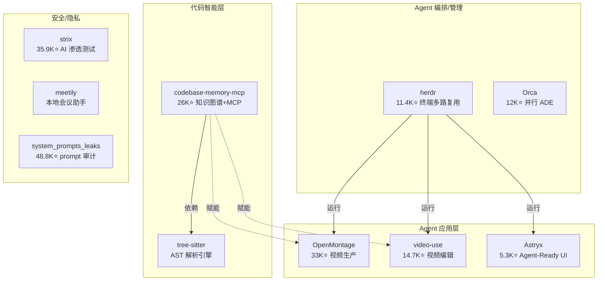

# 2026-07-05 GitHub 趋势研究简报

## 今日核心判断

今天 GitHub 趋势最重大的信号是 **代码智能层正在 MCP 化并爆发**。`codebase-memory-mcp` 以周 +10.2K stars 成为本周增速最快的项目之一，它不是又一个 code search 工具——它代表了一种范式转换：**从"Agent 读文件"到"Agent 查图谱"**。

与此同时，Agent 应用层正在突破纯代码/文本边界。`OpenMontage`（33K⭐）和 `video-use`（14.7K⭐）表明 Agent 正在进入多媒体生产领域。

## 今日五大趋势

### 趋势 1：代码智能 MCP 爆发（92 分）

**DeusData/codebase-memory-mcp** 26.1K⭐（周 +10.2K，今日 Trending #6 全球）

核心数据：
- C 语言编写，单静态二进制，零运行时依赖
- tree-sitter AST 解析 158 种语言
- Hybrid LSP 语义类型解析（Python/TS/JS/Go/C++/Java/Kotlin/Rust 等）
- 持久化知识图谱：函数、类、调用链、HTTP 路由、跨服务链接
- 亚毫秒级结构化查询（<1ms）
- token 缩减 99%（5 次结构化查询 ≈3,400 tokens vs 文件搜索 ≈412,000 tokens）
- Linux 内核（28M LOC/75K 文件）3 分钟完成索引
- 14 个 MCP 工具 + 3D 图谱可视化
- 自动检测并配置 11 种 Coding Agent
- arXiv 论文背书（2603.27277）：31 个真实仓库评测 83% 回答质量

架构启发：**知识图谱 + MCP 是 Agent 理解大型代码库的最优路径**。当前主流方案（grep+read 循环）在大仓库中 token 消耗巨大且理解碎片化。codebase-memory-mcp 的思路——预处理构建持久化图谱，查询时返回精确子图——本质上是把编译器前端的语义分析能力开放给 Agent。

### 趋势 2：Agent 视频生产系统崛起（87 分）

**calesthio/OpenMontage** 33K⭐（周 +9.2K）— 12 pipeline/52 tool/500+ agent skill 的开源 Agent 视频生产系统。把 Coding Agent 变成完整视频工作室。

**browser-use/video-use** 14.7K⭐（周 +4.1K）— 让 Coding Agent 编辑视频。

判断：Agent 应用层正在从代码/文本扩展到多媒体生产。这是一个重要信号——当 Agent 工具链开始覆盖视频创作工作流，意味着 Agent 基础设施（MCP/沙箱/编排）已经足够成熟，可以支撑复杂的非线性创作任务。

### 趋势 3：前端 Agent-Ready 设计系统（86 分）

**facebook/astryx** 5.3K⭐（日 +1,013，TS 榜首）— Meta 8 年内部设计系统开源。

关键差异化：
- 不是又一套 UI 库，而是 **为人+Agent 共用设计**的系统
- API + docs + CLI 一体化，AI 和人从同一参考构建
- swizzle 源码导出，无 styling lock-in
- 150+ 组件，7 套主题
- 已在 Meta 内部驱动 13,000+ 应用

### 趋势 4：Agent 终端多路复用成熟化（85 分）

**ogulcancelik/herdr** 11.4K⭐（日 +706，周 +3K）— tmux-for-agents。

与昨日对比数据：
- 7/4: 10.7K⭐ 日 +513
- 7/5: 11.4K⭐ 日 +706

增速在加快。herdr 证明 Agent fleet 管理需要原生终端基础设施，而非凑合用 tmux + hooks。

### 趋势 5：安全+隐私双线并进（83 分）

- **strix** 35.9K⭐（日 +1,910）AI 渗透测试持续高位
- **meetily** 隐私优先本地会议助手（Rust + Parakeet/Whisper + Ollama，100% 本地处理）
- **system_prompts_leaks** 48.8K⭐ 系统 prompt 泄露合集

安全从攻击模拟（strix）→ 隐私保护（meetily）→ prompt 审计（leaks）全链条发酵。

## 重点项目深度分析

### 1. DeusData/codebase-memory-mcp — ⭐ 26,117 | Score: 92

**它做什么**：高性能代码智能 MCP 服务器，将代码库索引为持久化知识图谱，支持亚毫秒级结构化查询。

**为什么火**：解决了 Agent 理解大型代码库的核心痛点——token 消耗和上下文碎片化。99% 的 token 缩减不是营销数字，而是实际可验证的工程价值。

**技术亮点**：
1. C 语言编写的 tree-sitter 全量 AST 解析（158 种语言，vendored grammars 编译进二进制）
2. Hybrid LSP 语义增强（不只解析语法，还解析类型信息）
3. 持久化知识图谱（SQLite in-memory + LZ4 压缩）
4. Aho-Corasick 模式匹配加速
5. 14 个 MCP 工具（search/trace/architecture/impact analysis/Cypher/dead code/HTTP linking/ADR）
6. Infrastructure-as-code 索引（Dockerfile/K8s/Kustomize 作为图节点）
7. 3D 图谱可视化

**架构启发**：预处理 + 图查询 > 实时搜索。这与编译器的设计哲学一致——先 build 再 query。Agent 时代的代码理解工具应该更像 IDE 的 language server，而不是更强的 grep。

**定位**：基础设施候选。如果 MCP 成为标准，这类代码智能层将成为 Agent 基础设施的标配组件。

**风险**：
1. C 语言编写带来跨平台编译复杂度
2. tree-sitter grammar 质量参差（158 种语言覆盖深度不一）
3. 知识图谱构建增量更新能力待验证
4. arXiv 论文为 preprint，尚未经过同行评审

### 2. calesthio/OpenMontage — ⭐ 33,050 | Score: 85

**它做什么**：开源 Agent 视频生产系统，12 pipeline/52 tool/500+ agent skill。

**为什么火**：将视频创作工作流 Agent 化，填补了 Agent 在多媒体生产领域的空白。

**技术亮点**：pipeline + tool + agent skill 三层架构，让 Coding Agent 成为视频生产编排器。

**定位**：平台候选。如果 Agent 能覆盖完整视频工作流，意味着 Agent 工具链已具备支撑复杂非线性创作任务的能力。

**风险**：500+ agent skill 数字可能存在营销泡沫；视频生产工作流的 Agent 化程度和实际质量待验证。

### 3. ogulcancelik/herdr — ⭐ 11,372 | Score: 83

**它做什么**：Agent 多路复用终端，tmux 重新设计为 Agent 原生。

**为什么火**：开发者需要同时运行多个 Coding Agent（Claude Code/Codex/Cursor CLI 等），现有终端工具不感知 Agent 状态。

**技术亮点**：
1. Agent 状态感知（🔴 blocked / 🟡 working / 🔵 done / 🟢 idle）
2. 真实终端（非 GUI 模拟），支持全屏 TUI
3. SSH detach/reattach，手机也能连
4. Socket API，Agent 可以编程化操作
5. ~10MB 单 Rust 二进制
6. Workspaces/tabs/panes 鼠标原生操作

**定位**：工具型→平台候选。Agent fleet 管理的终端基础设施，如果加入编排能力可升级为平台。

**风险**：tmux 生态惯性强大；Rust 二进制虽好但插件生态需时间建立。

## 趋势关系图

## 风险与机遇

**机遇**：
- 代码智能 MCP 层可能成为 Agent 基础设施标配（类似 language server 之于 IDE）
- Agent 多媒体生产是新蓝海
- Agent-Ready 设计系统标准化窗口期

**风险**：
- OpenMontage 500+ skill 数字需谨慎评估实际可用性
- codebase-memory-mcp 的 C 语言选择可能限制社区贡献速度
- 视频生产 Agent 化的质量标准尚未建立

## 重点项目档案

今日重点档案：
- [codebase-memory-mcp](projects/codebase-memory-mcp.html) — 🧠 代码智能 MCP，知识图谱 + tree-sitter
- [OpenMontage](projects/openmontage.html) — 🎬 Agent 视频生产系统
- [herdr](projects/herdr.html) — 🦬 Agent 终端多路复用器

---

*2026-07-05 · github-researcher · 第 84 期*
