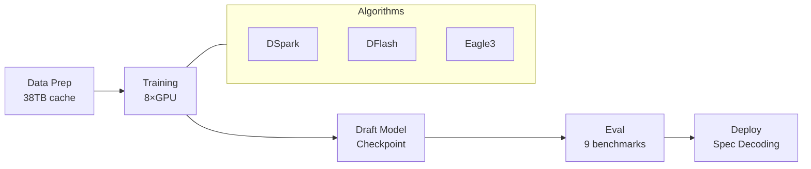

# 2026-07-06 GitHub 趋势研究简报

## 今日核心判断

**周一趋势信号明确：基础设施层和方法论层同步进化。**

本周开盘的 GitHub 趋势呈现出一个非常清晰的信号——Agent 生态正在从「能跑起来」转向「跑得好、跑得省、跑得可复现」。五个方向同步发酵：

1. **推理加速走向可训练全栈**（DeepSpec）
2. **文档自动化形成独立赛道**（OpenWiki）
3. **Agent 编排方法论化**（Loop Engineering）
4. **Node.js 工具链 Rust 化**（Nub）
5. **表格基础模型实用化**（TabFM）

---

## 趋势一：推测解码训练框架基建化

### deepseek-ai/DeepSpec — 6,238⭐ · 10 天创建 · MIT License

DeepSeek 开源了完整的推测解码（Speculative Decoding）训练和评估全栈代码库。这不是一个推理引擎，而是一个**训练 draft model 的完整基础设施**。

**核心内容：**
- 三种 draft model 算法实现：DSpark（自有论文）、DFlash、Eagle3
- 完整三阶段 pipeline：Data Preparation → Training → Evaluation
- 支持 Qwen3-4B/8B/14B、Gemma-4-12B 多个目标模型
- 数据准备需要 ~38TB 存储（默认 Qwen3-4B 配置）
- 8 GPU 单节点训练，支持多 GPU 缩放
- 评测覆盖 gsm8k/math500/aime25/humaneval/mbpp/livecodebench/mt-bench/alpaca/arena-hard-v2
- 全部 checkpoint 已发布到 HuggingFace

**架构师判断：**
推测解码是 LLM 推理加速最实用的技术之一。之前社区有 vLLM/TGI 等推理引擎的 spec decoding 支持，但 **训练 draft model 的工具链极度匮乏**。DeepSpec 填补了这个空白——它不是一个推理服务，而是一个 **研究+工程训练框架**。

这意味着：推理加速从「调 API 参数」走向「自定义训练 draft model」，企业可以针对自己的模型+场景训练专用 draft model，获得 2-5x 推理加速。这对自建推理集群的团队是重大利好。

**风险：** 38TB 数据集门槛极高，8 GPU 训练配置不菲，主要面向有算力余力的研究/工程团队。

---

## 趋势二：Agent 文档自动化成新赛道

### langchain-ai/openwiki — 5,014⭐ · 14 天创建

LangChain 出品的 Agent 驱动文档系统。这不是传统的文档生成器，而是 **为 Agent 时代设计的文档基础设施**。

**核心能力：**
- CLI 工具 `openwiki` 一键初始化+生成文档
- GitHub Action 每日自动开 PR 更新文档
- 自动向 `AGENTS.md` 和 `CLAUDE.md` 注入参考指令
- 支持 OpenRouter/Fireworks/OpenAI/Anthropic 多 LLM 后端
- 默认模型包含 GLM 5.2、Kimi K2.6、Sonnet 5
- LangSmith tracing 集成

**架构师判断：**
这标志着文档从「人写人读」到「Agent 写 Agent 读」的范式转变。OpenWiki 生成的文档放在 `openwiki/` 目录，Coding Agent 通过 AGENTS.md 自动引用——形成 **文档→Agent 上下文→代码生成** 的闭环。

与 codebase-memory-mcp（昨天 26K⭐）形成互补：codebase-memory-mcp 做代码理解（AST+知识图谱），OpenWiki 做文档维护（自动生成+更新）。两者结合，Agent 的代码库理解能力质变。

---

## 趋势三：Loop Engineering 方法论化

### cobusgreyling/loop-engineering — 5,896⭐ · 27 天创建

这不是一个库，是一套 **Agent 编排的工程方法论 + CLI 工具链**。受 Addy Osmani 和 Boris Cherny 启发。

**五个工具组件：**

| 工具 | npm 包 | 作用 |
|------|--------|------|
| loop-init | @cobusgreyling/loop-init | 脚手架：创建 skills/state/budget 文件，输出 Loop Ready 分数 |
| loop-audit | @cobusgreyling/loop-audit | 评分：审计当前 loop 配置质量 |
| loop-cost | @cobusgreyling/loop-cost | 成本：追踪 Agent 运行 token/成本 |
| loop-sync | @cobusgreyling/loop-sync | 同步：多 Agent 状态同步 |
| loop-context | @cobusgreyling/loop-context | 上下文：管理 Agent 上下文窗口 |

**核心理念：**
> "Stop prompting. Design the loop. Get a score."

从「你给 Agent 写 prompt」进化为「你设计系统，系统去 prompt Agent」。loop-init 输出 Loop Ready 分数（10→100），让 Agent 编排质量可量化。

**架构师判断：**
这是 Agent 工程从 artisan 走向 industrial 的标志。当 Agent 编排有了脚手架+评分+成本追踪，企业就可以标准化 Agent 开发流程。对比 Forsy-AI/agent-apprenticeship（1.2K⭐，Agent 学徒制生态），Loop Engineering 更偏方法论和工具链，更实用。

---

## 趋势四：Node.js 工具链 Rust 化加速

### nubjs/nub — 2,629⭐ · 33 天创建 · Rust

用 Rust 编写的 Node.js 全能工具箱，在 stock node 之上提供 Bun 式开发体验。

**性能数据：**

| 操作 | Nub | 对比 |
|------|-----|------|
| `nub run` | 24× faster | vs pnpm run |
| `nubx` | 19× faster | vs npx |
| `nub install` | 2.5× faster | vs pnpm install |

**一站式替代：**
- `nub index.ts` → 替代 node + tsx + ts-node + dotenv-cli
- `nub run dev` → 替代 npm run / pnpm run
- `nubx prisma generate` → 替代 npx / pnpm dlx
- `nub watch` → 替代 nodemon / tsx watch
- `nub node install 26` → 替代 nvm / fnm / volta
- `nub pm shim` → 替代 corepack

**架构师判断：**
关键差异在于 **不替换 runtime**。Bun 替换了 Node.js runtime，Nub 只加速工具链、保持 stock Node.js 不变。这对企业来说是更安全的选择——不需要验证新 runtime 的兼容性，只享受工具链加速。

Node.js 生态正在经历 Rust 化：Deno 用 Rust 写运行时，Bun 用 Zig，Nub 用 Rust 写工具链。JavaScript 工具链的 Rust/Zig 化已成定局。

---

## 趋势五：表格基础模型 + YAGNI Agent 理念

### Google tabfm — 1,264⭐ · 20 天创建

Google Research 开源的表格基础模型（Tabular Foundation Model），支持零样本分类和回归。

**核心特点：**
- scikit-learn 兼容 API
- 零样本：通过 in-context learning 读取训练数据作为上下文
- 无需训练参数，即时预测
- JAX 和 PyTorch 双后端支持
- TabFM v1.0.0 预训练权重已发布

**同时 Ponytail 74.8K⭐ 持续高位验证 YAGNI Agent 理念：**
- 54% less code（最高 94%）
- 20% cheaper
- 27% faster
- 100% safety guard 保留
- 支持 16 种 Coding Agent
- 上次 commit: 2026-07-01（稳定维护中）

---

## 今日其他值得关注

| 项目 | Stars | 一句话 |
|------|-------|--------|
| XiaomiMiMo/MiMo-Code | 11,469 | 小米 MiMo Code：模型+Agent 共进化框架，持续活跃 |
| omnigent-ai/omnigent | 6,314 | 开源 Agent 编排 meta-harness，支持 Claude/Codex |
| shadcn/improve | 6,938 | 用最强模型审计代码库+为便宜模型写计划 |
| cloudflare/security-audit-skill | 2,293 | Cloudflare 出品：多阶段安全审计 Agent Skill |
| Forsy-AI/agent-apprenticeship | 1,245 | Agent 学徒制生态：工作循环+评估+经验积累 |
| elder-plinius/T3MP3ST | 1,510 | 多 Agent 红队攻击平台（4 天创建 1.5K⭐） |
| rebel0789/codexpro | 1,167 | ChatGPT Developer Mode 作为本地 Coding Agent |
| shy3130/tickflow-stock-panel | 1,529 | 自托管 A 股量化工作台（DuckDB+FastAPI+LLM） |

---

## 风险与机遇

### 机遇
- **推理加速训练基建化**：DeepSpec 让企业训练专用 draft model 成为可能，自建推理集群的 TCO 可大幅优化
- **文档自动化闭环**：OpenWiki + codebase-memory-mcp + AGENTS.md 标准形成文档→理解→生成完整链路
- **Agent 工程标准化**：Loop Engineering 提供了可量化的 Agent 编排质量评估框架
- **Node.js 工具链**：Nub 的「不替换 runtime」策略对企业友好， adoption 门槛极低

### 风险
- DeepSpec 38TB 数据+8 GPU 门槛极高，短期内只有大算力团队受益
- Loop Engineering 方法论类项目容易「看的人多，用的人少」
- Nub 仍处于早期（33 天），生产稳定性待验证
- T3MP3ST 红队工具有被滥用的风险，需要关注伦理边界

---

## 重点项目档案

详见以下项目档案（本日新增/更新）：

- ⚡ [DeepSpec — 推测解码训练框架](projects/deepspec.md)（新增）
- 📚 [OpenWiki — Agent 文档系统](projects/openwiki.md)（新增）
- 🔄 [Loop Engineering — Agent 编排方法论](projects/loop-engineering.md)（新增）
- 🦀 [Nub — Node.js Rust 工具链](projects/nub.md)（新增）
