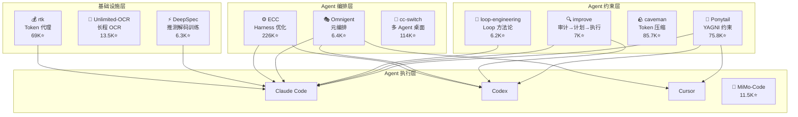

# 2026-07-07 GitHub 趋势研究简报

## 今日核心判断

**Agent 工程进入"约束优于增强"阶段。** Ponytail 以 YAGNI 理念 75.8K⭐ 登顶 Trending，核心洞察不是让 Agent 更强，而是让 Agent 更克制——54% less code 且 100% safe。这标志着 Agent 工程从"能力扩展"走向"行为约束"，与 shadcn/improve（贵模型规划+便宜模型执行）共同验证一个方向：**在 Agent 能力足够后，工程价值来自约束、分层和成本控制。**

## 趋势一：Agent 约束即性能（Ponytail 75.8K⭐）

### 核心数据

| 维度 | 数据 |
|------|------|
| Stars | 75,876（25 天创建） |
| Forks | 4,024 |
| Language | JavaScript |
| License | MIT |
| 兼容 | 16 种 Agent（Claude Code/Cursor/Codex/...） |
| 基准 | -54% LOC / -22% tokens / -20% cost / -27% time / 100% safe |

### 为什么火

Ponytail 把"最懒的资深开发"抽象成 Agent Skill——不是简洁风格指南，而是系统化的代码约束引擎。在真实 Claude Code 会话中（FastAPI+React 项目/12 个 feature ticket/Haiku 4.5/n=4），它是唯一同时减少 LOC/tokens/cost/time 且不丢安全性的 Skill。

关键洞察：**Agent 的浪费不在模型能力不足，而在过度工程。** 一个 date picker 404 行代码被 Ponytail 压到 23 行（用原生 `<input type="date">`），这不是提示词技巧，是对 YAGNI 原则的工程化执行。

### 对比

| vs baseline | LOC | tokens | cost | time | safe |
|---|---|---|---|---|---|
| **ponytail** | **-54%** | **-22%** | **-20%** | **-27%** | **100%** |
| caveman（简洁文风控制） | -20% | +7% | +3% | +2% | 100% |
| "YAGNI+one-liners" 裸提示 | -33% | -14% | -21% | -30% | 95% |

Ponytail 是唯一全维度削减且保持 100% 安全的方案。裸 YAGNI 提示丢了一个安全守卫。

## 趋势二：OCR 长程解析突破（Baidu Unlimited-OCR 13.5K⭐）

### 核心定位

Baidu 提出 "One-shot Long-horizon Parsing"——单次推理处理整篇文档，不需要分页→拼接。是对 DeepSeek-OCR 的直接推进。

### 技术亮点

- **单次长文档解析**：不再需要分页处理+后处理拼接
- **双推理引擎**：vLLM（高性能）+ Transformers（通用）
- **双配置模式**：gundam（分块裁剪/高吞吐）和 base（全分辨率）
- **生态完整**：HuggingFace Spaces Demo + Baidu Cloud 部署 + ModelScope

### 架构启发

OCR 从"切分→识别→拼接"走向"端到端长序列解析"，这与 LLM 从短上下文→长上下文的演进路径一致。Vision-Language Model 正在吃掉传统 OCR pipeline。

## 趋势三：贵模型规划+便宜模型执行（shadcn/improve 7K⭐）

### 核心模式

```
you          →  /improve                    （贵模型，审计+规划）
plans/       →  001-fix-n-plus-one.md       （自包含计划）
other agent  →  implements, tests, ships    （便宜模型，执行）
```

### 关键设计

- **9 类并行子 Agent 审计**：correctness / security / performance / test coverage / tech debt / dependencies / DX / docs / direction
- **每条发现携带 `file:line` 证据**，不允许 idea-slop
- **Advisor 重读每个引用位置**，过滤误报
- **计划即产品**：不直接实现，而是生成可由任何 Agent 执行的自包含 Markdown 计划
- **`/improve execute`**：在隔离 worktree 中委派便宜模型执行，review diff vs plan

### 架构启发

这固化了 2026 年最重要的 LLM 成本梯度利用范式：**不是所有步骤都需要最强模型。** 规划阶段用 Opus/GPT-5 级模型（智力复利），执行阶段用 Haiku/Mini 级模型（成本最优）。shadcn 把这个范式做成了可安装的 Skill（`npx skills add shadcn/improve`）。

## 趋势四：多 Agent 元编排成赛道（Omnigent 6.4K⭐）

### 为什么这个方向重要

当 Claude Code、Codex、Cursor、OpenCode、Hermes 各自成为成熟的编码 Agent 后，下一个工程需求不是再造一个 Agent，而是**编排它们**。Omnigent 定位为 "meta-harness"——统一编排层。

### 核心能力

- **跨设备同步**：终端→浏览器→手机，session 跟随
- **多 Agent 混合**：同一 session 中混合 Claude Code + Codex + Cursor，一个 Agent review 另一个的工作
- **云沙箱**：Modal/Daytona/E2B/CoreWeave/K8s/Databricks
- **策略治理**：审批、预算上限、工具限制
- **实时协作**：共享 session，队友可加入

### 生态验证

| 项目 | Stars | 定位 |
|------|-------|------|
| ECC | 226K | Agent Harness 性能优化系统 |
| cc-switch | 114K | 跨平台 Agent 一体化桌面助手 |
| Omnigent | 6.4K | 多 Agent 元编排框架 |

Agent Harness 生态已从单工具竞争走向元编排层。

## 趋势五：中国大厂密集开源编码 Agent（MiMo-Code 11.5K⭐）

小米 MiMo-Code 加入百度（Unlimited-OCR）+ DeepSeek（DeepSpec）的行列，中国大厂正在密集开源 AI 编码基础设施。

**MiMo-Code 差异点**：
- "模型+Agent 协同进化"理念——Agent 使用数据反馈模型训练
- 持久记忆系统——跨 session 保持项目理解
- 免费 MiMo Auto 通道——零配置启动
- 支持 Claude Code 配置一键导入

## 重点项目深度分析

### 1. Ponytail — Agent 约束工程的开创者

**评分**：

| 维度 | 分数 | 理由 |
|------|------|------|
| 热度质量 | 9 | 25 天 75.8K⭐，基准验证而非营销 |
| 技术创新度 | 8 | YAGNI 工程化不新颖但系统化基准验证是新的 |
| 工程成熟度 | 8 | 16 种 Agent 兼容，npm 安装，基准可复现 |
| 架构启发价值 | 9 | "约束优于增强"是 Agent 工程范式转变 |
| 企业落地潜力 | 8 | 直接降本 20%，兼容现有 Agent 工具链 |
| 中期趋势概率 | 8 | Agent Skill 生态刚起步 |
| 平台化潜力 | 7 | 当前是 Skill，可能发展为 Agent 治理平台 |
| 基础设施潜力 | 6 | 偏上层应用 |

**总分：75/80（94%）**
**归类：工具型 → 可能演进为平台候选**
**建议持续跟踪：是**

### 2. shadcn/improve — LLM 成本梯度利用的工程范式

**评分**：

| 维度 | 分数 | 理由 |
|------|------|------|
| 热度质量 | 8 | 27 天 7K⭐，shadcn 个人品牌加持 |
| 技术创新度 | 8 | 9 类并行审计+计划即产品，模式清晰 |
| 工程成熟度 | 7 | 可用但偏早期，worktree 隔离执行是新设计 |
| 架构启发价值 | 9 | 成本梯度利用范式，影响深远 |
| 企业落地潜力 | 9 | 直接可用，降本效果明确 |
| 中期趋势概率 | 8 | 成本优化是刚需 |
| 平台化潜力 | 7 | 当前是 Skill，可能发展为 CI 集成方案 |
| 基础设施潜力 | 5 | 偏工具层 |

**总分：61/80（76%）**
**归类：工具型**
**建议持续跟踪：是**

### 3. Baidu Unlimited-OCR — OCR 长程解析的里程碑

**评分**：

| 维度 | 分数 | 理由 |
|------|------|------|
| 热度质量 | 8 | 19 天 13.5K⭐，Baidu 官方背书 |
| 技术创新度 | 9 | One-shot Long-horizon Parsing 是技术突破 |
| 工程成熟度 | 8 | vLLM+Transformers 双引擎，HuggingFace Demo |
| 架构启发价值 | 8 | OCR pipeline 简化，端到端替代分页拼接 |
| 企业落地潜力 | 8 | Baidu Cloud 部署，文档处理刚需 |
| 中期趋势概率 | 8 | VLM 吃掉传统 OCR 是确定性趋势 |
| 平台化潜力 | 6 | 当前是模型+工具 |
| 基础设施潜力 | 7 | OCR 是企业基础设施能力 |

**总分：62/80（78%）**
**归类：基础设施候选**
**建议持续跟踪：是**

## 风险与机遇

### 机遇

1. **Agent Skill 生态爆发**：Ponytail、improve、loop-engineering、caveman 验证了 Agent Skill 作为新品类——可安装、可复用、可基准验证的行为约束包
2. **LLM 成本梯度利用**从理念走向工程：shadcn/improve 固化了"贵模型规划+便宜模型执行"模式
3. **VLM 吃掉 OCR**：Unlimited-OCR 证明 Vision-Language Model 正在端到端替代传统 OCR pipeline
4. **中国大厂编码 Agent 生态**：百度+DeepSeek+小米密集开源，可能形成差异化生态

### 风险

1. **Agent Skill 同质化**：caveman（85K⭐）、Ponytail（75.8K⭐）、ECC（226K⭐）都在做"约束/优化 Agent 行为"，可能快速泡沫化
2. **元编排层过早**：Omnigent 等 meta-harness 在单个 Agent 尚未充分成熟时做多 Agent 编排，可能过度工程
3. **OCR 长文档的可靠性**：One-shot 解析在极端长文档（100+ 页）上的准确率仍需验证

## 生态关系图



## 今日项目列表

| # | 项目 | Stars | 类别 | 一句话 |
|---|------|-------|------|--------|
| 1 | Ponytail | 75.8K | 工具型 | YAGNI Agent Skill，54% less code |
| 2 | Unlimited-OCR | 13.5K | 基础设施候选 | One-shot 长程 OCR |
| 3 | MiMo-Code | 11.5K | 工具型 | 模型+Agent 协同进化 |
| 4 | OpenWiki | 7.4K | 工具型 | Agent 驱动的代码文档 |
| 5 | improve | 7K | 工具型 | 贵模型规划+便宜模型执行 |
| 6 | Omnigent | 6.4K | 平台候选 | 多 Agent 元编排框架 |
| 7 | DeepSpec | 6.3K | 基础设施候选 | 推测解码训练全栈 |
| 8 | loop-engineering | 6.2K | 平台候选 | Loop Engineering 方法论 |

---

*研究日期：2026-07-07 | 数据来源：GitHub API via `gh` | 研究视角：资深架构师*
