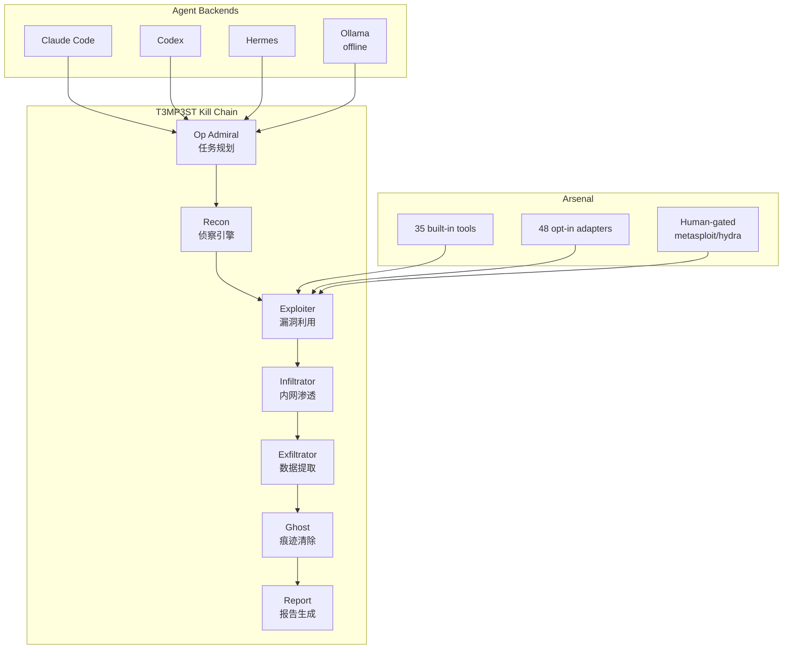
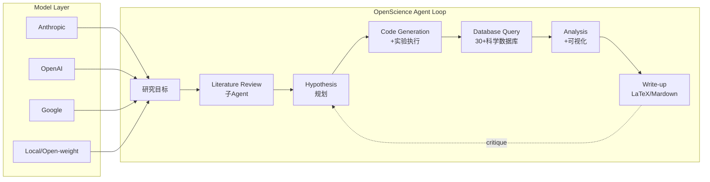

# 2026-07-10 GitHub 趋势研究简报

## 今日核心判断

今天是 2026 年 7 月 10 日，周四。GitHub 趋势生态出现三个值得关注的信号：

1. **安全 Agent 正式成为独立赛道**——T3MP3ST 把"AI 编码 Agent → 攻击性安全工具"的路径走通了，而且用 `verify-claims` 复现机制建立了信任标杆
2. **AI4Science 工具链从实验室走向可用产品**——OpenScience 把文献阅读、实验代码、科学数据库查询、论文写作整合到一个浏览器工作台
3. **Agent Harness 头部生态已经定型**——ECC 228K + Hermes 212K + OpenCode 184K + OpenClaw 382K，四大项目定义了编码 Agent 基础设施的边界

## 趋势深度分析

### 🏆 趋势 1：AI 红队元框架——T3MP3ST（4,152⭐ / 8 天 / AGPL-3.0）

**它是什么：** 多 Agent 攻击性安全元框架（meta-harness），让 Claude Code、Codex、Hermes 或本地 Ollama 模型变成零日漏洞猎人。Kill chain 全自动：recon → exploit → report，支持 Web 应用、CTF、机器人/OT 嵌入式、源代码、智能合约、云 IaC、移动端、二进制/逆向 8 个领域。

**为什么火：**
- **90.1% pass@1 on XBOW 104-challenge suite**（XBOW 自报 85%）——用别人的基准打别人的分
- **`npm run verify-claims` 复现机制**——README 里每个数字都可从 committed JSON 重算，24/24 绿
- **Keyless 设计**——不额外收 API key，用你已有的编码 Agent 作为推理引擎
- **Pliny（elder-plinius）品牌效应**——AI 安全圈 KOL + 越狱研究者
- 8 天 4.2K Star + 890 Fork，社区参与度极高

**技术亮点：**
- 8-operator kill chain 架构（Recon → Exploiter → Infiltrator → Exfiltrator → Ghost 等）
- 35 个内置工具（全量 83 个，危险工具如 metasploit/hydra 在 human-approval gate 后）
- Egress-scope containment：目标设定后，网络工具拒绝访问域外主机
- 支持完全离线运行（Ollama/LM Studio/vLLM/llama.cpp）
- War Room 浏览器 UI + CLI 双入口
- 协调披露管道（OSV novelty + live PoC + refuter panel）

**架构启发：**

**定位判断：** 工具型 → 平台候选。当前是高级工具，但 meta-harness 架构（任意 Agent + 工具集 + 基准验证）有平台化潜力。

**风险/局限/泡沫点：**
- Exploiter/Infiltrator/Ghost 仍标注 Experimental——swarm 协调端到端尚未基准验证
- AGPL-3.0 限制商业集成
- 安全工具天然面临滥用风险
- "零日猎人"的营销话术需要更多真实 CVE 发现来支撑（当前有 8/10 post-cutoff CVE 但规模有限）
- Pliny 个人品牌带来的关注度可能高于工程成熟度

### 🔬 趋势 2：OpenScience——科研全闭环 Agent（1,935⭐ / 7 天 / Apache-2.0）

**它是什么：** 开源 AI 科研工作台。给它一个研究目标，它自动完成：读文献 → 提假设 → 写代码 → 跑实验 → 查数据库 → 分析数据 → 写论文。

**为什么值得关注：**
- **290+ Skills** 覆盖 ML 训练（DeepSpeed/PEFT/TRL）、分子生物学、化学信息学、LaTeX 排版、云计算（Modal/Tinker）
- **30+ 科学数据库直连**：UniProt、PDB、Ensembl、ChEMBL、PubChem、arXiv、OpenAlex、Semantic Scholar
- 浏览器 UI 含文件树、编辑器、终端、会话历史，还支持分子/结构/基因组/图表的 inline 渲染
- 默认 `research` agent + biology/physics/ml 三个专家 agent + critique/literature-review 子 agent
- BYOK 永远免费，Atlas 平台可选
- Bun 构建，TypeScript 全栈

**架构启发：**

**定位判断：** 平台候选。已具备 AI4Science 平台的雏形——多领域覆盖、技能可扩展、模型无关。

**风险/局限：**
- Agent 未沙箱化——权限系统仅提醒，非隔离边界（官方建议在容器/VM 中运行）
- 7 天 1.9K Star 增速健康但不算爆发——AI4Science 受众比通用编码 Agent 窄
- Atlas 商业平台的存在可能引发开源 vs 商业路线分歧
- 科研可重复性需要实际验证，Agent 生成的实验代码可能有微妙错误

### ⚡ 趋势 3：Agent Harness 头部生态定型

今日 GitHub 全局活跃仓库 Top 10 中，Agent 相关项目占据显著位置：

| 项目 | Star | Forks | Issues | 定位 |
|------|------|-------|--------|------|
| OpenClaw | 382K | 80K | 6,269 | 个人 AI 助手/跨平台 |
| ECC | 228K | 35K | 83 | Agent 性能优化/技能+记忆+安全 |
| Hermes-Agent | 212K | 39K | 27K | 成长型 Agent/NousResearch |
| OpenCode | 184K | 23K | 4,658 | 开源编码 Agent |

**关键判断：编码 Agent 基础设施层已定型。** 这四个项目合计 100 万+ Star，覆盖了个人助手、性能优化、成长型 Agent、通用编码四个方向。新入局者很难在这个层面竞争，机会在上层应用和下层工具：

- **上层：** 特定领域 Agent（安全 T3MP3ST、科研 OpenScience、运维、数据分析）
- **下层：** Agent 工具链（Loop Engineering、Skills、MCP servers）
- **横向：** 元编排（Omnigent）和框架标准化（Vercel Eve）

### 🌐 趋势 4：分布式 GPU 推理网络——Talos（815⭐ / 8 天）

**它是什么：** GPU worker 客户端，连接 Talos 网络执行开源模型推理任务，通过 WebSocket 报告 uptime 获取奖励。

**为什么关注：** 去中心化推理算力市场的早期信号。如果 CDN 模式可以用于 GPU 推理供给，算力市场结构可能被重塑。当前体量很小（815 Star、13 Fork），但方向值得关注。

**风险：** 体量过小，可能是概念验证阶段。经济模型可持续性未知。与 Ollama（175K⭐）等本地推理方案不构成直接竞争，更像是算力市场的 Airbnb。

### 趋势 5：Vercel Eve 稳步增长（3.4K⭐ / 24 天）

从 6 月 19 日的 2.5K 到今天 3.4K，日均 ~40 Star。增长不算爆发但很稳定。

**核心设计理念——filesystem-first：** agent 的 tools/skills/channels/schedules 映射到约定目录结构。文件系统就是 Agent 的开发界面。

这个设计的核心洞察是：**Agent 框架应该消除框架学习成本。** 你不需要学 DSL，只需要按目录约定放文件。Coding Agent（Claude Code/Codex）可以直接从 `node_modules/eve/docs` 读取文档——这是 Agent-native 的 DX 设计。

## 重点项目评分

| 项目 | 热度质量 | 技术创新 | 工程成熟度 | 架构启发 | 企业落地 | 中期趋势 | 平台化 | 基础设施 | 总分 | 分类 |
|------|----------|----------|------------|----------|----------|----------|--------|----------|------|------|
| T3MP3ST | 9 | 8 | 7 | 8 | 6 | 8 | 7 | 4 | **57/80** | 工具型→平台候选 |
| OpenScience | 7 | 8 | 7 | 8 | 6 | 7 | 8 | 5 | **56/80** | 平台候选 |
| Talos | 5 | 6 | 4 | 6 | 3 | 5 | 4 | 6 | **39/80** | 学习型 |
| Vercel Eve | 7 | 7 | 8 | 8 | 7 | 7 | 7 | 4 | **55/80** | 平台候选 |

## 本周值得补看（如果还没看）

> 7 月 7 日日报中的 **Ponytail（79K⭐）** ——YAGNI Agent Skill 范式，54% less code / 20% cheaper / 27% faster / 100% safe。如果你还没看，这是本周最值得花 5 分钟了解的 Agent 工程实践。

## 项目档案

今日新增 3 个项目档案，更新 1 个项目档案：

- 🆕 `projects/t3mp3st.md` — 多 Agent 攻击性安全元框架
- 🆕 `projects/openscience.md` — 开源 AI 科研工作台
- 🆕 `projects/talos.md` — 分布式 GPU 推理网络
- 🔄 `projects/vercel-eve.md` — 更新 Star 数和增长趋势
