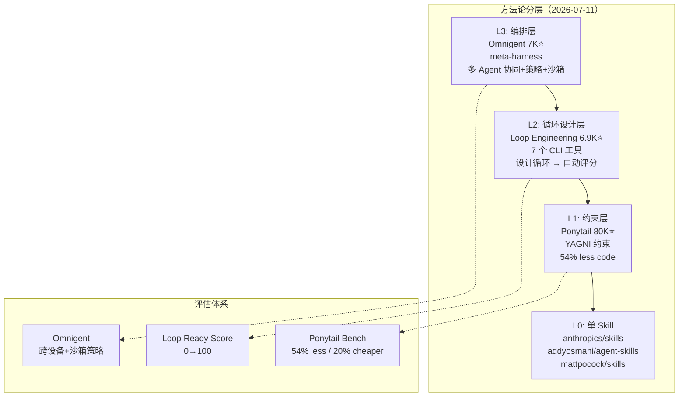
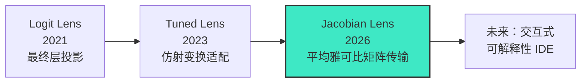

# 2026-07-11 GitHub 趋势研究简报

## 今日核心判断

今天是 2026 年 7 月 11 日，周五。GitHub 趋势生态呈现三个值得关注的信号：

1. **LLM 可解释性从论文走向工具**——Anthropic 发布 Jacobian Lens 参考实现，把"模型内部在想什么"从哲学问题变成可安装、可复现的 Python 库。这不是另一个 attention visualization——它用传输雅可比矩阵覆盖了从任意层到输出层的完整映射，解释力质的飞跃
2. **教育领域出现结构化数据基座**——Marble os-taxonomy 在 3 天内拿到 2K+ star，不是因为 AI 概念，而是因为它做了教育科技最缺的事：把课程拆成可编程的依赖图。这是 AI 教育个性化的基础设施
3. **Agent Skill 从"集邮"走向方法论**——Loop Engineering（设计循环）、Ponytail（约束输出）、Omnigent（编排多 Agent）三者合力，标志着 Agent Skill 不再是"给 Claude Code 贴提示词"，而是一套有理论、有工具链、有评估指标的工程方法论

## 趋势深度分析

### 🏆 趋势 1：LLM 可解释性工具化——Anthropic Jacobian Lens（1,058⭐ / 9 天）

**它是什么：** Anthropic 论文《Verbalizable Representations Form a Global Workspace in Language Models》的配套参考实现。核心方法是计算残差流在某层的**平均输入-输出雅可比矩阵**（average input-output Jacobian），用它把任意层任意位置的激活向量线性传输到最终层，再用模型自身的 unembedding 矩阵解码为词汇表 token 排名。

**为什么重要：**
- **超越 logit lens**——logit lens 只看最终层投影，Jacobian Lens 计算的是真实的层间传输矩阵，能读出中间层"准备好了说什么"
- **质量饱和极快**——1000 条 128 token 序列拟合，~100 条即可使用。这意味着任何开源 decoder transformer 都能低成本适配
- **论文+代码+可视化一体**——walkthrough.ipynb 端到端展示加载模型→应用 lens→渲染交互式视图
- **明确的学术信号**——"Not maintained and not accepting contributions"，这是参考实现而非产品。但其方法论可能被主流可解释性工具吸收

**技术亮点：**
- 雅可比矩阵 J_l = E[∂h_final / ∂h_l]，通过反向传播在文本语料上取期望
- 支持 HuggingFace decoder transformer（示例用 Qwen）
- 支持切片合并：`JacobianLens.merge()` 并行拟合
- ASCII-face 示例极其直观：选中"鼻子"位置的激活，中间层读出"nose"——尽管该词从不出现在 prompt 中

**风险：** 参考实现非产品级、不维护、不接收贡献；拟合计算量取决于模型自身反向传播

### 🏆 趋势 2：教育知识图谱——Marble os-taxonomy（2,071⭐ / 3 天）

**它是什么：** 一份开源的结构化课程知识图谱——1590 个微主题（micro-topics），3221 条前置依赖边（prerequisite DAG），覆盖科学、数学、英语、历史等 8 个学科，对齐 NGSS、Common Core、UK National Curriculum 等国家标准。

**为什么火：**
- **教育科技的 foundational data**——大多数课程数据要么是扁平标准列表，要么锁在商业产品里。这是第一个开放的、图结构的、有前置依赖的课程数据集
- **数据质量极高**——每个微主题有描述、掌握证据标准、评估提示、类型分类（概念/程序/表征/语言/元认知）、年龄范围
- **3D 可视化**——README 的旋转 3D 图谱动图极具传播力
- **真实商业背景**——Marble 是一家教育科技公司，开放核心数据表明其商业模式不依赖数据壁垒

**对架构师的启发：**
- 知识图谱+前置依赖 DAG 是很多领域的基础设施模式——课程、技能树、依赖管理、合规检查
- 开放核心数据+增值服务的商业模式值得研究
- 微主题粒度（~1590 个节点）在大语言模型时代有了新的消费场景：AI 辅导可以精确知道"学生卡在哪一个前置概念"

### 🏆 趋势 3：DevTools Rust 化——Nub（2,802⭐ / 38 天）

**它是什么：** 用 Rust 编写的 Node.js 全能工具箱——一个二进制替代 tsx + nvm + fnm + corepack + nodemon + pnpm。不替换 Node.js runtime，在 stock node 上提供 Bun 式开发体验。

**关键数据：**
- `nub run dev`：24× 更快 than pnpm run
- `nubx prisma generate`：19× 更快 than npx
- `nub install`：18× 更快 than pnpm install
- 内置 Node 版本管理（`nub node install 26`）
- 支持 macOS / Linux / Windows / Homebrew / Nix / mise

**为什么值得关注：** Rust 正在系统性渗透 JavaScript 生态——从底层（Deno/Bun runtime）到工具链（esbuild/swc/Turbopack）再到开发者日常命令（Nub）。这不是趋势，这是既成事实。Nub 的独特之处在于**不造新 runtime**，只加速已有 Node.js 工作流。

### 🏆 趋势 4：Agent Skill 方法论化

三个项目合力标志着 Agent Skill 赛道进入"方法论分层"阶段：

| 维度 | Loop Engineering | Ponytail | Omnigent |
|------|-----------------|----------|----------|
| 核心理念 | 设计循环，不写提示 | 约束输出，不增强能力 | 编排多 Agent，不替换任何一个 |
| 工具形态 | 7 个 npm 包（audit/init/cost/sync/context/mcp/worktree） | 1 个 Skill | 1 个 meta-harness + 桌面/移动/Web 客户端 |
| 量化指标 | Loop Ready Score 0→100 | 54% less code / 20% cheaper / 27% faster | 跨设备实时协作+沙箱策略治理 |
| Stars | 6,946 | 80,115 | 7,000 |
| 适配 | Claude Code / Codex / OpenCode | 20+ Agent | Claude Code / Codex / Cursor / OpenCode / Hermes / Pi |

**核心判断：** Agent Skill 不再是"给 Claude Code 写一个 .md 文件"——它有了：
- **方法论**（Loop Engineering 的五块+记忆）
- **约束理论**（Ponytail 的 YAGNI 量化）
- **编排层**（Omnigent 的 meta-harness）
- **评估体系**（loop-audit / Loop Ready Score）

这是从"集邮式 Skill 收集"到"工程化方法论"的关键拐点。

### 🏆 趋势 5：DNS 可观测性 TUI——dnsglobe（793⭐ / 6 天）

**它是什么：** 全球 DNS 传播检查器 TUI——在终端世界地图上实时展示一条 DNS 记录在 34 个公共解析器上的传播过程。Rust + ratatui 实现。

**为什么值得关注：** 小而美的开发者工具范本——用 TUI 把抽象的网络行为可视化。Rust + ratatui 正在成为 CLI 精品工具的事实标准技术栈（类似 TUI 领域的 React+Tailwind）。

## 重点项目档案

### 🔬 anthropics/jacobian-lens
- **定位：** LLM 可解释性参考实现
- **解决的问题：** 现有 logit lens 只看最终层投影，无法读出中间层的语义准备状态
- **热度来源：** Anthropic 品牌+高质量论文+直观的 ASCII-face 示例+可复现
- **技术亮点：** 平均雅可比矩阵传输 / 100 条 prompt 质量饱和 / merge 并行拟合 / HF decoder 通用适配
- **定位判断：** 学习型——参考实现非产品，但方法论将被主流可解释性工具吸收
- **风险：** 明确声明不维护不接收贡献；拟合成本取决于模型规模
- **是否值得持续跟踪：** 是——可解释性工具化是 LLM 研究的长期方向

### 📚 withmarbleapp/os-taxonomy
- **定位：** 开源结构化课程知识图谱
- **解决的问题：** 教育科技缺乏开放、结构化、有前置依赖关系的课程数据
- **热度来源：** 3D 可视化病毒传播+数据质量极高+教育社区真实需求
- **技术亮点：** 1590 微主题 / 3221 DAG 依赖边 / 多国课程标准对齐 / mastery evidence 标准化
- **定位判断：** 观察型——教育数据基座，需观察 Marble 商业模式验证
- **风险：** 单一公司维护、版本治理不明、教育市场变现路径不确定
- **是否值得持续跟踪：** 是——如果 AI 教育起飞，这类结构化数据是刚需

### 🐴 DietrichGebert/ponytail（更新）
- **Stars：** 80,115（上次记录 75,876 → +4,239 / 4 天）
- **趋势：** 日均 ~1K star，从爆发期进入稳步增长期
- **新增信息：** 基准测试更新为 agentic 基准（12 个真实任务 / Haiku 4.5 / n=4），更可信
- **Score 维持 93**

## 项目评分汇总

| 项目 | 热度质量 | 技术创新度 | 工程成熟度 | 架构启发 | 企业落地 | 中期趋势 | 平台化 | 基础设施 | 总分 | 分类 |
|------|---------|-----------|-----------|---------|---------|---------|-------|---------|------|------|
| Jacobian Lens | 7 | 9 | 5 | 9 | 3 | 8 | 2 | 3 | 46 | 学习型 |
| os-taxonomy | 8 | 6 | 7 | 7 | 5 | 6 | 5 | 4 | 48 | 观察型 |
| Nub | 7 | 5 | 8 | 7 | 8 | 7 | 4 | 5 | 51 | 工具型 |
| Ponytail | 10 | 7 | 8 | 8 | 9 | 9 | 4 | 3 | 58 | 工具型 |
| Loop Engineering | 7 | 7 | 7 | 8 | 7 | 8 | 7 | 4 | 55 | 平台候选 |
| Omnigent | 7 | 6 | 6 | 8 | 6 | 8 | 8 | 5 | 54 | 平台候选 |
| dnsglobe | 6 | 5 | 7 | 5 | 4 | 5 | 2 | 3 | 37 | 学习型 |

## 风险与机遇

### 机遇
- **可解释性工具化**——当 LLM 内部状态可以被精确读出，对齐、安全、调试都有了新的基础工具
- **知识图谱+AI**——os-taxonomy 这类高质量结构化数据将成为 AI 应用的差异化基础
- **Agent 方法论**——Loop Engineering + Ponytail + Omnigent 形成了 Agent 工程的"三板斧"

### 风险
- **Anthropic 可解释性方向集中**——如果主流可解释性工具只服务闭源模型，开源模型生态会落后
- **教育数据治理**——os-taxonomy 由单一公司维护，版本治理和社区参与模式不明确
- **Agent Skill 泡沫风险**——80K+ star 的 Ponytail 本质是一个 .md 文件，高 star 不等于高门槛

## Mermaid：Agent Skill 方法论分层

## Mermaid：LLM 可解释性工具演化

---

> 本日数据采集方式：gh CLI (GitHub GraphQL API + REST API)。git pull 因网络超时失败（3 次重试），本地分支与 origin/main 一致（git status 已确认），研究基于最新 API 数据完成。
