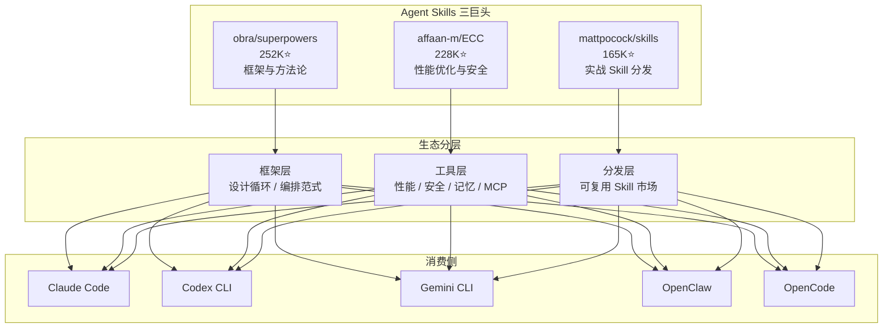
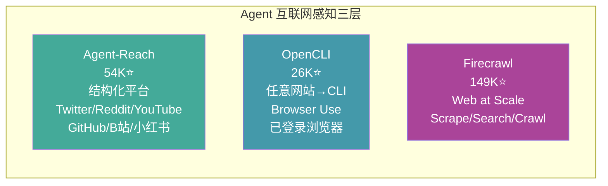

# 2026-07-12 GitHub 趋势研究简报

## 今日核心判断

今天是 2026 年 7 月 12 日，周六。GitHub 生态呈现以下关键信号：

1. **Agent Skills 赛道三巨头格局成型**——Superpowers (252K) + ECC (228K) + mattpocock/skills (165K) 合计 64 万 star。这不是简单的 prompt collection——Superpowers 是框架与方法论，ECC 是 Agent 性能优化与安全，mattpocock/skills 是实战 Skill 分发。一个完整的赛道正在成型：有框架层、有工具层、有分发层
2. **Code Intelligence MCP 正在成为 Agent 标准底座**——codebase-memory-mcp 突破 30K star，纯 C 实现，158 语言支持，11 个编码 Agent 自动配置，arXiv 论文背书，SLSA 3 安全等级，5604 测试通过。这已经不是"有用的工具"，而是"Agent 认知代码库的基础设施"
3. **实用工具不需要 AI 概念也能爆发**——Knockoff 6 天 1.7K star，做的事情极其朴素：过滤亚马逊上的伪品牌商品。全本地运行，无追踪，无 AI。但它解决了真实的消费痛点，被 Fast Company、Gizmodo、404 Media、Lifehacker 等主流媒体报道。信号：开发者社区对"真正解决问题的小工具"仍有巨大需求

## 趋势深度分析

### 🏆 趋势 1：Agent Skills 三巨头格局成型（合计 64 万 star）

**Superpowers（252K⭐）** — 定位：agentic skills framework & 软件开发方法论。它不只是 Skill 集合，而是"用 Skill 驱动开发"的完整方法论——subagent-driven-development、brainstorming、结构化 SDLC。Shell 语言，MIT 协议，80K+ forks 说明社区参与度极高。

**ECC（228K⭐）** — 定位：Agent harness 性能优化系统。Skills + instincts + memory + security + research-first development。覆盖 Claude Code、Codex、OpenCode、Cursor 等主流编码 Agent。35K+ forks 表明大量团队在基于 ECC 做内部定制。

**mattpocock/skills（165K⭐）** — 定位：实战 Skill 直接分发。"Straight from my .claude directory"——不谈方法论，直接给可用的 Skill 文件。14K+ forks 说明大量开发者在 fork 后定制。

**对架构师的关键判断：**
- Agent Skills 正在从"给 Claude Code 写提示词"变成一个有框架、有评估、有分发的独立工程领域
- 如果你在做企业内部 AI 编码落地，需要同时关注三层：方法论（怎么设计 Agent 工作流）、工具链（怎么评估和优化）、分发（怎么让团队用起来）
- 三者并非竞争关系——Superpowers 提供骨架、ECC 提供肌肉、mattpocock/skills 提供器官

### 🏆 趋势 2：Code Intelligence MCP 基础设施化——codebase-memory-mcp 突破 30K（30,110⭐）

**关键指标变化（上次记录 7/5: 26,117 → 今日: 30,110）：**
- 周增约 4,000 star（较前期放缓，但仍在稳定增长）
- v0.9.0 发布（2026-07-08），功能趋于稳定
- 30 名贡献者，220 个 open issues（基础设施级别的社区规模）
- arXiv 论文（2603.27277）：83% answer quality, 10× fewer tokens, 2.1× fewer tool calls

**为什么这是基础设施而非工具：**
- **零依赖单二进制** — macOS/Linux/Windows 全平台，下载即用。这是基础设施的交付标准
- **11 Agent 自动配置** — `install` 命令自动检测 Claude Code/Codex/Gemini CLI/Zed/OpenCode/Antigravity/Aider/KiloCode/VS Code/OpenClaw/Kiro 并配置 MCP entries
- **SLSA 3 安全等级** — 供应链安全达到企业级。签名、校验、VirusTotal 扫描
- **5604 测试通过** — 这不是实验性项目，是经过严格验证的工程产品
- **Hybrid LSP** — tree-sitter AST + LSP 语义类型解析，覆盖 Python/TS/JS/JSX/TSX/PHP/C#/Go/C/C++/Java/Kotlin/Rust/Perl

**对架构师的启发：**
- Code Intelligence 正在从"grep + read"变成"知识图谱 + 语义查询"
- MCP 协议让代码理解能力成为 Agent 的即插即用模块——不需要改 Agent 代码，只需要安装 MCP server
- 知识图谱（SQLite + Cypher）作为代码库表示，比向量数据库更适合结构性代码查询

### 🏆 趋势 3：实用工具回归——Knockoff（1,761⭐ / 6 天）

**它做什么：** Chrome/Firefox/Safari 扩展，过滤亚马逊上的伪品牌商品（SZHLUX、HORUSDY、LATTOOK 等商标抢注品牌），在搜索结果中隐藏、变暗或标记。

**为什么火（6 天 1.7K star + 多家媒体报道）：**
- **真实痛点** — 亚马逊伪品牌问题是全球消费者的日常困扰
- **零摩擦** — Chrome Web Store 一键安装，全本地运行，无追踪
- **多平台** — Chrome、Firefox、Safari 全覆盖
- **不蹭概念** — 没有 AI、没有区块链、没有云。只是一个内容脚本 + 品牌检测管线
- **媒体背书** — Fast Company、Gizmodo、404 Media、PC Gamer、Yahoo、Lifehacker

**品牌检测管线（技术亮点）：**
1. 用户 allowlist → 放行
2. 用户 blocklist → 拦截
3. 已知伪品牌数据库 → 拦截
4. 商标注册时间 + 品牌名熵分析 → 可疑标记
5. 默认行为：隐藏/变暗/标签三选一

**对架构师的启发：**
- 最有效的工具往往不是技术最先进的，而是最精准地命中痛点的
- 全本地运行的隐私优势在消费工具中越来越重要
- 浏览器扩展作为轻量交付渠道，仍然有巨大的产品空间

### 🏆 趋势 4：Agent 互联网感知层闭合

**关键判断：** Agent 获取外部数据的基础设施层正在闭合。
- Agent-Reach 解决"结构化平台数据获取"（零 API 费）
- OpenCLI 解决"任意网站操作"（用已登录浏览器做 Browser Use）
- Firecrawl 解决"大规模 Web 数据"（scrape/search at scale）

三者覆盖了从"精准平台数据"到"任意网站交互"到"大规模爬取"的完整光谱。Agent 的"感知器官"已经ready，下一步竞争将转向"认知能力"（怎么理解和推理获取到的数据）。

### 🏆 趋势 5：分布式 GPU 推理网络萌芽——Talos（971⭐ / 9 天）

Talos 是一个 GPU worker client——连接到 Talos 网络，通过 WebSocket 服务开放模型推理任务，报告 uptime 以获得 payout。

**为什么值得关注：**
- 消费级 GPU 分布式推理是去中心化 AI 的关键基础设施
- WebSocket 协议意味着低延迟、实时双向通信
- 与 Ollama（176K⭐，已支持 Kimi-K2.6/GLM-5.1）形成互补——Ollama 做本地推理，Talos 做分布式推理

**风险：** 971 star 还很早期，payout 机制和商业模式不明确，可能是 web3 思维的 GPU 共享概念。

## 重点项目深度分析

### 1. DeusData/codebase-memory-mcp — Code Intelligence MCP 基础设施（30,110⭐）

**评分：**

| 维度 | 分数 | 理由 |
|------|------|------|
| 热度质量 | 9 | 30K+ star，周增稳定 4K，非爆发式但持续走高 |
| 技术创新度 | 9 | tree-sitter + Hybrid LSP + 知识图谱 + Cypher 查询，方法论有 arXiv 论文支撑 |
| 工程成熟度 | 10 | 纯 C 零依赖单二进制，SLSA 3，5604 测试，跨 3 平台，30 贡献者 |
| 架构启发价值 | 9 | 知识图谱 vs 向量数据库、MCP 作为能力扩展协议、LSP 语义增强 tree-sitter |
| 企业落地潜力 | 8 | 本地运行无数据外泄，但需要内部推广和教育成本 |
| 中期趋势概率 | 9 | MCP 生态 + Agent 代码理解刚需，处于上升通道 |
| 平台化潜力 | 7 | 当前是 MCP server，但知识图谱引擎本身有平台化空间 |
| 基础设施潜力 | 9 | 已成为 Agent 认知代码库的事实标准 |

**总分：70/80**
**分类：基础设施候选**
**建议持续跟踪：是**

### 2. Shpigford/knockoff — 亚马逊伪品牌过滤器（1,761⭐ / 6 天）

**评分：**

| 维度 | 分数 | 理由 |
|------|------|------|
| 热度质量 | 7 | 6 天 1.7K，媒体驱动增长，可持续性待观察 |
| 技术创新度 | 4 | 内容脚本 + 品牌检测管线，技术门槛低 |
| 工程成熟度 | 7 | Chrome+Firefox+Safari 全覆盖，allowlist/blocklist 机制完善 |
| 架构启发价值 | 5 | 全本地运行的隐私架构、品牌检测管线设计有参考价值 |
| 企业落地潜力 | 3 | 消费工具，非企业场景 |
| 中期趋势概率 | 6 | 亚马逊假货问题长期存在，但扩展可能被亚马逊对抗 |
| 平台化潜力 | 2 | 单一功能扩展，无平台空间 |
| 基础设施潜力 | 1 | 与基础设施无关 |

**总分：35/80**
**分类：工具型**
**建议持续跟踪：否（一次性关注即可）**

### 3. jackwener/OpenCLI — 任意网站→CLI + Browser Use（26,487⭐）

**评分：**

| 维度 | 分数 | 理由 |
|------|------|------|
| 热度质量 | 8 | 26K+ star，持续增长 |
| 技术创新度 | 7 | 网站→CLI 抽象 + Browser Bridge 扩展 + Agent Skill 集成 |
| 工程成熟度 | 7 | npm 分发 + Chrome 扩展 + 桌面 App，多入口 |
| 架构启发价值 | 8 | "把网站变成确定性接口"这个抽象层次很有启发性——为 Agent 提供结构化的 Web 交互能力 |
| 企业落地潜力 | 6 | 依赖浏览器登录态，企业场景需要考虑认证管理 |
| 中期趋势概率 | 7 | Browser Use 是 Agent 领域上升方向 |
| 平台化潜力 | 7 | adapter 生态可扩展，有平台化空间 |
| 基础设施潜力 | 6 | 可成为 Agent 互联网交互层的一部分 |

**总分：56/80**
**分类：工具型（有平台候选潜力）**
**建议持续跟踪：是**

## 风险与机遇

### 风险
1. **Agent Skills 赛道可能泡沫化** — 三者合计 64 万 star 但商业模式都不清晰。Skill 分发是否能形成可持续的生态，还是会被 Agent 平台方（OpenClaw/Anthropic/OpenAI）收编？
2. **MCP 生态碎片化** — codebase-memory-mcp 是 MCP server 的标杆，但 MCP server 总数已过千，互操作性和质量参差不齐
3. **浏览器扩展对抗风险** — Knockoff 类工具依赖亚马逊页面结构，亚马逊随时可能改版对抗

### 机遇
1. **Code Intelligence 作为 Agent 标准模块** — 企业在做 AI 编码落地时，codebase-memory-mcp 这类工具应成为标准配置
2. **Agent 感知层闭合带来的应用爆发** — 当 Agent 能可靠地获取数据（Agent-Reach）、操作网站（OpenCLI）、理解代码（codebase-memory-mcp），上层应用创新将加速
3. **实用工具的回归** — 不蹭 AI 概念但解决真实问题的项目仍有巨大市场

## 重点项目档案

详见：
- [codebase-memory-mcp](projects/codebase-memory-mcp.md) — Code Intelligence MCP 基础设施
- [knockoff](projects/knockoff.md) — 亚马逊伪品牌过滤器
- [opencli](projects/opencli.md) — 任意网站→CLI + Browser Use

---

*Generated by GitHub Researcher Agent · 2026-07-12*
