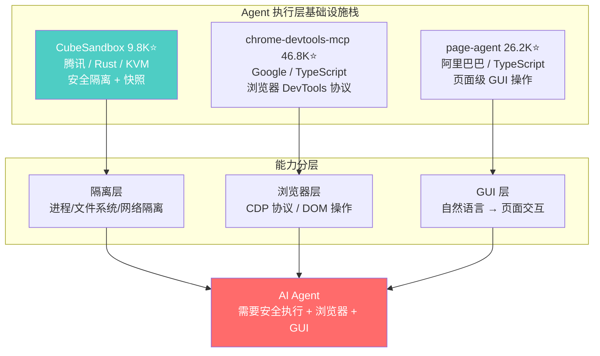
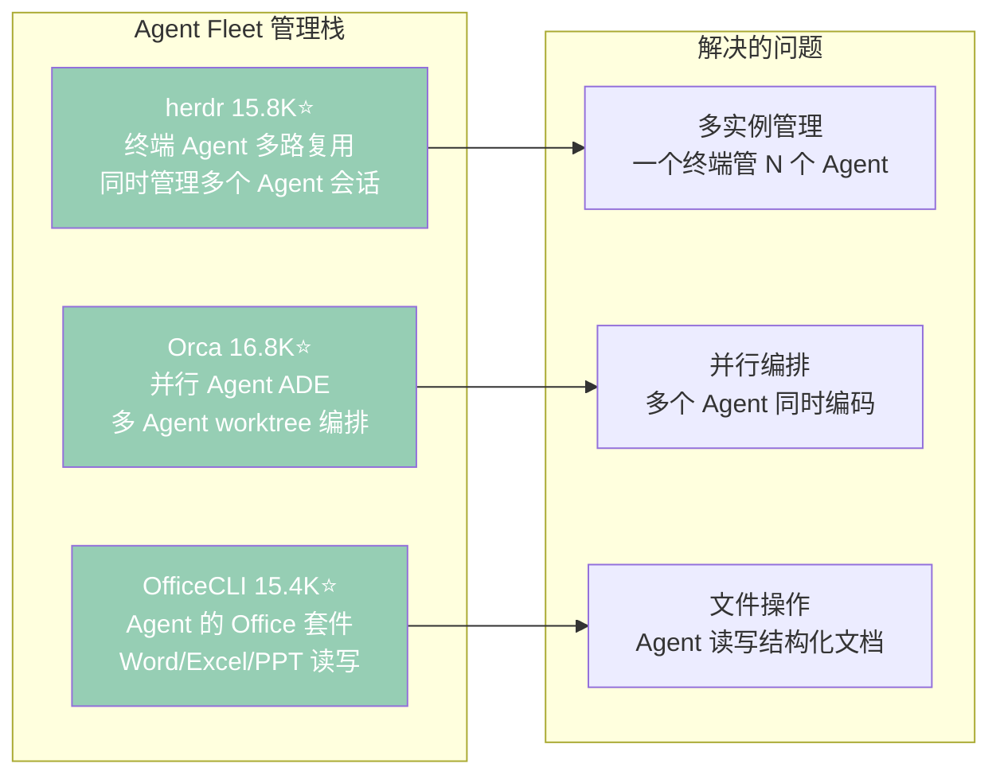

# 2026-07-13 GitHub 趋势研究简报

## 今日核心判断

今天是 2026 年 7 月 13 日，周日。本周 GitHub Trending 呈现以下关键信号：

1. **Agent 基础设施栈正在收敛为标准组件**——CubeSandbox（沙箱执行）+ chrome-devtools-mcp（浏览器控制）+ page-agent（页面 GUI 操作）三者形成 Agent 执行层完整栈。CubeSandbox 9.8K⭐ 腾讯出品、Rust 实现、KVM 虚拟化、E2B 兼容，已经具备生产级 Agent 沙箱的所有要素。这不是实验项目——这是 Agent 安全隔离的标准化方案

2. **本地优先 AI 应用进入爆发期**——Meetily 23.5K⭐ 周增 8.6K 登顶 Trending。纯 Rust 实现、Whisper/Parakeet 实时转录、说话人分离、Ollama 本地摘要、100% 本地处理。隐私法规收紧（GDPR/CCPA 执法加严）+ 本地模型成熟（Ollama 176K⭐ 支持 GLM-5.1/Kimi-K2.6）= 本地优先从理念变为可交付产品

3. **Agent Fleet 管理赛道成型**——herdr（终端 Agent 多路复用）+ Orca（并行 Agent ADE）+ OfficeCLI（Agent 的 Office 套件），分别解决 Agent 的多实例管理、并行编排和文件操作问题。当 Agent 从单次对话走向多实例持续运行时，Fleet 管理成为刚需

## 趋势深度分析

### 🏆 趋势 1：Agent 沙箱基础设施收敛（执行层标准化）

**关键判断**：Agent 执行层正在重演云计算的 PaaS 标准化过程。CubeSandbox 对标 Firecracker（AWS Lambda 的沙箱），chrome-devtools-mcp 对标 Selenium WebDriver，page-agent 对标 Playwright。当这三层都有成熟方案时，Agent 执行层的标准化基本完成。

**对架构师的启发**：如果你的 Agent 需要执行代码、操作浏览器、操控 GUI，现在不需要自己造轮子。CubeSandbox 提供 KVM 级隔离，chrome-devtools-mcp 提供标准 CDP 协议，page-agent 提供自然语言到 GUI 的桥接。关键是设计好三层之间的权限边界。

### 🏆 趋势 2：本地优先 AI 应用爆发

Meetily 的核心数据：
- **23,536 stars**，周增 **8,579**（+57%）
- **Rust** 实现，100% 本地处理，无需云端
- **Parakeet/Whisper** 实时转录，速度是 Whisper 的 4 倍
- **Ollama** 本地摘要生成
- 支持 macOS 和 Windows

**为什么现在爆发**：
1. 隐私法规收紧——GDPR 罚款累计超 50 亿欧元，企业会议录音上云风险极高
2. 本地模型质量达标——Whisper Large-v3 + Ollama GLM-5.1 的转录+摘要质量已超过云端方案
3. Rust 音频处理成熟——从 inference 引擎到音频 I/O 全链路 Rust，延迟低于 200ms
4. 消费级硬件够用——M3 Pro 16GB 即可实时转录+摘要

**赛道判断**：本地优先 AI 不是"反云"运动，而是 AI 应用的第二增长曲线。云端 AI 解决了"能不能做"的问题，本地 AI 解决了"敢不敢用"的问题。会议、医疗、法律等隐私敏感场景，本地优先是唯一选择。

### 🏆 趋势 3：Agent Fleet 管理赛道成型

三者合计 **48K stars**，周增合计 **15.2K**。Agent 管理工具的增速已经超过 Agent 本身的增速——这意味着 Agent 已经从"试验性使用"进入"规模化部署"阶段。

### 📊 趋势 4：AI 网关功能叠加

OmniRoute 16.2K⭐ 周增 4.4K，已从单纯的 API 代理演进为：
- 231+ provider 接入（50+ 免费）
- RTK+Caveman 堆叠压缩（省 15-95% token）
- 智能自动 fallback
- MCP/A2A 协议支持
- 桌面端 + PWA

**判断**：AI 网关正在变成 Agent 的"API Gateway + CDN + WAF"三合一。这个赛道的终局可能不是独立的 gateway 项目，而是被 Agent 平台（如 Claude Code、Cursor）原生集成。

### 📊 趋势 5：System Prompt 泄露与 Agent 安全

system_prompts_leaks 56.7K⭐ 周增 7.7K，收集了主流 AI 产品的 system prompt：
- Anthropic: Claude Fable 5, Opus 4.8, Claude Code, Claude Design
- OpenAI: ChatGPT GPT-5.6, Codex GPT-5.6, GPT-5.5
- Google: Gemini 3.5 Flash, 3.1 Pro, Antigravity
- xAI: Grok
- Cursor, Copilot, VS Code, Perplexity

**安全视角**：这不只是"窥探"——它是 Agent 安全攻击面映射。知道 system prompt 就能设计更精准的 prompt injection。对于部署 Agent 的团队来说，这个仓库是红队演练的宝贵资源。

## 重点项目深度分析

### 1. Meetily — 隐私优先的 AI 会议助手

| 维度 | 评分 | 理由 |
|------|------|------|
| 热度质量 | 9 | 23.5K⭐ + 周增 8.6K，登顶 Trending，增速真实 |
| 技术创新度 | 7 | Rust 全栈 + Parakeet/Whisper 不是新概念，但工程完成度高 |
| 工程成熟度 | 8 | macOS+Windows 双平台、实时转录延迟 <200ms、Ollama 集成完整 |
| 架构启发价值 | 8 | 证明本地优先 AI 应用的可行路径——Rust 全栈 + 开源模型 |
| 企业落地潜力 | 8 | 会议场景刚需，隐私法规驱动，无需云端部署 |
| 中期趋势概率 | 8 | 本地优先是 AI 应用的第二增长曲线 |
| 平台化潜力 | 6 | 会议是入口，但平台化需要更多场景 |
| 基础设施潜力 | 5 | 应用层产品，不涉及基础设施 |

**总分：61/80**
**归类：工具型（高质量，有明确场景）**
**建议持续跟踪：是**

### 2. CubeSandbox — Agent 安全沙箱

| 维度 | 评分 | 理由 |
|------|------|------|
| 热度质量 | 8 | 9.8K⭐ 周增 2.4K，腾讯背书，稳定增长 |
| 技术创新度 | 8 | KVM + E2B 兼容 + 凭据保险箱 + Snapshot，技术栈完整 |
| 工程成熟度 | 9 | Rust 实现、腾讯生产环境验证、E2B API 兼容 |
| 架构启发价值 | 9 | Agent 沙箱是 Agent 基础设施的必选项 |
| 企业落地潜力 | 9 | Agent 安全隔离是企业部署的硬需求 |
| 中期趋势概率 | 9 | Agent 沙箱标准化是必然趋势 |
| 平台化潜力 | 7 | 可以作为 Agent 平台的底层隔离层 |
| 基础设施潜力 | 9 | 这就是基础设施——Agent 执行环境的安全底座 |

**总分：68/80**
**归类：基础设施候选**
**建议持续跟踪：是（重点）**

### 3. OfficeCLI — Agent 的 Office 套件

| 维度 | 评分 | 理由 |
|------|------|------|
| 热度质量 | 9 | 15.4K⭐ 周增 6.5K（Trending 前 5），增速极快 |
| 技术创新度 | 7 | Office 文件操作不是新概念，但为 Agent 优化+单二进制是工程创新 |
| 工程成熟度 | 8 | 单二进制、无需 Office 安装、C# 实现、跨平台 |
| 架构启发价值 | 7 | Agent 操作结构化文档是刚需，从 CLI 角度切入有创意 |
| 企业落地潜力 | 8 | 企业场景大量 Office 文件，Agent 自动化处理价值高 |
| 中期趋势概率 | 7 | Agent 的文档操作能力会持续被需要 |
| 平台化潜力 | 5 | 工具属性强，平台化需要更多文档格式支持 |
| 基础设施潜力 | 4 | 应用工具，不涉及基础设施 |

**总分：55/80**
**归类：工具型（实用、高增长）**
**建议持续跟踪：是**

## 本周 GitHub Trending Top 20 速览

| # | 项目 | Stars | 周增 | 语言 | 一句话定位 |
|---|------|-------|------|------|-----------|
| 1 | meetily | 23.5K | +8.6K | Rust | 隐私优先 AI 会议助手，100% 本地 |
| 2 | system_prompts_leaks | 56.7K | +7.7K | JS | 主流 AI system prompt 提取合集 |
| 3 | OfficeCLI | 15.4K | +6.5K | C# | Agent 专用 Office 读写套件 |
| 4 | caveman | 88.5K | +4.7K | JS | Claude Code token 压缩 Skill |
| 5 | strix | 40.8K | +5.0K | Python | AI 渗透测试工具 |
| 5 | claude-video | 7.8K | +4.4K | Python | 给 Claude 看视频的能力 |
| 7 | herdr | 15.8K | +4.3K | Rust | 终端 Agent 多路复用器 |
| 8 | orca | 16.8K | +4.4K | TS | 并行 Agent ADE |
| 9 | OmniRoute | 16.2K | +4.4K | TS | 免费 AI 网关 231+ provider |
| 10 | codex-plugin-cc | 28.0K | +4.0K | JS | Codex→Claude Code 插件 |
| 11 | RuView | 80.2K | +3.7K | Rust | WiFi 信号感知+生命体征监测 |
| 12 | page-agent | 26.2K | +3.3K | TS | 页面级 GUI Agent（阿里巴巴） |
| 13 | CubeSandbox | 9.8K | +2.4K | Rust | Agent 沙箱（腾讯） |
| 14 | astryx | 8.1K | +2.8K | TS | Agent-ready 设计系统（Meta） |
| 15 | impeccable | 45.9K | +2.3K | JS | AI 设计语言 |
| 16 | claude-skills | 22.4K | +2.3K | Python | 345 Claude Code Skills 合集 |
| 17 | chrome-devtools-mcp | 46.8K | +1.1K | TS | Chrome DevTools for Agent |
| 18 | DesktopCommanderMCP | 8.0K | +1.5K | TS | Claude 终端控制 MCP |
| 19 | pentagi | 20.1K | +1.8K | Go | 全自动 AI 渗透测试 |
| 20 | archify | 3.9K | +1.0K | JS | Agent 架构图生成 |

## 风险与机遇

### 机遇
- **本地优先 AI 应用赛道**正在复制 SaaS 的增长曲线，但起步更快（隐私法规倒逼）
- **Agent 基础设施标准化**意味着上层应用可以更快构建，降低 Agent 创业门槛
- **OfficeCLI 的爆发**说明 Agent 与传统企业软件（Office）的集成有巨大未被满足的需求

### 风险
- **system_prompts_leaks** 暴露了 Agent 安养的真实攻击面——如果你的 Agent 使用泄露的 system prompt，它就已经处于"已知弱点"状态
- **caveman 88.5K⭐** 的 token 压缩方法是否真正适合生产环境仍存疑——过度压缩可能丢失关键上下文
- **AI 网关赛道**（OmniRoute 等）如果被大厂原生集成，独立项目可能面临生存压力

## 重点项目档案

今日新增/更新的重点项目档案：
- 🆕 `projects/meetily.md` — 隐私优先 AI 会议助手
- 🆕 `projects/officecli.md` — Agent 专用 Office 套件
- 🔄 `projects/cubesandbox.md` — 更新（9.8K⭐，基础设施候选）
- 🔄 `projects/herdr.md` — 更新（15.8K⭐，Fleet 管理）
- 🔄 `projects/omniroute.md` — 更新（16.2K⭐，AI 网关）
- 🔄 `projects/stablyai-orca.md` — 更新（16.8K⭐，并行 ADE）
- 🔄 `projects/caveman.md` — 更新（88.5K⭐，token 压缩）
