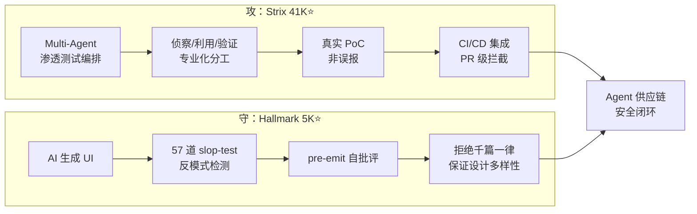

# 2026-07-14 GitHub 趋势研究简报

## 今日核心判断

今天是 2026 年 7 月 14 日，周一。GitHub Trending 释放出以下关键信号：

1. **Graphify 代表的代码知识图谱是对 RAG 的范式替代信号**——不是嵌入+相似度搜索，而是 tree-sitter AST 精确解析+图遍历。84.5K⭐ + 日增 1K，LOCOMO benchmark recall@10 达到 0.497（mem0 的 10 倍），且代码解析零 LLM 调用。这意味着 Agent 的代码理解能力可以从"概率猜测"跃迁到"精确遍历"，对 Coding Agent 架构产生深远影响

2. **AI 安全赛道攻防双翼齐飞**——Strix（攻：AI 渗透测试 / Multi-Agent / 真实 PoC）41K⭐ + Hallmark（守：反 AI-slop 设计质量门禁）5K⭐。当 Agent 可以自主执行安全测试并生成可验证的 PoC，当 AI 生成代码的质量可以被 57 道门禁自动拦截，Agent 供应链的"开发-测试-部署"安全闭环正在成型

3. **OpenCut 的 MCP Server 是 Agent 创作基础设施的里程碑**——66K⭐ 的开源视频编辑器正在 Rust 重写，核心亮点不是"替代 CapCut"，而是内建 MCP Server + Headless 批渲染 + 脚本化编辑。这意味着 Agent 可以通过 MCP 协议直接编排视频生产流水线，创作工具正在从"人用手操作"变为"Agent 用 API 驱动"

## 趋势深度分析

### 🏆 趋势 1：代码知识图谱——Agent 上下文理解的范式跃迁（Graphify 84.5K⭐）

```mermaid
graph TD
    subgraph "传统 RAG 路径（概率性）"
        A1["代码文件"] --> A2["Chunking"]
        A2 --> A3["Embedding"]
        A3 --> A4["Vector Store"]
        A4 --> A5["相似度搜索"]
        A5 --> A6["Top-K 片段"]
        A6 --> A7["LLM 生成答案"]
    end

    subgraph "Graphify 路径（确定性）"
        B1["代码文件"] --> B2["tree-sitter AST"]
        B2 --> B3["符号提取"]
        B3 --> B4["跨文件边解析<br/>calls/imports/inherits"]
        B4 --> B5["知识图谱<br/>graph.json"]
        B5 --> B6["图遍历查询<br/>explain/path/query"]
        B6 --> B7["精确答案 + 边标注"]
    end

    style A4 fill:#fcc
    style B5 fill:#cfc
    style B7 fill:#cfc
```

**关键对比：**

| 维度 | 传统 RAG | Graphify |
|------|----------|----------|
| 索引方式 | Chunk + Embedding | tree-sitter AST 精确解析 |
| 查询方式 | 相似度搜索 | 图遍历（explain/path/query） |
| LLM 依赖 | 全程依赖 | 代码解析零调用 |
| 结果可解释性 | 黑盒 | EXTRACTED vs INFERRED 标注 |
| 跨语言支持 | 受限 | 40+ 语言 |
| LOCOMO recall@10 | mem0: 0.048 | 0.497（10x 提升）|

**架构师判断：** Graphify 不是 RAG 的优化，而是范式替代。当 Agent 可以精确遍历代码知识图谱而不是猜测相似片段，Coding Agent 的准确率和可解释性将大幅提升。这对 Cursor、Claude Code、Copilot 等工具的上下文引擎构成直接竞争压力。

---

### 🏆 趋势 2：AI 安全攻防——Strix 41K⭐ + Hallmark 5K⭐

**Strix 的突破点：** 不是 SAST（静态分析）的 AI 包装，而是真正运行动态测试——Multi-Agent 分工侦察/利用/验证，每个漏洞都有可复现的 PoC。Docker 沙箱隔离 + CI/CD 集成意味着每次 PR 都可以触发安全测试。

**Hallmark 的突破点：** 不是"设计模板库"，而是"质量门禁"——57 道反 AI-slop 检测 + pre-emit 自批评，强制 AI 生成的 UI 产生设计多样性。支持 study 模式（从截图提取设计 DNA），这是设计领域的 RAG/CAG。

---

### 🏆 趋势 3：Agent 原生创作工具——OpenCut 66K⭐

OpenCut 正在从"开源视频编辑器"进化为"Agent 创作基础设施"：

- **Rust 核心重写**：跨平台单代码库（桌面/移动/浏览器）
- **插件优先架构**：第三方插件一等公民
- **MCP Server**：Agent 可直接调用视频编辑能力
- **Headless 模式**：自动化、批量渲染
- **脚本化编辑**：编辑器内建脚本面板

**架构启发：** 当创作工具内建 MCP Server，意味着视频生产可以从"人在 GUI 里操作"变为"Agent 通过协议驱动"。批量生成、个性化定制、模板化生产的成本将趋近于零。

---

### 趋势 4：AI 交易 Agent 多市场覆盖

Vibe-Trading 21.6K⭐（日增 1.1K）的关键进化：
- 多市场覆盖：美股 + 港股 + A股 + 印度 NSE/BSE
- 多 LLM Provider：OpenAI/Claude/Kimi/GLM/Codex
- 460 个 Alpha 因子（含 SEC 基本面因子）
- Swarm 模式：多 Agent 辩论决策
- Docker 一键部署

**风险提示：** 交易 Agent 是"后果不可逆"场景，Agent 决策的可解释性和风控机制比收益率更重要。

---

### 趋势 5：Agent Skill 生态——从提示词到能力包

Agent Skill 正在形成独立生态层：

| Skill | Stars | 定位 |
|-------|-------|------|
| Graphify | 84.5K | 代码理解 Skill |
| marketingskills | 38.5K | 营销 Skills 包 |
| Hallmark | 5K | 设计质量 Skill |
| archify | 4.2K | 架构图 Skill |

Skill 不再是"提示词模板"，而是带有工具链、检测逻辑、输出规范的完整能力包。Skill 商店形态初现——类似 Chrome 扩展生态的早期。

---

## 今日 Trending 速览

### 日榜 Top 10

| 排名 | 项目 | 语言 | Stars | 日增 | 一句话 |
|------|------|------|-------|------|--------|
| 1 | OpenCut-app/OpenCut | TypeScript | 66K | +1,077 | 开源 CapCut 替代，Rust 重写 |
| 2 | HKUDS/Vibe-Trading | Python | 21.7K | +1,148 | 个人交易 Agent，多市场覆盖 |
| 3 | Graphify-Labs/graphify | Python | 84.6K | +1,028 | 代码知识图谱 Skill |
| 4 | Nutlope/hallmark | CSS | 5K | +802 | 反 AI-slop 设计 Skill |
| 5 | coreyhaines31/marketingskills | JavaScript | 38.5K | +260 | 营销 Skills for Agent |
| 6 | moeru-ai/airi | TypeScript | 41.8K | +57 | 自托管 AI 伴侣 |
| 7 | Raphire/Win11Debloat | PowerShell | 50.8K | +74 | Windows 去臃肿脚本 |
| 8 | github/spec-kit | - | - | - | Spec 驱动开发工具包 |
| 9 | OpenCut-app/OpenCut | TypeScript | 66K | +1,077 | （重复确认热度）|
| 10 | tt-a1i/archify | JavaScript | 4.2K | - | Agent 架构图生成 Skill |

### 周榜关键项目

| 项目 | Stars | 周增 | 趋势 |
|------|-------|------|------|
| Meetily | 24.1K | +7,440 | 本地优先 AI 会议助手（持续）|
| system_prompts_leaks | 57.3K | +7,155 | System Prompt 安全研究 |
| OmniRoute | 16.8K | +4,506 | AI 网关（231+ provider）|
| RuView | 80.5K | +3,763 | WiFi 感知（持续）|
| OfficeCLI | 16.1K | +6,978 | Agent Office 套件 |
| openai/codex-plugin-cc | 28.4K | +2,803 | Codex ↔ Claude Code |
| Orca | 18.1K | +4,481 | 并行 Agent ADE |
| Strix | 41.2K | +4,143 | AI 渗透测试 |

---

## 风险与机遇

### 机遇
- **Graphify 的图遍历方法可能成为 Agent 上下文管理的新标准**——优于 RAG，且零 LLM 调用
- **Agent Skill 生态正在形成独立分发渠道**——Skill 商店是下一个平台机会
- **创作工具 + MCP = Agent 原生创作流水线**——OpenCut 的 MCP Server 是早期信号
- **安全 Agent 的 Multi-Agent 编排模式可复用到其他领域**——Strix 的侦察/利用/验证分工模式

### 风险
- **交易 Agent 的真实可盈利性存疑**——回测表现 ≠ 实盘表现，市场 regime 切换会失效
- **Skill 生态碎片化风险**——每个 Skill 有自己的安装方式和依赖，缺乏统一标准
- **OpenCut 重写期间无法接受外部贡献**——架构尚未稳定，社区热情可能流失

---

## 重点项目档案

今日新增 3 个项目档案、更新 3 个已有档案，详见 projects/ 目录。

| 项目 | 操作 | 分类 | 评分 |
|------|------|------|------|
| Graphify-Labs/graphify | 更新 | 平台候选 | 92 |
| OpenCut-app/OpenCut | 新增 | 平台候选 | 85 |
| Nutlope/hallmark | 新增 | 工具型 | 78 |
| HKUDS/Vibe-Trading | 新增 | 工具型 | 80 |
| usestrix/strix | 更新 | 工具型 | 85 |
| stablyai/orca | 更新 | 平台候选 | 84 |
