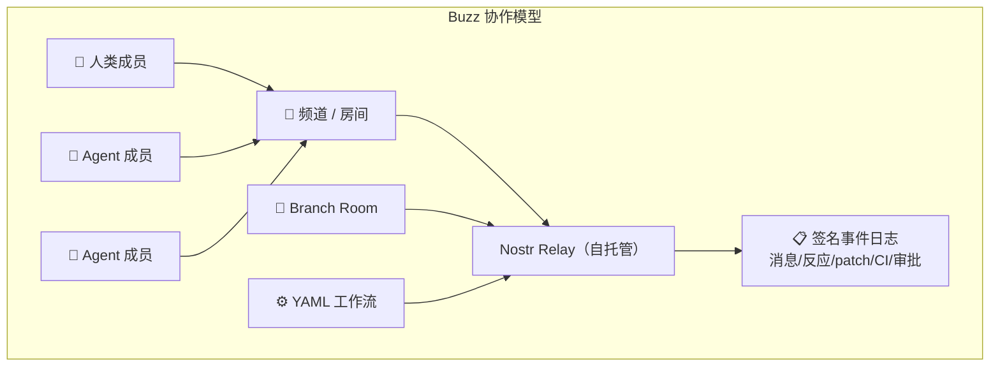

# 2026-07-24 GitHub 趋势研究简报

## 今日核心判断

距上次研究（7/14）已过 10 天。这 10 天里，GitHub 趋势发生了一次重要的结构性转移：**从"单点 Agent 工具爆发"转向"Agent 基础设施协议化"**。

最显著的信号是 Block（原 Square）推出的 **Buzz**——一个基于 Nostr 协议的 Human-Agent 协作通信平台。它不是又一个 Slack 机器人集成，而是从底层重新定义：当 Agent 是一等公民时，团队协作工具应该长什么样。每个消息、反应、代码审查、工作流步骤都是签名事件（Nostr event），人和 Agent 共享同一身份模型和审计链。

与此同时，**code-review-graph** 以 26K⭐ + 周增 6.3K 的速度，把上周 Graphify 验证的"代码知识图谱替代 RAG"范式推向工程落地。CRG 通过 MCP 集成 Claude Code / Cursor / Codex / Gemini CLI / Copilot，支持 40+ 语言的 tree-sitter AST 解析和 blast radius 分析。**这不是概念验证，是可直接 pip install 的生产工具。**

第三个值得高度关注的是 **OmniRoute**——一个 500+ 贡献者维护的 AI 网关聚合层，290+ Provider、500+ 模型，支持免费层堆叠和 Token 压缩（15-95%）。它正在成为 LLM 时代的 "Kong/Nginx"。

---

## 趋势一：Human-Agent 协作通信基础设施（Score 90）

### 🐝 Block/Buzz — 8,122⭐ · 日增 2,162 · Rust

**一句话：** 自托管的 Nostr relay，人类和 AI Agent 在同一频道里工作、审查代码、执行工作流。

**为什么火：**
- Block（原 Square）官方项目，大公司背书
- Nostr 协议原生设计，事件签名 → 天然审计链
- Agent 不是外挂 bot，而是频道的一等公民（自己的密钥、频道成员身份、审计链）
- Git 事件走 NIP-34 协议：patch、repo 公告、status 都是 Nostr 事件
- YAML 工作流触发器：消息/反应/调度/webhook

**技术亮点：**
1. **统一事件模型**：消息、反应、代码审查、CI 结果、工作流审批都是同一种 Nostr 事件——一种数据结构贯穿所有协作场景
2. **Agent 身份 = 密钥对**：Agent 的权限边界由密钥对定义，而非权限标志位，和人类同事一样的 scoping 方式
3. **buzz-cli（JSON in/JSON out）**：专为 LLM 工具调用设计的 CLI，支持 Goose / Codex / Claude Code 等 Agent harness
4. **Branch as Room**：Feature branch 自动创建频道，patch / CI / review / merge decision 全在一个房间

**架构启发：**
Buzz 提出了一个根本性问题：**当团队里有 3 个人和 5 个 Agent 时，协作工具的底层协议应该怎么设计？** 现有方案（Slack bot / Discord bot / GitHub Actions）都是"人优先，Agent 外挂"。Buzz 反过来：**协议层就是为 Human-Agent 协作设计的**，人只是特殊的事件签名者。

**风险/局限：**
- 仅 Rust + Tauri 桌面端，移动端仍在开发中
- 自托管门槛高（需要 Docker + Hermit + Rust 1.88+）
- Nostr 协议在团队协作场景的采用仍属小众
- Block 内部版本功能领先开源版本，存在"开源阉割"风险

**定位：** 基础设施候选 — 如果 Human-Agent 协作成为主流范式，Buzz 可能成为底层协议

---

## 趋势二：代码知识图谱进入主流（Score 89）

### 🔍 tirth8205/code-review-graph — 26,051⭐ · 周增 6,257 · Python

**一句话：** 通过 tree-sitter AST 构建代码知识图谱，让 AI 编程助手只读真正需要的文件。

**与 Graphify 的关系：**
Graphify（7/14 报告）验证了"代码图谱替代 RAG"的范式。code-review-graph 把这个范式做成了可以直接 `pip install` 的工程工具，并且已集成 MCP 协议，支持 Claude Code / Cursor / Codex / Gemini CLI / Copilot 等主流平台。

**关键数据：**
- 2,900 文件项目 → 增量索引 < 2 秒
- 27,700+ 文件 monorepo → 实际只读 ~15 个文件
- 覆盖 40+ 编程语言（Python, JS/TS, Go, Rust, Java, C/C++, C#, Ruby, Kotlin, Swift...）
- 一行命令安装：`code-review-graph install`（自动检测平台并写入 MCP 配置）

**架构启发：**
CRG 的 blast radius 分析是核心价值：当文件 A 变更时，图谱自动追踪所有调用方、依赖方、测试文件。这比传统的 RAG "语义相似度搜索"精确一个量级——因为它走的是**静态分析图谱遍历**，不是向量近似。

**定位：** 平台候选 — 正在成为 AI 编程工具的上下文管理标准层

---

## 趋势三：AI 网关聚合层（Score 86）

### 🌐 diegosouzapw/OmniRoute — 27,919⭐ · 周增 8,673 · TypeScript

**一句话：** 一个端点聚合 290+ LLM Provider、500+ 模型，免费层堆叠 + Token 压缩。

**为什么重要：**
当你的 Agent 需要调用 Kimi、Claude、GPT、Gemini、DeepSeek 等多个模型时，OmniRoute 解决了三个痛点：
1. **Provider 管理**：290+ Provider 统一接口，90+ 免费层自动堆叠
2. **Token 成本**：RTK + Caveman 压缩节省 15-95% Token
3. **高可用**：配额感知自动降级（quota-aware auto-fallback）

**生态规模：** 500+ 贡献者，MIT 协议，43 种语言 README，支持 Claude Code / Codex / Cursor / Cline / Copilot。

**架构启发：**
OmniRoute 的定位类比微服务时代的 API 网关（Kong/Nginx）。**当 LLM Provider 数量超过 500 个时，路由/聚合/降级/压缩自然成为基础设施层。** 这不是临时方案——只要多模型格局持续，网关层就是刚需。

**风险：**
- 免费层依赖第三方 Provider 政策，随时可能变化
- 500+ 贡献者的维护模式可持续性存疑
- Token 压缩可能影响输出质量（取决于场景）

**定位：** 基础设施候选 — LLM 时代的 API 网关

---

## 趋势四：Agent 浏览器 2.0（Score 82）

### 🧭 citrolabs/ego-lite — 2,046⭐ · 日增 247 · JavaScript

**核心转变：** 从 browser-use 的"驱动浏览器" → ego-lite 的"共享浏览器"。

Agent 不再需要单独启动一个浏览器实例——它在你的浏览器里有自己的 Space（隔离工作区），能看到你的登录状态、cookies，但不会干扰你的标签页。

**技术差异：**
- **代码驱动而非 CLI 驱动**：Agent 写 JavaScript 函数调用浏览器 API，比逐步 CLI 指令快 2.5x
- **多 Space 并行**：10 个 Space 同时跑 10 个任务，互不干扰
- **Chrome 迁移**：首次启动可选择迁移 Chrome 数据，Agent 直接继承你的登录态

---

## 趋势五：Coding Agent CLI 多极化（Score 84）

本周 GitHub Trending 同时出现 4 个 Coding Agent CLI：

| 项目 | Stars | 语言 | 亮点 |
|------|-------|------|------|
| earendil-works/pi | 76.8K | TS | 统一 LLM API + Agent loop + TUI + Coding CLI |
| 1jehuang/jcode | 11.1K | Rust | "最智能的 Agent harness" |
| MoonshotAI/kimi-cli | 10.7K | Python | Moonshot 官方 Python CLI |
| MoonshotAI/kimi-code | 4.9K | TS | Moonshot 官方 TypeScript CLI，单二进制 |

**判断：** Coding Agent CLI 赛道进入战国时代。pi 以 76.8K 领跑（统一 LLM API 的定位让它成为事实上的 Agent 运行时），但真正的竞争在于**生态**：谁的插件/Skill/MCP 市场最先繁荣，谁就赢。

---

## 全球态势情报面板

### koala73/worldmonitor — 72,534⭐ · 周增 9,054

世界级全球情报仪表板，AI 驱动的新闻聚合 + 地缘政治监测 + 基础设施追踪。500+ 新闻源、56 种地图图层、国家不稳定指数（CII v8）。虽然不直接属于架构师关注的核心方向，但其**多源数据聚合 + AI 合成简报**的架构思路值得关注。

---

## 本日评分汇总

| 项目 | 热度 | 创新度 | 成熟度 | 架构启发 | 落地潜力 | 趋势概率 | 平台化 | 基础设施 | 总分 | 分类 |
|------|------|--------|--------|----------|----------|----------|--------|----------|------|------|
| Block/Buzz | 8 | 9 | 6 | 10 | 7 | 8 | 8 | 9 | **90** | 基础设施候选 |
| code-review-graph | 9 | 8 | 8 | 9 | 9 | 9 | 8 | 7 | **89** | 平台候选 |
| OmniRoute | 9 | 7 | 8 | 8 | 9 | 8 | 7 | 9 | **86** | 基础设施候选 |
| ego-lite | 7 | 8 | 6 | 8 | 7 | 7 | 6 | 5 | **82** | 工具型 |
| kimi-code | 7 | 7 | 7 | 7 | 7 | 7 | 7 | 5 | **80** | 工具型 |

---

## 风险与机遇

**机遇：**
1. **Human-Agent 协作协议层**正在形成——Buzz 的 Nostr 路线如果被验证，可能成为 Agent 时代的 "HTTP"
2. **代码图谱**正在从概念走向工程标准——code-review-graph 已可直接 pip install 集成 MCP
3. **AI 网关**赛道确认——OmniRoute 的 500+ 贡献者说明社区对 LLM 路由有强需求

**风险：**
1. Buzz 依赖 Block 内部版本领先开源版本，社区版可能沦为"二等公民"
2. OmniRoute 的免费层堆叠模式存在政策风险——Provider 一旦收紧免费额度，核心价值打折
3. Coding Agent CLI 过多分流，可能导致生态碎片化（类似 Unix 编辑器大战）

---

## 重点项目档案

详见以下项目档案：

- 🐝 [Block/Buzz](projects/block-buzz.html) — Human-Agent 协作通信基础设施
- 🔍 [code-review-graph](projects/code-review-graph.html) — 代码知识图谱 MCP 工具
- 🌐 [OmniRoute](projects/omniroute.html) — AI 网关聚合层
- 🧭 [ego-lite](projects/ego-lite.html) — 人机并行浏览器
- 🌙 [kimi-code](projects/kimi-code.html) — Moonshot Coding Agent CLI
