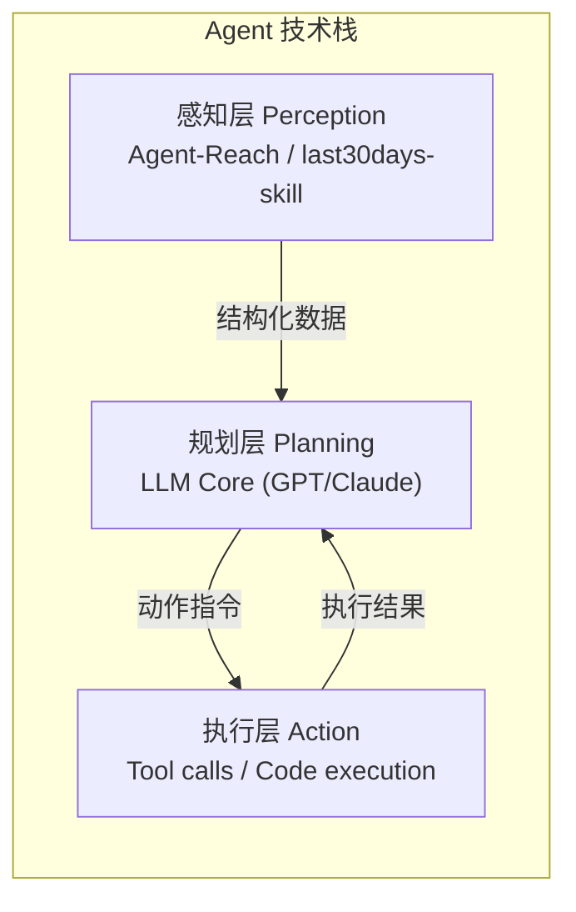

# Agent-Reach

## 一句话定位
AI Agent 的互联网感知层——一个 CLI 聚合 Twitter/Reddit/YouTube/GitHub/Bilibili/XiaoHongShu 等 7+ 平台数据，零 API 费用。

## 它解决的问题
AI Agent 需要访问多个社交和内容平台的数据来做判断，但：
- 官方 API 贵且覆盖不全
- 每个平台 API 协议不同，集成成本高
- 中文平台（Bilibili/XiaoHongShu）几乎无官方 API
- Agent 需要结构化数据，而非给人看的 HTML

Agent-Reach 用一个统一 CLI 解决了这些问题。

## 为什么值得关注（2026-06-27 更新）
GitHub Trending 持续在榜，42,263⭐（日增 1,164），从 6 月 14 日的 38K 增长到 42K+。更重要的是它代表了 Agent 技术栈中"感知层"的独立——类似自动驾驶中的感知模块，Agent 感知层正在从 Agent 核心中分离出来成为独立组件。

### 最近动态（2026-06-27）
- 平台覆盖扩展至 10+（新增 LinkedIn、V2EX、雪球、小宇宙播客）
- 多后端路由架构成熟——B站 yt-dlp 被风控封死后自动切换 bili-cli，用户零操作
- 新增 `agent-reach doctor` 自诊断系统
- 安全模式 `--safe` + Dry Run `--dry-run` 支持
- 设计理念明确为"能力层（capability layer）"定位

## 热度来源判断
- **真实需求驱动**：Agent 开发者确实需要多平台数据，这是刚需
- **零 API 费用**降低了使用门槛，与收费 API 形成鲜明对比
- **中文平台覆盖**（Bilibili/XiaoHongShu）打开了中文开发者市场
- **Claude Code / Cursor 生态红利**：作为 Agent skill 分发

## 关键技术亮点
1. **统一接口覆盖异构平台**：10+ 平台用同一 CLI 接口（Web/YouTube/Twitter/Reddit/B站/小红书/GitHub/LinkedIn/V2EX/雪球/RSS/小宇宙），输出统一格式
2. **多后端路由架构**：每个平台有"首选 + 备选"后端，某个失效自动切换（2026-06 实例：B站 yt-dlp 被风控 412 封死 → 切换 bili-cli，用户零操作）
3. **结构化输出**：直接产出 Agent 可消费的 JSON/Markdown，无需二次解析
4. **零 API 费用架构**：全部开源工具，零付费 API
5. **自诊断系统**：`agent-reach doctor` 一条命令告诉你每个渠道的状态、当前走哪条路
6. **能力层定位**：不负责底层读取本身，负责选型 + 安装 + 体检 + 路由

## 架构启发
Agent 技术栈正在分化出明确的"感知层"：
- 传统爬虫 → 给人看的数据
- Agent 感知层 → 给 Agent 消费的结构化数据

这一分层与自动驾驶架构类似：Perception → Planning → Action。Agent-Reach 占据的就是 Perception 层位置。

## 定位判断
- 基础设施候选：Agent 感知层的早期代表
- 偏向工具型 → 基础设施型的过渡产品
- 如果能加入缓存、调度、合规层，有成为 Agent 数据基础设施的潜力

## 风险 / 局限 / 泡沫点
1. ⚠️ **反爬风险（高）**：平台随时可能加强反爬，导致核心功能失效
2. ⚠️ **合规灰区**：大规模抓取可能违反平台 ToS，企业使用有法律风险
3. ⚠️ **数据质量不稳定**：无 API 保障的数据完整性和准确性
4. ⚠️ **可持续性疑问**：反爬与反反爬是长期军备竞赛，小团队难以持续投入

## 与同类项目的关系
- **vs last30days-skill（41K⭐）**：last30days 偏深度研究（30天聚合分析），Agent-Reach 偏广度爬取（实时多平台读取）。互补关系。
- **vs 传统爬虫框架（Scrapy/BeautifulSoup）**：面向 Agent 消费 vs 面向人类消费，目标用户不同。
- **vs 官方 API**：零成本 vs 合规保障，各有取舍。

## 是否值得持续跟踪
✅ 是。即使 Agent-Reach 本身受反爬限制，"Agent 感知层独立"这一趋势值得长期跟踪。

## 后续观察点
1. 反爬升级后的可用性变化——各平台封禁策略的响应
2. 是否引入合规层（如 API fallback、速率限制、ToS 检查）
3. 企业采用案例——是否有公司在生产环境使用
4. 是否有商业 API 产品从该项目孵化

---
*首次记录：2026-06-14*
*最近更新：2026-06-27 — stars 更新至 42K，平台扩展至 10+，多后端路由成熟，新增安全模式*
