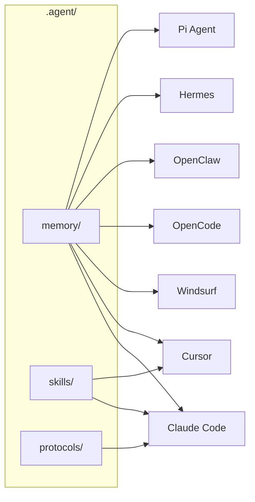

# agentic-stack — Agent 可移植性层

## 一句话定位

Portable `.agent/` folder，一份记忆和技能跨 Claude Code / Cursor / Windsurf / OpenCode / OpenClaw / Hermes / Pi 等所有主流 coding agent harness。

## 解决的问题

当前开发者同时使用多个 coding agent（Claude Code、Cursor、Codex 等），每个工具的 memory、skills、配置互不兼容。切换工具意味着丢失上下文、重新配置。agentic-stack 把记忆和技能从具体工具中抽离出来，形成可移植的 `.agent/` 目录。

## 为什么值得关注

- 多 harness 并用已经是开发者的真实工作模式
- 解决的是「工具锁定」这个平台经济层面的核心痛点
- brew 一行安装 + 自动适配，工程体验好
- 概念简洁，易于理解和传播

## 热度来源判断

492⭐，4/15 创建，6 天增长合理。话题切中 AI coding 社区当前最大的痛点之一——多工具切换的成本。Twitter 传播效应明显（@AV1DLIVE 推文驱动）。

## 关键技术亮点

- `.agent/` 目录结构：memory / skills / protocols 三层
- harness adapter 模式：对每个目标工具生成对应配置格式
- brew 分发 + PowerShell 安装器覆盖 macOS/Linux/Windows
- 支持 7+ 主流 harness

## 架构启发

核心启发：**Agent 的记忆应该独立于运行时**。这与数据库的「数据独立于应用」是同一个抽象层次。

## 定位判断

工具型，但有潜力成为 Agent 记忆的事实标准（如果主流 harness 选择兼容此格式）。短期是工具，中期可能是生态层。

## 风险/局限/泡沫点

- 无任何 harness 官方支持此格式，纯社区方案
- 多 harness 适配层的维护成本随工具版本更新增长
- 单人项目（@AV1DLIVE），长期可持续性存疑
- 492 星还不足以说明广泛采用

## 与同类项目的关系

- 与 cc-switch（跨 harness 切换工具）互补，cc-switch 切工具，agentic-stack 带记忆
- 与 claude-mem（Claude Code 记忆管理）有部分重叠，但更通用

## 是否值得持续跟踪

✅ 是。Agent 可移植性是中期刚需。

## 后续观察点

- 是否有主流 harness 选择兼容 .agent/ 格式
- 社区贡献者数量增长
- 是否形成跨工具的记忆标准化讨论
