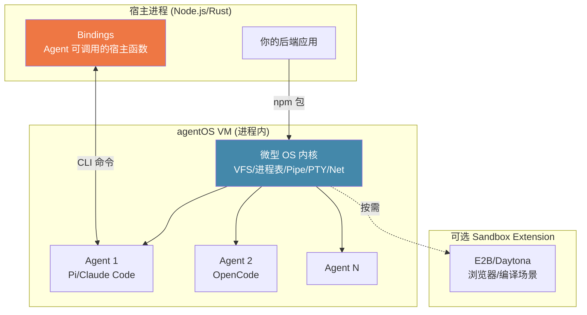

# agentOS

## 一句话定位
把 Agent 操作系统做成一个库——基于 WebAssembly + V8 Isolates，在进程内运行 Agent，无需 VM/容器/SaaS，6ms 冷启动。

## 它解决的问题
当前 Agent 后端部署的主流模式是 Sandbox-as-a-Service（E2B、Daytona）或自建容器池。每个 Agent 一个容器/VM 带来三个问题：(1) 冷启动慢（数百毫秒到数秒），(2) 内存开销大（每个容器至少 1GB），(3) 网络跳增加延迟。对于需要大规模、低延迟、细粒度控制 Agent 执行的后端来说，容器-per-agent 不是正确的抽象粒度。

## 为什么值得关注（2026-07-24）
Rust 实现，Apache 2.0，由 Rivet（游戏后端基础设施公司）开发。冷启动 p50 4.8ms（E2B 的 1/92），完整 Agent 内存 ~131MB（Daytona 的 1/8）。提供 npm 包，一行代码嵌入现有后端。

## 热度来源判断
- **Rivet 团队背景**：Rivet 做游戏后端基础设施，对低延迟、高并发有深度经验
- **WebAssembly 方案成熟**：Cloudflare Workers 已证明 V8 Isolates 在生产环境可行
- **成本叙事有吸引力**：比 Daytona 便宜 32x（Hetzner ARM 上 17x）
- **ACP 支持**：内置 Pi、Claude Code、OpenCode Agent，统一 API
- **npm 生态友好**：只是一个 npm 包，不需要改造部署基础设施

## 关键技术亮点
1. **进程内 VM**：在进程内运行一个微型 OS 内核——虚拟文件系统、进程表、管道、PTY、虚拟网络栈。Agent 在 VM 内执行，宿主机完全隔离
2. **WebAssembly + V8 Isolates**：与 Cloudflare Workers 同源技术。每个 Agent 是一个 V8 Isolate，启动代价极低
3. **Bindings**：Agent 可通过 VM 内的 CLI 命令直接调用宿主函数，无需网络跳。定义 JavaScript 函数 → Agent 在 VM 内作为命令调用
4. **可组合存储**：S3 兼容存储、Google Drive、宿主目录、overlay 文件系统、自定义后端都可作为虚拟文件系统挂载
5. **Deny-by-default 权限**：文件系统、网络、进程、环境变量全部默认拒绝，精细化控制
6. **Sandbox Extension**：需要浏览器/原生编译时，按需启动 E2B/Daytona 全 Sandbox，挂载文件系统
7. **Cron + Webhooks + Workflows**：内置定时任务、外部事件接收、可恢复的工作流编排

## 架构启发

**核心 insight：** Agent 运行时不一定需要容器。WebAssembly + V8 Isolates 提供了"足够好的隔离"和"足够好的性能"的平衡点。对于不需要完整 Linux 环境的 Agent 工作负载（代码生成、数据处理、API 调用），进程内 VM 是更高效的部署模式。

## 定位判断
基础设施候选。如果 In-Process Agent 模式被验证，agentOS 可能成为 Agent 后端的标准运行时——就像 V8 之于 Node.js 后端。但需验证在复杂工作负载（需要浏览器、原生编译）下的表现。

## 风险 / 局限 / 泡沫点
1. **V8 Isolates 隔离强度**：V8 Isolates 的安全性依赖 V8 引擎自身的沙箱能力。对于运行不可信代码的场景，隔离强度不如 KVM/Firecracker
2. **生态初期**：4K stars，registry 中包数量有限，社区采纳规模小
3. **复杂工作负载回退**：浏览器自动化、原生编译、大型二进制运行仍需 Sandbox Extension，引入额外复杂度
4. **Rivet 绑定**：与 Rivet Cloud 生态有一定绑定，需确认开源版本的独立性
5. **Node.js 依赖**：虽然 VM 是 Rust 实现，但 SDK 层是 TypeScript/Node.js，对于非 JS 后端不够友好

## 与同类项目的关系
- **vs E2B**：E2B 是 Sandbox-as-a-Service，每个 Agent 一个容器。agentOS 是进程内 VM，快 92x，便宜 6x
- **vs Daytona**：Daytona 提供开源开发环境管理。agentOS 更轻量，内存开销低 47x（简单命令）
- **vs CubeSandbox（腾讯）**：CubeSandbox 基于 KVM，隔离更强但更重。agentOS 更适合轻量级 Agent 工作负载
- **vs Firecracker**：Firecracker 是 microVM（AWS Lambda 底层），隔离最强但启动慢（125ms）。agentOS 适合更低延迟场景

## 是否值得持续跟踪
**是。** In-Process Agent OS 是一个新的基础设施范式。如果 Agent 后端从"容器池"模式迁移到"进程内 VM"模式，agentOS 有先发优势。

## 后续观察点
1. 生产环境部署案例和稳定性报告
2. V8 Isolates 在运行不可信/半不可信代码时的安全事件
3. 非 JavaScript 后端 SDK（Python/Go/Rust）的推出
4. Sandbox Extension 的实际使用体验（浏览器/编译场景）
5. Registry 生态发展——第三方 Agent 和工具包数量

---
*首次记录：2026-07-24*
