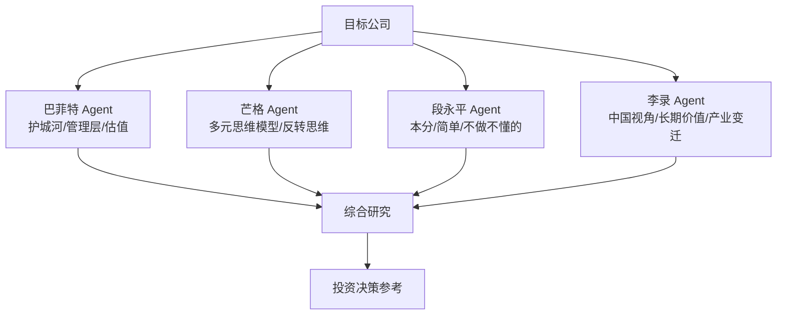

# ai-berkshire — AI 时代的伯克希尔：价值投资研究框架

## 一句话定位
基于 Claude Code / Codex 的价值投资研究框架，将巴菲特、芒格、段永平、李录四位投资大师的方法论编码为多 Agent 并行研究流程。

## 它解决的问题
**目标用户：** 个人投资者、投资研究员、量化分析师
**痛点：** 投资研究信息过载、单一视角偏差、研究效率低、大师方法论难以系统化应用

## 为什么值得关注（2026-06-29）
GitHub Trending 日增 1,456 stars（Python 榜 #2），代表了 AI Agent 在金融垂直领域的爆发。"AI 时代的伯克希尔"概念极具吸引力——不是简单的 AI 选股，而是将价值投资大师的思维方式结构化为 Agent 工作流。

## 热度来源判断
概念+时效双驱动。概念上，"AI+巴菲特"的叙事极具传播力；时效上，Claude Code / Codex 的普及让普通用户也能运行多 Agent 工作流。贡献者中有 Claude（AI 辅助开发），说明项目本身就是 AI Agent 时代的产物。

但需警惕泡沫风险：投资框架的"方法论编码"不等于投资能力，AI 生成的分析在真实市场中的有效性未经验证。

## 关键技术亮点
1. **四大师方法论并行研究**：巴菲特（护城河+管理层）、芒格（多元思维模型）、段永平（本分+简单）、李录（中国视角+长期价值）——每个大师作为独立 Agent 视角
2. **多 Agent 对抗分析**：不同大师视角交叉验证，减少单一偏见
3. **Claude Code / Codex 原生集成**：直接在 Coding Agent 环境中运行，降低使用门槛
4. **结构化输出**：研究报告而非简单的买卖信号

## 架构启发
"角色化多 Agent 对抗"模式值得学习：

这种模式可推广到其他需要"多视角分析"的场景：技术选型、竞品分析、架构决策。

## 定位判断
观察型。有创意的多 Agent 应用，但核心价值是"研究辅助"而非"交易系统"。距离生产级金融工具还有很大距离。

## 风险 / 局限 / 泡沫点
1. **投资方法论 ≠ 投资能力**：将大师理念编码为 Agent 工作流不等于复制了大师的投资能力
2. **回测偏差**：幸存者偏差+过拟合——大师方法论之所以流传是因为成功案例被记住
3. **监管风险**：AI 生成投资建议在多数司法管辖区需要牌照
4. **信息来源质量**：框架依赖公开信息，缺乏非公开数据的竞争优势
5. **市场非理性**：价值投资方法论在非理性市场（如 meme stock）中可能完全失效

## 与同类项目的关系
- **vs daily_stock_analysis（51K⭐）**：daily_stock 更偏技术面+数据驱动，ai-berkshire 更偏基本面+方法论驱动
- **vs TradingAgents**：TradingAgents 是多 Agent 交易框架（含执行层），ai-berkshire 是研究框架（不含执行）
- **vs Vibe-Trading（HKUDS）**：Vibe-Trading 是个人交易 Agent，更偏产品化

## 是否值得持续跟踪
**有限跟踪。** 作为"多 Agent 垂直应用"的案例研究跟踪其架构演进，但不建议作为投资工具使用。

## 后续观察点
1. 是否有实盘验证数据（即使是模拟盘的长期回测）
2. 多 Agent 对抗分析是否真的减少了偏见（还是只是平均值）
3. 是否扩展到更多投资风格（技术分析、量化、宏观）
4. 社区是否贡献更多大师方法论

---
*首次记录：2026-06-29*
