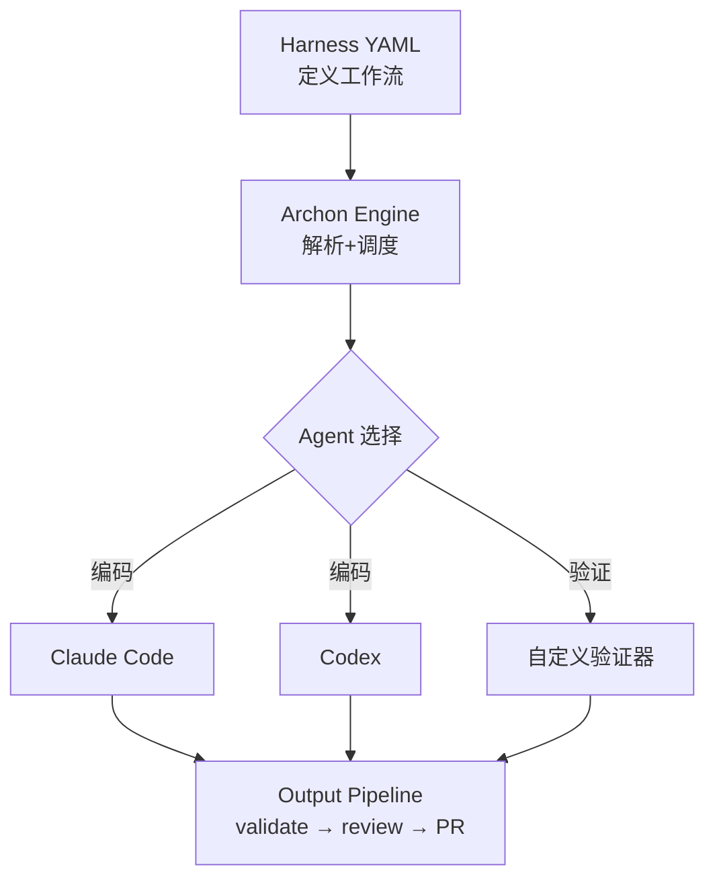

# Archon — 首个开源 AI Coding Harness Builder

## 一句话定位

用 YAML 工作流让 AI 编程可确定、可重复——Dockerfile 标准化了基础设施，GitHub Actions 标准化了 CI/CD，Archon 标准化了 AI 编程。

## 解决的问题

AI Coding Agent 的核心痛点不是能力不足，而是**输出不可控**。同一条 prompt 跑两次，结果可能天差地别。对企业而言，不可重复 = 不可信赖 = 不可用。

Archon 把开发流程编码为 YAML harness：plan → implement → validate → code review → PR creation。每次执行走同样的流程，产出可审计、可比较、可回溯。

## 为什么值得关注

1. **概念精准**：harness builder 的类比（Dockerfile / GitHub Actions / AI Coding）击中认知空白
2. **4 天 16K stars**：增速健康，多渠道热议
3. **多入口支持**：CLI / Web / Slack / Discord / GitHub——说明定位是团队工具
4. **V3 版本**：经过多次迭代，不是概念验证而是持续演进的产品
5. **支持 Claude Code + Codex**：覆盖主流 AI Coding Agent

## 热度来源判断

- 真实需求驱动：AI Coding 不确定性是开发者的普遍痛点
- 叙事驱动：harness 概念自带传播性
- 创作者影响力：coleam00 在 AI Coding 社区有知名度
- 社区验证：MapoDev、ByteIota、PyShine 等多渠道覆盖

## 关键技术亮点

### YAML 工作流引擎
```yaml
# 示例 harness 结构
harness:
  name: "feature-implementation"
  steps:
    - plan:
        agent: claude-code
        prompt: "分析需求并制定实现计划"
    - implement:
        agent: codex
        based_on: plan.output
    - validate:
        command: "npm test"
    - review:
        agent: claude-code
        focus: "代码质量、安全漏洞"
    - pr:
        auto_create: true
```

### 多入口执行
- CLI：本地开发
- Web UI：可视化操作
- Slack/Discord：团队协作
- GitHub：CI/CD 集成

### 架构设计


## 架构启发

1. **确定性封装模式**：对非确定性系统（LLM）用确定性框架（YAML 工作流）封装，是工程化的正确思路
2. **分离关注点**：harness 只管流程，Agent 只管执行——职责清晰
3. **多入口统一执行**：同一个 harness 可以从不同入口触发，说明核心引擎设计合理

## 定位判断

**平台候选**。如果 harness 概念被广泛接受，Archon 有潜力成为 AI Coding 工作流的事实标准层。类似于 GitHub Actions 之于 CI/CD。

## 风险/局限/泡沫点

1. **LLM 不确定性是根本性的**：harness 可以约束流程，但不能约束 LLM 输出。对"可确定性"的承诺可能过高
2. **YAML 复杂度膨胀**：真实开发流程远比 plan→implement→validate 复杂，YAML 可能很快变得难以维护
3. **Agent 绑定风险**：目前深度绑定 Claude Code 和 Codex，模型切换成本可能较高
4. **竞品风险**：harness 概念容易被复制，护城河不深

## 与同类项目的关系

- **vs Superpowers**：Superpowers 侧重技能（Skill），Archon 侧重流程（Harness）。互补而非竞争。
- **vs oh-my-codex**：oh-my-codex 是 Agent 增强框架，Archon 是工作流引擎。不同层。
- **vs agency-agents**：agency-agents 是 Agent 模板集合，Archon 是执行引擎。agency-agents 的 harness 可以用 Archon 来运行。

## 是否值得持续跟踪

**✅ 是**。Harness 工程是 AI Agent 工业化的关键环节，Archon 目前是这个赛道的领先者。

## 是否值得企业 PoC

**✅ 是**。如果团队正在使用 AI Coding Agent 且被不确定性困扰，Archon 提供了一个低成本的标准化尝试。

## 后续观察点

1. Harness 模板生态是否丰富——这将决定是否值得长期投入
2. 是否支持自定义 Agent（不限于 Claude Code/Codex）
3. 企业用户的真实反馈——尤其是"可确定性"是否真正提升
4. 竞品动态——OpenAI/Anthropic 是否可能推出类似功能
