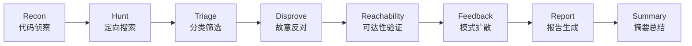

# audit

## 一句话定位
8 阶段漏洞发现 Agent，基于 Cloudflare Project Glasswing 论文，用多窄 Agent 并行 + 故意反对 + 可达性门控发现真实安全漏洞。

## 它解决的问题
目标用户：安全研究员、DevSecOps 团队。

痛点：
- 传统漏洞扫描（SAST/DAST）误报率高
- 单一大模型「找 bug」效果差 — 问题太宽泛，模型容易发散
- 大多数「发现」的漏洞实际上不可达（attacker-controlled input 无法到达 sink）
- 缺少系统化的多 Agent 安全审计方法

## 为什么值得关注（2026-05-23）
这是 Agent 在安全领域最正确的设计模式：不是一个大 Agent 啥都干，而是多个窄 Agent 各负责一个环节。特别是「故意反对」和「可达性门控」两个设计，直接解决了安全审计最核心的误报问题。

## 热度来源判断
433 stars / 5 天，由知名安全研究员 evilsocket 开发。热度来自：
- Cloudflare Project Glasswing 论文的完整实现（有理论背书）
- evilsocket 的个人品牌（goSecure、bettercap 等知名项目作者）
- Agent + 安全是当前热门交叉领域

不是泡沫 — 安全审计是真实需求，且设计有理论支撑。

## 关键技术亮点

### 1. 8 阶段流水线
Recon → Hunt → Triage → Disprove → Reachability → Feedback → Report → Summary。每个阶段由专门的 Agent 负责一个窄任务。

### 2. 故意反对（Disprove 阶段）
用不同模型（非发现漏洞的模型）尝试反驳第一个 Agent 的发现。这大幅降低了误报率。

### 3. 可达性门控（Reachability 阶段）
只保留攻击者可控输入能实际到达的漏洞。大多数「代码有 bug」的发现在这一步被过滤掉 — 因为攻击者根本无法触发。

### 4. 反馈循环（Feedback 阶段）
可达的漏洞自动触发同一模式的其他搜索。

### 5. 利用 Claude Agent SDK
直接利用 Claude Pro/Max 订阅，无需额外 API key。

## 架构启发
这展示了 Agent 在安全领域的最佳实践：

关键设计原则：
- **窄 Agent 优于宽 Agent**：每个 Agent 只做一件事
- **对抗验证**：用不同模型反驳，降低误报
- **可达性是最终门控**：不可达的漏洞等于不是漏洞

## 定位判断
**工具型。** 专用安全审计工具，不会成为平台或基础设施。但其设计模式（多窄 Agent + 对抗验证 + 可达性门控）可以被推广到其他领域。

## 风险 / 局限 / 泡沫点

1. **依赖 Claude Pro/Max**：需要付费订阅，不是完全免费
2. **仅支持 Claude**：目前只支持 Claude 模型，不支持其他 LLM
3. **速度**：8 阶段流水线对大型代码库可能很慢
4. **433 stars 仍很早期**：项目成熟度待验证

## 与同类项目的关系
| 项目 | 定位 | 核心差异 |
|------|------|---------|
| Snyk/SonarQube | 传统 SAST | 规则驱动，非 AI |
| GitHub Copilot Security | IDE 内安全建议 | 单模型单阶段 |
| audit | 多 Agent 安全审计 | 8 阶段 + 对抗验证 + 可达性门控 |

## 是否值得持续跟踪
**是，值得关注。** audit 展示了 Agent 在安全领域的正确使用模式，即使不直接使用，其架构设计值得学习和参考。

## 后续观察点
1. audit 在真实大型代码库中的效果和速度
2. 是否会添加对其他 LLM（如 GPT-5、Gemini）的支持
3. 社区是否会出现类似的多阶段安全 Agent 项目

---
*首次记录：2026-05-23*
