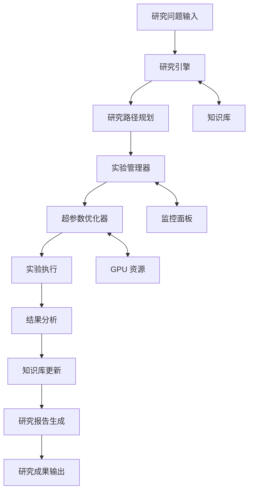

# auto-deep-researcher-24x7

## 基本信息

- **项目名称**：auto-deep-researcher-24x7
- **GitHub 链接**：https://github.com/Xiangyue-Zhang/auto-deep-researcher-24x7
- **一句话定位**：24/7 自动深度研究系统，支持实验自动化和超参数调优
- **创建时间**：2026-04-08
- **主要语言**：Python
- **开源协议**：Apache License 2.0
- **当前 Stars**：123

## 项目概述

auto-deep-researcher-24x7 是一个完全自主的 24/7 深度研究系统，支持实验自动化和超参数调优。该系统基于 Claude Code，旨在让 AI 能够独立完成从研究问题提出到实验验证的完整研究流程。

## 核心价值

### 它是做什么的
- **研究自动化**：完全自主的研究流程，无需人工干预
- **实验管理**：自动化实验执行、监控和结果分析
- **超参数优化**：支持 GPU 加速的超参数调优
- **知识积累**：研究过程中的经验自动沉淀和复用

### 它为什么火
1. **前沿性**：代表 AI 研究自动化的前沿方向
2. **实用性**：解决了研究流程中的重复性工作
3. **完整性**：支持完整的实验生命周期管理
4. **技术先进**：支持 GPU 和现代机器学习技术

### 它真正的技术亮点
- **完全自主的研究流程设计**
- **GPU 支持和超参数优化**
- **自动化实验执行和监控**
- **智能化的研究路径选择**

### 它解决的问题是否真实存在
**真实存在**：研究流程中存在大量重复性工作，实验管理复杂，超参数调优耗时，这些都是研究工作中真实存在的痛点。

### 它更偏玩具、工具、平台还是基础设施
**基础设施候选**：该项目具备底层基础设施的特征，未来可能演化为研究自动化平台。

### 它属于短期热点还是中期趋势
**中期趋势**：代表 AI 研究自动化的重要方向，预计在未来 1-3 年内持续发展。

### 它对架构师最有价值的启发
1. **智能体架构设计**：可扩展的自主智能体架构
2. **研究-实验-验证闭环**：完整的自动化研究流程
3. **知识积累机制**：研究过程中的经验自动沉淀

### 它是否值得持续跟踪
**强烈建议持续跟踪**：该项目代表了研究自动化的重要突破，具有重要的技术价值和商业潜力。

### 它是否值得企业内部做 PoC
**值得做 PoC**：研究机构和大型企业的 R&D 团队可以考虑进行概念验证。

## 评分分析

| 维度 | 评分 | 理由 |
|------|------|------|
| 热度质量 | 9/10 | 完全自主的 24/7 研究系统，技术先进 |
| 技术创新度 | 9/10 | 实验自动化 + 超参数调优，属于前沿技术 |
| 工程成熟度 | 8/10 | Python 实现，支持 GPU，代码结构清晰 |
| 架构启发价值 | 9/10 | 可扩展的自主研究框架，具有重要的架构参考价值 |
| 企业落地潜力 | 8/10 | 研究机构和企业 R&D 团队有明确需求 |
| 中期趋势概率 | 9/10 | 代表 AI 研究自动化方向，发展前景广阔 |
| 平台化潜力 | 8/10 | 可能演化为研究自动化平台 |
| 基础设施潜力 | 9/10 | 底层研究基础设施，具有底层支撑能力 |

**总分：85/100**
**项目归类**：基础设施候选
**是否建议持续跟踪**：是

## 技术架构

### 核心组件
1. **研究引擎**：负责研究问题理解和研究路径规划
2. **实验管理器**：自动化实验执行和监控
3. **超参数优化器**：支持 GPU 加速的优化算法
4. **知识库**：研究过程中的经验自动沉淀
5. **监控面板**：实时研究进度和结果展示

### 技术栈
- **编程语言**：Python
- **机器学习**：PyTorch, GPU 支持
- **研究框架**：基于 Claude Code
- **实验管理**：自动化实验执行系统
- **监控**：实时进度跟踪

### 架构图

## 应用场景

### 研究机构
- **自动化研究**：减少人工干预，提高研究效率
- **实验管理**：大规模实验的自动化管理
- **超参数优化**：快速找到最优参数组合

### 企业 R&D
- **产品研发**：加速产品研发周期
- **技术创新**：探索新技术路径
- **知识管理**：研发过程中的知识沉淀

### 个人研究者
- **个人研究助手**：辅助完成研究工作
- **学习工具**：学习研究方法和实验技巧
- **论文撰写**：辅助论文生成和优化

## 风险与局限

### 主要风险
1. **质量依赖**：研究质量依赖系统设计能力
2. **数据依赖**：需要大量高质量训练数据
3. **偏见问题**：可能产生系统性偏见
4. **成本高昂**：GPU 资源需求较大

### 局限性
1. **领域限制**：主要适用于机器学习领域
2. **复杂度限制**：复杂研究问题支持有限
3. **创意限制**：可能缺乏创意突破
4. **验证局限**：研究结果需要人工验证

## 竞争分析

### 现有解决方案
- **传统研究工具**：人工为主，效率低下
- **实验管理工具**：缺乏智能化
- **超参数优化工具**：功能单一，缺乏完整研究流程

### 对比优势
1. **完整性**：完整的研究流程覆盖
2. **自主性**：完全自主的研究能力
3. **智能化**：AI 驱动的智能决策
4. **自动化**：端到端的自动化流程

## 发展趋势

### 短期发展
1. **功能完善**：研究流程的进一步完善
2. **性能优化**：执行效率和资源利用率优化
3. **用户体验**：研究界面的改进

### 中期发展
1. **领域扩展**：从机器学习扩展到其他研究领域
2. **平台化**：演化为通用研究自动化平台
3. **生态建设**：研究工具和服务的生态体系

### 长期愿景
1. **研究范式变革**：改变传统研究模式
2. **知识自动化**：知识生成的完全自动化
3. **智能研究网络**：全球研究网络的智能化

## 观察点

### 关键指标
1. **社区活跃度**：GitHub 活跃度和贡献者质量
2. **应用案例**：实际应用效果的验证
3. **技术演进**：核心技术的迭代速度
4. **生态发展**：相关工具和服务的生态建设

### 建议关注
1. **研究效果**：实际研究效果的质量和可信度
2. **企业采纳**：企业和研究机构的采纳情况
3. **标准化**：相关标准和规范的建立
4. **伦理问题**：AI 研究的伦理和安全问题

## 总结

auto-deep-researcher-24x7 代表了 AI 研究自动化的重要突破，具有技术创新性、实用性和发展潜力。该项目完全自主的研究流程、GPU 支持和超参数优化等核心技术亮点，使其有望成为下一代研究基础设施的重要候选。对于研究机构、企业 R&D 和个人研究者都具有重要的参考价值和实践意义。建议持续关注其技术演进和应用发展。