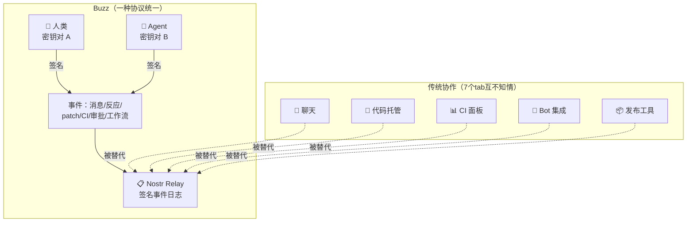

# Block/Buzz

## 一句话定位
基于 Nostr relay 的 Human-Agent 协作通信平台——人类和 AI Agent 在同一频道工作，所有操作签名上链。

## 它解决的问题
当团队中有多个 AI Agent 时，现有协作工具（Slack、Discord、GitHub）的 Agent 集成都是外挂式 bot。Agent 没有一等公民身份，没有独立审计链，没有统一的身份和权限模型。团队不得不在 7 个 tab 之间切换：聊天、代码托管、CI 面板、发布工具、搜索索引……它们之间互不知情。

## 为什么值得关注（2026-07-24）
Block（原 Square）官方开源项目，首日 2,162 stars。这不是社区玩具——是有大公司工程团队背书的 Agent 协作底层协议。采用 Nostr（已被验证的去中心化协议）作为事件模型，把所有协作行为统一为签名事件。这是目前最认真尝试解决"Agent 时代协作工具应该怎么设计"的项目。

## 热度来源判断
- **真实需求驱动**：Agent 从单点工具走向团队协作场景是 2026 下半年的确定性趋势
- **Block 背书**：大型 fintech 公司的工程团队出品，不是个人项目
- **协议创新**：Nostr + Git Events (NIP-34) 的组合在协作领域是全新思路
- **非炒作型**：README 诚实标注功能成熟度（✅ Works today / 🚧 Being wired / 💭 Pending），没有过度承诺

## 关键技术亮点
1. **统一事件模型**：消息、反应、代码审查、CI 结果、工作流审批、git 事件——全部是同一种 Nostr 签名事件。一种数据结构、一种身份模型、一条审计链
2. **Agent 身份 = 密钥对**：Agent 的权限由密钥对定义，和人类同事一样 scoped by identity。不是 permission flags，不是 API token
3. **buzz-cli（JSON in/JSON out）**：专为 LLM 工具调用设计的 CLI，支持 Goose / Codex / Claude Code 等 Agent harness
4. **Branch as Room**：Feature branch 自动创建协作频道，patch (NIP-34) / CI 结果 / review / merge decision 在同一房间
5. **YAML 工作流引擎**：消息/反应/调度/webhook 四种触发器，Agent 可执行编排
6. **搜索 = 事件查询**：对话、补丁、工作流运行、审批记录搜索合一，因为它们是同一种事件

## 架构启发

核心设计哲学：**一种协议、一种身份模型、一条事件日志**。不是集成了 7 个工具，是替代了 7 个工具的数据层。

## 定位判断
处于 **Agent 基础设施协议层**。如果 Human-Agent 协作成为主流工作模式（2026-2027 大概率事件），Buzz 定义的就是这个领域的"HTTP"——最基本的交互协议。

## 风险 / 局限 / 泡沫点
1. **开源阉割风险**：Block 内部版本预连接 Block relay 和 Agent provider，开源版需要自行搭建。存在"社区版 = 二等公民"风险
2. **自托管门槛高**：需要 Docker + Hermit + Rust 1.88+ + Node 24+，非一键部署
3. **Nostr 采用风险**：Nostr 在团队协作场景的采用仍属极早期，社区可能选择更传统的协议
4. **移动端缺失**：iOS/Android 客户端仍在开发中（Flutter）
5. **单公司依赖**：核心维护者几乎都来自 Block，bus factor 风险

## 与同类项目的关系
| 维度 | Buzz | Slack + Bot | Zed Collaboration |
|------|------|-------------|-------------------|
| Agent 身份 | 一等公民（密钥对） | 外挂 bot（token） | 编辑器内协作 |
| 事件模型 | Nostr 签名事件 | 私有 API | CRDT |
| 自托管 | ✅ 完全控制 | ❌ SaaS | ❌ 编辑器绑定 |
| Git 集成 | NIP-34 原生 | Webhook | 内置 |
| 审计链 | ✅ 事件日志 | 部分 | ❌ |

## 是否值得持续跟踪
**强烈建议持续跟踪。** 这是目前最认真的 Agent 协作底层协议项目。即使最终 Nostr 路线未被广泛采用，其设计思路（统一事件模型、Agent 一等公民身份、签名审计链）将深刻影响后续所有协作工具设计。

## 后续观察点
1. 移动端发布时间表及体验质量
2. 社区是否出现第三方 relay 托管服务（降低自托管门槛）
3. 非 Block 员工的核心贡献者数量变化
4. Agent harness 生态（Goose / Codex / Claude Code）的集成深度
5. 是否有企业 PoC 案例公开

---
*首次记录：2026-07-24*
