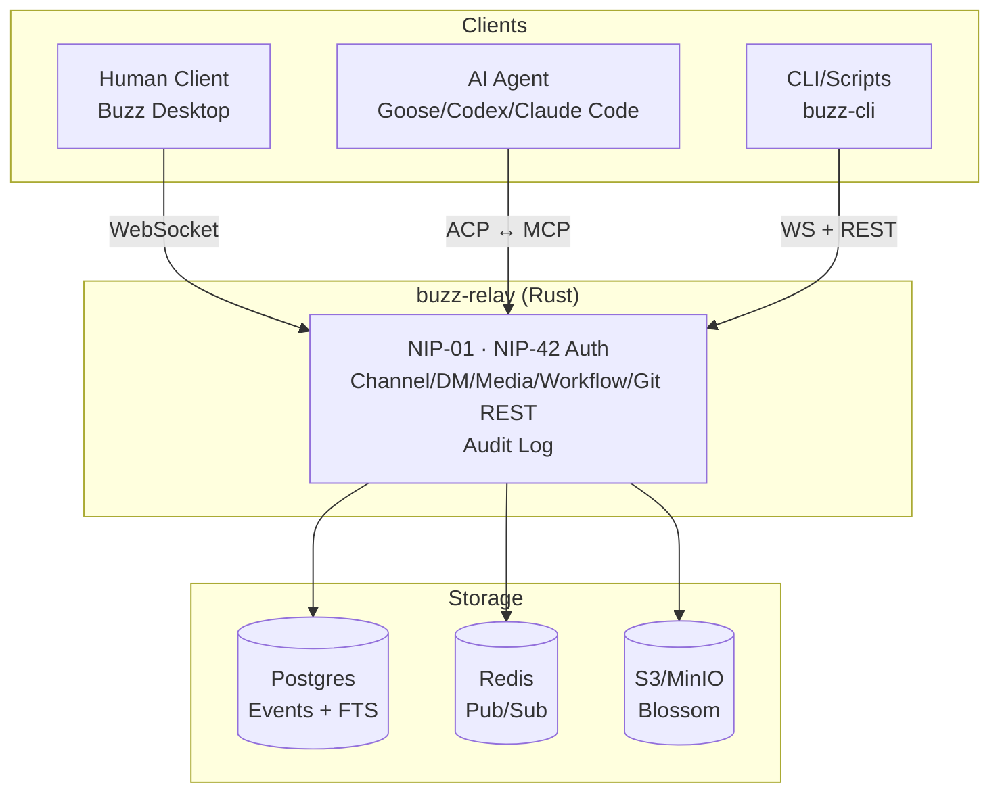

# Block Buzz

## 一句话定位
基于 Nostr Relay 协议的人机协同工作空间——人类和 AI Agent 在同一个频道里工作，共享身份模型、审计日志和 Git 事件流。

## 它解决的问题
AI Agent 已能做代码审查、发布管理、事件响应，但它们以"haunted cron jobs"方式存在——藏在 CI 后台、Bot token 后面，不在团队的工作流里。团队协作需要人类、Agent、工作流、Git 事件在同一个上下文中可见、可搜索、可审计。现有方案（Slack+Bot+CI Dashboard+Forge）是 7 个 tab 的拼凑。

## 为什么值得关注（2026-07-24）
Block Inc.（Square/Cash App 母公司）出品，日增 2,162 stars，Rust 实现，Apache 2.0 协议。这不是又一个 AI 聊天工具——它定义了一种新的协作协议层。

## 热度来源判断
- **Block Inc. 背书**：大公司开源，自带信任溢价和工程能力背书
- **Nostr 协议原生**：利用已有的 Nostr 生态（签名事件、中继），不是 reinvent
- **Agent 协作痛点真实**：开发者已饱受 Agent 藏在 CI 后台、缺乏上下文之苦
- **Rust + 自托管**：隐私优先、可自托管，满足企业需求
- **ACP 接入**：支持 Goose/Codex/Claude Code，不锁定 Agent 框架

## 关键技术亮点
1. **Nostr 协议底座**：所有交互（消息、反应、工作流、Git 事件）都是签名 Nostr 事件。同一身份模型（NIP-42 Schnorr 认证），同一审计轨迹，无论作者是人还是 Agent
2. **Git NIP-34 原生支持**：Patch、Repo 公告、Status 作为标准 Nostr 事件流转。Feature branch 可以自动成为一个"房间"
3. **buzz-cli（agent-first）**：JSON in / JSON out，专为 LLM 工具调用设计。ACP harness 支持 Goose、Codex、Claude Code
4. **多租户架构**：单 Relay 托管一个社区，Hosted 模式通过 host-derived community 做租户隔离，共享 Postgres/Redis/S3
5. **Rust workspace 设计**：buzz-core（零 I/O 类型）、buzz-relay（Axum WS+REST）、buzz-db（Postgres）、buzz-auth（NIP-42/98 认证+限流）、buzz-pubsub（Redis）、buzz-search（Postgres FTS）、buzz-audit（哈希链日志）

## 架构启发

**设计哲学：** 一个协议替代七个 tab。人类和 Agent 的 affordance 完全对等——同样的频道、画布、工作流、语音室，不同的只是密钥对。

## 定位判断
平台候选。如果 Nostr-as-workspace-protocol 成立，它有潜力成为人机协作的 Slack+Forge 替代。但高度依赖 Block Inc. 的持续投入和社区采纳。

## 风险 / 局限 / 泡沫点
1. **单公司主导**：Block Inc. 开源，Apache 2.0 但治理模式不明朗。大公司开源项目的常见风险：战略变更即弃坑
2. **Nostr 生态依赖**：Nostr 用户基数仍小，协议网络效应未形成
3. **功能成熟度**：README 明确标注 Mobile 客户端、Push 通知、Git 托管后端仍在开发中
4. **竞争激烈**：Slack+Bot 生态已根深蒂固，切换成本高
5. **过度野心风险**：试图同时替代 Forge+Chat+CI+搜索+发布，每个领域都有强竞争者

## 与同类项目的关系
- **vs Slack+Bot**：Slack 是人类优先+Bot 附加，Buzz 是人类和 Agent 对等设计。但 Slack 的网络效应巨大
- **vs Zulip**：Zulip 有良好的 Bot 支持，但缺乏 Agent-first 的身份模型和 Nostr 协议底座
- **vs Mattermost**：自托管替代方案，但同样缺乏 Agent 原生设计

## 是否值得持续跟踪
**是。** 协议层创新稀缺，Block Inc. 的工程能力是质量背书。关注社区采纳速度和第三方 Agent 接入情况。

## 后续观察点
1. 第三方 Agent（非 Block 内部）接入数量和活跃度
2. buzz-cli 和 ACP harness 的实际使用反馈
3. Mobile 客户端和 Push 通知落地时间
4. Nostr 生态项目是否选择 Buzz 作为协作前端
5. 企业自托管案例

---
*首次记录：2026-07-24*
