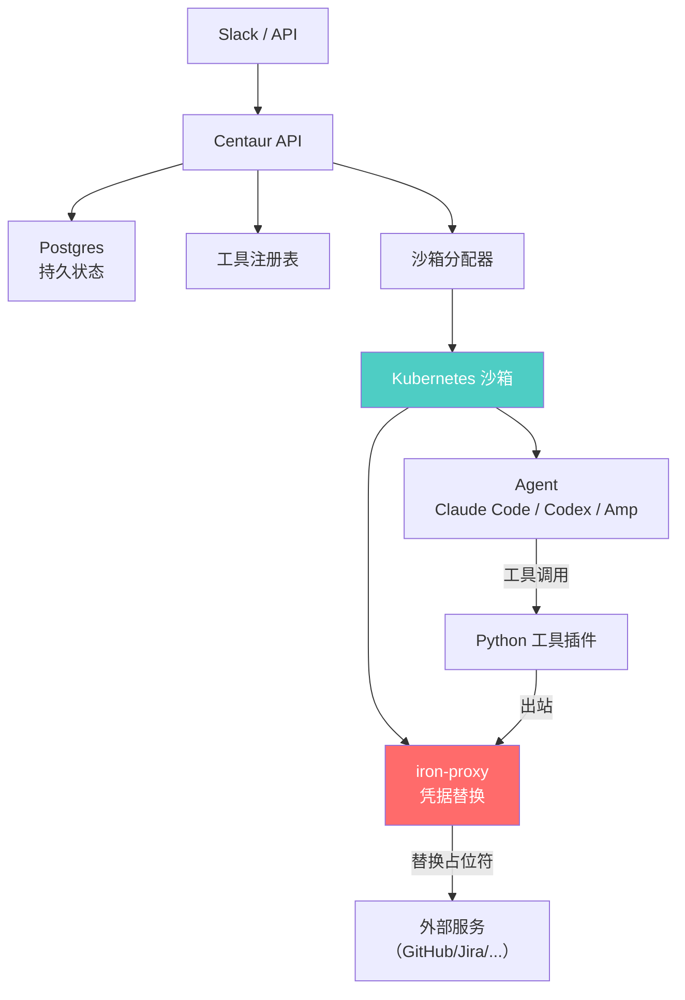

# Paradigm Centaur

## 一句话定位
自托管团队共享 Agent 平台，Slack 原生交互 + K8s 隔离沙箱 + 持久工作流 + 凭据安全边界。

## 它解决的问题
团队使用 AI Agent 的三大痛点：每人本地跑一套浪费资源、Agent 拿到 API Key 有安全风险、对话状态不持久无法协作。

## 为什么值得关注（2026-06-06）
Paradigm（以太坊生态知名开发公司）出品的自托管 Agent 平台。核心创新是凭据边界（Credential Boundaries）：Agent 永远拿不到原始密钥，通过 iron-proxy 代理替换。这是企业级 Agent 安全的正确设计。

## 热度来源判断
- Paradigm 品牌（以太坊/Rust 生态）
- Slack 原生交互降低使用门槛
- 安全设计（沙箱 + 凭据隔离）直击企业痛点
- 718 stars + 116 forks = 活跃的早期社区

## 关键技术亮点
1. **Slack 原生对话**：@mention 发起对话，线程级进度更新和结果回复
2. **K8s 隔离沙箱**：每个对话独立沙箱，default-deny NetworkPolicy，k3s 即可部署
3. **iron-proxy 凭据隔离**：Agent 只看到占位符字符串，真实凭据由 iron-proxy 在出站请求时替换到指定 host + header
4. **可插拔 Agent 引擎**：支持 Claude Code / Codex / Amp / 自定义 harness
5. **Python 工具插件**：工具是 Python 包，公共方法自动变为 API 端点
6. **持久工作流**：Python 函数 + durable steps，支持 sleep/resume/子 Agent/定时触发
7. **可重放状态**：Postgres 存储消息、执行、事件，客户端断线重连不丢结果

## 架构启发

**核心设计模式：凭据边界**
传统方式：把 API Key 放到 Agent 环境变量 → Agent 可以泄露密钥。
Centaur 方式：Agent 环境只有占位符（如 `OP_SERVICE_ACCOUNT_TOKEN`），iron-proxy 拦截出站请求，按 host + header 精确替换。Agent 用服务但不接触密钥。

## 定位判断
**平台候选。** 自托管团队 Agent 平台的早期参考实现。安全设计领先，但运维门槛较高。

## 风险 / 局限 / 泡沫点
1. **K8s 依赖**：虽然 k3s 降低了门槛，但仍然是运维复杂的选择
2. **Paradigm 维护优先级**：Paradigm 核心业务是 Web3，此项目可能非战略优先
3. **Slack 绑定**：当前只有 Slack 入口，缺少 Discord/飞书/企业微信支持
4. **早期阶段**：83 个 open issues 说明功能完善度有限
5. **中国落地的本地化障碍**：需要适配钉钉/飞书等国内 IM

## 与同类项目的关系
| 项目 | 定位 | 差异 |
|------|------|------|
| Odysseus (55.4K⭐) | 自托管 AI 工作空间 | 个人使用，非团队 Agent 平台 |
| n8n (191K⭐) | 工作流自动化 | 偏流程编排，非 Agent 沙箱 |
| Butterbase (1.3K⭐) | AI 原生 BaaS | 后端服务，非 Agent 平台 |

## 是否值得持续跟踪
**是。** 团队级 Agent 平台是企业 Agent 化的关键基础设施。凭据边界设计值得长期跟踪。

## 后续观察点
1. 是否出现非 Slack 的对话入口（Discord / Web UI / API-first）
2. 沙箱方案是否从 K8s 扩展到 microVM（如 forkd）
3. 工作流引擎的可靠性验证
4. 企业部署案例

---
*首次记录：2026-06-06*
