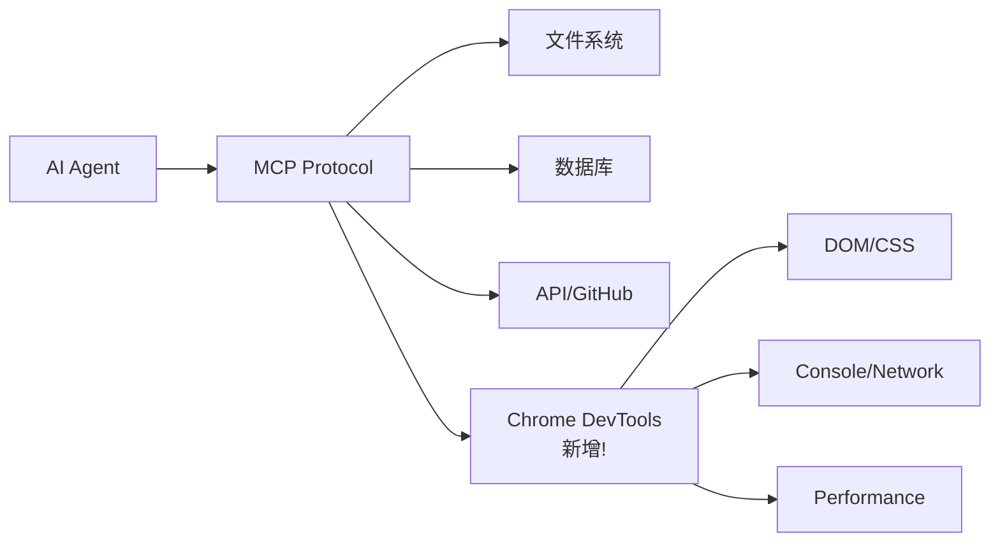

# chrome-devtools-mcp

## 一句话定位
通过 MCP 协议让 AI Coding Agent 直接操作 Chrome DevTools——Agent 的浏览器感知和调试能力。

## 它解决的问题
AI Coding Agent 可以写代码，但不能直接看到代码在浏览器中的运行效果。调试前端问题仍需人工介入。chrome-devtools-mcp 让 Agent 能够：查看 DOM 结构、读取 Console 输出、分析网络请求、执行 Performance 分析。

## 为什么值得关注（2026-04-15）
- 35,007 stars，Apache 2.0 许可
- MCP 协议从后端工具扩展到前端工具的标志性项目
- 日增稳定（218/day），持续需求

## 热度来源判断
**真实开发需求：** 前端开发者 + AI 编程用户的核心痛点。Agent 能自主调试前端意味着减少人机切换。

## 关键技术亮点
1. **标准 MCP 协议**：可作为任何支持 MCP 的 Agent 的工具插件
2. **Puppeteer 底层**：成熟的浏览器自动化方案
3. **双向通信**：Agent 既能读取 DevTools 数据，也能执行调试操作
4. **安全边界**：需要用户授权的敏感操作设计

## 架构启发
MCP 协议的扩展方向清晰：文件系统 → 数据库 → API → 浏览器/DevTools。Agent 的感知边界正在从"代码编辑"扩展到"运行时调试"。

**关键图示：**

## 定位判断
Agent 工具层基础设施。不是 Agent 框架本身，而是 Agent 的"眼睛"——让 Agent 能看到和操作浏览器运行时。

## 风险 / 局限 / 泡沫点
1. **安全风险**：Agent 操作浏览器可能泄露敏感信息
2. **稳定性**：依赖 Chrome 版本和 Puppeteer 兼容性
3. **性能开销**：MCP Server 常驻运行消耗资源

## 与同类项目的关系
- **camofox-browser**（2,343 stars）：类似方向但专注反封锁的浏览器自动化
- **plano**（6,317 stars）：AI 网关，关注网络层而非浏览器层

## 是否值得持续跟踪
**是，深度跟踪。** MCP 扩展到浏览器是 Agent 自主性的关键一步。

## 后续观察点
1. 是否支持 Firefox/Safari DevTools
2. 是否出现"Agent 自主修复前端 Bug"的端到端演示
3. 企业级安全管控功能

---
*首次记录：2026-04-15*
