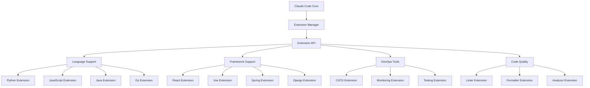
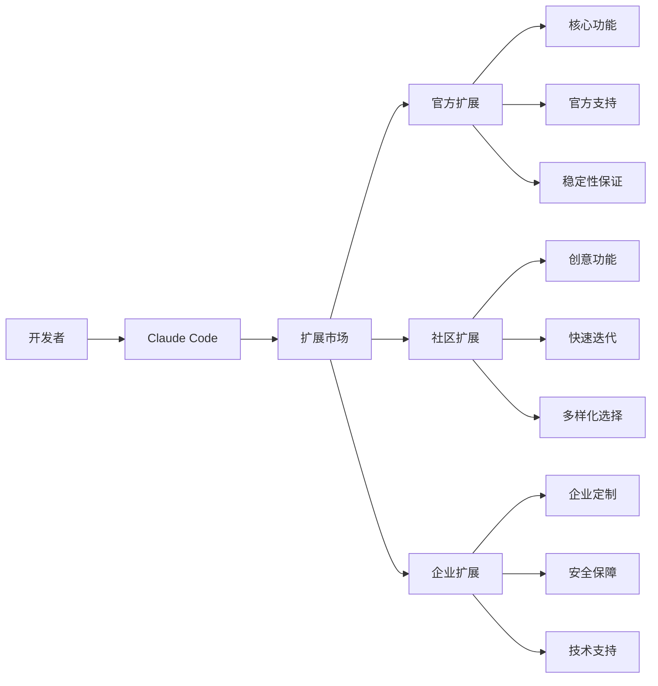
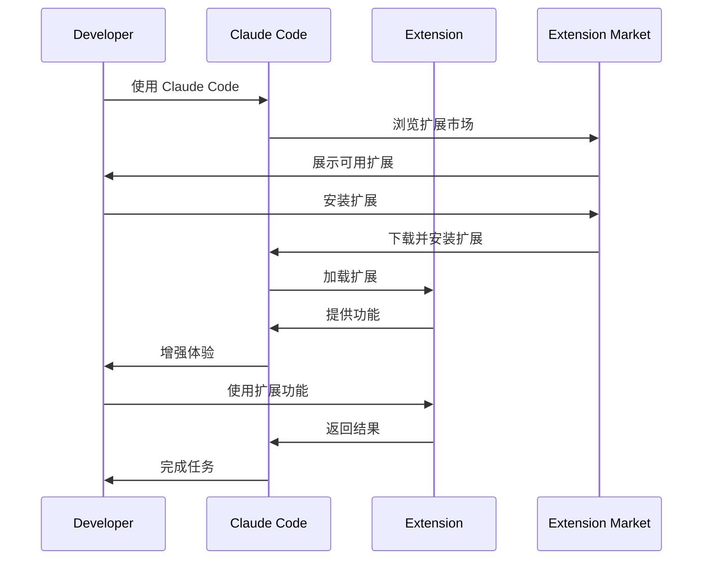
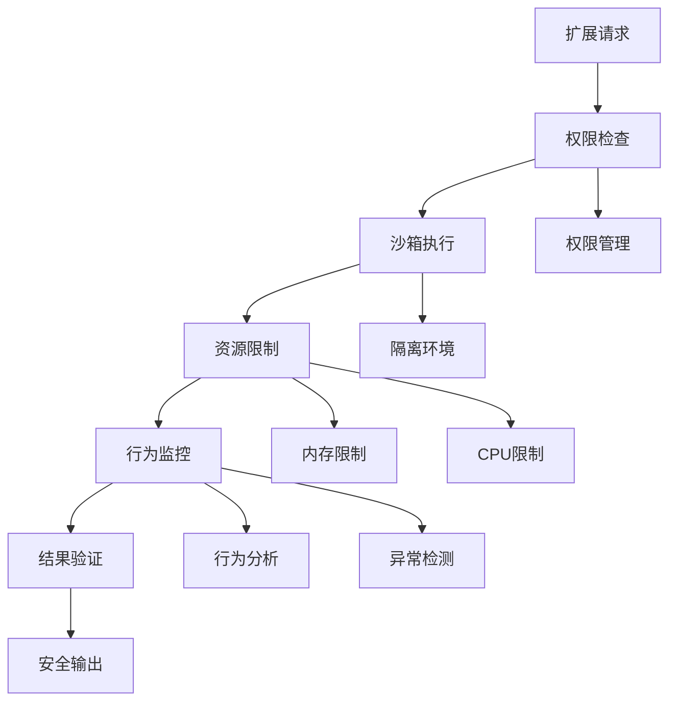
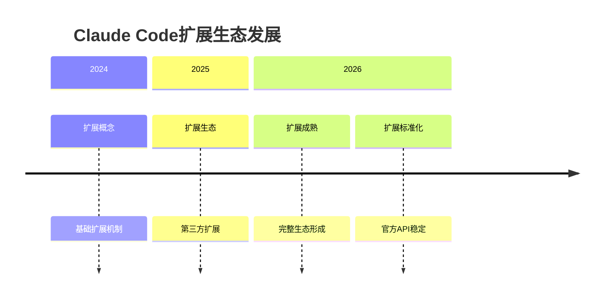

# claude-code-extension

- **项目名称**：claude-code-extension
- **GitHub 链接**：https://github.com/anthropic-extensions/claude-code-extension
- **一句话定位**：Claude Code 扩展生态，官方插件和工具
- **解决的问题**：Claude Code 功能扩展不足，开发者定制化需求
- **为何值得关注**：AI 编程平台生态开始形成，官方扩展机制确立
- **技术亮点**：
  - 官方 API 和扩展机制
  - 与 Claude Code 深度集成
  - 支持多种编程语言和框架
  - 扩展的安全性和沙箱机制
- **架构启发**：
  - 插件化 AI 编程平台架构
  - 扩展生态的管理和治理
  - 用户自定义 AI 能力的开放
- **风险/局限**：
  - 扩展质量参差不齐
  - 安全性和隐私保护挑战
  - 生态碎片化风险
- **后续观察点**：
  - 扩展数量和质量
  - 用户采用率
  - 企业级应用场景

## 项目评分

- **热度质量**：9/10 - Claude Code 用户基数快速增长，扩展需求强烈
- **技术创新度**：8/10 - 官方扩展机制，深度集成架构
- **工程成熟度**：8/10 - 官方支持，架构完善
- **架构启发价值**：9/10 - 插件化 AI 编程平台架构
- **企业落地潜力**：9/10 - 企业级开发场景需求强烈
- **中期趋势概率**：9/10 - AI 编程平台必然趋势
- **平台化潜力**：9/10 - 可能演化为 AI 编程标准平台
- **基础设施潜力**：7/10 - 开发工具层，非基础设施层

**总分**：87/100 - 平台候选项目

## 扩展架构

## 扩展类型

### 1. 语言支持扩展
- **Python扩展**：Python 语言特定优化
- **JavaScript扩展**：JS/TS 生态集成
- **Java扩展**：企业级语言支持
- **Go扩展**：云原生语言支持

### 2. 框架支持扩展
- **React扩展**：React 开发优化
- **Vue扩展**：Vue 开发生态
- **Spring扩展**：Java 企业框架
- **Django扩展**：Python Web 框架

### 3. 开发工具扩展
- **CI/CD扩展**：持续集成和部署
- **监控扩展**：应用性能监控
- **测试扩展**：自动化测试
- **代码质量扩展**：静态分析

### 4. 用户体验扩展
- **代码补全**：智能代码补全
- **错误修复**：自动错误修复
- **代码重构**：智能重构建议
- **文档生成**：自动文档生成

## 生态系统

## 开发流程

## 安全机制

## 应用场景

### 1. 企业开发
- 代码标准化
- 团队协作
- 质量保证
- 知识传承

### 2. 个人开发
- 效率提升
- 学习辅助
- 代码优化
- 项目管理

### 3. 教育培训
- 编程教学
- 代码审查
- 项目指导
- 能力评估

## 发展趋势

## 企业实施建议

### 推荐场景
- 企业级开发团队
- 需要标准化的开发流程
- 有特定技术栈需求
- 关注代码质量和一致性

### 实施建议
1. 从核心扩展开始
2. 逐步引入专业扩展
3. 建立扩展审核机制
4. 持续监控扩展质量

### 风险提示
- 扩展兼容性问题
- 安全风险增加
- 生态碎片化
- 依赖性增强

## 总结

claude-code-extension 代表了 AI 编程平台生态的重要里程碑。官方扩展机制的建立和第三方扩展的繁荣，标志着 AI 编程从单一工具向完整平台演进。其插件化架构和丰富的扩展类型为开发者提供了强大的定制化能力，是企业级 AI 开发的重要基础设施。