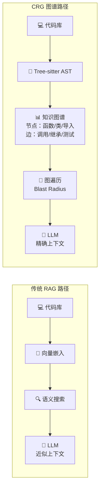

# code-review-graph

## 一句话定位
通过 tree-sitter AST 构建代码知识图谱的 MCP 工具，让 AI 编程助手精确获取上下文——只读真正需要读的文件。

## 它解决的问题
AI 编程助手（Claude Code / Cursor / Codex 等）在 code review 时反复扫描大量代码，Token 浪费严重且上下文不精确。传统 RAG 方案用向量相似度搜索代码，语义近似但结构关系丢失——不知道哪个函数调用了哪个，哪些测试覆盖了变更。

## 为什么值得关注（2026-07-24）
26K⭐ + 周增 6.3K，从上周 Graphify 的范式验证到本周 code-review-graph 的工程化落地，速度极快。CRG 不是概念验证——它可以直接 `pip install` 并通过 MCP 集成主流 AI 编程工具。支持 40+ 语言，2900 文件项目增量索引 < 2 秒。

## 热度来源判断
- **工程成熟度**：一行命令安装（`code-review-graph install` 自动检测平台写 MCP 配置）
- **真实痛点**：Agent 上下文管理是 2026 年 AI 编程的核心瓶颈
- **数据说话**：monorepo 27,700+ 文件排除，实际只读 ~15 文件
- **生态集成**：Claude Code / Cursor / Codex / Gemini CLI / Copilot / Kiro 全覆盖

## 关键技术亮点
1. **Tree-sitter AST 解析**：40+ 语言的函数/类/导入/调用/继承/测试覆盖的结构化图谱，不依赖向量
2. **Blast Radius 分析**：文件变更时自动追踪所有调用方、依赖方、测试——"爆炸半径"精确定义上下文边界
3. **增量索引**：SHA-256 hash diff 只重解析变更文件，2900 文件项目 < 2 秒
4. **MCP 原生集成**：一行 `code-review-graph install` 自动写入所有支持平台的 MCP 配置
5. **对称卸载**：`code-review-graph uninstall` 原子化清理，不残留

## 架构启发

**核心差异：** RAG 回答"哪些代码语义相似"，CRG 回答"哪些代码有真实依赖关系"。前者是近似，后者是精确。

## 定位判断
处于 **AI 编程工具上下文管理层**，正在从"新兴方案"向"事实标准"过渡。与 Graphify 属于同一范式但定位不同——Graphify 更偏平台化/通用知识图谱，CRG 更聚焦 code review 工程场景。

## 风险 / 局限 / 泡沫点
1. **Tree-sitter 依赖**：语言覆盖取决于 tree-sitter grammar 质量，非主流语言支持可能不完整
2. **动态类型语言**：Python/JS 的隐式依赖可能遗漏（如反射、猴子补丁）
3. **与 Graphify 竞争**：两个项目在同一赛道，可能分散社区精力
4. **单语言（Python）实现**：对非 Python 项目的集成可能增加摩擦

## 与同类项目的关系
| 维度 | code-review-graph | Graphify | Augment Code |
|------|------------------|----------|--------------|
| 实现方式 | Tree-sitter AST | Tree-sitter AST | 闭源 |
| 集成方式 | MCP（开源） | MCP（开源） | IDE 插件（闭源） |
| 安装 | pip install | pip install | 付费订阅 |
| 语言覆盖 | 40+ | 40+ | 未公开 |
| 定位 | Code Review 场景 | 通用代码知识图谱 | 商业产品 |

## 是否值得持续跟踪
**强烈建议。** 代码知识图谱正在从"创新概念"变为"工程标配"。CRG 和 Graphify 谁先达到生产级稳定性，谁就可能成为 Agent 上下文管理的事实标准。

## 后续观察点
1. 与 Graphify 是否会合并或互操作
2. 企业级 monorepo（10K+ 文件）的性能表现
3. IDE 原生 hook 集成的深度（目前依赖外部触发）
4. 社区贡献的语言 parser 数量增长
5. 是否被 Cursor / Replit 等商业产品集成

---
*首次记录：2026-07-24*
