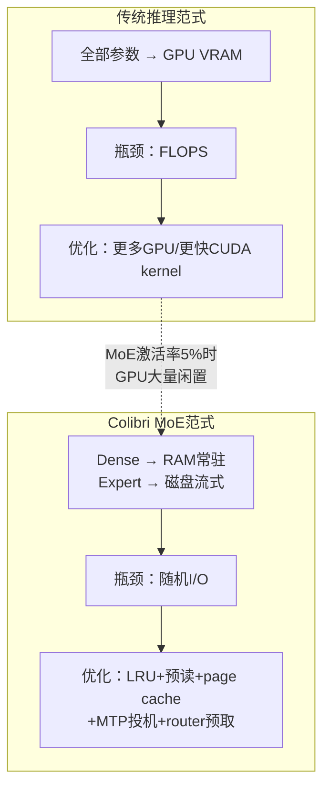

# Colibri

## 一句话定位
纯C、零依赖的 GLM-5.2 744B MoE 推理引擎，在 25GB RAM 消费机上正确运行前沿大模型。

## 它解决的问题
前沿大模型（700B+参数）的推理通常需要数据中心级 GPU 集群。普通开发者无法在本地运行这类模型。Colibri 证明：利用 MoE 架构的稀疏激活特性 + 精巧的 I/O 工程化，可以在一台没有 GPU 的消费级机器上正确运行 744B 前沿模型。

## 为什么值得关注（2026-07-12 更新）

**Stars 暴涨**：从昨日 2,065 暴涨至 3,850（+87%），社区传播效应显著。核心原因可能是 Colibri 的 I/O-first 设计模式引发了广泛讨论。
这是2026年本地推理的工程标本。不是一个产品，而是一份"如何用工程智慧突破硬件限制"的参考实现。2400行C代码，无BLAS/无Python运行时/无GPU依赖，token级验证精确。每一个设计决策都有实测数据支撑。

## 热度来源判断
- **真实技术价值驱动**：C语言+大模型推理的组合本身就吸引底层工程师
- **GLM-5.2热度**：智谱的744B MoE模型自带流量
- **社区讨论质量高**：issue讨论MTP接受率、SSD热管理等实际工程问题
- **非炒作型增长**：10天2K star对于纯C项目是真实兴趣信号

## 关键技术亮点

### 1. MoE 内存分层架构
- Dense部分（attention + shared experts + embeddings ~17B params）：常驻RAM，int4量化，9.9GB
- 路由专家（21,504个，每个~19MB int4）：存磁盘（~370GB），按需流式加载
- 每token激活~40B参数，仅~11GB变化（路由专家部分）

### 2. MLA注意力 + KV压缩
- 576 floats/token vs 标准32,768（57×压缩）
- GLM-5.2有64头无GQA，压缩更为关键
- MLA weight absorption（DeepSeek trick）：decode时无需per-token k/v reconstruction

### 3. MTP投机解码
- GLM-5.2自带的multi-token-prediction头（layer 78）做draft
- int8头：39-59%接受率，2.2-2.8 tokens/forward
- int4头：0-4%接受率（不可用），诚实标注
- 采样下无损（rejection sampling）

### 4. 异步专家预读 + Router预取
- 计算当前层专家时，I/O线程已用WILLNEED预读下一层
- PILOT实验功能：下层路由71.6%可预测，提前预取

### 5. DSA稀疏注意力
- GLM-5.2的lightning indexer：per-layer top-2048 causal key selection
- 可禁用（DSA=0）或自定义（DSA_TOPK）

### 6. 全验证 + 安全设计
- token级对比transformers oracle（TF 32/32, greedy 20/20）
- KV持久化崩溃安全（.coli_kv, ~182KB/token）
- RAM自动预算（MemAvailable → expert cache auto-size），不触发OOM killer

## 架构启发

**核心insight：MoE推理瓶颈是I/O不是FLOPS。** 当每token仅激活5%参数时，GPU算力大量闲置，真正的瓶颈变成"如何快速从磁盘读取需要的专家"。Colibri的I/O-first设计——专家流式加载 + LRU cache + OS page cache L2 + 异步预读 + router预取——是这个新范式的工程参考。

**对架构师的价值：** 随着MoE成为大模型主流架构（GLM-5.2、DeepSeek-V3等），推理基础设施的设计哲学需要从"算力优先"转向"I/O优先"。Colibri是这个转向的极端示例。

## 定位判断
**研究型工程标本**，不是生产工具。它证明了"前沿大模型可在消费机正确运行"的工程路径，但速度限制（冷启动0.05-0.1 tok/s）使其更像概念验证。价值在于：被其他本地推理项目借鉴的I/O-first设计模式。

## 风险 / 局限 / 泡沫点
1. **速度硬伤**：冷启动0.05-0.1 tok/s，即使热缓存也只是"勉强可对话"级别
2. **磁盘空间门槛**：~370GB int4模型 + 需要NVMe级随机读性能
3. **单一模型**：仅支持GLM-5.2架构（glm_moe_dsa），泛化到其他MoE模型需额外工作
4. **单人项目**：主要贡献者JustVugg，bus factor = 1
5. **MTP头量化敏感**：int4 MTP头不可用（接受率0-4%），必须int8

## 与同类项目的关系
| 项目 | 定位 | 差异 |
|------|------|------|
| llama.cpp | 通用本地推理 | 支持多模型，但GLM-5.2 744B的MoE支持不如Colibri深 |
| Ollama | 本地推理产品化 | 用户体验好但对744B级模型无专门优化 |
| MLX | Apple Silicon推理 | 依赖Apple GPU，Colibri纯CPU+磁盘 |
| vLLM | 服务端推理 | GPU集群场景，定位完全不同 |

## 是否值得持续跟踪
**是。** Colibri代表MoE本地推理的工程前沿。即使项目本身不成长为平台，其I/O-first设计模式会被广泛借鉴。

## 后续观察点
1. 是否被llama.cpp/ollama等项目吸收其MoE流式加载设计
2. 社区是否为其贡献其他MoE模型的支持（DeepSeek-V3等）
3. SSD随机读性能提升（PCIe 5.0/6.0）是否会改变Colibri类项目的可用性
4. 是否出现基于Colibri思路的GPU加速版本（利用低成本GPU做专家计算）
5. GLM-5.2后续版本对Colibri设计的兼容性

---
*首次记录：2026-07-11*
