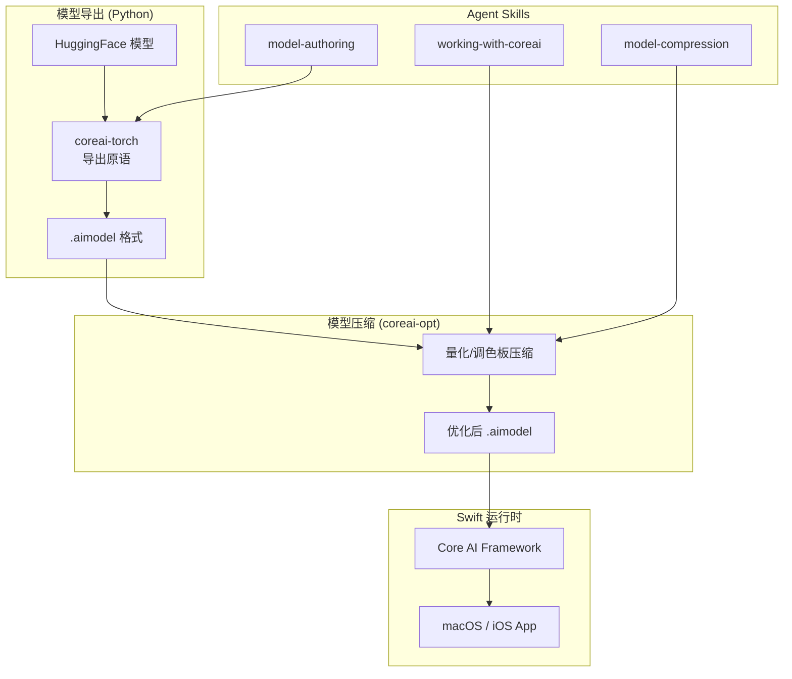

# apple/coreai-models

## 一句话定位
Apple 端侧 AI 模型导出/运行时/Skills 全栈开源生态，Core AI 框架的官方开发者工具链。

## 它解决的问题
开发者想在 Apple 设备上运行 AI 模型，但缺乏从模型训练到端侧部署的完整工具链。coreai-models 填补了这个空白。

## 为什么值得关注（2026-06-11）

1. **Apple 官方开源** — 这不是社区项目，是 Apple 第一方开源
2. **全栈覆盖** — 模型导出 → Python 原语 → Swift 运行时 → Agent Skills
3. **端侧 AI 窗口期** — 刚开放，早期投入有先发优势
4. **Skills 生态** — 包含 Agent Skills 让 Coding Agent 直接使用 Core AI

## 热度来源判断
- Apple 品牌效应 + 端侧 AI 是确定性趋势 + 开发者苦工具链久矣
- 3 天 605⭐ 对于 Apple 项目来说增速正常

## 关键技术亮点
- **模型导出管线** — HuggingFace 模型到 Core AI `.aimodel` 格式的一键导出
- **Python 原语** — PyTorch 模型到端侧的构建块（BC1S 布局、算子兼容、KV Cache 模式）
- **Swift 运行时** — 与 Core AI 框架无缝集成的 Swift 包
- **模型压缩** — 支持量化、调色板压缩等端侧优化
- **Agent Skills** — working-with-coreai、model-authoring、model-compression-exploration 三个官方 Skill
- **CLI 工具** — 命令行直接在 Mac 上运行导出的模型

## 架构启发

**启发 1：** 端侧 AI 的关键不仅是推理性能，更是从训练到部署的完整工具链。
**启发 2：** Apple 通过 Agent Skills 让 AI 开发工具直接支持 Core AI，这是开发者体验的降维打击。
**启发 3：** `.aimodel` 格式可能是 Apple 生态的「AI 模型标准格式」，类似 `.app` 之于应用。

## 定位判断
**基础设施候选。** 这是 Apple 端侧 AI 生态的基石项目，如果端侧 AI 成为主流，coreai-models 就是底座。

## 风险/局限/泡沫点
1. **Apple 生态锁定** — 只服务于 Apple 平台，跨平台团队需谨慎
2. **版本要求高** — macOS/iOS 27.0+、Xcode 27.0+，目前仅支持最新系统
3. **模型种类有限** — 目前支持的模型种类还需扩展
4. **生态成熟度** — 刚发布，文档和社区都处于早期
5. **无明确 License** — 目前没有明确开源协议

## 与同类项目的关系
- **ollama** — 不同赛道，ollama 做本地推理，coreai-models 做端侧部署工具链
- **CoreML** — 演进关系，Core AI 是 CoreML 的 AI-native 升级
- **GGUF/llama.cpp** — 竞争格式，.aimodel vs GGUF

## 是否值得持续跟踪
✅ 是。Apple 端侧 AI 生态的基础设施项目。

## 后续观察点
1. 支持的模型种类扩展速度
2. 社区贡献的导出配方数量
3. macOS/iOS 27 正式发布后的采用率
4. 企业级端侧 AI 部署案例
5. 是否成为端侧 AI 的事实标准工具链
