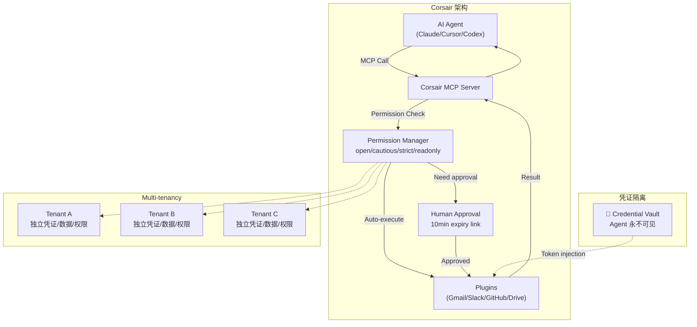

# Corsair

## 一句话定位
Agent 的统一集成层——4 档权限模式 + multi-tenancy + webhook 全覆盖 + Agent 永不见凭证。

## 它解决的问题
Agent 集成的核心矛盾：你需要给 Agent 权限（Gmail、Slack、GitHub、Drive 等）才能让它有用，但你不信任它点的每一下按钮。一旦 Agent 误发邮件、误删文件、误操作生产环境，后果不可逆。传统 API 集成没有"人类审批"环节。

## 为什么值得关注（2026-06-23）
- **2.8K⭐** 日增 210，新进入 Trending
- 定义了一个全新品类：Agent Integration Layer（不是 API Gateway，不是 MCP Server，是两者之上的权限层）
- 权限模型设计精准：open/cautious/strict/readonly 四档 + per-endpoint override
- Multi-tenancy 原生支持——企业部署 Agent 的刚需

## 热度来源判断
**真实需求驱动。** 当 Agent 从"个人 coding 助手"走向"接入企业系统的自动化 Agent"，权限和集成是必经之路。corsair 出现的时机精准——Agent 框架已经很多了（LangChain/CrewAI/AutoGen），但"Agent 安全接入企业系统"这一层还没有标准答案。

## 关键技术亮点
1. **四档权限模式** — open（全自动）/ cautious（读自动 + 写审批）/ strict（读自动 + 写审批 + 破坏性阻止）/ readonly。每个 API endpoint 可单独 override，例如 Slack 设为 open 但发消息需要审批
2. **Multi-tenancy 原生** — `multiTenancy: true` 后每个租户独立凭证/数据/权限，零交叉污染。`withTenant('org-456')` scope 隔离
3. **Webhook 全覆盖** — 每个 plugin 自带类型化、签名验证的 webhook handler。单一端点处理所有 webhook
4. **Agent 永不见凭证** — Corsair 持有所有 API token，Agent 只看到操作结果。凭证不暴露给 Agent 的 context window

## 架构启发
**核心设计哲学：** Agent 不应该直接持有凭证。Agent 发出意图（"给 Sarah 发邮件"），Corsair 负责执行（认证、权限检查、审批、调用 API、返回结果）。这是 Agent 时代的"零信任"实践。

**Trade-off：** 增加了一层 indirection（延迟 + 复杂度），但换来的是安全边界。对于个人项目可能过重，对于团队/企业部署是必需。

## 定位判断
**基础设施候选。** Agent 安全接入企业系统的必经层。如果 MCP 标准化了 Agent 与工具的连接，Corsair 正在标准化 Agent 与工具之间的权限和审计。

## 风险 / 局限 / 泡沫点
1. **生态规模小** — 2.8K⭐ vs Agent 框架动辄 10K+，采用率还很低
2. **Plugin 依赖** — 只有内置 plugin 覆盖的 API 才能用，长尾 API 需要自己写 plugin
3. **审批链接 10 分钟过期** — 钓鱼/社工攻击不在模型覆盖范围内
4. **5 个核心贡献者** — 团队还很小，bus factor 风险
5. **与 MCP 的边界模糊** — MCP 定义了 Agent 与工具的连接，Corsair 在 MCP 之上加了权限——但 MCP 规范本身可能演化出权限层

## 与同类项目的关系
- **vs MCP（Model Context Protocol）**：MCP 是连接层标准，Corsair 是连接层之上的权限/审计/multi-tenancy 层。互补而非竞争
- **vs API Gateway（Kong/APISIX）**：传统 API Gateway 管理 machine-to-machine 权限，Corsair 管理 Agent-to-API 权限 + 人类审批
- **vs OAuth**：OAuth 管理用户授权，Corsair 管理 Agent 授权 + 执行

## 是否值得持续跟踪
**建议持续跟踪。** Agent 权限层是企业 Agent 部署的必选项，corsair 是目前最完整的设计。

## 后续观察点
1. Plugin 数量增长——当前内置多少 plugin，社区 plugin 生态是否形成
2. 是否有企业客户 case study
3. MCP 规范是否会原生集成权限层（如果会，Corsair 需要转型）
4. 是否出现竞品（LangChain 等框架可能内建类似功能）

## 评分
| 维度 | 分数 | 理由 |
|------|------|------|
| 热度质量 | 7 | 2.8K⭐ 日增 210，早期但增长明确 |
| 技术创新度 | 9 | 四档权限模式 + multi-tenancy 是 Agent 时代原创 |
| 工程成熟度 | 7 | 代码质量好，但 5 人团队 + 53 issues |
| 架构启发价值 | 9 | 定义了 Agent 权限层品类 |
| 企业落地潜力 | 9 | Multi-tenancy + 权限审批是企业刚需 |
| 中期趋势概率 | 8 | 企业 Agent 部署是确定性趋势 |
| 平台化潜力 | 7 | Plugin 生态有平台化空间 |
| 基础设施潜力 | 8 | 权限+集成+审计是企业基础设施 |

**总分：64/80**
**项目归类：基础设施候选**
**是否建议持续跟踪：是**

---
*首次记录：2026-06-23*
