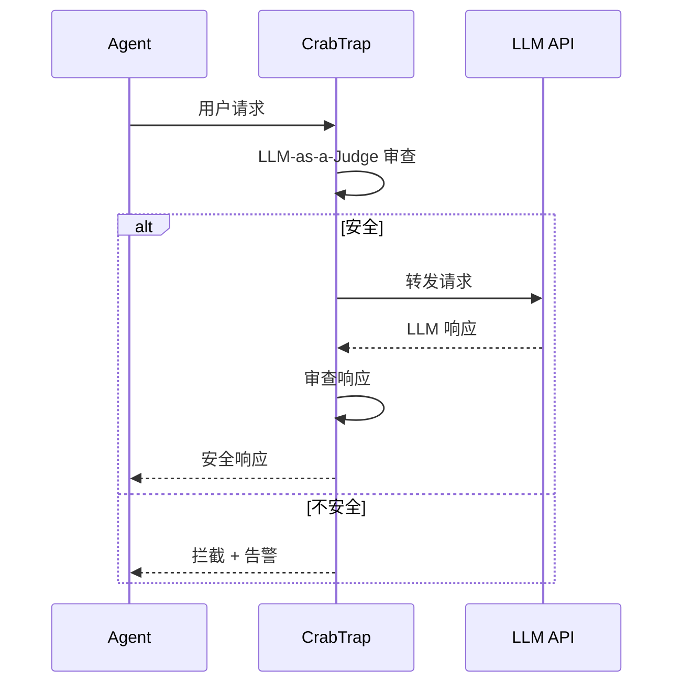

# CrabTrap

## 一句话定位
LLM-as-a-Judge HTTP 代理，为生产环境的 AI Agent 提供请求/响应安全审查。

## 它解决的问题
传统 WAF 基于规则，无法理解自然语言中的恶意意图（Prompt Injection、数据泄露指令等）。Agent 在生产环境中暴露面大，需要理解语义的安全层。

## 为什么值得关注（2026-04-25）
用 LLM 审查 LLM 是 Agent 安全的新范式。CrabTrap 由 Brex（金融科技公司）出品，说明已在金融级生产环境验证。HTTP 代理形式意味着零侵入接入。

## 热度来源判断
424 stars，热度不高但来源可靠。Brex 背书增加了可信度。Agent 安全是企业刚需，不需要 viral 增长。

## 关键技术亮点
1. **LLM-as-a-Judge 模式**：用 AI 理解 AI 的意图，比规则引擎更适应 Prompt Injection 的多变手法
2. **HTTP 代理零侵入**：不改 Agent 代码，加一层代理即可
3. **Brex 生产验证**：金融场景的安全要求极高，通过验证说明方案可行

## 架构启发
CrabTrap 代表了 Agent 安全链路中的"内容审查层"。与 ThinkWatch（身份层）、CubeSandbox（执行层）形成完整的安全架构：

## 定位判断
基础设施候选。Agent 安全链路的语义审查层。Go 实现适合代理场景。

## 风险 / 局限 / 泡沫点
1. **LLM 审查延迟**：每次请求额外调用一次 LLM 做安全审查，增加延迟和成本
2. **误判风险**：LLM-as-a-Judge 可能产生误报/漏报，尤其是面对精心构造的 Prompt Injection
3. **审查本身的安全**：审查用的 LLM 也可能被注入攻击

## 与同类项目的关系
- **ThinkWatch**：互补关系。ThinkWatch 做身份/限流/审计，CrabTrap 做语义审查
- **NeMo Guardrails**：NVIDIA 的 LLM 安全框架，规则+模型混合，更重
- **LLM Guard**：Protect AI 的 LLM 安全扫描器，规则为主

## 是否值得持续跟踪
是。LLM-as-a-Judge 安全审查是 Agent 安全的新范式，值得关注其在生产环境中的表现。

## 后续观察点
1. 延迟和成本在生产环境中的实际表现
2. 面对 Prompt Injection 变种的拦截率
3. 是否会从代理模式扩展到 SDK/插件模式

---
*首次记录：2026-04-25*
