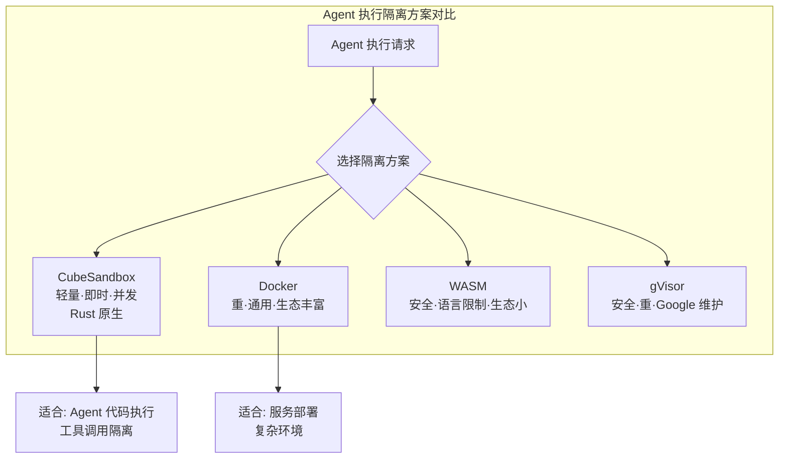

# CubeSandbox

## 一句话定位
腾讯云出品的即时、并发、安全的轻量级沙箱，专为 AI Agent 设计，Rust 实现。

## 它解决的问题
AI Agent 需要执行代码、访问文件系统、调用外部工具，但直接在宿主机上执行有安全风险。Docker 等传统沙箱启动慢、资源消耗大。Agent 需要一个轻量、即时、并发的隔离执行环境。

## 为什么值得关注（2026-07-04 更新）
Agent 沙箱是 Agent 从开发走向生产的关键基础设施。70 天内从 4.5K 增长到 7.1K，持续保持 Trending。新增 Snapshot/Clone/Rollback 功能、凭据保险库、Egress 控制。与 NVIDIA OpenShell 形成"腾讯 vs NVIDIA"的 Agent 安全沙箱双雄格局，两大巨头同时押注验证了赛道确定性。

## 热度来源判断
热度真实。腾讯背书 + Rust 实现 + Agent 安全刚需，三重驱动。Fork 数（250）与 Star 比例健康。

## 关键技术亮点
1. **KVM+RustVMM microVM**：亚 60ms 冷启动（bare metal benchmark），<5MB 内存开销
2. **E2B SDK 兼容**：零代码改动迁移，swap 一个 URL 环境变量即可
3. **凭据保险库**：API keys 不进入沙箱/model context/logs，通过安全代理注入
4. **Snapshot/Clone/Rollback**：百毫秒级检查点，支持 fork 和回滚
5. **Web Console**：浏览器管理沙箱、模板、节点（:12088）
6. **模板系统**：OCI 镜像一键转模板，支持 Template Store

## 架构启发
CubeSandbox 代表了 Agent Runtime 的隔离层。与 Docker（重隔离）、WebAssembly（语言限制）形成差异化定位：

## 定位判断
基础设施候选。Agent 沙箱是 Agent Runtime 的核心组件，如果质量过关可能成为事实标准。

## 风险 / 局限 / 泡沫点
1. **腾讯开源维护风险**：腾讯开源项目历史上维护投入波动较大
2. **生产环境验证不足**：虽然有 SWE-Bench RL demo，但缺乏大规模生产案例
3. **需要 KVM 支持**：要求 x86_64 Linux + KVM，限制了部署场景（云 VM 需要 PVM 或嵌套虚拟化）
4. **与 OpenShell 的竞争**：NVIDIA 入局可能分流开发者注意力

## 与同类项目的关系
- **E2B Sandbox**：商业化的 AI Agent 沙箱，云服务模式
- **Modal**：Serverless 执行平台，可做 Agent 沙箱但更通用
- **gVisor**：Google 的容器沙箱，更重但更成熟

## 是否值得持续跟踪
是。Agent 沙箱是确定性基础设施需求，腾讯的投入增加了可信度。需要观察隔离性 benchmark 和社区活跃度。

## 后续观察点
1. 与 Docker/gVisor 的隔离性和性能对比 benchmark
2. 是否有非腾讯用户的生产环境使用案例
3. 是否支持 MCP 工具调用的沙箱化

---
*首次记录：2026-04-25*
