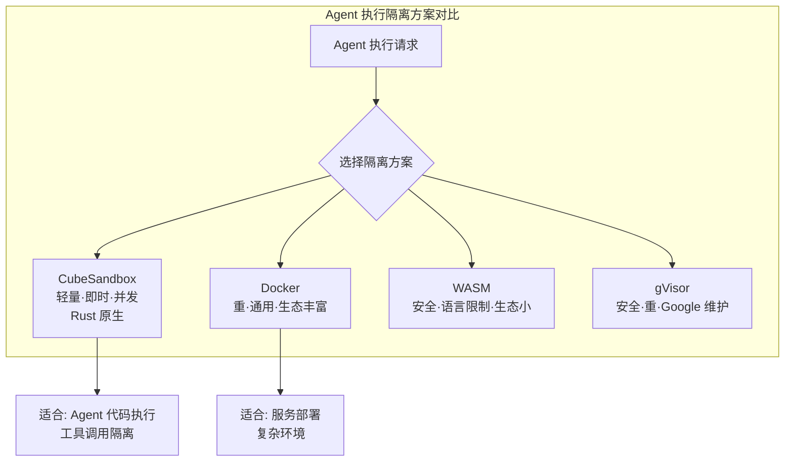

# CubeSandbox

## 一句话定位
腾讯云出品的即时、并发、安全的轻量级沙箱，专为 AI Agent 设计，Rust 实现。

## 它解决的问题
AI Agent 需要执行代码、访问文件系统、调用外部工具，但直接在宿主机上执行有安全风险。Docker 等传统沙箱启动慢、资源消耗大。Agent 需要一个轻量、即时、并发的隔离执行环境。

## 为什么值得关注（2026-04-25）
Agent 沙箱是 Agent 从开发走向生产的关键基础设施。腾讯背书意味着大厂已经认可"Agent 沙箱"作为基础设施投入。Rust 实现保证了性能。3.9K stars 说明社区也有强烈需求。

## 热度来源判断
热度真实。腾讯背书 + Rust 实现 + Agent 安全刚需，三重驱动。Fork 数（250）与 Star 比例健康。

## 关键技术亮点
1. **即时启动**：对比 Docker 的秒级启动，面向 Agent 的高频执行场景优化
2. **并发支持**：多 Agent 同时执行的场景下保持隔离
3. **Rust 实现的轻量级**：资源占用远低于 Docker/gVisor，适合大规模部署

## 架构启发
CubeSandbox 代表了 Agent Runtime 的隔离层。与 Docker（重隔离）、WebAssembly（语言限制）形成差异化定位：

## 定位判断
基础设施候选。Agent 沙箱是 Agent Runtime 的核心组件，如果质量过关可能成为事实标准。

## 风险 / 局限 / 泡沫点
1. **腾讯开源维护风险**：腾讯开源项目历史上维护投入波动较大
2. **与 Docker/gVisor 隔离性对比**：轻量化的代价可能是隔离性降低，需要独立安全审计
3. **生态锁定风险**：如果深度绑定腾讯云服务，会限制通用性

## 与同类项目的关系
- **E2B Sandbox**：商业化的 AI Agent 沙箱，云服务模式
- **Modal**：Serverless 执行平台，可做 Agent 沙箱但更通用
- **gVisor**：Google 的容器沙箱，更重但更成熟

## 是否值得持续跟踪
是。Agent 沙箱是确定性基础设施需求，腾讯的投入增加了可信度。需要观察隔离性 benchmark 和社区活跃度。

## 后续观察点
1. 与 Docker/gVisor 的隔离性和性能对比 benchmark
2. 是否有非腾讯用户的生产环境使用案例
3. 是否支持 MCP 工具调用的沙箱化

---
*首次记录：2026-04-25*
